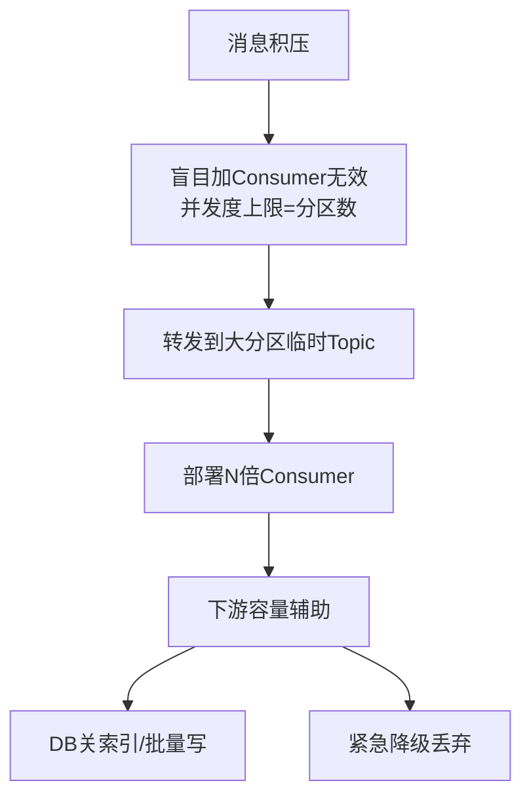

# 在处理 Kafka 消息积压时，如果仅仅增加消费者实例（Consumer）往往无效甚至导致 Rebalance 风暴。正确的紧急处理思路是什么？如何利用下游服务的容量来辅助清空积压？

Kafka 消息积压通常是因为消费者处理速度 < 生产者写入速度。单纯增加 Consumer 实例受限于 Topic 分区数，如果消费者数 > 分区数，多余实例会闲置，且可能触发 Rebalance 导致服务停顿。正确的紧急处理思路是：1. 临时扩容 Topic 分区数（需注意是否可行），或者在下游服务承受范围内，将被积压的分区通过自定义分区策略强行分配给更多临时消费者；2. 将积压严重的 Topic 的消息转发到一个拥有更多分区的临时 Topic（或通过克隆 Topic），然后部署大量消费者专门消费该临时 Topic进行“削峰”；3. 如果业务允许，可以丢弃非关键消息或进行降级处理。此外，可以利用下游服务的“消费能力”，例如若下游是 DB，可暂时批量写入或禁用索引，加快写入速度，待积压恢复后再开启。

## 技术原理

消息积压的根因诊断与处置，必须从 Kafka 的消费并发模型入手：

- **分区即并发上限**：Kafka 的 Consumer Group 中，每个分区在同一时刻只能被组内一个 Consumer 消费。因此消费并发度 = min(Consumer 实例数, 分区数)。Topic 有 16 个分区时，部署 32 个 Consumer 会有 16 个空闲——这是「加机器无效」的根因。
- **Rebalance 风暴的触发**：频繁上下线 Consumer 会触发 Rebalance（协调器重新分配分区）。Rebalance 期间整个 Consumer Group 暂停消费（Stop The World），持续时间随分区数和实例数增长。积压场景下误加机器，结果可能是「加得越多，停得越久」。
- **临时 Topic 转发削峰**：核心思路是绕过分区限制。原 Topic 分区少，但可以让一个「转发消费者」读原 Topic，按 round-robin 把消息写入一个新建的有 100+ 分区的临时 Topic。临时 Topic 上挂载 100 个 Consumer 并行消费，吞吐瞬间放大。代价是多一跳网络和存储，但能在分钟级消化积压。
- **下游容量释放**：消费慢的真正瓶颈常在下游。例如消费者要写 MySQL，逐条 INSERT 慢；改为批量 INSERT（1000 条/次）可提升 10 倍；临时禁用二级索引（写入后再重建）能再快几倍。本质是「把下游从强一致性模式切到批量模式，换取吞吐」。

## 代码示例

```java
// 方案二：转发到临时大分区 Topic 进行削峰（伪代码）
public class ForwardingConsumer {
    public static void main(String[] args) {
        // 消费原 Topic（分区少，积压严重）
        KafkaConsumer<String, byte[]> src = new KafkaConsumer<>(originProps);
        src.subscribe(Collections.singleton("order_events_backlog"));

        // 生产到临时 Topic（分区多，如 100 个）
        KafkaProducer<String, byte[]> sink = new KafkaProducer<>(tmpProps);

        while (true) {
            ConsumerRecords<String, byte[]> records = src.poll(Duration.ofMillis(500));
            for (ConsumerRecord<String, byte[]> r : records) {
                // round-robin 分发到临时 Topic 的不同分区
                String key = String.valueOf(System.nanoTime() % 100);
                sink.send(new ProducerRecord<>("order_events_tmp", key, r.value()));
            }
            src.commitAsync();  // 转发后提交原 Topic 的 offset
        }
    }
}

// 临时 Topic 上挂载大量 Consumer（与分区数对齐）并行消费
// 临时 Topic 处理完后，可下线，恢复正常消费链路
```

```sql
-- 下游 MySQL 提速：临时批量写入 + 关闭索引
ALTER TABLE orders DISABLE KEYS;            -- 关闭二级索引
INSERT INTO orders VALUES (...),(...),(...); -- 批量插入
-- 积压清空后：
ALTER TABLE orders ENABLE KEYS;             -- 重建索引
```

## 注意事项

- **先诊断根因再加机器**：积压原因可能是消费慢（CPU/下游慢）、生产突增、还是消费者宕机。加 Consumer 只对「消费实例数 < 分区数」有效，对「单 Consumer 处理慢」无效。
- **临时 Topic 的数据一致性**：转发链路引入了重复消费风险（转发后 commit 失败会导致重发）。临时 Topic 消费者需做幂等处理。且转发后原 Topic 的 offset 语义变了，恢复时要小心 offset 对齐。
- **Rebalance 优化**：若必须扩 Consumer，先调优 Rebalance 参数（`max.poll.interval.ms` 调大、`session.timeout.ms` 适度增大），并使用 Cooperative Rebalance（Kafka 2.4+）减少 STW。
- **下游降级的回滚计划**：关闭索引/批量写入是临时措施，必须提前准备恢复脚本（重建索引、校验数据一致性）。生产环境操作要有变更窗口和回滚预案。
- **降级与丢弃的审批**：丢弃非核心消息会损失数据，需业务方确认可接受。建议设置消息优先级队列，只丢弃低优先级。



## 记忆要点

- 盲目增加Consumer无效且引发Rebalance风暴，因为并发度上限是Topic分区数。
- 紧急处理方案：将原Topic消息转发至大分区临时Topic，利用扩容Consumer削峰。
- 若业务允许，紧急时可直接降级或丢弃非核心消息以快速自救。
- 利用下游容量清空积压：DB侧临时关闭索引或改为批量写入以提速。

## 结构化回答

**30 秒电梯演讲：** 突破分区限制，通过转发消息和扩容下游实现倍速消费。打个比方，这就好比堵车时车道数（分区）是固定的，单纯加车（消费者）没用；正确的做法是把积压的车引流到一条更宽的临时高速路上，或者把红绿灯（下游检查）关掉让车跑快点。

**展开框架：**
1. **盲目增加Consumer无效且引发Rebalan** — ce风暴，因为并发度上限是Topic分区数。
2. **紧急处理方案** — 将原Topic消息转发至大分区临时Topic，利用扩容Consumer削峰。
3. **若业务允许** — 紧急时可直接降级或丢弃非核心消息以快速自救。

**收尾：** 这三点都能配合实战聊。您想深入聊原理、对比还是避坑？

## 视频脚本

> 预计时长：2 分钟 | 由浅入深

| 时间 | 画面/字幕 | 口播台词 | 讲解要点 |
|------|----------|----------|----------|
| 0:00 | 标题卡：在处理 Kafka 消息积压时，如果… | "在处理 Kafka 消息积压时，如果仅仅增加消费者实例（Consumer）往往无效甚至导致 Rebalance 风暴。正确的紧急处理思路是什么？如何利用下游服务的容量来辅助清空积压？一句话——这就好比堵车时车道数（分区）是固定的，单纯加车（消费者）没用；正确的做法是把积压的车引流到一条更宽的临时高速路上，或者把红绿灯（下游检查）关掉让车跑快点。" | 开场钩子 |
| 0:40 | 概念动画/示意图 | "突破分区限制，通过转发消息和扩容下游实现倍速消费——这就好比堵车时车道数（分区）是固定的，单纯加车（消费者）没用；正确的做法是把积压的车引流到一条更宽的临时高速路上，或者把红绿灯（下游检查）关掉让车跑快点" | 核心定义 |
| 1:20 | 要点1图解示意 | "盲目增加Consumer无效且引发Rebalan" | 要点1 |
| 2:00 | 总结卡 | "记住这几条，面试不慌。下期讲进阶追问。" | 收尾 |
