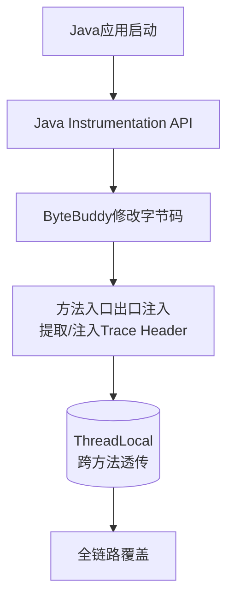

# OpenTelemetry在Java Agent模式下是如何无侵入地实现分布式追踪的？它与字节码增强技术有什么关系？

OpenTelemetry Java Agent利用Java Instrumentation API，在JVM启动时通过`-javaagent`参数加载。Agent使用字节码操作库（如ByteBuddy）在目标类加载前修改其字节码。具体流程是：Agent拦截特定框架（如Spring MVC、JDBC、Redis Client）的核心类方法，在方法入口和出口插入捕获Span上下文、记录时间戳、提取和注入Trace Header的代码。这种增强对业务代码完全透明，无需修改任何源码。它将追踪上下文存储在ThreadLocal（或虚拟线程的上下文）中，实现了跨线程、跨服务的Trace透传。这种方式的优势在于全链路覆盖，但要注意由于是字节码注入，可能会对冷启动时间和少量吞吐量产生影响。

**实战案例**：生产环境曾遇到过Agent拦截了自定义的线程池创建逻辑，导致上下文未正确传播，排查发现需要在`Runnable`包装时手动进行上下文快照；另外，旧版ByteBuddy在JDK 17+模块化限制下会报`InaccessibleObjectException`，需添加`--add-opens`参数。

**代码示例**：
```java
// Agent中典型的拦截逻辑（伪代码）
public class MyAdvice {
    @Advice.OnMethodEnter
    public static void onEnter(@Advice.Origin String method) {
        Span span = tracer.spanBuilder(method).startSpan();
        ContextStorage.put(span);
    }
    @Advice.OnMethodExit(onThrowable = Throwable.class)
    public static void onExit(@Advice.Thrown Throwable t) {
        Span span = ContextStorage.get();
        if (t != null) span.recordException(t);
        span.end();
    }
}
```

## 技术原理

无侵入分布式追踪依赖 Java 字节码增强的三层机制：

- **Java Instrumentation 机制**：JVM 提供 `premain`（启动时）和 `agentmain`（运行时 Attach）两个入口。`-javaagent:otel-agent.jar` 启动时，JVM 在应用 main 方法执行前先调用 agent 的 `premain`，此时 `Instrumentation` API 允许注册 `ClassFileTransformer`——在任意类被加载到 JVM 前，拿到其原始字节码并返回修改后的字节码。这是「无侵入」的底层支撑：业务代码无感知，类一加载就已被增强。
- **ByteBuddy 的切面织入**：Instrumentation 只是提供了字节码修改的入口，真正干活的是 ByteBuddy/ASM。OTel Agent 内置大量「Instrumentation 模块」，每个模块针对一个框架（Spring MVC、JDBC、Kafka、Redis 客户端等），定义「拦截哪个类的哪个方法 + 在方法前后插入什么代码」。例如对 `HttpURLConnection.connect()`，在入口注入「从 HTTP Header 提取 traceparent」、在出口注入「将当前 Span 的 traceparent 写入响应 Header」。这种基于名字的匹配让 Agent 无需源码也能精准拦截。
- **上下文传播（Context Propagation）**：Span 上下文（traceId、spanId、baggage）存在 `ThreadLocal` 中，同线程内任意方法可读写。跨线程时，Agent 拦截 `Executor.submit`、`Thread.start` 等，自动用 `Context.current()` 快照并复制到子线程。跨进程时，通过 HTTP Header（W3C `traceparent`）/ Kafka Header 注入和提取。这套传播机制对业务透明，是全链路追踪的关键。
- **性能开销**：字节码增强在类加载时一次性完成（首次加载变慢，冷启动增加 1~3 秒），运行时只是多了 Span 创建和 ThreadLocal 读写，吞吐量损耗通常 <5%。采样（sampling）进一步降低开销——生产环境常按比例采样（如 1%）而非全量。

## 注意事项

- **JDK 17+ 模块化限制**：ByteBuddy 反射访问 JDK 内部类（如 `java.net.http`）会触发 `InaccessibleObjectException`。需在启动参数添加 `--add-opens java.base/java.lang=ALL-UNNAMED` 等，或升级 OTel Agent 到适配 JDK 17 的版本。
- **自定义线程池的上下文断裂**：Agent 拦截的是标准 `Executor`，自定义的线程池或直接 `new Thread()` 可能漏掉上下文传播，导致 Trace 断链。排查工具：检查 Span 日志中是否有 `traceId` 缺失，必要时手动 `Context.wrap(Runnable)`。
- **Agent 冲突**：同时挂载多个 Java Agent（如 SkyWalking + OTel）可能对同一方法做重复增强，导致 ClassFormatError 或行为异常。生产环境应统一用一套可观测方案。
- **冷启动敏感场景**：Serverless / FaaS 对冷启动延迟敏感，字节码增强的额外开销可能不可接受。可考虑编译期增强（如 OTel Spring Boot Starter 的注解方式）替代运行时 Agent。
- **采样策略的权衡**：全量采样（ParentBased/AlwaysOn）在 QPS 高的系统会产生海量 Span 数据，存储和查询成本激增。生产推荐 Tail-based Sampling——在 Trace 结束后按规则（如「含错误」「延迟 > P99」）决定是否上报，既保证关键链路完整，又控制数据量。
- **虚拟线程（Loom）的上下文传播**：JDK 21 的虚拟线程复用载体线程，传统 `ThreadLocal` 会跨虚拟线程串数据。OTel Agent 从 1.29.0 起改用 `ScopedContext`，老版本在虚拟线程场景下 Trace 会错乱，升级前不要贸然启用虚拟线程。
- **类加载隔离**：Agent jar 里的依赖（如 Netty、gRPC）版本可能与业务冲突。OTel 用独立的 `BootstrapClassLoader`/`InternalClassLoader` 隔离 Agent 类，但自定义扩展（Extension）若引入业务同名类，仍可能冲突。扩展机制要谨慎使用。
- **Span 的属性设计**：避免把大对象（Request Body、大 List）塞进 Span Attribute，OTel 对单 Span 有 128 个 Attribute 上限和单值长度限制，超限会截断。结构化业务信息应走 Log 关联（SpanId 关联日志），而非 Attribute。
- **字节码增强的「双重拦截」风险**：OTel Agent 与业务自己用的 AOP（如 Spring AOP、AspectJ）可能对同一方法做双重增强，导致 Span 嵌套异常或性能叠加。常见于业务自定义 HTTP 拦截器与 OTel 的 Servlet Instrumentation 同时生效，需通过 `otel.instrumentation.servlet.enabled=false` 等开关关闭其一。
- **`Context` 与 `MDC` 的桥接**：业务常依赖 SLF4J MDC 打 traceId 到日志。OTel 提供 `MDCContextStorage` 自动同步，但若业务用了自定义的 `ThreadLocal`（非 MDC），Agent 不会感知，需手动实现 `ContextStorageProvider` 桥接，否则日志里的 traceId 会缺失。
- **版本升级的回归测试**：OTel Agent 每季度发大版本，新增 Instrumentation 模块可能改变已有方法的拦截行为。升级前务必在预发环境跑全链路回归，重点验证 HTTP/RPC/Kafka/Redis 这几个高频组件的 Span 仍正常生成且属性无丢失。
- **W3C Trace Context 与 B3 的兼容**：OTel 默认用 W3C `traceparent` Header，但旧系统（如 Spring Cloud Sleuth）用 Zipkin B3 Header。跨服务调用时协议不一致会导致 Trace 断链。OTel Agent 提供 `otel.propagators=tracecontext,b3,baggage` 配置同时注入多种 Header，实现平滑迁移，但要承受 Header 体积变大的开销。
- **Exemplar 与 Metrics 的关联**：OTel 1.31+ 支持 Exemplar——在 Metric 数据点（如 HTTP 请求延迟 P99 飙升）上关联触发该数据点的 TraceId。排障时能从监控告警一键跳转到完整 Trace，是可观测性「指标→链路→日志」三位一体的关键能力，但需要后端（Tempo/Jaeger）配合存储。
- **Baggage 的滥用风险**：OTel Baggage 允许跨服务透传业务自定义键值对（如 `user_id`、`region`），但每多一个键值对都会让所有下游 HTTP 请求 Header 变大，且明文传输可能泄露 PII。生产环境应严格限定 Baggage 键白名单，敏感数据加密或改用 Span Attribute。
- **Self-instrumentation 的死锁陷阱**：如果 Agent 自身用了被它增强的库（如 OTel Agent 内部用 Netty 做上报，又对 Netty 做增强），会形成 Span 创建的递归死循环。OTel 通过「Instrumentation 自身类加载到 BootstrapClassLoader 避开业务增强」规避，但自定义扩展若没遵守该约束极易触发 StackOverflow。




## 核心知识点图


## 记忆要点

- Agent基于Java Instrumentation API，在类加载前通过ByteBuddy修改字节码。
- 无侵入原理是在核心组件方法入口与出口，强行注入提取与注入Trace Header逻辑。
- Trace上下文通常借助ThreadLocal实现跨方法透传，进而实现全链路覆盖。
- 字码注入对业务透明，但可能导致冷启动变慢及少量吞吐量损耗。

## 结构化回答


**30 秒电梯演讲：** 就像给快递员（业务方法）强制配发一个随身录音笔（Agent），无需快递员知道，就能自动记录他的出发、到达和处理时间。

**展开框架：**
1. **利用-javaa** — 利用-javaagent和Instrumentation API在类加载时拦截字节码
2. **通过ByteBu** — 通过ByteBuddy在方法入口/出口插入Span创建和透传逻辑
3. **利用Thread** — 利用ThreadLocal存储上下文实现跨服务/跨线程追踪

**收尾：** 这是我实战中的理解，您想深入哪一段？


## 视频脚本

> 预计时长：2 分钟 | 由浅入深

| 时间 | 画面/字幕 | 口播台词 | 讲解要点 |
|------|----------|----------|----------|
| 0:00 | 标题卡：OpenTelemetry在Java… | "OpenTelemetry在Java Agent模式下是如何无侵入地实现分布式追踪的？它与字节码增强技术有什么关系？一句话——就像给快递员（业务方法）强制配发一个随身录音笔（Agent），无需快递员知道，就能自动记录他的出发、到达和处理时间。" | 开场钩子 |
| 0:40 | 概念动画/示意图 | "利用字节码注入在方法切面织入追踪代码，实现无侵入链路监控——就像给快递员（业务方法）强制配发一个随身录音笔（Agent），无需快递员知道，就能自动记录他的出发、到达和处理时间" | 核心定义 |
| 1:20 | 要点1图解示意 | "Agent基于Java Instrumentation API，在类加载前通过ByteBud" | 要点1 |
| 2:00 | 总结卡 | "记住这几条，面试不慌。下期讲进阶追问。" | 收尾 |
