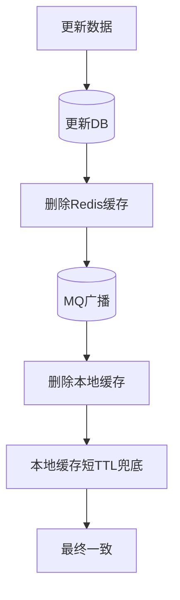

# 在多级缓存架构（本地缓存 + Redis）中，如何保证缓存一致性？

在多级缓存架构中，保证一致性的核心策略是：采用先更新数据库、再删除分布式缓存，最后通过消息队列（MQ）或 Redis Pub/Sub 广播消息通知所有应用节点删除本地缓存。该方法利用“最终一致性”模型，通过异步广播确保各级缓存同步失效。为防止极端情况的不一致，需配合本地缓存设置较短的 TTL 作为兜底，并统一使用“删除”而非“更新”操作以避免并发脏数据。

## 技术原理

- **采用 Cache-Aside + 消息广播策略**：读流程是经典的 Cache-Aside——先查本地缓存（Caffeine/Guava），未命中再查 Redis，再未命中查 DB，逐级回源并回填。写流程是核心：先更新 DB（数据源头），再删 Redis（让其他实例下次查 DB 拿新值），最后通过 MQ/Redis Pub/Sub 广播让**所有应用实例**删各自本地缓存。广播是关键——本地缓存在每个 JVM 进程内独立，不广播就只有写库那个实例的本地缓存被清，其他实例的本地缓存仍是旧值。
- **先更新 DB，再删缓存，最后广播删本地缓存**：顺序固定为 `update DB → delete Redis → broadcast delete local`。为什么是删不是更新见下条。删 Redis 在 DB 写之后，下次读时 Cache-Aside 会重新从 DB 加载新值。广播删本地缓存让所有节点本地缓存失效，下次访问回源到 Redis（已删）→ DB（已更新），拿到一致数据。
- **遵循最终一致性模型，配合 TTL 兜底**：由于删 Redis 和广播删本地缓存之间有短暂窗口，且广播消息可能丢失或延迟，所以本地缓存必须设短 TTL（如 5-30 秒）作为最后兜底——即使广播丢失，TTL 到期后本地缓存也会自动失效重新加载。这是多级缓存只能保证"最终一致"而非"强一致"的本质。
- **统一使用删除操作，禁止更新缓存**：并发更新缓存会导致脏数据——线程 A 写 DB 旧值后准备更新缓存、线程 B 写 DB 新值并先更新缓存、线程 A 才把旧值覆盖回缓存。改成"删缓存"则没有覆盖问题——删操作幂等，多次删效果一致，下次读统一从 DB 加载。这是经典缓存并发问题（Cache Aside 的 race condition）的标准解法。

## 代码示例

多级缓存一致性方案（伪代码）：

```java
@Service
public class UserService {
    @CacheLocal(prefix="user", expire=10)        // 本地缓存（TTL 10s 兜底）
    @CacheRedis(prefix="user", expire=300)       // Redis 缓存
    public User getUser(long id) {
        return userDb.findById(id);              // DB
    }

    @KafkaListener(topics = "cache-invalidate")
    public void onInvalidate(CacheInvalidEvent e) {
        if (e.getKey().startsWith("user:" + e.getId())) {
            localCache.evict(e.getKey());        // 收到广播删本地缓存
        }
    }

    @Transactional
    public void updateUser(User u) {
        userDb.update(u);                        // 1. 更新 DB
        redis.del("user:" + u.getId());          // 2. 删 Redis
        kafka.send("cache-invalidate",           // 3. 广播删本地缓存
                   new CacheInvalidEvent("user:" + u.getId()));
    }
}
```

## 对比/选型

| 方案 | 一致性 | 复杂度 | 适用 |
|------|--------|--------|------|
| 只 TTL 过期 | 弱（依赖 TTL）| 低 | 一致性要求低 |
| Cache-Aside + 删 Redis | 较强 | 中 | 单级 Redis |
| 多级 + MQ 广播 | 最终一致 | 高 | 本地+Redis 多级 |
| 订阅 binlog（Canal） | 最终一致 | 高 | 解耦业务代码 |

## 常见坑/注意事项

- **删缓存 vs 更新缓存的并发陷阱**：见原理第 4 点，统一用"删"避免 race condition，永远不要"更新缓存"。
- **先删缓存还是先更新 DB**：必须先更新 DB 再删缓存。先删缓存的方案在"删缓存 → 写 DB"之间若有读请求，会把旧 DB 值回填到缓存，造成长时间脏数据。
- **删缓存失败的重试**：删 Redis 或发 MQ 失败要重试，否则缓存一直是旧值直到 TTL 过期。建议订阅 binlog（Canal/Debezium）做最终一致——业务代码只更新 DB，由 binlog 消费者异步删各级缓存，彻底解耦。
- **本地缓存 TTL 必须短**：本地缓存的 TTL 是兜底，设 10-30 秒即可，太长则广播失败时脏数据持续时间久。Redis 的 TTL 可长（几分钟到几小时）。
- **广播消息的幂等**：消费者删本地缓存要幂等（多次删同一个 key 没副作用），MQ 至少一次语义可能重复投递。
- **缓存击穿保护**：删缓存后并发回源 DB 可能打爆 DB，要配合单飞机制（singleflight）或互斥锁让一个请求回源、其他等待。



## 记忆要点

- 核心步骤：先更新DB，再删Redis，最后MQ广播删本地缓存。
- 操作原则：因为并发更新易产生脏数据，所以统一用「删除」而非更新。
- 兜底策略：因为异步广播可能延迟，所以本地缓存必须设短TTL兜底。

## 结构化回答

**30 秒电梯演讲：** 更新DB删分布式缓存，消息广播通知删本地缓存保最终一致。打个比方，就像大喇叭通知全厂员工撤回旧通知，先改总台账，再广播让所有人撕掉手里的旧页，下次查新台账。

**展开框架：**
1. **核心步骤** — 先更新DB，再删Redis，最后MQ广播删本地缓存。
2. **操作原则** — 因为并发更新易产生脏数据，所以统一用「删除」而非更新。
3. **兜底策略** — 因为异步广播可能延迟，所以本地缓存必须设短TTL兜底。

**收尾：** 这三点都能配合实战聊。您想深入聊原理、对比还是避坑？

## 视频脚本

> 预计时长：3 分钟 | 由浅入深

| 时间 | 画面/字幕 | 口播台词 | 讲解要点 |
|------|----------|----------|----------|
| 0:00 | 标题卡：在多级缓存架构（本地缓存 + Red… | "在多级缓存架构（本地缓存 + Redis）中，如何保证缓存一致性？一句话——就像大喇叭通知全厂员工撤回旧通知，先改总台账，再广播让所有人撕掉手里的旧页，下次查新台账。" | 开场钩子 |
| 0:45 | 概念动画/示意图 | "更新DB删分布式缓存，消息广播通知删本地缓存保最终一致——就像大喇叭通知全厂员工撤回旧通知，先改总台账，再广播让所有人撕掉手里的旧页，下次查新台账" | 核心定义 |
| 1:30 | 核心步骤示意 | "先更新DB，再删Redis，最后MQ广播删本地缓存。" | 要点1 |
| 2:15 | 操作原则示意 | "因为并发更新易产生脏数据，所以统一用「删除」而非更新。" | 要点2 |
| 3:00 | 总结卡 | "记住这几条，面试不慌。下期讲进阶追问。" | 收尾 |
