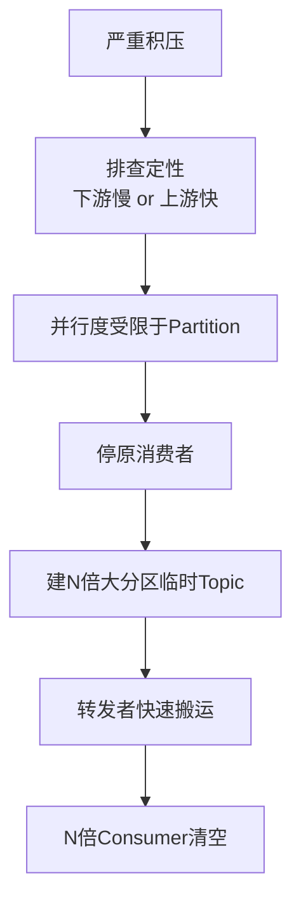
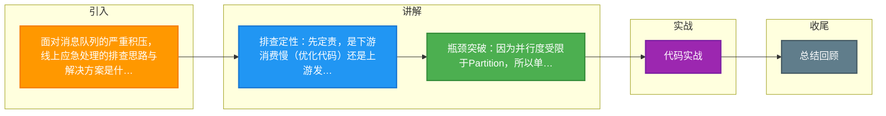

# 面对消息队列的严重积压，线上应急处理的排查思路与解决方案是什么？

首先排查积压原因：是下游消费速度慢（如 SQL 慢、外部接口超时），还是生产端流量突增。排查手段包括查看 Consumer 的日志、堆栈（是否卡死）、监控 Metrics（消费 TPS、Lag 值）。如果是生产端问题，需要临时限流。针对已积压的数据，应急方案通常是扩容：1. 临时将现有 Consumer 停掉；2. 新建一个临时的 Topic，Partition 数量扩容为原来的 N 倍（如 10 倍）；3. 部署 N 倍数量的 Consumer 只负责“转发”消息，将原 Topic 的积压消息快速搬运到新 Topic；4. 恢复原 Consumer 或部署更多 Consumer 专注于消费新 Topic 的消息。这种“下游扩容+转发”的方案利用了 Kafka/RocketMQ 分区并行度的特性，能以最快速度消除积压。

**实战案例**：在大促期间，日志服务因下游ES写入慢导致消息堆积千万级。紧急将Partition从10扩容至100，并部署20个转发Consumer，仅用15分钟就追平了原本需要数小时才能消费完的积压数据。

**代码示例 (Java 伪代码)**：
```java
// 临时转发Consumer逻辑：只读不处理业务，快速转发
public void forwardMessage(Message msg) {
    // 仅做简单的序列化和发送，不进行耗时业务逻辑
    Message newMsg = new Message("new_topic_v2", msg.getBody());
    // 发送时使用同步发送但设置极短超时，防止转发本身阻塞
    producer.send(newMsg).setTimeoutMillis(100);
}
```

**对比表格**：
| 方案 | 核心思路 | 优点 | 缺点 |
| :--- | :--- | :--- | :--- |
| **扩容消费者** | 增加并行度 | 显著提升吞吐量 | 受限于Partition数量，需扩容分区才能生效 |
| **临时丢弃/降级** | 直接放弃旧数据 | 快速恢复服务 | 数据丢失风险，仅限非核心数据 |
| **临时转发方案** | 剥离积压数据 | 不影响正在进行的业务修复，支持极大扩容 | 需要额外的Topic资源，需管理两套消费者 |
| **排查优化代码** | 提升单机性能 | 根本性解决 | 见效慢，不适用于应急场景 |

## 技术原理

应急方案的每一步都有对应的系统原理支撑，理解原理才能灵活变通：

- **积压的量化诊断**：积压量 = 生产速率 × 时间 - 消费速率 × 时间。监控关注三个指标：(1) **Lag**（未消费消息数）反映积压规模；(2) **消费 TPS** vs **生产 TPS** 的对比定位是消费慢还是生产快；(3) **消费延迟**（消息产生到消费的时间差）反映业务影响。若消费 TPS < 生产 TPS 持续，积压会无限增长，必须干预。
- **分区并行度的硬约束**：Kafka/RocketMQ 的消费并发度上限 = 分区数。Consumer Group 中每个分区同一时刻只被一个 Consumer 消费。10 个分区部署 100 个 Consumer，90 个闲置。这是「加 Consumer 无效」的物理本质——并发度被分区数锁死。
- **转发方案的吞吐放大**：临时 Topic 有 $N$ 倍分区（如 100），可挂 $N$ 个转发 Consumer 并行读原 Topic 的 $M$ 个分区（$N \gg M$）。但转发 Consumer 只是「读 + 写」，不做业务处理，单条耗时极短（毫秒级），所以即使分区数不变，转发 Consumer 也能快速搬运。再在新 Topic 上部署 $N$ 个业务 Consumer 并行消费，吞吐放大 $N/M$ 倍。本质是用「两次 MQ 跳转」换取「并行度放大」。
- **下游瓶颈的识别**：消费慢的真因常在下游。诊断手法：(1) 看 Consumer 线程堆栈，是否卡在 DB/HTTP 调用；(2) 看 DB 慢查询日志、下游服务的 RT；(3) 看是否有锁竞争或 GC 停顿。若下游 RT 从 10ms 飙到 500ms，扩容 Consumer 也无济于事——下游扛不住，加并发只会更快打爆下游。

## 代码示例

```java
// 应急转发方案：双层 Consumer 架构（伪代码）
// 第一层：转发 Consumer（只搬运，不处理业务）
public class ForwardConsumer {
    private final KafkaProducer<String, byte[]> producer;
    
    public void onMessage(ConsumerRecord<String, byte[]> record) {
        // 关键：不做任何业务处理，直接转发到临时大分区 Topic
        ProducerRecord<String, byte[]> forwarded = new ProducerRecord<>(
            "log_events_tmp",           // 临时 Topic，100 个分区
            record.key(),               // 保留原 Key 做有序性
            record.value()
        );
        producer.send(forwarded, (metadata, e) -> {
            if (e == null) {
                // 转发成功后才提交原 Topic 的 offset
                consumer.commitSync();
            }
        });
    }
}

// 第二层：业务 Consumer（消费临时 Topic，可部署 100 个实例）
public class BusinessConsumer {
    public void onMessage(ConsumerRecord<String, byte[]> record) {
        LogEvent event = parse(record.value());
        esClient.bulkIndex(event);     // 真正的业务处理：写入 ES
    }
}
```

```bash
# 运维操作步骤
# 1. 停原 Consumer（避免 offset 争抢）
kubectl scale deployment log-consumer --replicas=0

# 2. 创建临时大分区 Topic
bin/kafka-topics.sh --create --topic log_events_tmp \
  --partitions 100 --replication-factor 3

# 3. 部署转发 Consumer（数量 = 原 Topic 分区数）
kubectl scale deployment forward-consumer --replicas=10

# 4. 部署业务 Consumer（数量 = 临时 Topic 分区数，充分利用并行度）
kubectl scale deployment log-consumer-tmp --replicas=100

# 5. 积压清空后，切回原 Topic，下线临时资源
```

## 注意事项

- **先限流再扩容**：如果生产速率持续高于消费能力，扩容只是延缓积压。必须先在生产端限流（如 Kafka Producer 的 `linger.ms` + `batch.size` 调大降低发送频率，或业务层降级），否则扩容追不上生产。
- **转发方案的消息顺序性**：原 Topic 的同一 Key 消息在转发后可能落到临时 Topic 的不同分区，破坏顺序。若业务依赖顺序（如订单状态变更），需保证转发时用相同 Key（Kafka 按 Key 哈希到分区）。
- **offset 管理的复杂性**：转发方案涉及两层 offset（原 Topic + 临时 Topic），故障恢复时需对齐。建议转发 Consumer 用手动提交 offset，确保转发成功后才提交。
- **下游容量验证**：扩容业务 Consumer 前，先压测下游（ES、DB）能承受的最大 QPS。盲目扩容可能把下游打挂，从「MQ 积压」变成「下游宕机」，问题更严重。
- **临时资源的清理**：应急结束后及时下线临时 Topic 和 Consumer，避免长期占用资源和成本。保留预案脚本，下次直接复用。




## 记忆要点

- 排查定性：先定责，是下游消费慢（优化代码）还是上游发太快（限流）。
- 瓶颈突破：因为并行度受限于Partition，所以单纯加Consumer无效。
- 终极方案：停原消费者，建N倍大分区临时Topic，用「转发者」快速搬运。
- 恢复消费：最后部署N倍Consumer专注新Topic，最快速度消除积压。

## 结构化回答

**30 秒电梯演讲：** 利用临时转发将积压数据“搬运”至扩容分区，以并行度换时间。打个比方，高速公路堵车了，直接封锁入口，临时开辟10倍车道，用拖车把积压车全部拖到新车道快速通过。

**展开框架：**
1. **排查定性** — 先定责，是下游消费慢（优化代码）还是上游发太快（限流）。
2. **瓶颈突破** — 因为并行度受限于Partition，所以单纯加Consumer无效。
3. **终极方案** — 停原消费者，建N倍大分区临时Topic，用「转发者」快速搬运。

**收尾：** 我在项目里踩过坑——在大促期间，日志服务因下游ES写入慢导致消息堆积千万级。您想深入聊哪一段：原理、避坑还是对比选型？

## 视频脚本

> 预计时长：3 分钟 | 由浅入深

| 时间 | 画面/字幕 | 口播台词 | 讲解要点 |
|------|----------|----------|----------|
| 0:00 | 标题卡：面对消息队列的严重积压，线上应急处理… | "面对消息队列的严重积压，线上应急处理的排查思路与解决方案是什么？一句话——高速公路堵车了，直接封锁入口，临时开辟10倍车道，用拖车把积压车全部拖到新车道快速通过。" | 开场钩子 |
| 0:45 | 概念动画/示意图 | "利用临时转发将积压数据“搬运”至扩容分区，以并行度换时间——高速公路堵车了，直接封锁入口，临时开辟10倍车道，用拖车把积压车全部拖到新车道快速通过" | 核心定义 |
| 1:30 | 排查定性示意 | "先定责，是下游消费慢（优化代码）还是上游发太快（限流）。" | 要点1 |
| 2:15 | 瓶颈突破示意 | "因为并行度受限于Partition，所以单纯加Consumer无效。" | 要点2 |
| 3:00 | 总结卡 | "记住这几条，面试不慌。下期讲进阶追问。" | 收尾 |

### 视频流程图



