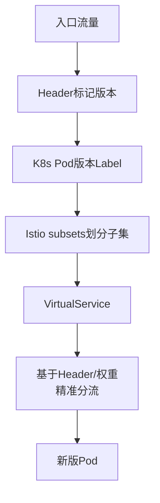

# 在微服务架构中，如何实现全链路灰度发布？请结合K8s和Service Mesh（如Istio）描述具体实现方案。

全链路灰度发布旨在让特定流量（如内部员工或特定用户ID）在整个微服务调用链中始终路由到新版本服务。传统做法是在每个服务层解析流量特征并动态配置路由规则，侵入性强且维护成本高。

基于Service Mesh（如Istio）的实现方案更为优雅。通过VirtualService和DestinationRule配置流量分流规则，利用Istio的流量镜像功能将线上流量复制到灰度版本进行验证，或基于Header（如x-gray-user: true）进行精确路由。

结合K8s，可以通过为灰度版本的Pod打上特定的Label（如version: v2），并在Istio中配置 subsets 将流量指向这些Pod。这种方案将灰度逻辑下沉到Sidecar代理中，业务代码零感知，且支持复杂的百分比流量调整和A/B测试，配合Prometheus监控观察灰度版本性能，确认无误后全量切换。

**实战案例**：在支付系统重构中，利用Istio根据请求Header中的 `uid` 尾号进行全链路灰度。1%的内部员工流量始终透传至新版本，实现了在同一套集群中验证新版链路，避免了搭建独立灰度环境的巨大成本。

**代码示例**：
```yaml
# DestinationRule 定义灰度子集
apiVersion: networking.istio.io/v1beta1
kind: DestinationRule
metadata:
  name: order-service
spec:
  host: order-service
  subsets:
  - name: v1  # 稳定版
    labels:
      version: v1
  - name: v2  # 灰度版
    labels:
      version: v2
```

**对比表格**：
| 维度 | 传统SDK方式 | Service Mesh (Istio) |
| :--- | :--- | :--- |
| **侵入性** | 高 (需修改业务代码/Ribbon配置) | 低 (配置Sidecar流量规则) |
| **灵活性** | 一般 (依赖路由组件能力) | 极高 (支持Header、权重、镜像) |
| **全链路透传** | 需自行编码透传Context | 自动透透，无需关注 |
| **运维复杂度** | 部署简单，维护规则复杂 | 基础设施复杂，规则统一管理 |
| **适用场景** | 架构简单，技术栈统一 | 微服务数量多，多语言混合 |

## 技术原理

- **全链路灰度 vs 单服务灰度的差异**：单服务灰度只需在入口网关按权重/Header 分流到一个服务的 v2。但微服务调用是链式的（A→B→C→D），若只有 A 路由到 v2，B/C/D 仍走 v1，链路就"断裂"了——v2 的 A 调用 v1 的 B 可能因接口不兼容失败。**全链路灰度**要求：灰度流量在 A→B→C→D 的每一跳都走 v2，需要把"灰度标记"在调用链中**透传**。
- **Istio 的 Sidecar 透传机制**：每个 Pod 旁挂一个 Envoy Sidecar，所有进出流量经过 Sidecar。当请求带灰度 Header（如 `x-gray: true`），Sidecar 拦截后：①把 Header 透传给下游服务；②根据 VirtualService 规则路由到 v2 子集。业务代码**完全无感**——它只是发普通 HTTP 请求，Sidecar 在背后做路由和 Header 透传。这是 Mesh 相比 SDK 方案的核心优势。
- **K8s Label + Istio Subset 的配合**：①K8s 给 v2 Pod 打 Label `version: v2`；②Istio DestinationRule 定义 subset（`v1` 对应 `version: v1` label 的 Pod，`v2` 对应 `version: v2`）；③VirtualService 定义路由规则（Header `x-gray: true` → v2 subset，否则 → v1）。三层配置协同实现精准路由。
- **流量镜像（Mirroring）的预验证**：Istio 支持把生产流量**复制**一份到 v2（不影响真实响应）。这让你能在不影响用户的情况下用真实流量压测 v2，观察指标（延迟、错误率）确认 v2 健康，再切换真实流量。镜像是"零风险灰度"的关键工具。

## 命令演示

```yaml
# ===== 1. K8s 部署 v2，打版本标签 =====
apiVersion: apps/v1
kind: Deployment
metadata:
  name: order-service-v2
spec:
  replicas: 3
  selector:
    matchLabels:
      app: order-service
      version: v2          # 关键：版本标签
  template:
    metadata:
      labels:
        app: order-service
        version: v2

# ===== 2. Istio DestinationRule：定义 subset =====
apiVersion: networking.istio.io/v1beta1
kind: DestinationRule
metadata:
  name: order-service
spec:
  host: order-service
  subsets:
  - name: v1
    labels: {version: v1}
  - name: v2
    labels: {version: v2}

# ===== 3. VirtualService：基于 Header 精准路由 =====
apiVersion: networking.istio.io/v1beta1
kind: VirtualService
metadata:
  name: order-service
spec:
  hosts: [order-service]
  http:
  # 灰度规则：带 x-gray Header 的走 v2
  - match:
    - headers: {x-gray: {exact: "true"}}
    route:
    - destination: {host: order-service, subset: v2}
  # 默认走 v1
  - route:
    - destination: {host: order-service, subset: v1}
    # 流量镜像：复制到 v2 观察（不影响真实响应）
    mirror:
      host: order-service
      subset: v2
    mirrorPercentage: {value: 10.0}    # 镜像 10% 流量

# ===== 4. 全链路透传：在入口网关注入 Header =====
# (Istio Ingress Gateway 或应用网关)
apiVersion: networking.istio.io/v1beta1
kind: VirtualService
metadata:
  name: ingress
spec:
  hosts: ["api.example.com"]
  gateways: [my-gateway]
  http:
  - match:
    - headers: {x-user-id: {regex: ".*[0-4]$"}}   # uid 尾号 0-4
    headers:
      request: {set: {x-gray: "true"}}            # 注入灰度标记
    route: [{destination: {host: frontend}}]
```

业务代码如何透传 Header（若不用 Mesh）：

```java
// 传统 SDK 方案：每个服务都要显式透传（侵入性强）
@RestController
public class OrderController {
    @GetMapping("/order/{id}")
    public Order getOrder(@PathVariable String id,
                          @RequestHeader(value = "x-gray", required = false) String gray) {
        // 必须把 gray header 显式传给下游
        HttpHeaders headers = new HttpHeaders();
        if ("true".equals(gray)) headers.set("x-gray", "true");
        return restTemplate.exchange("http://payment-service/" + id,
                                     GET, new HttpEntity<>(headers), Order.class).getBody();
    }
}
// Mesh 方案：业务代码完全无感，Sidecar 自动透传
```

## 对比/选型

| 维度 | 传统 SDK | Service Mesh (Istio) |
|------|---------|---------------------|
| 业务侵入 | 高（每服务手写透传） | 零（Sidecar 自动） |
| 多语言支持 | 差（每语言都要 SDK） | 好（Sidecar 统一） |
| 规则管理 | 分散（各服务配置） | 集中（VirtualService） |
| 流量镜像 | 难（需 SDK 支持） | 内置（mirror 字段） |
| Header 透传 | 需手动编码 | 自动 |
| 运维复杂度 | 部署简单 | Sidecar 增加延迟和运维 |
| 适用 | 单语言、简单架构 | 微服务多、多语言 |

## 常见坑/注意事项

- **Header 透传的"断链"**：即使有 Mesh，若某服务用了**非标准 RPC**（如 gRPC 而非 HTTP）或绕过 Sidecar（如直接访问外部服务），Header 透传会断。务必审计所有出站流量都经过 Sidecar。
- **异步消息的灰度**：MQ 是异步的，Header 透传到消息体而非 HTTP Header。Kafka/RocketMQ 需在消息属性（properties/headers）中携带灰度标记，消费者侧路由。Mesh 不自动处理 MQ 灰度，需额外方案。
- **数据库共享的污染**：v2 和 v1 共享同一数据库时，v2 的写操作可能污染 v1 的读。灰度时要确保 v2 的数据变更可回滚，或用独立 schema。
- **流量镜像的副作用**：镜像请求会真实调用 v2 并可能产生副作用（写库、发消息）。镜像只适合**读操作**或 v2 有幂等保护。对写操作，镜像可能产生重复数据。
- **灰度比例的精确性**：Istio 的权重路由基于 Envoy 的随机抽样，小流量（如 1%）时实际比例波动大。灰度初期用 Header 精准路由（确定性），稳定后再用权重（随机）。




## 核心知识点图


## 记忆要点

- 核心痛点：全链路灰度旨在让特定流量（如Header标记）始终路由至新版。
- Mesh优势：Istio低侵入，业务零感知，而传统SDK侵入性极高。
- 落地配置：K8s给Pod打版本Label，Istio配置 subsets 划分子集。
- 路由策略：利用 VirtualService 基于 Header 或权重精准分流。

## 结构化回答

**30 秒电梯演讲：** 利用Sidecar透传上下文，基于标签实现全链路精确路由。打个比方，就像VIP顾客进入商场，每个店员（服务）都能通过胸牌（Header）认出他，并把他引导到专属的新品体验区。

**展开框架：**
1. **核心痛点** — 全链路灰度旨在让特定流量（如Header标记）始终路由至新版。
2. **Mesh优势** — Istio低侵入，业务零感知，而传统SDK侵入性极高。
3. **落地配置** — K8s给Pod打版本Label，Istio配置 subsets 划分子集。

**收尾：** 我在项目里踩过坑——在支付系统重构中，利用Istio根据请求Header中的 `uid` 尾号进行全链路灰度。您想深入聊哪一段：原理、避坑还是对比选型？

## 视频脚本

> 预计时长：3 分钟 | 由浅入深

| 时间 | 画面/字幕 | 口播台词 | 讲解要点 |
|------|----------|----------|----------|
| 0:00 | 标题卡：在微服务架构中，如何实现全链路灰度发… | "在微服务架构中，如何实现全链路灰度发布？请结合K8s和Service Mesh（如Istio）描述具体实现方案。？一句话——就像VIP顾客进入商场，每个店员（服务）都能通过胸牌（Header）认出他，并把他引导到专属的新品体验区。" | 开场钩子 |
| 0:45 | 概念动画/示意图 | "利用Sidecar透传上下文，基于标签实现全链路精确路由——就像VIP顾客进入商场，每个店员（服务）都能通过胸牌（Header）认出他，并把他引导到专属的新品体验区" | 核心定义 |
| 1:30 | 核心痛点示意 | "全链路灰度旨在让特定流量（如Header标记）始终路由至新版。" | 要点1 |
| 2:15 | Mesh优势示意 | "Istio低侵入，业务零感知，而传统SDK侵入性极高。" | 要点2 |
| 3:00 | 总结卡 | "记住这几条，面试不慌。下期讲进阶追问。" | 收尾 |
