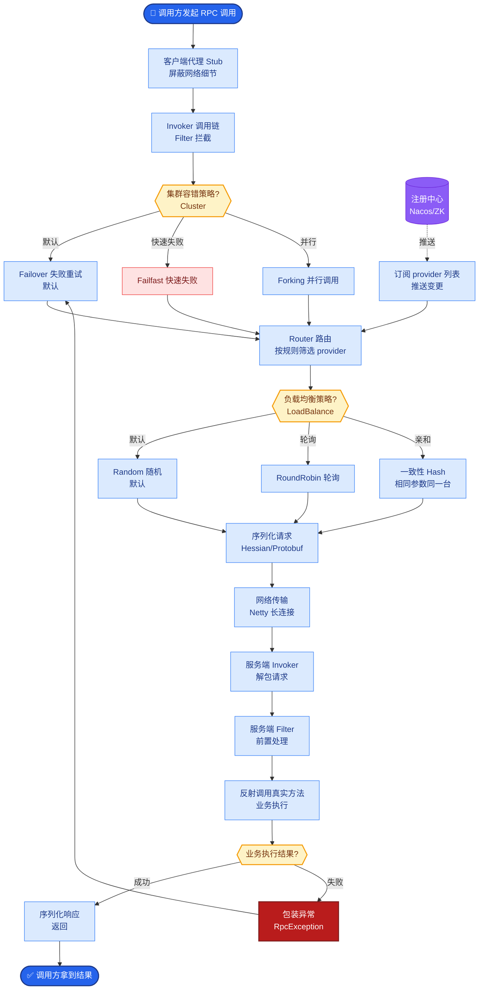
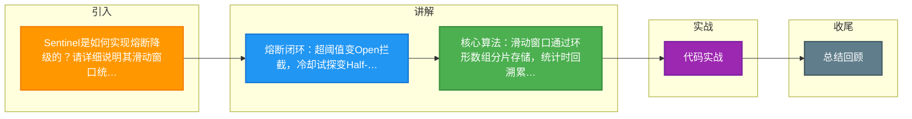

# Sentinel是如何实现熔断降级的？请详细说明其滑动窗口统计算法的工作原理。

Sentinel通过统计资源的QPS、异常比例或响应时间来判断熔断。其核心采用**滑动窗口（LeapArray）**算法，通过环形数组将时间分片存储指标，统计时回溯累加指定时间窗口的数据。当指标超阈值，状态变Open拦截请求；冷却后变Half-Open试探，成功则恢复Closed，否则继续Open。

## 技术原理

- **滑动窗口算法：环形数组存储时间片指标，高效回溯统计**：Sentinel 用 `LeapArray` 把时间轴切成固定大小的样本桶（如 1 秒窗口分 2 个 bucket，每个 bucket 500ms）。每个 bucket 是环形数组的一个槽位，存储该时间片内的成功/失败/RT/异常等指标。统计时遍历窗口内的所有 bucket 累加。过期的 bucket 会被复用（reset 后写新数据），避免内存增长。这种设计是 O(1) 写入、O(N)（N=桶数）统计，远低于遍历全部请求的 O(N)。
- **多维熔断策略：支持慢调用比例、异常比例及异常数判定**：①慢调用比例——统计窗口内 RT 超过阈值（`max RT`）的请求占比，超过 `慢调用比例阈值` 触发熔断（适合依赖服务变慢场景）；②异常比例——异常请求 / 总请求 > 阈值触发；③异常数——异常请求绝对数 > 阈值触发（适合低 QPS 但每次失败都关键的场景）。每种策略都基于滑动窗口实时统计，不维护每个请求记录。
- **状态机流转：Closed → Open → Half-Open 自动恢复**：①Closed（正常放行）持续统计指标，超阈值后切到 Open；②Open（熔断中）直接拒绝所有请求（抛 `DegradeException`），持续 `timeWindow`（如 10s）后切到 Half-Open；③Half-Open（探测）放一个请求试探下游是否恢复——成功则回 Closed 恢复正常，失败则回 Open 再等下一轮。这个闭环实现了"故障时快速切断 + 恢复时自动探测"。

## 代码示例

Sentinel 熔断规则配置：

```java
// 慢调用比例熔断：RT>200ms 算慢，比例>50% 触发，熔断 10s 后探测
DegradeRule slowRule = new DegradeRule("orderService")
    .setGrade(CircuitBreakerStrategy.SLOW_REQUEST_RATIO.getType())
    .setCount(200)                    // 慢调用阈值：200ms
    .setSlowRatioThreshold(0.5)       // 慢调用比例阈值：50%
    .setMinRequestAmount(5)           // 最小请求数（样本不足不熔断）
    .setStatIntervalMs(1000)          // 统计窗口 1s
    .setTimeWindow(10);               // 熔断时长 10s

// 异常比例熔断
DegradeRule exRule = new DegradeRule("payService")
    .setGrade(CircuitBreakerStrategy.ERROR_RATIO.getType())
    .setCount(0.5)                    // 异常比例 50%
    .setTimeWindow(10);

DegradeRuleManager.loadRules(Arrays.asList(slowRule, exRule));
```

滑动窗口简化实现（理解 LeapArray 原理）：

```java
class LeapArray {
    final int sampleCount = 2;            // 桶数
    final int intervalMs = 1000;          // 窗口 1s
    Bucket[] array = new Bucket[sampleCount];

    static class Bucket { long success, fail, total; long startTime; }

    public void onSuccess() {
        Bucket b = currentBucket();
        b.success++; b.total++;
    }

    private Bucket currentBucket() {
        long now = System.currentTimeMillis();
        int idx = (int) ((now / (intervalMs / sampleCount)) % sampleCount);
        Bucket b = array[idx];
        if (b == null || now - b.startTime >= intervalMs / sampleCount) {
            b = new Bucket();              // 桶过期则重置
            b.startTime = now;
            array[idx] = b;
        }
        return b;
    }
}
```

## 状态机示意

```
   Closed ──指标超阈值──> Open
     ↑                      │
     │                      │ 等 timeWindow 后
     │                      ↓
     └──探测成功───────── Half-Open
                              │
                              │ 探测失败
                              ↓
                            Open
```

## 常见坑/注意事项

- **`minRequestAmount` 避免误报**：QPS 低时几个偶然失败就触发熔断是不合理的，要设最小样本量（如 5 个请求以下不熔断）。
- **慢调用比例的 RT 阈值要合理**：RT 阈值太低（如 50ms）正常负载也会被判慢，太高（如 10s）熔断感知不到。要按业务下游 RT 的 P99 设定。
- **`timeWindow` 与恢复速度的权衡**：熔断时长太短（如 1s）下游还没恢复就探测，会反复在 Open/Half-Open 切换；太长（如 5min）故障恢复后迟迟不切回。经验值 10-30s。
- **Half-Open 时的高并发**：Half-Open 只放 1 个探测请求，若此时大量请求到来全被拒。可配合预热（渐进放量）避免恢复瞬间被冲垮。
- **熔断只防"扩散"，根因还是要查**：熔断是止损手段，熔断触发后要告警 + 排查下游根因（依赖服务挂了/慢查询/资源耗尽），别让熔断器一直开着掩盖问题。
- **滑动窗口的桶数选择**：桶越多精度越高但内存越大，默认 2 桶（500ms 粒度）够用，高精度场景可调到更多桶。


## 核心流程图



## 记忆要点

- 熔断闭环：超阈值变Open拦截，冷却试探变Half-Open，成功则Closed。
- 核心算法：滑动窗口通过环形数组分片存储，统计时回溯累加。
- 触发指标：Sentinel 主要依据 QPS、异常比例或响应时间超阈值。

## 结构化回答

**30 秒电梯演讲：** 基于滑动窗口的指标统计与状态机自动熔断恢复。打个比方，像电路中的空气开关，通过电流表（滑动窗口）实时监测，发热超标（异常/慢）自动跳闸（熔断），冷却后尝试合闸（探底）。

**展开框架：**
1. **熔断闭环** — 超阈值变Open拦截，冷却试探变Half-Open，成功则Closed。
2. **核心算法** — 滑动窗口通过环形数组分片存储，统计时回溯累加。
3. **触发指标** — Sentinel 主要依据 QPS、异常比例或响应时间超阈值。

**收尾：** 这三点都能配合实战聊。您想深入聊原理、对比还是避坑？

## 视频脚本

> 预计时长：2 分钟 | 由浅入深

| 时间 | 画面/字幕 | 口播台词 | 讲解要点 |
|------|----------|----------|----------|
| 0:00 | 标题卡：Sentinel是如何实现熔断降级的… | "Sentinel是如何实现熔断降级的？请详细说明其滑动窗口统计算法的工作原理。？一句话——像电路中的空气开关，通过电流表（滑动窗口）实时监测，发热超标（异常/慢）自动跳闸（熔断），冷却后尝试合闸（探底）。" | 开场钩子 |
| 0:40 | 概念动画/示意图 | "基于滑动窗口的指标统计与状态机自动熔断恢复——像电路中的空气开关，通过电流表（滑动窗口）实时监测，发热超标（异常/慢）自动跳闸（熔断），冷却后尝试合闸（探底）" | 核心定义 |
| 1:20 | 熔断闭环示意 | "超阈值变Open拦截，冷却试探变Half-Open，成功则Closed。" | 要点1 |
| 2:00 | 总结卡 | "记住这几条，面试不慌。下期讲进阶追问。" | 收尾 |

### 视频流程图



