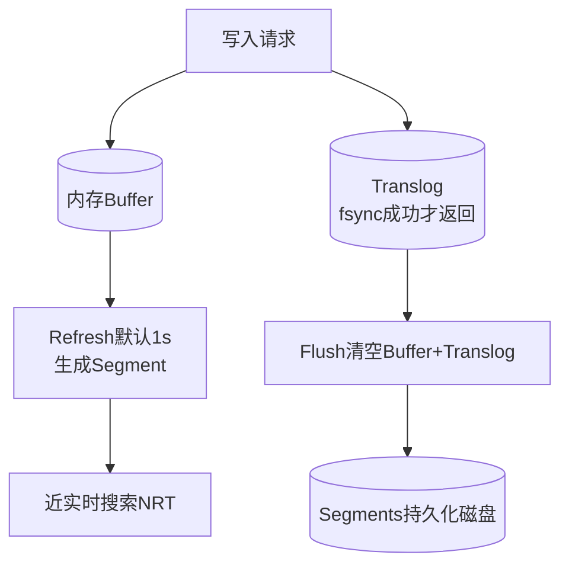

# Elasticsearch在数据写入时，如何通过Translog和Refresh机制保证数据可靠性与近实时搜索？

ES的写入流程融合了Lucene的特性，旨在保证数据不丢失的同时提供近实时（NRT）搜索。

1. **Translog（事务日志）**：数据写入ES时，先追加到内存buffer，同时同步（或异步）写入磁盘上的Translog文件。Translog类似于MySQL的Binlog，用于防止宕机导致内存数据丢失。当ES重启时，会重放Translog中的操作恢复数据。只有Translog成功fsync到磁盘，写入请求才返回成功。
2. **Refresh（刷新）**：内存中的数据是不可搜索的。默认每隔1秒，ES会执行一次Refresh操作，将Memory Buffer中的数据生成一个新的Segment文件（倒排索引），并打开供Searcher读取。这就是ES'近实时'的原因（最多1秒延迟）。
3. **Flush（冲刷）**：定期执行，将内存Buffer清空，Translog清空，Segments持久化到磁盘并提交。

**实战案例**：在高并发日志采集场景中，若设置 `index.translog.durability=async` 可提升吞吐量，但在节点宕机时会导致未Fsync的约5秒数据丢失，金融场景通常保持默认 `request` 模式。

**代码示例**：
```json
PUT /my_index/_settings
{
  "index": {
    "refresh_interval": "30s",
    "translog.durability": "async",
    "translog.sync_interval": "5s"
  }
}
```
这种机制平衡了性能与安全，Translog保证持久性，Refresh保证可见性。

## 技术原理

ES 写入流程涉及内存、Translog、Segment 三层数据结构，每层承担不同职责：

- **写入全链路**：`write → IndexingBuffer（内存）+ Translog（磁盘）→ Refresh → Segment（磁盘，可搜索）→ Flush → Segment 提交 + Translog 清空`。数据先进入内存 Buffer（JVM 堆），同时追加写入 Translog 文件（磁盘）。内存 Buffer 中的数据不可搜索（没有倒排索引），只有经过 Refresh 转成 Segment 后才对 Searcher 可见。
- **Translog 的持久性机制**：Translog 是追加写的日志文件（类似 MySQL Redo Log/Binlog）。`index.translog.durability` 控制刷盘策略：(1) `request`（默认）——每次写请求都 fsync，宕机零丢失但性能低；(2) `async`——按 `sync_interval`（默认 5 秒）批量 fsync，宕机可能丢 5 秒数据但吞吐高。重启时 ES 重放 Translog 恢复未 Flush 的数据。Translog 满了（`flush_threshold_size` 默认 512MB）会触发 Flush。
- **Refresh 的可见性机制**：Refresh 把 IndexingBuffer 生成一个新的 Lucene Segment（倒排索引文件），写入 OS PageCache（不一定 fsync 到磁盘），打开新 Segment 供 Searcher 读取。默认 `refresh_interval=1s`，即数据写入后最多 1 秒可被搜到——这是 ES「近实时」（NRT）的根源。Refresh 不调 fsync，所以 Segment 在 PageCache 中，宕机可能丢失，但 Translog 兜底恢复。
- **Flush 的提交点**：Flush 执行：(1) 触发一次 Refresh；(2) 调用 Lucene 的 `commit`，把所有未持久化的 Segment fsync 到磁盘；(3) 清空 Translog（此时数据已安全落盘，Translog 不再需要）；(4) 写入新的 commit point（Segment 列表）。Flush 开销大（大量磁盘 IO），不能频繁执行。
- **Segment 的不可变性与合并**：每次 Refresh 生成一个 Segment，Segment 不可变（追加写）。Segment 过多会拖慢搜索（要查多个文件）和耗 fd。后台 Merge 策略定期合并小 Segment 为大 Segment，删除被标记删除的文档，减少文件数。

## 代码示例

```json
// 调优索引的写入性能与可靠性
PUT /logs-2026.07
{
  "settings": {
    "index": {
      "refresh_interval": "30s",          // 日志场景可放宽到 30s，减少 Segment 数量
      "translog.durability": "async",      // 异步刷盘，提升吞吐（容忍 5s 丢失）
      "translog.sync_interval": "5s",
      "translog.flush_threshold_size": "1gb", // 攒到 1GB 才 Flush，减少 Flush 频率
      "number_of_shards": 3,
      "number_of_replicas": 1
    }
  }
}
```

```bash
# 手动控制 Refresh 与 Flush（批量写入场景）
# 1. 批量导入前暂停 Refresh（大幅提升写入速度）
PUT /my_index/_settings
{"index.refresh_interval": "-1"}     # -1 表示禁用自动 Refresh

# 2. 批量写入（Bulk API）
POST /_bulk
{ "index": { "_index": "my_index", "_id": "1" } }
{ "field": "value1" }
...

# 3. 批量完成后恢复 Refresh 并强制 Flush
PUT /my_index/_settings
{"index.refresh_interval": "1s"}
POST /my_index/_flush               # 强制 Flush，确保数据落盘
```

```java
// Java High Level REST Client 批量写入优化
BulkRequest bulk = new BulkRequest();
for (Doc doc : docs) {
    bulk.add(new IndexRequest("my_index").id(doc.getId())
        .source(JSON.toJSONString(doc), XContentType.JSON));
}
BulkResponse response = client.bulk(bulk, RequestOptions.DEFAULT);
// 批量大小建议 5-15MB，过大会增加重试成本，过小失去批量优势
```

## 注意事项

- **`refresh_interval` 的权衡**：默认 1s 适合搜索场景；写入密集型（如日志、指标）可调到 30s 甚至 `-1`（手动 Refresh），减少 Segment 生成数量，提升写入吞吐 3~5 倍。但调长后数据可见性延迟增大。
- **`translog.durability` 的风险**：`async` 模式宕机会丢数据（最多 5s）。金融、订单类强一致场景必须用默认 `request`；日志、监控类可接受 `async` 换性能。
- **Refresh 不是 Flush**：常见误区以为 Refresh 后数据就安全了。Refresh 只让数据可搜索，Segment 仍在 PageCache，宕机会丢。只有 Flush（或 Translog fsync）才保证持久性。
- **Segment 数量监控**：`_cat/segments/my_index` 查看 Segment 数。每个分片超过 50 个 Segment 说明 Merge 跟不上，需调大 `indices.store.throttle.type: none`（解除 Merge IO 限流）或检查磁盘性能。
- **批量写入的 Bulk 大小**：单次 Bulk 建议 5~15MB，文档数不超过 5000~10000。过大易触发内存压力和超时重试，过小失去批量优势。
- **副本的影响**：主分片写成功后同步到副本，副本也走 Translog + Refresh。副本数增加写入放大（写 N 份），但提升读取可用性。写入密集型可临时 `number_of_replicas=0`，写完再恢复。




## 记忆要点

- 功能划分：Translog保证不丢（可靠性），Refresh保证可搜（近实时）。
- Translog原理：类似Binlog，数据先写内存与Translog，fsync成功才返回。
- Refresh机制：默认1秒将Buffer生成为Segment，这是ES近实时（NRT）原因。
- Flush操作：清空Buffer与Translog，并将Segments真正持久化提交到磁盘。

## 结构化回答

**30 秒电梯演讲：** Translog保持久性防丢，Refresh转段文件保可见。打个比方，像记日记，Translog是备忘录（必须先记下来防止忘），Refresh是定期整理笔记（把草稿誊写到正式本子上才能被查阅）。

**展开框架：**
1. **功能划分** — Translog保证不丢（可靠性），Refresh保证可搜（近实时）。
2. **Translog原理** — 类似Binlog，数据先写内存与Translog，fsync成功才返回。
3. **Refresh机制** — 默认1秒将Buffer生成为Segment，这是ES近实时（NRT）原因。

**收尾：** 我在项目里踩过坑——在高并发日志采集场景中，若设置 `index.translog.durability=async` 可提升吞吐量，但在节点宕机时会导致未Fsync的约5秒数据丢失，金融场景通常保持默认 `request` 模式。您想深入聊哪一段：原理、避坑还是对比选型？

## 视频脚本

> 预计时长：2 分钟 | 由浅入深

| 时间 | 画面/字幕 | 口播台词 | 讲解要点 |
|------|----------|----------|----------|
| 0:00 | 标题卡：Elasticsearch在数据写入… | "Elasticsearch在数据写入时，如何通过Translog和Refresh机制保证数据可靠性与近实时搜索？一句话——像记日记，Translog是备忘录（必须先记下来防止忘），Refresh是定期整理笔记（把草稿誊写到正式本子上才能被查阅）。" | 开场钩子 |
| 0:40 | 概念动画/示意图 | "Translog保持久性防丢，Refresh转段文件保可见——像记日记，Translog是备忘录（必须先记下来防止忘），Refresh是定期整理笔记（把草稿誊写到正式本子上才能被查阅）" | 核心定义 |
| 1:20 | 功能划分示意 | "Translog保证不丢（可靠性），Refresh保证可搜（近实时）。" | 要点1 |
| 2:00 | 总结卡 | "记住这几条，面试不慌。下期讲进阶追问。" | 收尾 |
