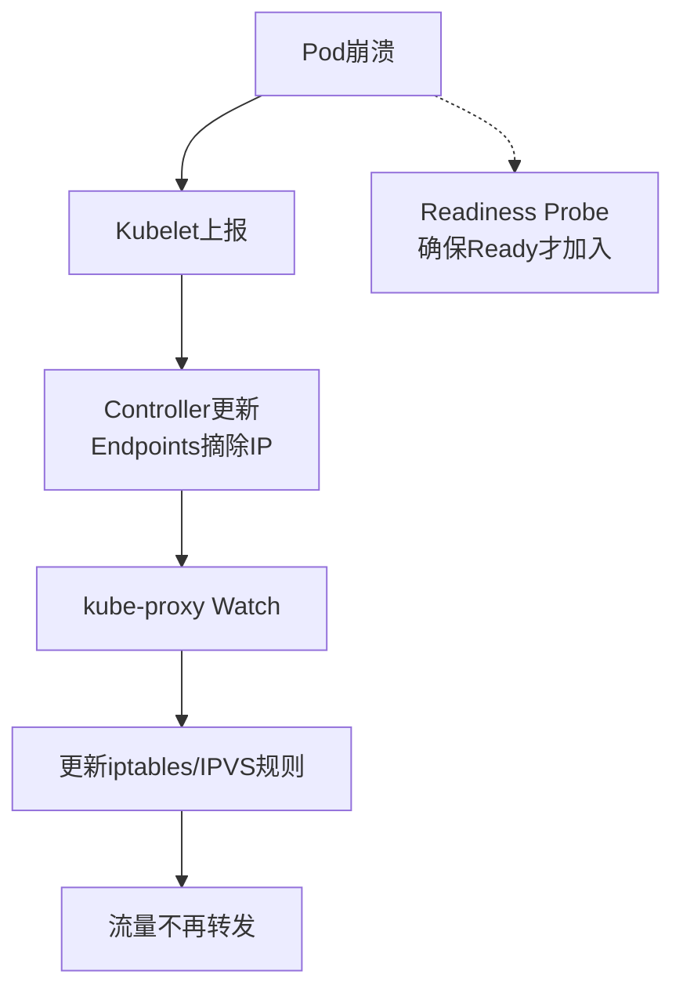

# 在Kubernetes中，当Service的后端Pod发生崩溃或重启时，kube-proxy与Ingress是如何感知并更新流量转发的？

K8s中Service负载均衡的实现依赖于`kube-proxy`和`Endpoints`对象的联动。

1. **感知机制**：Kubelet负责监控节点上的Pod状态，一旦Pod崩溃，Kubelet向API Server汇报状态更新。Controller Manager检测到Pod变化（IP失效），会自动更新对应的Endpoints对象，将该Pod的IP从列表中移除。
2. **流量更新**：`kube-proxy`通过Watch机制监听API Server中Service和Endpoints的变化。一旦发现Endpoints列表变更，`kube-proxy`会更新本地的转发规则（如iptables或IPVS模式），将失效Pod的规则删除。IPVS模式由于使用哈希表查找，更新性能通常优于iptables的大规模链式更新。
3. **Ingress层**：Ingress Controller（如Nginx）通常通过Watch Service获取Endpoints变动，并动态重载配置（或通过Lua脚本实时更新上游列表），确保流量不再转发到已崩溃的Pod。整个过程通常在秒级完成，配合Readiness Probe（就绪探针），可确保只有Ready状态的Pod接收流量。

**实战案例**：
在应用滚动更新时，未配置Readiness Probe导致旧Pod被Terminated但仍处于Service列表，造成大量5xx错误；配置探针后，K8s会在Pod完全Ready后才将其加入Endpoints列表。

**代码示例**：
```yaml
readinessProbe:
  httpGet:
    path: /health
    port: 8080
  initialDelaySeconds: 5
  periodSeconds: 10 # 每10秒检查一次，不通过则从Endpoints摘除
```

**对比表格**：

| 特性 | iptables 模式 | IPVS 模式 |
| :--- | :--- | :--- |
| **实现方式** | 纯用户态 netlink 调用，规则链式匹配 | 内核态 IPVS 负载均衡模块，哈希表查找 |
| **性能** | Service数量多时规则线性递增，性能下降明显 | O(1) 复杂度，支持大规模 Service |
| **负载均衡算法** | 随机 | 轮询 (RR)、最小连接 (LC)、源地址哈希 (SH) 等 |
| **网络回流** | 可能需要 SNAT/DNAT，支持 Pod 访问 Service | 支持直接路由 (DR)、隧道，性能更优 |

## 技术原理

K8s Service 流量转发的本质是「控制面（元数据）+ 数据面（转发规则）」的解耦与联动：

- **控制面：Endpoints 的维护链路**：Kubelet 周期性执行健康检查（Liveness/Readiness Probe），把 Pod 状态上报给 API Server。Endpoint Controller 监听 Pod 和 Service 变化，实时更新 Endpoints 对象（记录 Service 背后健康的 Pod IP:Port 列表）。当 Pod 崩溃/被删除/就绪探针失败时，对应 IP 被从 Endpoints 摘除；新 Pod Ready 后被加入。这是「感知」的核心——通过声明式 API + 控制器模式，让集群状态始终反映现实。
- **数据面：kube-proxy 的三种模式**：(1) **userspace**（已废弃）——kube-proxy 在用户态监听端口，收到连接后选一个后端 Pod 转发，性能差（两次内核-用户态拷贝）；(2) **iptables**——kube-proxy 监听 Endpoints 变化，生成 iptables 规则（KUBE-SERVICES 链），数据包在内核态被 DNAT 到某个 Pod IP，性能好但规则数随 Service 线性增长，万级 Service 时规则匹配变慢；(3) **IPVS**——基于内核 IPVS 模块，用哈希表存储 Service→Pods 映射，查找 O(1)，支持 RR/LC/SH 等多种调度算法，适合大规模集群（K8s 1.11+ 默认推荐）。
- **Ingress 的七层感知**：Ingress Controller（如 nginx-ingress、traefik）通过 Watch API Server 监听 Service 和 Endpoints 变化。检测到变化后，动态更新自身配置（nginx 用 lua-nginx-module 实时更新 upstream，或触发 `nginx -s reload`）。相比 kube-proxy 的四层转发，Ingress 工作在七层（HTTP/HTTPS），能基于域名、路径路由，支持 TLS 终止、灰度发布（基于 Header/Cookie 路由）。
- **最终一致性的延迟**：从 Pod 崩溃到流量切走，整条链路涉及 Kubelet 上报、Controller 更新 Endpoints、kube-proxy/Ingress 刷新规则，通常 1~5 秒完成。期间发往崩溃 Pod 的请求会失败，需要客户端重试或配合熔断。

## 代码示例

```yaml
# 就绪探针：控制 Pod 是否进入 Endpoints
apiVersion: apps/v1
kind: Deployment
metadata:
  name: web
spec:
  template:
    spec:
      containers:
      - name: app
        image: nginx
        readinessProbe:           # 就绪探针失败 → 从 Endpoints 摘除，但不重启
          httpGet:
            path: /health
            port: 8080
          initialDelaySeconds: 5
          periodSeconds: 10
          failureThreshold: 3     # 连续 3 次失败才摘除（避免抖动）
        livenessProbe:            # 存活探针失败 → 重启 Pod
          httpGet:
            path: /live
            port: 8080
          periodSeconds: 20
```

```bash
# 切换 kube-proxy 为 IPVS 模式（提升大规模集群性能）
kubectl edit configmap kube-proxy -n kube-system
# 修改：
# mode: "ipvs"
# ipvs.scheduler: "lc"   # 最小连接调度

kubectl rollout restart daemonset kube-proxy -n kube-system

# 查看 Service 的 Endpoints（验证摘除/加入）
kubectl get endpoints web -o wide
# NAME   ENDPOINTS                           AGE
# web    10.244.1.5:8080,10.244.2.7:8080     5m   # 崩溃的 Pod IP 已不在列表

# 查看 iptables 规则（理解 kube-proxy 数据面）
iptables-save | grep KUBE-SVC
# -A KUBE-SVC-XXX -m statistic --mode random --probability 0.5 -j KUBE-SEP-A
# -A KUBE-SVC-XXX -j KUBE-SEP-B   # 随机负载均衡到两个 Pod
```

## 注意事项

- **就绪探针 vs 存活探针的区分**：就绪探针失败只摘除流量（Pod 不重启），适合应用临时不健康（如加载中、依赖未就绪）；存活探针失败会重启 Pod，适合应用死锁。两者职责不同，混用会导致频繁重启或流量不切走。
- **terminationGracePeriodSeconds 的配合**：Pod 删除时，K8s 先发 SIGTERM，等 terminationGracePeriodSeconds（默认 30s）后强杀。应用要在收到 SIGTERM 后停止接收新请求、处理完存量请求再退出，否则摘除 Endpoints 与实际退出之间的窗口会有请求失败。
- **iptables 模式的规模瓶颈**：Service 数超过 1 万时，iptables 规则链很长，每次规则更新（全量替换）耗时数秒，期间转发受影响。IPVS 模式用哈希表规避此问题，大规模集群必须切换。
- **Pod 访问自身 Service 的回流问题**：Pod 通过 Service IP 访问自己所在 Service 时，kube-proxy 可能 DNAT 回自身，导致请求处理异常。iptables 模式有Hairpin 处理，IPVS 模式需开启 `hairpinMode`。
- **灰度发布的流量切分**：iptables 的 random 模式只能做简单按比例切分；精确灰度（按用户、Header）需要 Ingress + Service Mesh（Istio）在七层做。




## 记忆要点

- 感知机制：Kubelet上报Pod崩溃，Controller更新Endpoints摘除IP。
- 流量更新：kube-proxy通过Watch监听变动，更新本地iptables或IPVS规则。
- 性能对比：IPVS基于哈希表O(1)查找，而iptables规则链式匹配性能差。
- 就绪探针：配合Readiness Probe，确保只有Ready状态Pod才加入Endpoints。

## 结构化回答

**30 秒电梯演讲：** Kubelet更新状态，Endpoints变更触发iptables/IPVS及Ingress重载流量规则。打个比方，像公司大屏（Endpoints）实时更新员工在岗名单，前台（kube-proxy）和接待员（Ingress）盯着大屏动态调整电话转接表，瞬间把离职员工的号码剔除。

**展开框架：**
1. **感知机制** — Kubelet上报Pod崩溃，Controller更新Endpoints摘除IP。
2. **流量更新** — kube-proxy通过Watch监听变动，更新本地iptables或IPVS规则。
3. **性能对比** — IPVS基于哈希表O(1)查找，而iptables规则链式匹配性能差。

**收尾：** 我在项目里踩过坑——在应用滚动更新时，未配置Readiness Probe导致旧Pod被Terminated但仍处于Service列表，造成大量5xx错误；配置探针后，K8s会在Pod完全Ready后才将其加入Endpoints列表。您想深入聊哪一段：原理、避坑还是对比选型？

## 视频脚本

> 预计时长：2 分钟 | 由浅入深

| 时间 | 画面/字幕 | 口播台词 | 讲解要点 |
|------|----------|----------|----------|
| 0:00 | 标题卡：在Kubernetes中，当Serv… | "在Kubernetes中，当Service的后端Pod发生崩溃或重启时，kube-proxy与Ingress是如何感知并更新流量转发的？一句话——像公司大屏（Endpoints）实时更新员工在岗名单，前台（kube-proxy）和接待员（Ingress）盯着大屏动态调整电话转接表，瞬间把离职员工的号码剔除。" | 开场钩子 |
| 0:40 | 概念动画/示意图 | "Kubelet更新状态，Endpoints变更触发iptables/IPVS及Ingress重载流量规则——像公司大屏（Endpoints）实时更新员工在岗名单，前台（kube-proxy）和接待员（Ingress）盯着大屏动态调整电话转接表，瞬间把离职员工的号码剔除" | 核心定义 |
| 1:20 | 感知机制示意 | "Kubelet上报Pod崩溃，Controller更新Endpoints摘除IP。" | 要点1 |
| 2:00 | 总结卡 | "记住这几条，面试不慌。下期讲进阶追问。" | 收尾 |
