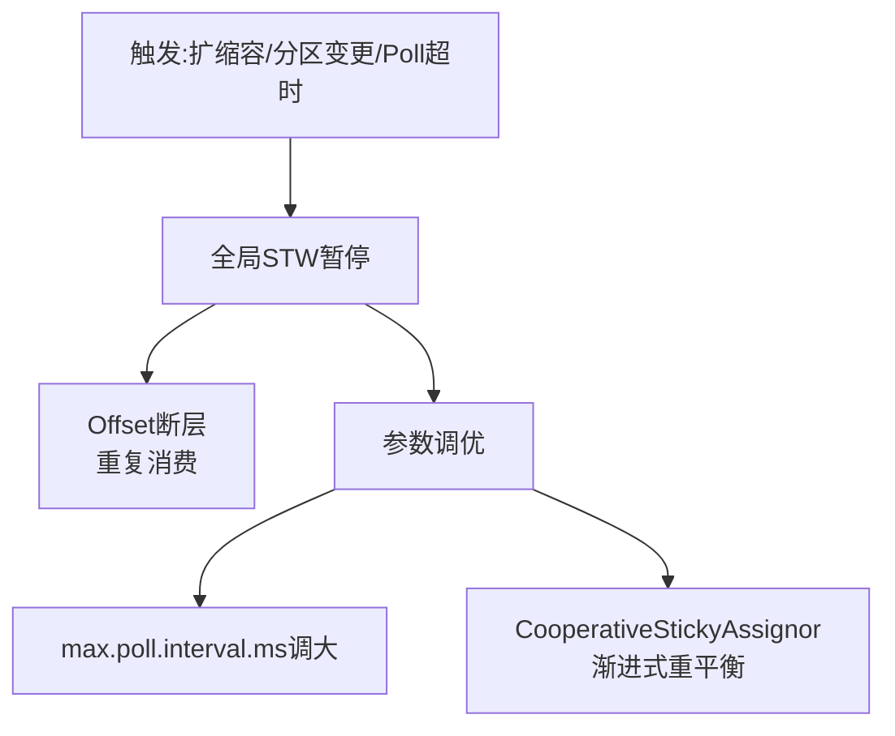
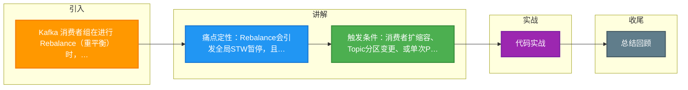

# Kafka 消费者组在进行 Rebalance（重平衡）时，为何可能会导致消息重复消费或短暂停止消费？如何通过调整参数优化 Rebalance 带来的影响？

【Rebalance 的原因与后果】Rebalance 本质上是消费组的一次“暂停分配”。期间所有消费者停止拉取，协调器重新规划分区所有权。这导致两个问题：一是“Stop-The-World”造成消费暂停，服务不可用；二是 Offset 提交断层，若重启后从旧的 Offset 恢复，就会重复处理暂停期间到达的新消息。

【Rebalance 触发条件】1. 消费者数量变化（扩缩容或宕机）。2. 订阅 Topic 的分区数变化。3. 消费者超时：未在 `session.timeout.ms` 内发心跳，或在 `max.poll.interval.ms` 内未完成处理。

【Rebalance 流程】1. 触发：消费者变动/超时。2. 停止：组内消费者全部停止 Poll，提交当前 Offset。3. 协调：协调器计算新分配方案（JoinGroup/SyncGroup）。4. 恢复：消费者获取新分区，恢复消费。

【优化策略】1. **调大超时阈值**：增大 `session.timeout.ms`（防抖动误判），增大 `max.poll.interval.ms`（防处理慢触发 Rebalance）。2. **开启增量协作重平衡**（Kafka 2.4+）：使用 `CooperativeStickyAssignor`，仅重平衡受影响的分区，而非全局“Stop-The-World”，大幅减少抖动。

**实战案例**：某次批量数据处理任务因单条记录处理耗时过长（超过默认的5分钟），触发了`max.poll.interval.ms`导致消费者频繁离组Rebalance，陷入无限循环；排查后调大该参数并改为多线程消费解决。另外，使用`RangeAssignor`时，增加订阅Topic的分区数会触发全局Rebalance，导致全集群消费卡顿数秒。

**代码示例**：
```java
// 增量协作重平衡配置与优化参数
Properties props = new Properties();
props.put(ConsumerConfig.BOOTSTRAP_SERVERS_CONFIG, "localhost:9092");
// 开启增量协作重平衡（避免Stop-The-World）
props.put(ConsumerConfig.PARTITION_ASSIGNMENT_STRATEGY_CONFIG, 
    "org.apache.kafka.clients.consumer.CooperativeStickyAssignor");
// 防止处理慢导致离组
props.put(ConsumerConfig.MAX_POLL_INTERVAL_MS_CONFIG, "300000"); // 5分钟
// 配合适当调整心跳和会话超时
props.put(ConsumerConfig.SESSION_TIMEOUT_MS_CONFIG, "30000");
```

**对比表格**：
| 参数/策略 | 作用 | 默认值 (Kafka 3.x) | 调优建议 |
|------|------|------------------|----------|
| session.timeout.ms | 检测消费者故障 | 45s | 网络波动大时适当调大 (如60-90s) |
| max.poll.interval.ms | 限制单次Poll处理间隔 | 5分钟 (300000ms) | 业务处理慢时必须调大，并减小max.poll.records |
| RangeAssignor (默认) | 分区分配策略 | - | 稳定但加分区会全局Rebalance |
| CooperativeStickyAssignor | 渐进式重平衡 | - | 生产环境强烈推荐，减少影响范围 |

## 技术原理

Rebalance 的「Stop-The-World」和重复消费问题，根源在于 Kafka 消费者组的协调协议设计：

- **两阶段协调协议**：Rebalance 分两阶段。(1) **JoinGroup**——所有消费者向 Group Coordinator（某个 Broker）发送 JoinGroup 请求，Coordinator 选出一个 Consumer Leader，收集所有成员的订阅信息；(2) **SyncGroup**——Leader 根据分配策略（Range/RoundRobin/Sticky）计算分区分配方案，发给 Coordinator，Coordinator 再下发给所有成员。在两个阶段完成前，所有消费者都处于「等待」状态，无法 poll 消息——这就是 STW。
- **Eager（全量）vs Cooperative（增量）重平衡**：传统 Eager 模式（Range/RoundRobin Assignor）在 Rebalance 时**先撤销全部分区**，再重新分配，导致所有消费者瞬间停止消费。Cooperative 模式（Kafka 2.4+ 的 CooperativeStickyAssignor）改为「只撤销需要变动的分区」，未受影响的分区继续消费，把一次大停顿拆成多次小停顿，整体影响大幅降低。
- **重复消费的根因**：(1) Rebalance 触发时，消费者正在处理但未提交 offset 的消息，重新分配后新消费者从上次提交的 offset 开始消费，导致重复；(2) 消费者处理完消息但提交 offset 前被踢出组（处理时间超过 max.poll.interval.ms），重启后从旧 offset 恢复，整批消息重复。幂等消费是终极防御。
- **被动离组的触发**：Consumer 每秒发心跳到 Coordinator。若 `session.timeout.ms`（默认 45s）内无心跳，判定宕机；若两次 `poll()` 间隔超过 `max.poll.interval.ms`（默认 5 分钟），判定处理卡死，主动踢出。后者是业务处理慢导致雪崩的常见原因。

## 代码示例

```java
// 生产级 Consumer 配置：防 Rebalance 雪崩
Properties props = new Properties();
props.put(BOOTSTRAP_SERVERS_CONFIG, "localhost:9092");
props.put(GROUP_ID_CONFIG, "order-consumer");

// 1. 增量协作重平衡（关键，避免全局 STW）
props.put(PARTITION_ASSIGNMENT_STRATEGY_CONFIG,
    CooperativeStickyAssignor.class.getName());

// 2. 防处理慢导致离组
props.put(MAX_POLL_INTERVAL_MS_CONFIG, 600000);      // 10 分钟
props.put(MAX_POLL_RECORDS_CONFIG, 100);             // 单次 poll 最多 100 条
props.put(SESSION_TIMEOUT_MS_CONFIG, 45000);         // 心跳超时
props.put(HEARTBEAT_INTERVAL_MS_CONFIG, 15000);      // 心跳间隔 = 超时 / 3

// 3. 手动提交 offset（处理完成后提交，避免重复）
props.put(ENABLE_AUTO_COMMIT_CONFIG, false);

KafkaConsumer<String, String> consumer = new KafkaConsumer<>(props);
consumer.subscribe(Collections.singleton("orders"));
while (running) {
    ConsumerRecords<String, String> records = consumer.poll(Duration.ofMillis(500));
    for (ConsumerRecord<String, String> r : records) {
        processIdempotent(r.value());   // 幂等处理（防重复消费的终极防御）
    }
    consumer.commitSync();  // 同步提交：处理完一批才提交
}
```

```bash
# 诊断 Rebalance 频率（运维）
# 监控指标：kafka.consumer:type=coordinator-metrics,name=rebalance-rate
# 若 rebalance-rate 持续 > 0，说明频繁重平衡，需排查：
#   1. 是否有消费者频繁 OOM/重启
#   2. 是否处理时间超过 max.poll.interval.ms
#   3. 网络抖动导致心跳丢失

# 查看 Consumer Group 状态
bin/kafka-consumer-groups.sh --bootstrap-server localhost:9092 \
  --describe --group order-consumer
# 关注 LAG 和消费者实例数，判断是否在频繁变化
```

## 注意事项

- **max.poll.interval.ms 与 max.poll.records 的联动**：处理慢的任务既要调大 `max.poll.interval.ms`，也要调小 `max.poll.records`（如从 500 降到 50），确保单批处理时间留有余量（处理时间 < 间隔的 60%）。否则调大了间隔但单批还是超时，仍会离组。
- **CooperativeStickyAssignor 的迁移**：从 Eager 切到 Cooperative 需要所有消费者同时升级（滚动升级期间会触发一次全量 Rebalance 做兼容）。建议在低峰期一次性升级。
- **Static Membership（Kafka 2.3+）**：配置 `group.instance.id` 让消费者有固定身份，短暂离线（如重启）不触发 Rebalance，上线后直接接管原分区。适合消费者数量固定、偶尔重启的场景，能完全消除重启引起的 STW。
- **幂等消费是必备防御**：即使调优了所有参数，网络故障、消费者崩溃仍可能导致重复消费。业务侧必须用唯一键（如消息 ID + Redis 去重）做幂等，不能依赖 Kafka 的 exactly-once。
- **避免频繁扩缩容**：K8s 的 HPA 频繁扩缩 Consumer Pod 会触发频繁 Rebalance。建议设置合理的扩缩容阈值和冷却时间，或用 Static Membership 减少影响。




## 记忆要点

- 痛点定性：Rebalance会引发全局STW暂停，且Offset断层导致重复消费。
- 触发条件：消费者扩缩容、Topic分区变更、或单次Poll处理超时。
- 参数调优：业务处理慢必须调大 max.poll.interval.ms 防被动离组。
- 高级策略：推荐开启 CooperativeStickyAssignor，渐进式重平衡减少影响。

## 结构化回答

**30 秒电梯演讲：** 消费者组全员暂停重分配，导致消费中断与Offset回溯重复。打个比方，像公交车到站，所有乘客（消费者）必须下车，调度员（协调者）重新规划座位和路线，乘客重新上车。这期间车不走，且有人可能坐回原位重复看风景。

**展开框架：**
1. **痛点定性** — Rebalance会引发全局STW暂停，且Offset断层导致重复消费。
2. **触发条件** — 消费者扩缩容、Topic分区变更、或单次Poll处理超时。
3. **参数调优** — 业务处理慢必须调大 max.poll.interval.ms 防被动离组。

**收尾：** 我在项目里踩过坑——某次批量数据处理任务因单条记录处理耗时过长（超过默认的5分钟），触发了`max.poll.interval.ms`导致消费者频繁离组Rebalance，陷入无限循环；排查后调大该参数并改为多线程消费解决。您想深入聊哪一段：原理、避坑还是对比选型？

## 视频脚本

> 预计时长：2 分钟 | 由浅入深

| 时间 | 画面/字幕 | 口播台词 | 讲解要点 |
|------|----------|----------|----------|
| 0:00 | 标题卡：Kafka 消费者组在进行 Reba… | "Kafka 消费者组在进行 Rebalance（重平衡）时，为何可能会导致消息重复消费或短暂停止消费？如何通过调整参数优化 Rebalance 带来的影响？一句话——像公交车到站，所有乘客（消费者）必须下车，调度员（协调者）重新规划座位和路线，乘客重新上车。这期间车不走，且有人可能坐回原位重复看风景。" | 开场钩子 |
| 0:40 | 概念动画/示意图 | "消费者组全员暂停重分配，导致消费中断与Offset回溯重复——像公交车到站，所有乘客（消费者）必须下车，调度员（协调者）重新规划座位和路线，乘客重新上车。这期间车不走，且有人可能坐回原位重复看风景" | 核心定义 |
| 1:20 | 痛点定性示意 | "Rebalance会引发全局STW暂停，且Offset断层导致重复消费。" | 要点1 |
| 2:00 | 总结卡 | "记住这几条，面试不慌。下期讲进阶追问。" | 收尾 |

### 视频流程图



