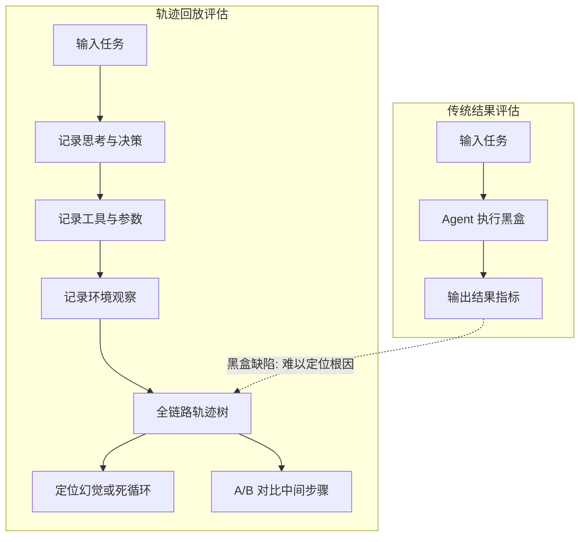

# 在Agent评测中，轨迹回放与简单的结果指标评估相比，解决了什么核心问题？

简单的结果指标（如最终任务是否成功）往往是一个黑盒，无法揭示Agent失败的具体原因（如幻觉、工具调用错误、规划死循环）。轨迹回放通过记录Agent每一步的思考过程、工具调用参数、中间观察结果和决策路径，提供了可观测性。它解决了核心的“可调试性”问题，允许开发者精确定位失败发生的节点，分析是Prompt理解偏差、环境反馈异常还是逻辑推理错误。此外，轨迹回放还可以用于A/B测试中的细粒度对比，评估不同Prompt策略或模型版本在特定步骤上的表现差异，而非仅看最终输出来“蒙”运气。

## 技术原理

- **结果指标是黑盒，无法定位具体失败原因**：传统评测只看终态——任务成功率、输出准确率、用户满意度，但 Agent 是多步推理系统，失败可能发生在任意一步：理解用户意图偏差、选错工具、工具参数错误、规划陷入死循环、幻觉编造事实。只看最终结果相当于看考试分数，无法知道哪道题错了、为什么错，对改进毫无指导意义。
- **轨迹回放提供全链路可观测性，解决可调试性难题**：轨迹回放（Trajectory Replay）记录 Agent 执行全过程——每一步的思考（thought）、行动（action/tool call）、观察（observation/tool result）、决策路径、token 概率分布、耗时。开发者可以像调试程序一样逐步回看，定位失败发生在哪一步、是哪个环节出问题。
- **支持细粒度对比，用于 Prompt 优化和逻辑纠错**：在 A/B 测试中，结果指标只能告诉你"版本 A 准确率比 B 高 5%"，但不知道高在哪。轨迹回放可以对比同一 prompt 下两个版本在每一步的差异，定位改进来自工具选择更准、还是推理链更短、还是反思机制生效，从而精准优化。

## 对比/选型

| 维度 | 结果指标 | 轨迹回放 |
|------|----------|----------|
| 数据形式 | 标量（成功率/分数）| 序列（thought-action-obs 链）|
| 可调试性 | 无 | 高（逐步定位）|
| 失败归因 | 不能 | 能（幻觉/工具错/死循环）|
| 存储成本 | 低 | 高（每步全量记录）|
| 适用场景 | 线上监控 | 离线分析/Prompt 优化 |

## 代码示例

LangSmith/LangFuse 风格的轨迹记录：

```python
from langfuse import Langfuse

langfuse = Langfuse()
trace = langfuse.trace(name="research-agent", user_id="u1")

# 每一步记录到 trace，自动串联成完整轨迹
with trace.span(name="plan", metadata={"prompt": query}) as span:
    plan = llm.plan(query)
    span.end(output=plan)

for step in plan:
    with trace.span(name=f"tool:{step.tool}") as span:
        obs = tools[step.tool].run(step.args)
        span.end(output=obs, metadata={"latency_ms": ...})

# 在 UI 里回放：plan → tool:search → tool:summarize → final
# 失败的 trace 标红，方便定位是哪步出错
```

轨迹数据分析（定位失败模式）：

```python
import pandas as pd

# 把所有失败 trace 的轨迹聚合，按"失败发生在哪一步"分桶
failures = pd.DataFrame(load_failed_traces())
failure_at_step = failures["last_step"].value_counts()
# 输出：
# tool:sql_exec    45   ← SQL 调用最易失败
# plan             28   ← 规划阶段理解偏差
# reflect          12   ← 反思陷入死循环
```

## 常见坑/注意事项

- **记录成本不低**：完整轨迹（含 prompt/response/token 概率）数据量大，全量记录会拖慢推理、撑爆存储。线上采样记录（如 1%）+ 失败 case 全量记录是常见策略。
- **隐私脱敏**：轨迹含用户原始输入和工具返回，可能含 PII/敏感数据，落盘前要脱敏。
- **失败 ≠ 轨迹错误**：有些任务 Agent 轨迹每步都对，但最终答案因外部数据问题失败，要区分"逻辑错"和"环境错"。
- **轨迹对比要控制变量**：A/B 测试时 prompt 改了一点，但模型温度、工具版本都变了，对比结论不可信。要严格 fix 其他变量。
- **结合人工标注**：纯自动轨迹分析难判"这一步是否合理"，需配合人工标注失败原因分类（幻觉/工具/规划/外部）。

## 流程图



## 核心知识点图


## 记忆要点

- 结果指标是黑盒，轨迹回放提供可观测性。
- 解决“可调试性”问题，精确定位失败节点。
- 区分是幻觉、工具错误还是规划死循环。
- 支持细粒度 A/B 测试，对比中间步骤表现。


## 结构化回答

**30 秒电梯演讲：** 通过记录中间过程，将黑盒评估转化为白盒调试。——打个比方，就像考试只看分数（结果指标）无法知道哪里错，而查看草稿纸（轨迹回放）能发现是公式背错了还是计算粗心。

**展开框架：**
1. **结果指标是黑盒** — 结果指标是黑盒，轨迹回放提供可观测性。
2. **解决“可调试性”** — 解决“可调试性”问题，精确定位失败节点。
3. **区分是幻觉、工具** — 区分是幻觉、工具错误还是规划死循环。

**收尾：** 以上三点都能配合实战聊。您想深入聊哪一块？

## 视频脚本

> 预计时长：2 分钟 | 由浅入深

| 时间 | 画面/字幕 | 口播台词 | 讲解要点 |
|------|----------|----------|----------|
| 0:00 | 标题卡 | "在Agent评测中，轨迹回放与简单的结果指标评估相比，解决了什么核心问题，30 秒讲清楚。" | 开场钩子 |
| 0:30 | 概念定义动画 | "一句话：通过记录中间过程，将黑盒评估转化为白盒调试。" | 核心定义 |
| 1:00 | 要点图解 | "结果指标是黑盒，轨迹回放提供可观测性。" | 要点 |
| 1:30 | 总结卡 | "记好这几条，面试不慌。下期见。" | 收尾 |
