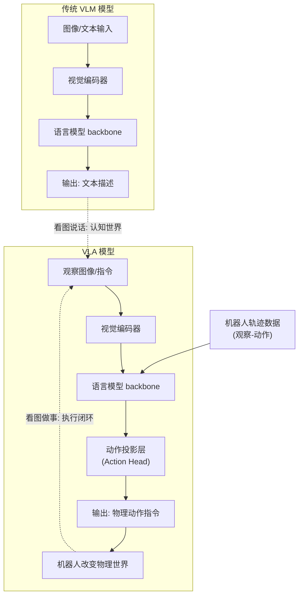

# VLA（Vision-Language-Action）模型与传统的VLM相比，在架构和能力上有什么根本区别？

VLM（视觉-语言模型）核心在于“感知与认知”（看图说话），输出是文本；而VLA（视觉-语言-动作模型）实现了“感知-决策-执行”闭环（看图做事），核心输出是物理动作指令。在架构上，VLA增加了动作投影层，直接预测末端轨迹；在数据上，VLA融合了（观察-动作）轨迹数据。这使得VLA无需针对新任务编程，具备跨具身任务的泛化能力，是具身智能的核心。

## 技术原理

- **核心差异：VLM 输出文本信息，VLA 输出物理动作**：VLM（Vision-Language Model，如 GPT-4V、LLaVA）把图像和文本作为输入，输出仍是对图像/问题的**文本描述或回答**——它在"认知世界"。VLA（Vision-Language-Action，如 RT-2、OpenVLA、π0）的输出是**物理动作指令**（机器人关节角度、末端执行器位姿、轨迹点序列），它直接驱动物理设备改变世界——"操作世界"。这是从"看图说话"到"看图做事"的范式跃迁。
- **架构改进：VLA 在视觉和语言层间引入动作映射**：VLA 在 VLM 的视觉编码器和语言模型之上，增加一个**动作投影层（Action Head / Action Tokenizer）**——把语言模型的隐状态映射到连续动作空间（如 7 维关节角度 + 1 维 gripper）。语言模型本身仍是 backbone（常是预训练的 VLM），动作 token 作为特殊"词"嵌入词表，让模型用统一的 next-token 预测框架同时输出语义理解和动作指令。
- **数据闭环：VLA 训练数据包含机器人轨迹数据**：VLM 主要在 (image, text) 互联网数据上训练，VLA 则要混合大规模**机器人轨迹数据**——(观察图像, 语言指令, 执行动作, 后续观察) 序列。这些数据来自遥操记录、仿真（Sim）、跨具身迁移（multiple robots）。轨迹数据让模型学到"在什么观察下，什么动作能达成什么效果"的因果关系，实现感知到执行的直接映射。

## 对比/选型

| 维度 | VLM | VLA |
|------|-----|-----|
| 输入 | 图像 + 文本 | 图像 + 文本（任务指令）|
| 输出 | 文本 | 物理动作（关节/位姿/轨迹）|
| 架构 | 视觉编码器 + LLM | VLM backbone + Action Head |
| 训练数据 | (image, text) 互联网数据 | + 机器人轨迹数据 |
| 应用 | 视觉问答/图像描述 | 机器人抓取/操作/导航 |
| 侧重 | 认知 | 具身控制 |

## 代码示例

VLA 推理（OpenVLA 风格）：

```python
from primitives import VLA

# 加载 VLA（基于 PaliGemma + Action Head）
vla = VLA.load("openvla/openvla-7b")

# 输入：图像 + 自然语言任务指令
image = camera.capture()                    # 当前场景观察
prompt = "pick up the red block and place it on the blue square"

# 输出：连续动作指令（关节角度 + gripper 开合）
action = vla.predict_action(image, prompt)
# action = {"position": [x, y, z], "rotation": [...], "gripper": 0.0/1.0,
#           "joint_angles": [j1, j2, j3, j4, j5, j6, j7]}

robot.execute(action)                       # 直接驱动机器人执行
```

动作 token 化原理（RT-2 风格）：

```python
# 把连续动作离散成 token，作为 LLM 词表的一部分
def action_to_tokens(action):
    # action: 7维关节角度 + 1维 gripper，每维离散为 256 bin
    tokens = []
    for dim in action:                      # 8 维
        bin_idx = int((dim - MIN) / (MAX - MIN) * 255)
        tokens.append(f"<action_{bin_idx}>")
    return tokens                            # 8 个 action token

# LLM 用 next-token 预测同时输出语义和动作
# "pick up red block" → <action_128><action_64>...<action_255>
```

## 常见坑/注意事项

- **动作空间一致性**：不同机器人的关节构型不同（6DoF vs 7DoF、夹爪 vs 灵巧手），VLA 要么限定单一具身，要么做动作归一化/跨具身训练（如 Open X-Embodiment）。
- **数据稀缺是瓶颈**：互联网有海量图文数据但缺机器人轨迹数据，VLA 的核心挑战是数据效率——靠仿真预训练（Sim2Real）、遥操收集、跨具身共享来补足。
- **Sim2Real Gap**：仿真训练的 VLA 部署到真实机器人会有视觉/物理差异（domain gap），要配 domain randomization、实物微调。
- **闭环反馈延迟敏感**：VLA 要实时（10-30Hz）输出动作，但大模型推理慢（>100ms），要用量化、蒸馏、专门的 Action Expert 加速，否则机器人动作卡顿。
- **安全约束**：物理动作可能损坏物体或伤人，VLA 输出要加安全过滤（工作空间限制、力矩上限、紧急停止），不像文本输出那样无害。
- **泛化性 vs 专项精度**：通用 VLA 跨任务泛化强但单任务精度不如专项策略模型，工业产线单一任务可能仍用专项方案。

## 流程图




## 记忆要点

- VLM 是看图说话（输出文本），VLA 是看图做事（输出动作）。
- VLA 增加动作投影层，融合观察-动作轨迹数据。
- VLA 实现感知-决策-执行闭环，具备跨任务泛化。
- VLM 侧重认知，VLA 侧重具身智能控制。


## 结构化回答

**30 秒电梯演讲：** VLM看图说话解释世界，VLA看图做事改变世界。——打个比方，VLM像个解说员，看着球赛告诉你在发生什么；VLA像个运动员，看着球直接指挥手脚去接球。

**展开框架：**
1. **VLM 是看图说** — VLM 是看图说话（输出文本），VLA 是看图做事（输出动作）。
2. **VLA 增加动作** — VLA 增加动作投影层，融合观察-动作轨迹数据。
3. **VLA 实现感知** — VLA 实现感知-决策-执行闭环，具备跨任务泛化。

**收尾：** 以上三点都能配合实战聊。您想深入聊哪一块？

## 视频脚本

> 预计时长：2 分钟 | 由浅入深

| 时间 | 画面/字幕 | 口播台词 | 讲解要点 |
|------|----------|----------|----------|
| 0:00 | 标题卡 | "VLA（Vision-Language-Action）模型与传统的VLM相比，30 秒讲清楚。" | 开场钩子 |
| 0:30 | 概念定义动画 | "一句话：VLM看图说话解释世界，VLA看图做事改变世界。" | 核心定义 |
| 1:00 | 要点图解 | "VLM 是看图说话（输出文本），VLA 是看图做事（输出动作）。" | 要点 |
| 1:30 | 总结卡 | "记好这几条，面试不慌。下期见。" | 收尾 |
