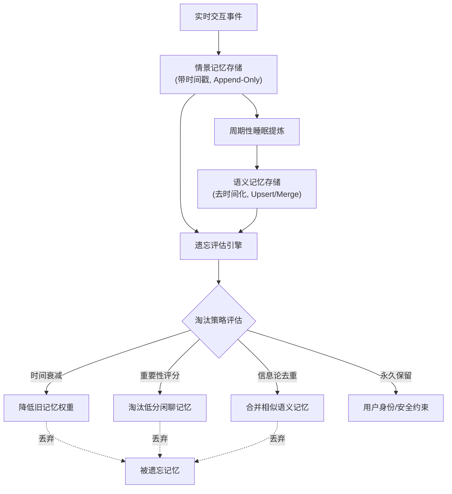

# Agent系统中的情景记忆与语义记忆有什么区别？如何设计记忆的遗忘机制？

情景记忆存储具体的、有时间戳的事件或经历（如“用户昨天提到喜欢吃辣”）；语义记忆存储提炼出的通用知识或事实（如“该用户偏好重口味”）。情景记忆个性化强但冗余，语义记忆抽象但易失真。遗忘机制设计通常基于重要性评分和访问频率。一种常见策略是使用滑动窗口或基于时间的衰减，自动丢弃过期的低优先级记忆；另一种是基于“信息论”的方法，当新增记忆与现有记忆高度相似（互信息低）时进行合并或去重。此外，也可以引入强化学习机制，让模型学习哪些记忆对当前任务的Reward贡献最大，从而决定保留哪些记忆。

**实战案例**：在构建长期陪伴型虚拟人时，曾发现不引入遗忘会导致上下文爆炸，Agent在处理复杂任务时反而忽略了关键近期指令（如用户修改了核心偏好），最终通过“时间衰减+最近强化”的双窗口机制解决了“经验掩盖新知”的问题。

**代码示例**：
```python
# 基于时间衰减与重要性的记忆评分
def calculate_score(memory):
    # importance: 初始重要性 (0-1)
    # time_delta: 距离现在的天数
    decay_factor = 0.95 ** memory['time_delta']  # 指数衰减
    recency_boost = 2.0 if memory['time_delta'] < 1 else 1.0  # 24小时内加权
    return memory['importance'] * decay_factor * recency_boost

# 简单的遗忘过滤策略
def filter_memories(memories, limit=10):
    scored = sorted(memories, key=calculate_score, reverse=True)
    return scored[:limit]
```

**对比表格**：

| 维度 | 情景记忆 | 语义记忆 |
| :--- | :--- | :--- |
| **存储内容** | 原始事件、对话片段、观察日志（带时间戳） | 提炼的规则、用户画像、事实图谱（去时间化） |
| **数据结构** | List/Vector Database (检索重视文本相似度) | Knowledge Graph/SQL (检索重视逻辑关系) |
| **更新机制** | Append Only (追加) | Upsert/Merge (更新或合并) |
| **典型应用** | 回复“我们上周聊了什么？” | 回复“我通常喜欢什么？” |
| **主要风险** | 上下文窗口溢出、噪声干扰 | 过度泛化、信息失真 |

## 技术原理

借鉴认知科学的记忆分类，Agent 系统通过双轨记忆平衡「具体性」与「泛化性」：

- **情景记忆（Episodic Memory）的流水账模型**：每个记忆条目是一个 `(timestamp, event)` 元组，记录「何时发生了什么」。存储采用 Append-Only（只追加不修改），保证历史可追溯。检索时常用向量数据库（按语义相似度召回）或时间窗口（取最近 N 条）。优势是细节完整、可回溯；劣势是数据量线性增长，上下文窗口容易溢出，且大量细节会稀释关键信息。典型应用：用户上周说过的具体话术、某次任务的完整执行轨迹。
- **语义记忆（Semantic Memory）的知识图谱模型**：从情景记忆中提炼出去时间化的通用知识（如「用户偏好辣味」从多次「用户点了水煮鱼」「用户加了辣椒」抽象而来）。存储用 Knowledge Graph（实体-关系-属性）或 KV/SQL 表，更新机制是 Upsert/Merge（新信息覆盖或合并旧信息）。优势是紧凑、可推理；劣势是抽象过程可能丢失关键细节或过度泛化（如把「用户某次拒绝甜食」误泛化为「用户不喜欢甜食」，实际可能只是当时不饿）。
- **遗忘机制的必要性**：LLM 上下文窗口有限（即使 128K），无限累积记忆会导致：(1) token 超限；(2) 关键信息被噪声淹没（lost in the middle）；(3) 检索延迟增加。遗忘是「资源约束下的信息压缩」，类似于人脑睡眠时的记忆整理。
- **遗忘策略的三种范式**：(1) **时间衰减**——$score = importance \times \lambda^{\Delta t}$（$\lambda < 1$），近期记忆权重高，典型 $\lambda = 0.95$；(2) **重要性评分**——LLM 给每条记忆打分（如「用户核心偏好」高分、「闲聊」低分），低分优先淘汰；(3) **信息论去重**——新记忆与已有记忆的语义相似度高于阈值时合并（提取共性、丢弃冗余），保留信息增量。生产系统常三者组合。

## 代码示例

```python
# 完整的记忆管理器：双轨记忆 + 遗忘机制（伪代码）
import time
from dataclasses import dataclass, field

@dataclass
class EpisodicMemory:
    content: str
    timestamp: float
    importance: float          # LLM 评分 0-1
    access_count: int = 0      # 访问频率

class MemoryManager:
    def __init__(self):
        self.episodic: list[EpisodicMemory] = []   # 情景记忆（追加）
        self.semantic: dict = {}                    # 语义记忆（Upsert）

    def add(self, event: str, importance: float):
        """新增情景记忆"""
        self.episodic.append(EpisodicMemory(event, time.time(), importance))
        self._maybe_consolidate()   # 触发情景→语义的提炼
        self._forget()              # 触发遗忘

    def score(self, m: EpisodicMemory) -> float:
        """遗忘评分：重要性 × 时间衰减 × 访问加权"""
        days = (time.time() - m.timestamp) / 86400
        decay = 0.95 ** days
        recency_boost = 2.0 if days < 1 else 1.0   # 24 小时内加权
        access_boost = 1 + 0.1 * m.access_count    # 越常访问越重要
        return m.importance * decay * recency_boost * access_boost

    def _forget(self, limit: int = 50):
        """遗忘：保留评分最高的 limit 条"""
        self.episodic.sort(key=self.score, reverse=True)
        self.episodic = self.episodic[:limit]

    def _maybe_consolidate(self):
        """情景→语义提炼：定期把高频事件抽象成通用知识"""
        if len(self.episodic) < 100:
            return
        # 用 LLM 从情景记忆中提炼语义知识（模拟人脑睡眠整理）
        facts = llm.extract_facts([m.content for m in self.episodic])
        for fact in facts:
            key = fact["entity"]
            self.semantic[key] = fact["value"]    # Upsert/Merge

    def retrieve(self, query: str, top_k: int = 5):
        """检索：语义记忆优先 + 情景记忆补充"""
        semantic_hits = [v for k, v in self.semantic.items() if k in query]
        episodic_hits = sorted(self.episodic, key=self.score, reverse=True)[:top_k]
        for m in episodic_hits:
            m.access_count += 1                    # 访问计数（影响未来评分）
        return semantic_hits + [m.content for m in episodic_hits]
```

## 注意事项

- **情景→语义的提炼时机**：不能实时提炼（开销大），常见策略是周期性触发（如每 100 条新记忆）或空闲时段（模拟「睡眠整理」）。提炼 prompt 要明确「提取稳定偏好，忽略偶发行为」，避免过度泛化。
- **遗忘的不可逆风险**：被遗忘的记忆无法恢复。重要记忆（如用户身份信息、安全约束）应标记为「永久保留」，不参与遗忘淘汰。
- **记忆冲突的处理**：新旧记忆矛盾时（如用户先说喜欢辣、后说口味变淡），语义记忆应保留最新（带时间戳的 Upsert），情景记忆则两者都留供回溯。冲突检测可用语义相似度 + 矛盾词识别。
- **检索的相关性 vs 时效性**：纯语义检索可能召回很久之前的记忆，忽略近期变化。建议「时间衰减 + 语义相似度」加权，或用 Recency-Weighted RAG。
- **隐私与合规**：长期记忆含用户个人信息，需支持「删除某用户全部记忆」（GDPR 的被遗忘权）。存储设计要按 user_id 隔离，支持批量删除。
- **多用户记忆隔离**：记忆管理器必须按用户/会话隔离，避免 A 的记忆污染 B 的对话。通常 user_id 作为记忆的前缀或分库键。

## 流程图



## 记忆要点

- 情景记具体事件（带时间），语义记通用知识（去时间）。
- 情景记忆 Append Only，语义记忆 Upsert/Merge。
- 遗忘机制：时间衰减+重要性评分，或基于互信息去重。
- 情景易溢出，语义易失真，需结合双窗口机制。


## 结构化回答

**30 秒电梯演讲：** 情景记流水账，语义记规律；按重要性和时间淘汰旧记忆。——打个比方，就像人的大脑，情景记忆是日记（具体发生过的事），语义记忆是常识（总结出的规律）；遗忘机制就是大脑睡觉时的“清理内存”，把没用的事忘掉。

**展开框架：**
1. **情景记具体事件（** — 情景记具体事件（带时间），语义记通用知识（去时间）。
2. **情景记忆 App** — 情景记忆 Append Only，语义记忆 Upsert/Merge。
3. **遗忘机制** — 时间衰减+重要性评分，或基于互信息去重。

**收尾：** 以上三点都能配合实战聊。您想深入聊哪一块？

## 视频脚本

> 预计时长：2 分钟 | 由浅入深

| 时间 | 画面/字幕 | 口播台词 | 讲解要点 |
|------|----------|----------|----------|
| 0:00 | 标题卡 | "Agent系统中的情景记忆与语义记忆有什么区别，30 秒讲清楚。" | 开场钩子 |
| 0:30 | 概念定义动画 | "一句话：情景记流水账，语义记规律；按重要性和时间淘汰旧记忆。" | 核心定义 |
| 1:00 | 要点图解 | "情景记具体事件（带时间），语义记通用知识（去时间）。" | 要点 |
| 1:30 | 总结卡 | "记好这几条，面试不慌。下期见。" | 收尾 |
