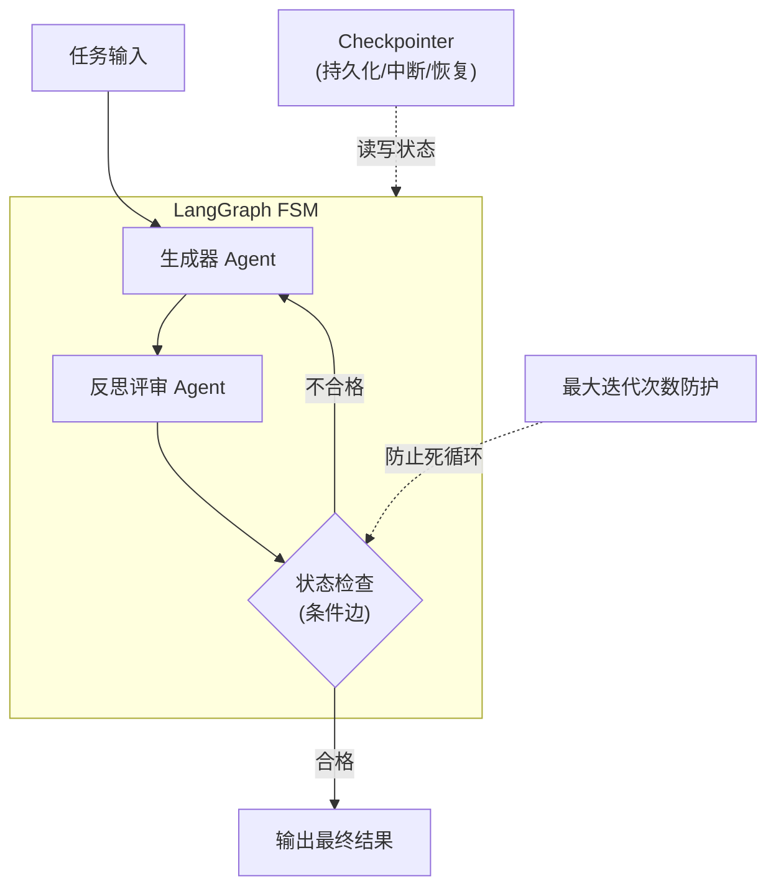

# LangGraph 的状态机模型与传统 Chain（如 LangChain）有何本质区别？在处理循环逻辑时有什么优势？

LangChain 的传统 Chain 基于线性或简单的 DAG 结构，输出直接传递，难以处理循环和状态回退。LangGraph 将执行过程建模为有向循环图（FSM），维护全局共享状态。优势在于：1. 原生支持循环（如反思-修正的自动重试）；2. 可控性高，每步可观测和中断；3. 适合模拟多轮对话和工具调用的复杂非线性工作流。

## 技术原理

- **架构区别：传统线性 DAG vs. 有向循环图（FSM）**：LangChain 的 Chain 是线性或简单 DAG——节点按预定义顺序执行，每个节点的输出作为下一节点的输入，**执行路径在编译期固定**，无回路。LangGraph 把工作流建模为**有向循环图 + 有限状态机（FSM）**——节点之间通过边连接，边可以是条件边（基于状态决定下一个节点），从而支持循环、跳转、回退等复杂控制流。
- **核心优势：原生支持循环迭代与状态回退**：循环是 LangGraph 的核心能力——执行到某节点后根据状态决定回到之前的节点重试，典型的"反思-修正"循环（生成草稿 → 自我评审 → 不满意回到生成节点重写）在 LangGraph 里是原生结构。Chain 要实现循环需要手动递归/异常处理，破坏了链式语义；LangGraph 用图的边自然表达。
- **适用场景：多轮对话、反思修正等复杂工作流**：任何需要"重试、回退、分支、人机交互（HITL）"的复杂工作流都适合 LangGraph：多轮对话的状态管理、ReAct 的 think-act-observe 循环、Self-Reflection 的生成-批评-重写、需人工审批才继续的合规流程。简单的"读-处理-写"线性流程用 Chain 更简洁。

## 对比/选型

| 维度 | LangChain Chain | LangGraph |
|------|------------------|-----------|
| 图结构 | 线性 / DAG | 有向循环图（FSM） |
| 状态管理 | 仅传递上一步输出 | 全局共享 State（可读写） |
| 循环支持 | 需手动递归 | 原生条件边 |
| 中断/恢复 | 不支持 | 支持（checkpointer） |
| HITL（人机交互）| 难 | 原生支持 |
| 适合场景 | 简单线性 RAG/工具链 | 多轮/反思/复杂工作流 |

## 代码示例

LangGraph 反思-修正循环：

```python
from langgraph.graph import StateGraph, END
from typing import TypedDict, List

class State(TypedDict):
    draft: str
    critique: str
    iterations: int

def generate(state): state["draft"] = llm.write(); return state
def critique(state):
    state["critique"] = reviewer.check(state["draft"])
    return state

def should_revise(state):
    if "good" in state["critique"] or state["iterations"] >= 3:
        return END                          # 满意或达上限 → 结束
    return "generate"                       # 不满意 → 回到 generate 重写

g = StateGraph(State)
g.add_node("generate", generate)
g.add_node("critique", critique)
g.set_entry_point("generate")
g.add_edge("generate", "critique")          # 生成 → 评审
g.add_conditional_edges("critique", should_revise)  # 评审 → 条件分支
app = g.compile(checkpointer=memory)        # 支持中断/恢复

# 可在任意节点中断，人工介入后再继续
app.invoke({"draft": "", "critique": "", "iterations": 0})
```

对比 LangChain 的循环写法（繁琐）：

```python
# LangChain 实现同样逻辑要手动递归/while
def run():
    draft = llm.write()
    for _ in range(3):
        if reviewer.check(draft) == "good": break
        draft = llm.rewrite(draft)         # 手动循环，状态散在变量里
    return draft
```

## 常见坑/注意事项

- **死循环防护**：图里的循环要设最大迭代次数或终止条件，否则状态可能让 Agent 永远循环（如反思永远不满意）。LangGraph 有 `recursion_limit` 默认 25。
- **状态设计要规范**：State 是图里所有节点共享的全局对象，字段设计要清晰（用 TypedDict），否则节点间读写易混乱。复杂状态可分层。
- **Checkpointer 的代价**：要支持中断/恢复必须配 checkpointer（持久化每步状态），有 IO 开销，简单流程不必要。
- **不是所有场景都要 LangGraph**：简单 RAG/单次工具调用用 Chain 更轻量，过度使用 LangGraph 反而增加复杂度。
- **调试比 Chain 难**：图执行路径动态（条件边决定下一步），调试要看 trace 而非代码顺序，配合 LangSmith 等可视化工具。
- **并发分支**：LangGraph 支持扇出并发执行多个节点再汇聚（fan-out/fan-in），但要小心状态写冲突，需用 reducer 合并。

## 流程图




## 记忆要点

- Chain 是线性 DAG，LangGraph 是有向循环图（FSM）。
- LangGraph 维护全局共享状态，Chain 仅传递输出。
- LangGraph 原生支持循环、回退和人机交互。
- 复杂非线性工作流和反思修正场景首选 LangGraph。


## 结构化回答

**30 秒电梯演讲：** LangGraph 用状态机打破线性链，支持复杂循环与回退。——打个比方，传统 Chain 像单向流水线，出错了只能重来；LangGraph 像导航地图，走错路能绕回重走，还能随时暂停。

**展开框架：**
1. **Chain 是线** — Chain 是线性 DAG，LangGraph 是有向循环图（FSM）。
2. **LangGrap** — LangGraph 维护全局共享状态，Chain 仅传递输出。
3. **LangGrap** — LangGraph 原生支持循环、回退和人机交互。

**收尾：** 以上三点都能配合实战聊。您想深入聊哪一块？

## 视频脚本

> 预计时长：2 分钟 | 由浅入深

| 时间 | 画面/字幕 | 口播台词 | 讲解要点 |
|------|----------|----------|----------|
| 0:00 | 标题卡 | "LangGraph 的状态机模型与传统 Chain（如 LangChain）有何，30 秒讲清楚。" | 开场钩子 |
| 0:30 | 概念定义动画 | "一句话：LangGraph 用状态机打破线性链，支持复杂循环与回退。" | 核心定义 |
| 1:00 | 要点图解 | "Chain 是线性 DAG，LangGraph 是有向循环图（FSM）。" | 要点 |
| 1:30 | 总结卡 | "记好这几条，面试不慌。下期见。" | 收尾 |
