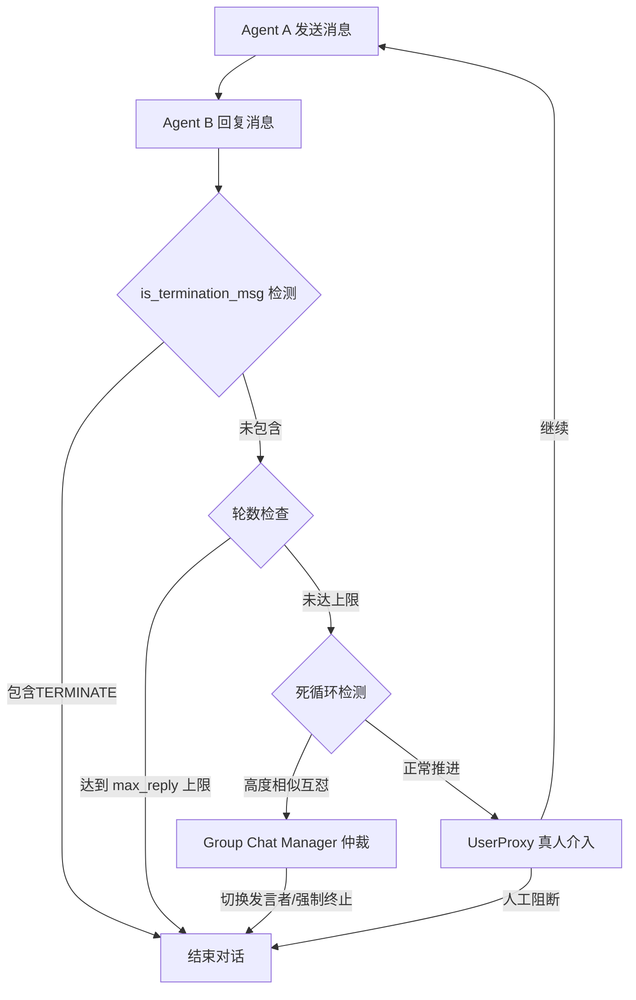

# 在 AutoGen 的多 Agent 对话模式中，如何定义“可终止对话”的条件？如果陷入死循环怎么办？

在 AutoGen 中，定义可终止对话主要依赖 `is_termination_msg` 参数。常见机制包括：1. **基于内容的信号**：如检测到包含“TERMINATE”的特定回复；2. **基于最大轮数**：设置 `max_consecutive_auto_reply` 强制结束；3. **基于状态或外部输入**：如任务成功或人类管理员介入。若陷入死循环（如互怼），解决策略有：设置**仲裁者 Agent** 或**Group Chat Manager** 来根据规则切换对话或终止；利用**反射机制**检测重复内容停止；通过 LLM 动态评估对话上下文决定是否结束。

## 技术原理

- **关键词匹配终止（如 TERMINATE）**：AutoGen 的 `AssistantAgent` 构造时传 `is_termination_msg` 函数，每条消息收到后调用该函数，返回 True 则终止对话。最常见是检测消息里是否含特定关键词（如 "TERMINATE"、"DONE"、"APPROVED"）。这是"信号驱动"的终止——任务完成时显式发出结束信号。
- **最大交互轮数限制（硬止损）**：通过 `max_consecutive_auto_reply`（如设为 10）限制两个 Agent 之间自动回复的最大次数。即使没收到终止信号，达到上限也强制停止。这是防止死循环的兜底——任何"软"终止机制都可能失效，硬上限永远有效。
- **引入仲裁者或人类管理员打破死循环**：在 Group Chat 中引入 `GroupChatManager` 作为仲裁者，每轮决定下一个发言者并可在判断"陷入循环"时切换话题或终止；或者用 `UserProxyAgent` 让真人介入审批。仲裁者本质是引入"第三方裁判"打破双方互怼的对称结构。

## 代码示例

AutoGen 终止条件配置：

```python
from autogen import AssistantAgent, UserProxyAgent

# 1. 关键词终止：检测消息含 TERMINATE
def is_termination_msg(msg):
    return "TERMINATE" in msg.get("content", "")

assistant = AssistantAgent(
    "coder",
    llm_config=...,
    is_termination_msg=is_termination_msg,   # 收到含 TERMINATE 的消息就停
    max_consecutive_auto_reply=10,           # 硬上限 10 轮兜底
)

user_proxy = UserProxyAgent("user", human_input_mode="NEVER")
user_proxy.initiate_chat(assistant, message="写一个排序算法并测试")

# 2. Group Chat 的 ManagerManager 作为仲裁者
from autogen import GroupChat, GroupChatManager
gc = GroupChat(
    agents=[researcher, coder, reviewer],
    messages=[],
    max_round=20,                            # 群聊总轮数上限
)
manager = GroupChatManager(gc)               # 仲裁者决定发言顺序、可终止
```

死循环检测（基于重复内容）：

```python
def is_stuck(messages, window=4, threshold=0.8):
    """检测最近 window 轮消息是否高度重复"""
    recent = [m["content"] for m in messages[-window:]]
    if len(recent) < window: return False
    # 简化：用文本相似度判断是否在重复
    return all(similarity(recent[0], r) > threshold for r in recent[1:])
```

## 对比/选型

| 终止机制 | 触发方式 | 可靠性 | 适用 |
|----------|----------|--------|------|
| 关键词 | 任务完成显式发信号 | 中（依赖 LLM 输出关键词）| 主动完成任务 |
| 最大轮数 | 硬上限 | 高（必触发）| 兜底防死循环 |
| 仲裁者 | 第三方判断 | 高 | Group Chat |
| LLM 评估 | 让 LLM 判断是否该停 | 中（成本高）| 复杂场景 |
| 人类介入 | 真人审批 | 极高 | 高风险任务 |

## 常见坑/注意事项

- **关键词终止依赖 LLM 输出**：LLM 可能"忘记"在完成时说 TERMINATE，导致对话空转。要 prompt 里反复强调"任务完成后输出 TERMINATE"，并配合轮数兜底。
- **`max_consecutive_auto_reply` 别设太小**：复杂任务可能需要 10+ 轮迭代，设 3-5 会过早截断；但太大（如 100）又失去防护。经验值 10-20。
- **Group Chat 的死循环更隐蔽**：多个 Agent 围绕同一观点反复讨论，Manager 不一定能识别。要监控"重复内容比例"或加 LLM-as-judge 动态评估。
- **终止后状态丢失**：AutoGen 默认终止即结束，要持久化中间结果（写文件/存库），否则下次重启从头来。
- **人类介入的延迟**：UserProxyAgent 等真人审批时整个对话阻塞，要设超时自动默认通过或拒绝，避免无限等待。
- **不要只依赖一种机制**：生产环境要"关键词 + 轮数 + 内容重复检测"多管齐下，单一机制都可能在边界 case 失效。

## 流程图



## 核心知识点图


## 记忆要点

- 终止条件：检测特定关键词、最大轮数限制或外部信号。
- 防死循环：设置仲裁者 Agent 或 Group Chat Manager。
- 利用反射机制检测重复内容，或 LLM 动态评估上下文。
- 核心是 `is_termination_msg` 参数与强制轮数兜底。


## 结构化回答

**30 秒电梯演讲：** 通过关键词、次数或外部干预设定停止熔断机制。——打个比方，像两人吵架，需设定“喊停口令”、“互怼次数上限”或“裁判介入”规则。

**展开框架：**
1. **终止条件** — 检测特定关键词、最大轮数限制或外部信号。
2. **防死循环** — 设置仲裁者 Agent 或 Group Chat Manager。
3. **利用反射机制检测** — 利用反射机制检测重复内容，或 LLM 动态评估上下文。

**收尾：** 以上三点都能配合实战聊。您想深入聊哪一块？

## 视频脚本

> 预计时长：2 分钟 | 由浅入深

| 时间 | 画面/字幕 | 口播台词 | 讲解要点 |
|------|----------|----------|----------|
| 0:00 | 标题卡 | "在 AutoGen 的多 Agent 对话模式中，如何定义“可终止对话”的条件，30 秒讲清楚。" | 开场钩子 |
| 0:30 | 概念定义动画 | "一句话：通过关键词、次数或外部干预设定停止熔断机制。" | 核心定义 |
| 1:00 | 终止条件图解 | "检测特定关键词、最大轮数限制或外部信号。" | 终止条件 |
| 1:30 | 总结卡 | "记好这几条，面试不慌。下期见。" | 收尾 |
