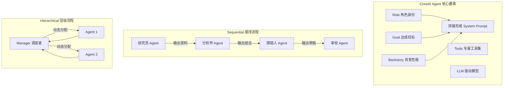

# CrewAI 中的角色定义包含哪些核心要素？如何通过角色分工实现自动化的任务执行？

CrewAI 强调基于角色的协作。每个 Agent 定义的核心要素包括：1. **Role（角色）**：定义 Agent 的身份（如“高级数据分析师”）；2. **Goal（目标）**：该角色致力于达成的具体目标；3. **Backstory（背景故事）**：赋予 Agent 上下文和性格，影响其回复风格；4. **Tools（工具）**：该角色可使用的工具集；5. **LLM（模型）**：驱动该角色的底层模型。CrewAI 通过**Process** 机制（如 Sequential 或 Hierarchical）将任务串联。在 Sequential 模式下，任务按顺序传递，每个角色根据自己的专长完成任务并输出结果给下一个角色。通过精心设计角色互补（如“研究员”负责找资料，“撰稿人”负责写文章），系统能自动将复杂任务分解并由专业人士协作完成。

## 技术原理

- **核心要素：角色、目标、背景故事、工具、模型**：CrewAI 的 Agent 定义由五大要素组成——①**Role**（身份/职位，如"高级数据分析师"）；②**Goal**（具体目标，让 Agent 知道要达成什么）；③**Backstory**（背景故事/性格设定，影响回复风格和决策偏好）；④**Tools**（该角色可用的工具集，限定能力边界）；⑤**LLM**（驱动该角色的底层模型，可按角色复杂度选不同模型）。其中 Role/Goal/Backstory 拼成 system prompt 引导 LLM 进入角色。
- **驱动机制：通过 Sequential 或 Hierarchical 流程串联任务**：CrewAI 的 Process 定义任务在角色间的流转方式——①**Sequential**（顺序流程）按 Task 列表的顺序依次执行，前一个 Task 的输出作为下一个的输入；②**Hierarchical**（层级流程）有一个 Manager Agent 统一调度，根据任务动态分配给最合适的 Agent，适合复杂不确定流程。流程是"剧本"，角色是"演员"。
- **执行逻辑：利用角色互补将复杂任务分解并接力完成**：通过精心设计角色分工（如"研究员"找资料 → "分析师"做分析 → "撰稿人"写报告 → "审校"校对），让每个 Agent 专精其领域，接力完成端到端复杂任务。互补设计是 CrewAI 的核心价值——单 Agent 难以兼顾多个专业领域，多角色分工能让每个环节由"专家"完成。

## 代码示例

CrewAI 角色定义与 Sequential 流程：

```python
from crewai import Agent, Task, Crew, Process

# 1. 定义互补角色
researcher = Agent(
    role='资深研究员',
    goal='收集并整理 RAG 一致性相关的高质量资料',
    backstory='你是 10 年经验的 AI 研究员，擅长从论文和实践中提炼要点，输出条理清晰。',
    tools=[search_tool, web_scraper],
    llm='gpt-4o',
)
writer = Agent(
    role='技术撰稿人',
    goal='把研究员的资料整理成易读的技术博客',
    backstory='你擅长把技术概念用通俗语言表达，文章结构清晰、有案例。',
    tools=[],
    llm='gpt-4o',
)
reviewer = Agent(
    role='编辑',
    goal='校对文章准确性、流畅度和结构',
    backstory='你是严苛的资深编辑，会指出逻辑漏洞和表达问题。',
    tools=[],
    llm='gpt-4o',
)

# 2. 定义任务（顺序流程）
research_task = Task(
    description='研究 RAG 一致性的核心方案',
    expected_output='500 字资料摘要',
    agent=researcher,
)
write_task = Task(
    description='基于研究资料写一篇技术博客',
    expected_output='2000 字博客',
    agent=writer,
    context=[research_task],            # 接收上游输出
)
review_task = Task(
    description='校对博客并给出修改建议',
    expected_output='修订稿 + 修改说明',
    agent=reviewer,
    context=[write_task],
)

# 3. 组建 Crew 并启动
crew = Crew(
    agents=[researcher, writer, reviewer],
    tasks=[research_task, write_task, review_task],
    process=Process.sequential,         # 顺序流程
)
result = crew.kickoff()
```

## 对比/选型

| 流程模式 | 调度方式 | 适用 |
|----------|----------|------|
| Sequential | 固定顺序 | 流程明确、线性 |
| Hierarchical | Manager 动态分配 | 复杂不确定、需路由 |
| Consensual | 投票/共识 | 多方协商决策 |

## 常见坑/注意事项

- **角色边界要清晰**：角色职责重叠会导致互相推诿或重复劳动。设计时要让每个角色的 Goal 严格限定在自己的专业领域。
- **Backstory 影响风格**：写得太抽象 LLM 抓不住重点，写得太具体会限制灵活性。要在"专业身份"和"行为指引"之间平衡。
- **Sequential 流程不灵活**：固定顺序在任务路径不确定时低效（如某任务需先做下游），要改用 Hierarchical 让 Manager 动态调度。
- **Task 上下文传递**：`context=[task]` 让下游看到上游输出，但上下文越长 LLM 越易"跑偏"，要控制传递的内容长度。
- **LLM 选择按角色复杂度**：研究者/撰稿人用 GPT-4o，简单校对可用 GPT-4o-mini 省成本，别一刀切用最强模型。
- **工具权限要隔离**：每个 Agent 只配它需要的 Tools，避免越权（如审校 Agent 不应有写入权限）。

## 流程图




## 记忆要点

- 核心要素：Role（身份）、Goal（目标）、Backstory（背景）。
- 通过 Process（顺序/层级）串联任务，实现角色互补。
- Sequential 模式下，任务按顺序在不同角色间流转。
- Backstory 赋予性格，Tools 赋予能力，LLM 提供智力。


## 结构化回答

**30 秒电梯演讲：** 赋予 AI 角色与流程，模拟人类团队协作自动化完成任务。——打个比方，像组建一支有分工的剧组，导演（流程）安排剧本（任务），演员（角色）按人设（背景故事）用道具（工具）演戏。

**展开框架：**
1. **核心要素** — Role（身份）、Goal（目标）、Backstory（背景）。
2. **通过 Proce** — 通过 Process（顺序/层级）串联任务，实现角色互补。
3. **Sequenti** — Sequential 模式下，任务按顺序在不同角色间流转。

**收尾：** 以上三点都能配合实战聊。您想深入聊哪一块？

## 视频脚本

> 预计时长：2 分钟 | 由浅入深

| 时间 | 画面/字幕 | 口播台词 | 讲解要点 |
|------|----------|----------|----------|
| 0:00 | 标题卡 | "CrewAI 中的角色定义包含哪些核心要素，30 秒讲清楚。" | 开场钩子 |
| 0:30 | 概念定义动画 | "一句话：赋予 AI 角色与流程，模拟人类团队协作自动化完成任务。" | 核心定义 |
| 1:00 | 核心要素图解 | "Role（身份）、Goal（目标）、Backstory（背景）。" | 核心要素 |
| 1:30 | 总结卡 | "记好这几条，面试不慌。下期见。" | 收尾 |
