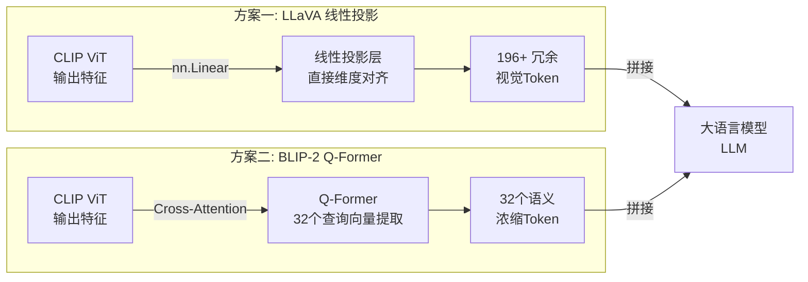

# 在多模态大模型（如LLaVA）中，简单的线性投影层（Linear Projection）是如何连接视觉编码器和LLM的？相比Q-Former（如BLIP-2）这种做法有什么优缺点？

在LLaVA等早期多模态大模型中，视觉编码器（如CLIP ViT）提取的图像特征通常经过一个简单的全连接层（Linear Projection）进行维度变换，直接映射到LLM的词嵌入空间，作为视觉Token拼接到文本Token序列中。这种方法的优点在于结构极简，参数量少，训练速度快，且端到端优化时能有效对齐视觉和文本特征。然而，缺点在于视觉特征的高层语义信息可能未被充分压缩和解码，且简单的投影可能导致冗余的视觉Token输入LLM，增加了推理计算开销。相比之下，BLIP-2使用的Q-Former（基于Transformer的查询网络）充当信息瓶颈，通过可学习的查询向量从视觉特征中提取最相关的信息，不仅减少了输入LLM的Token数量，提高了推理效率，还能在冻结LLM的情况下更好地解耦视觉和语言的表示，但在训练收敛速度和架构复杂度上有所权衡。

## 技术原理

- **线性投影通过全连接层将视觉特征直接映射到词嵌入空间，结构简单、训练快**：LLaVA 的做法极简——CLIP ViT 把图像切成 patch（如 224×224 图 → 196 个 patch token，每个 1024 维），再经过一个线性层（`nn.Linear(1024, 4096)`）把每个 patch 特征映射到 LLM 的词嵌入维度。映射后的视觉 token 和文本 token 直接拼接送入 LLM，端到端训练时线性层学到了"如何让视觉特征像'词'一样被 LLM 理解"。
- **线性投影输入冗余 Token 多，计算开销大，语义挖掘较浅**：每个 patch 都成一个 token，一张图就是 196+ 个视觉 token 进 LLM，attention 计算量随 token 数平方增长；且这些 token 是"低层视觉特征"直接搬，LLM 要自己重新抽象出语义（"这是一只猫"），对视觉信息的利用不够高效。
- **Q-Former 通过查询向量提取核心信息，减少 Token 数量并提升效率，但架构更复杂**：BLIP-2 的 Q-Former 是一个小 Transformer，内部有一组**可学习的 query 向量**（如 32 个）。query 通过 cross-attention 从 ViT 输出的大量 patch 特征里"提问"，提取与任务最相关的信息，输出固定数量的 token（如 32 个）给 LLM。它充当**信息瓶颈**——把 196 个冗余 patch 压缩成 32 个语义浓缩 token，既减计算又解耦视觉/语言。

## 对比/选型

| 维度 | Linear Projection（LLaVA）| Q-Former（BLIP-2）|
|------|----------------------------|--------------------|
| 结构 | 单层 Linear | Transformer + learnable queries |
| 输出 Token 数 | = patch 数（多，如 196+）| 固定少量（如 32）|
| 计算开销 | 大（LLM 处理长序列）| 小（LLM 处理短序列）|
| 训练速度 | 快（参数少）| 慢（需多阶段训练）|
| 信息压缩 | 无（直接映射）| 强（信息瓶颈）|
| 解耦性 | 弱（视觉特征直接进 LLM）| 强（Q-Former 可独立训练）|
| 适合场景 | 简单 VQA、训练资源少 | 复杂推理、冻结大 LLM |

## 代码示例

LLaVA 风格的 Linear Projection：

```python
import torch.nn as nn

class LlavaProjector(nn.Module):
    def __init__(self, vision_dim=1024, text_dim=4096):
        super().__init__()
        self.linear = nn.Linear(vision_dim, text_dim)   # 单层投影

    def forward(self, image_features):
        # image_features: (batch, num_patches, vision_dim)  如 (1, 196, 1024)
        return self.linear(image_features)               # (1, 196, 4096)
        # 输出 196 个视觉 token，和文本 token 拼接送 LLM

# 训练：通常只训练 linear 层 + LoRA，CLIP ViT 和 LLM 冻结
```

BLIP-2 风格的 Q-Former：

```python
import torch.nn as nn

class QFormer(nn.Module):
    def __init__(self, num_queries=32, dim=768):
        super().__init__()
        self.queries = nn.Parameter(torch.randn(num_queries, dim))   # 可学习 query
        self.transformer = nn.TransformerDecoder(
            num_layers=6, ...)
        self.cross_attn = nn.MultiheadAttention(dim, ...)

    def forward(self, image_features):
        # image_features: (batch, 196, dim)
        q = self.queries.unsqueeze(0).expand(batch, -1, -1)          # (1, 32, dim)
        # 32 个 query 通过 cross-attention 从 196 patch 里提取信息
        out = self.transformer(q, image_features)                    # (1, 32, dim)
        return self.to_llm_proj(out)                                  # (1, 32, llm_dim)
        # 输出固定 32 个语义 token
```

## 常见坑/注意事项

- **Linear Projection 的 token 膨胀**：高分辨率图（如 1024×1024）会产生几千个 patch token，LLM 上下文很快被吃满。LLaVA-1.5+ 引入下采样（如 MLP 把 4 个 patch 合并成 1 个 token）缓解，但仍是瓶颈。
- **Q-Former 训练复杂**：需多阶段——先冻结 ViT/LLM 训练 Q-Former 学表示，再联合微调。训练数据和目标设计复杂，工程成本远高于 Linear。
- **信息损失 vs 计算**：Q-Former 压得太狠（如只输出 8 个 token）会丢细节（OCR、细粒度识别变差），压得太少（如 64）失去压缩优势。32 是经验值，需按任务调。
- **Q-Former 在新模型里被弱化**：LLaVA 系列证明简单 Linear 配合足够大的 LLM 也能达到很好效果，Q-Former 在新的开源 VLM（如 Qwen-VL、InternVL）里逐渐让位给更简单的 MLP 投影 + 更多 patch。
- **冻结 vs 全量训练**：早期为省算力冻结 ViT/LLM 只训投影层，但表示能力受限；现在主流做法是全量或多阶段联合训练，性能更好。

## 流程图



## 记忆要点

- Linear Projection 直接映射特征到词嵌入，结构极简。
- 优点：参数少、训练快、端到端对齐效果好。
- 缺点：Token 冗余、计算开销大、语义压缩不足。
- Q-Former 充当信息瓶颈，压缩 Token 并解耦模态。

## 结构化回答

**30 秒电梯演讲：** 线性投影直接对齐维数，Q-Former压缩筛选信息。——打个比方，线性投影像‘直接翻译’，把整本外语书逐字照搬；Q-Former像‘写摘要’，只提炼最关键的句子送给读者。

**展开框架：**
1. **Linear P** — Linear Projection 直接映射特征到词嵌入，结构极简。
2. **优点** — 参数少、训练快、端到端对齐效果好。
3. **缺点** — Token 冗余、计算开销大、语义压缩不足。

**收尾：** 以上三点都能配合实战聊。您想深入聊哪一块？

## 视频脚本

> 预计时长：2 分钟 | 由浅入深

| 时间 | 画面/字幕 | 口播台词 | 讲解要点 |
|------|----------|----------|----------|
| 0:00 | 标题卡 | "在多模态大模型（如LLaVA）中，简单的线性投影层（Linear Project，30 秒讲清楚。" | 开场钩子 |
| 0:30 | 概念定义动画 | "一句话：线性投影直接对齐维数，Q-Former压缩筛选信息。" | 核心定义 |
| 1:00 | 要点图解 | "Linear Projection 直接映射特征到词嵌入，结构极简。" | 要点 |
| 1:30 | 总结卡 | "记好这几条，面试不慌。下期见。" | 收尾 |

### 视频流程图


