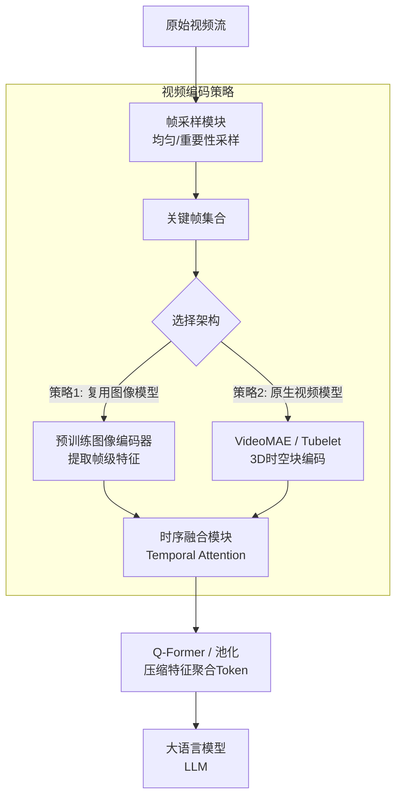

# 针对视频理解任务，多模态大模型如何解决“时序建模”的挑战？常见的视频编码器设计有哪些策略？

视频理解相比图像理解增加了时间维度，核心挑战在于如何高效捕捉长短期时序依赖并处理巨大的数据冗余。常见的视频编码器设计策略包括：1. 帧采样与特征提取：为了避免逐帧处理的高昂计算，通常采用均匀采样或基于重要性的采样提取关键帧，然后利用预训练的图像编码器（如ViT或CLIP）提取每一帧的视觉特征。2. 时序融合模块：在获取帧级特征后，引入时序建模模块，如1D Temporal Convolution、Temporal Attention机制或使用Transformer Encoder来捕捉帧之间的动态关系。3. 视频特定架构：直接使用VideoMAE、ViViT等专门的视频Transformer，它们通过Tubelet Embedding将3D时空块编码为Token，直接在patch层面进行时空注意力计算。此外，为了压缩视频Token以适应LLM的上下文窗口，近期研究还倾向于使用Q-Former或注意力池化将密集的视频特征聚合为少量Token。

## 技术原理

- **核心挑战：捕捉时序依赖并处理数据冗余**：视频比图像多了时间维度，一段几秒的视频可能有上百帧，相邻帧高度冗余（背景不变、动作微变），逐帧编码会让计算量爆炸。同时关键动作可能跨多帧（如"投篮"是 1-2 秒的连续动作），必须建模长短期时序依赖。核心矛盾是"信息密度低 + 时序关系重要"。
- **策略一：帧采样（均匀/重要性）+ 图像编码器提取特征**：最经济方案——从视频中采样 N 帧（如 8/16/32 帧），均匀采样（等间隔抽帧）或基于重要性采样（用 CLIP 分数/运动检测选关键帧），每帧用预训练图像编码器（ViT/CLIP）提取特征，再融合。优点：复用图像模型、计算可控；缺点：采样可能漏掉关键瞬间，且帧间时序关系靠后续模块补。
- **策略二：时序融合模块（Temporal Attention/Conv）**：对采样的帧级特征做时序建模——①1D Temporal Convolution 在时间轴卷积捕捉局部时序；②Temporal Attention 让每帧 attend 其他帧，建模长程时序依赖；③把帧特征当序列送 Transformer Encoder。这层是"把空间特征升级为时空特征"的关键。
- **策略三：视频专用架构（VideoMAE/Tubelet Embedding）**：原生视频 Transformer——把视频切成 3D 时空块（tubelet，如 2 帧 × 16 × 16 像素），每个 tubelet 编码成一个 token，直接在 token 层做时空 attention，无需先提帧特征再融合。VideoMAE 用掩码自监督训练（只编码 20% tubelet），效率高。这类架构建模能力强但需大规模视频预训练。

## 对比/选型

| 策略 | 计算量 | 时序建模 | 实现难度 | 适用 |
|------|--------|----------|----------|------|
| 帧采样 + 图像编码 | 低 | 弱 | 低 | 短视频、分类 |
| + Temporal Attention | 中 | 强 | 中 | 中长视频、动作识别 |
| VideoMAE / Tubelet | 高 | 最强 | 高 | 复杂时空推理 |
| Q-Former 聚合 | 低 | 中 | 中 | 接 LLM、压缩 token |

## 代码示例

帧采样 + Temporal Attention（接 LLM 的视频理解）：

```python
import torch
import torch.nn as nn

class VideoEncoder(nn.Module):
    def __init__(self, num_frames=16, frame_dim=1024, llm_dim=4096):
        super().__init__()
        self.image_encoder = CLIPVisionModel.from_pretrained(...)   # 复用图像编码
        self.temporal_attn = nn.MultiheadAttention(frame_dim, 8)    # 时序注意力
        self.proj = nn.Linear(frame_dim, llm_dim)
        self.qformer = QFormer(num_queries=64, dim=llm_dim)        # 压缩 token

    def forward(self, video):
        # video: (T, C, H, W)  原始视频帧
        # 1. 均匀采样 + 帧特征提取
        frames = uniform_sample(video, n=16)                       # (16, C, H, W)
        frame_feats = self.image_encoder(frames)                   # (16, num_patch, dim)
        frame_feats = frame_feats.mean(dim=1)                      # (16, dim) 每帧一个向量

        # 2. Temporal Attention 建模帧间时序
        feat = frame_feats.unsqueeze(1)                            # (16, 1, dim)
        feat, _ = self.temporal_attn(feat, feat, feat)             # 帧间互相 attend

        # 3. 压缩成少量 token 喂 LLM
        feat = self.proj(feat.squeeze(1)).unsqueeze(0)             # (1, 16, llm_dim)
        tokens = self.qformer(feat)                                # (1, 64, llm_dim)
        return tokens                                              # 拼到文本 token 后送 LLM
```

## 常见坑/注意事项

- **采样帧数 vs 计算量**：帧越多时序越完整但计算平方增长。接 LLM 的视频理解常用 8-32 帧，超过 64 帧显存吃不消。长视频要分段 + 聚合。
- **均匀采样漏关键帧**：动作可能集中在某一瞬间（如射门时刻），均匀采样可能跳过。重要场景用关键帧检测（基于运动/CLIP 相似度）采样。
- **token 爆炸**：16 帧 × 每帧 196 patch = 3072 个视觉 token，LLM 上下文吃满。必须用 Q-Former 或 pooling 压到几十个 token，否则推理慢且贵。
- **时序建模深度不够**：单层 Temporal Attention 只捕捉一阶时序，复杂动作（如"先举手再放下"）需深层 Transformer。但层数多训练数据需求大。
- **音频和文本也是模态**：纯视觉视频理解丢掉了音频（说话、环境音）和字幕信息，多模态融合（视觉+音频+ASR）效果更好但工程复杂。
- **训练数据稀缺**：视频-文本对远少于图文对，预训练数据是瓶颈。VideoMAE 等自监督方法用无标注视频预训练缓解。

## 流程图




## 记忆要点

- 核心挑战：捕捉时序依赖并处理数据冗余。
- 策略一：帧采样（均匀/重要性）+ 图像编码器提取特征。
- 策略二：时序融合模块（Temporal Attention/Conv）。
- 策略三：视频专用架构（VideoMAE/Tubelet Embedding）。


## 结构化回答

**30 秒电梯演讲：** 

**展开框架：**
1. **核心挑战** — 捕捉时序依赖并处理数据冗余。
2. **策略一** — 帧采样（均匀/重要性）+ 图像编码器提取特征。
3. **策略二** — 时序融合模块（Temporal Attention/Conv）。

**收尾：** 以上三点都能配合实战聊。您想深入聊哪一块？

## 视频脚本

> 预计时长：2 分钟 | 由浅入深

| 时间 | 画面/字幕 | 口播台词 | 讲解要点 |
|------|----------|----------|----------|
| 0:00 | 标题卡 | "针对视频理解任务，多模态大模型如何解决“时序建模”的挑战，30 秒讲清楚。" | 开场钩子 |
| 0:30 | 核心挑战图解 | "捕捉时序依赖并处理数据冗余。" | 核心挑战 |
| 1:00 | 策略一图解 | "帧采样（均匀/重要性）+ 图像编码器提取特征。" | 策略一 |
| 1:30 | 总结卡 | "记好这几条，面试不慌。下期见。" | 收尾 |
