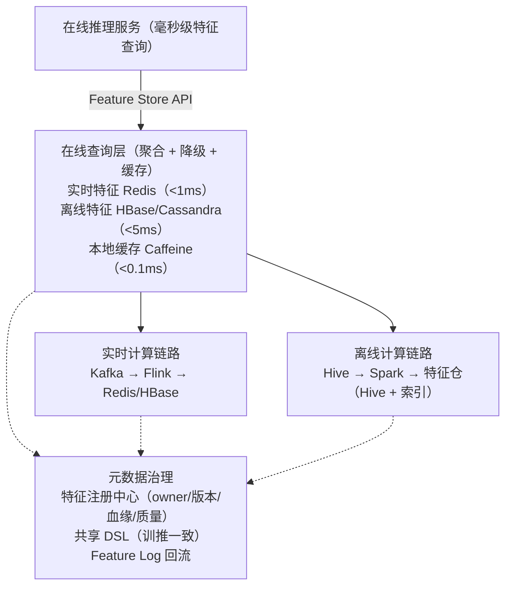

# 【拼多多 AI 中台】特征平台架构设计？实时离线怎么打通？

> JD 依据："特征平台、消费者服务策略算法中台"。

## 一、平台架构



## 二、离线特征链路（T+1）

**场景**：用户长期画像、商品统计、历史行为。

```sql
-- T+1 离线 SQL（Spark/Hive）
INSERT OVERWRITE TABLE feat.user_profile
SELECT
  user_id,
  AVG(amount) OVER (PARTITION BY user_id ORDER BY dt ROWS 30 PRECEDING) AS avg_amount_30d,
  COUNT(order_id) AS total_orders,
  MAX(dt) AS last_active_dt
FROM dwd.dwd_order
WHERE dt BETWEEN date_sub(current_date, 30) AND current_date
GROUP BY user_id;
```

**产出存储**：
- Hive（离线查询/训练用）
- HBase（在线查询，列存）
- 索引到本地缓存（在线服务预热）

**调度**：Airflow T+1 调度，凌晨跑完，6 点前可用。

## 三、实时特征链路（毫秒级）

**场景**：用户最近 1 小时点击数、实时加购、最近浏览商品序列。

```
App/服务端行为埋点
       ↓
    Kafka
       ↓
    Flink（窗口聚合/状态计算）
       ↓
    Redis / HBase
```

### Flink 实时聚合示例
```java
DataStream<Event> events = env.addSource(new FlinkKafkaConsumer<>("events", schema, props));

events
    .keyBy(Event::getUserId)
    .window(SlidingEventTimeWindows.of(Time.hours(1), Time.minutes(5)))  // 1h 窗口 5min 滑动
    .aggregate(new CountAgg())
    .addSink(new RedisSink<>(redisConfig, new FeatureRedisMapper("feat:user:click_cnt_1h")));
```

### Redis 存储设计
```
方案 1：String
  key: feat:user:123:click_cnt_1h
  val: 42
  TTL: 7200s

方案 2：Hash（推荐，多特征聚合查询）
  key: feat:user:123
  field: click_cnt_1h
  field: cart_cnt_1h
  field: last_cat
  ...
  TTL: 7200s

方案 3：ZSet（最近 N 个商品）
  key: feat:user:123:recent_items
  member: 商品ID
  score: 时间戳
```

## 四、在线查询层

```java
@Service
public class FeatureQueryService {

    @Autowired RedisTemplate<String, String> redis;
    @Autowired HBaseTemplate hbase;
    @Autowired Cache<String, Map<String, Object>> localCache;  // Caffeine

    public Map<String, Object> query(String entityId, List<String> feats) {
        // 1. 本地缓存（热点特征预热）
        Map<String, Object> cached = localCache.getIfPresent(entityId);
        if (cached != null) return project(cached, feats);

        // 2. 实时特征（Redis）
        Map<Object, Object> realtime = redis.opsForHash().entries("feat:user:" + entityId);

        // 3. 离线特征（HBase 或本地预热缓存）
        Map<String, Object> offline = localCache.get(entityId, k -> loadFromHBase(k));

        // 4. 合并
        Map<String, Object> result = new HashMap<>();
        result.putAll(offline);
        result.putAll(realtime);   // 实时覆盖离线（新值优先）

        return project(result, feats);
    }

    private Map<String, Object> loadFromHBase(String entityId) {
        // HBase 查询，结果预热到本地
    }
}
```

**优化**：
- **Pipeline 批量**：一次取多个特征，减少 RTT
- **本地缓存**：高 QPS 特征预热到 JVM（Caffeine，TTL 几秒）
- **降级**：Redis 挂时用离线（容忍秒级延迟）
- **批量预热**：高峰前预热 TopN 用户特征

## 五、训推一致性（核心难点）

**问题**：
```
训练：用 Spark SQL A 算特征
推理：用 Java B 实现同一逻辑
逻辑差异 → 特征分布不一致 → 模型上线效果掉
```

### 解决方案

#### 1. 共享特征 DSL（Feathr/Tecton 模式）
```
统一用 DSL 定义特征：
feature UserClickCount {
  source: events
  transform: count(*) where action == 'click' window = 1h
  output: feat.user.click_cnt_1h
}

训练/推理都调 DSL 编译器生成代码（Spark 或 Java）
逻辑同一份，不可能不一致
```

#### 2. Feature Log 回流
```
推理时记录实际用的特征：
{
  "request_id": "...",
  "entity_id": "user_123",
  "features": {"click_cnt_1h": 42, "age": 28, ...},
  "prediction": 0.85,
  "timestamp": ...
}

→ Kafka → HDFS
→ 训练时回放当训练样本（保证训推特征来源同一）
```

#### 3. CI 分布式校验
```
特征上线前用历史数据校验：
- 训练集 vs 在线推理分布（KS 检验）
- 特征缺失率
- 特征值域
超阈值禁止上线
```

## 六、元数据治理

### 特征注册中心
```
每个特征有：
- name, version, owner
- 类型（数值/类别/序列）
- 数据源（表/流）
- 计算逻辑（SQL/DSL）
- 血缘（来源表 → 特征 → 模型）
- 质量指标（缺失率/分布/延迟）
- 复用情况（被多少模型用）
```

### 质量监控
```
- 实时延迟（实时特征 Flink 到 Redis 延迟，>1min 告警）
- 缺失率（>20% 告警）
- 分布漂移（KS 检验，>0.1 告警）
- 异常值（超出历史分位数告警）
```

## 七、典型存储选型

| 数据类型 | 量级 | 延迟 | 存储 |
|---------|------|------|------|
| 离线画像 | 千万-亿 | 5ms | HBase |
| 实时特征 | 千万-亿 | 1ms | Redis Cluster |
| 序列特征 | 千万-亿 | 5ms | HBase / Redis ZSet |
| Embedding | 亿×千维 | 10ms | 向量库（Milvus/Faiss） |
| 图特征 | 千万 | 10ms | 图数据库（Neo4j/JanusGraph） |

## 八、拼多多实战规模

```
特征量：千亿级
查询 QPS：百万级
延迟：P99 < 10ms
实时特征延迟：Flink → Redis < 30s

关键挑战：
- 千亿特征存储（分片 + 冷热分层）
- 实时低延迟（本地缓存 + Pipeline）
- 训推一致（Feature Log + DSL）
- 多团队复用治理（注册中心）
```

## 九、底层本质

特征平台本质是**"离线批 + 实时流 + 在线查询 + 训推一致"**四位一体——离线保证覆盖度，实时保证新鲜度，在线服务保证性能，元数据治理保证一致和复用。是 AI 中台"数据底座"，所有模型都依赖它。

## 常见考点

1. **实时特征延迟大怎么办**？——Flink 水位线 + 延迟监控 + 降级离线 + 缓存兜底。
2. **特征更新频率怎么定**？——按业务时效性（实时/分钟/小时/天），权衡成本和价值。
3. **特征怎么评估价值**？——IV/SHAP/AUC-drop（移除该特征看模型掉多少），结合业务可解释性筛选。

## 苏格拉底式面试追问

> 这组追问不背答案，模拟面试官层层逼近本质。每一问先回答"为什么"，再回答"怎么做"，最后回答"如何证明"。

### 第一层：目标与动机

**Q：特征平台有"离线 T+1"和"实时流"两套链路。但两套链路意味着双倍的开发/计算/存储成本。为什么不只做实时流（Flink）？实时特征更新鲜，离线的是不是过时了？**

实时流不能完全替代离线，有三个根本原因。第一，**计算复杂度**——有些特征需要"全量历史聚合"（如"用户过去 30 天的购买类目分布"），实时流处理 30 天的窗口数据成本高（Flink 的 state 膨胀，TB 级状态），而离线 Spark 扫历史分区一把算完，成本低 10 倍。第二，**历史回算**——模型训练需要"历史某时刻的特征值"（T 时刻的模型看 T-30 天的特征），实时流只保留当前快照（不存历史），训练时拿不到"一个月前的实时特征"。离线仓存全量历史，训练时能精确回算。第三，**训推一致性**——如果模型训练用离线特征（T+1），推理用实时特征（毫秒），两者的"时间窗口"不一致（离线是"昨天截止"，实时是"当前时刻"），特征分布漂移，模型效果降。解法：训练和推理用同一套特征 DSL（共享逻辑），离线用 Spark 算、实时用 Flink 算，保证"逻辑一致"，即使时间窗口略有差异，分布也不漂移。两套链路是"成本 + 新鲜度 + 训推一致"的 trade-off。

### 第二层：证据与定位

**Q：模型上线后 AUC 从离线的 0.78 降到线上的 0.72。你怀疑是"训练-推理特征不一致"（training-serving skew）。怎么定位是哪个特征出了问题？**

用 Feature Log 回流 + 分布对比定位。第一，**Feature Log 回流**——在线推理时，把每次请求的"输入特征值"记到 Feature Log（Kafka → Hive），形成"线上特征快照"。第二，**离线-线上分布对比**——对每个特征，算离线训练集和线上 Feature Log 的分布差异（KS 检验、PSI）。如果某特征的 KS > 0.1 或 PSI > 0.2，说明分布漂移严重，是 skew 嫌疑。第三，**常见 skew 原因**——（1）时间窗口不一致（离线算"过去 7 天"，实时算"过去 7 天到当前"，差几小时）；（2）计算逻辑不一致（离线用 SQL 的 `COUNT DISTINCT`，实时用 Flink 的 `HyperLogLog` 近似，结果略有差异）；（3）缺失值处理不一致（离线填 0，实时填默认值 -1）。第四，**A/B 验证**——把嫌疑特征改成"离线/线上一致"的逻辑，重新训模型，看 AUC 是否恢复。如果改了特征 X 后 AUC 从 0.72 回到 0.78，特征 X 是 skew 源头。

### 第三层：根因深挖

**Q：你定位到 skew 来自"用户购买次数"特征——离线用 Spark 算（精确），实时用 Flink 算（近似）。为什么同一逻辑会算出不同值？**

根因是"计算引擎的实现差异"。第一，**窗口边界差异**——离线 Spark 算"过去 7 天的购买次数"是 `[7天前 00:00, 今天 00:00]`（按自然日），实时 Flink 算是 `[当前时刻 - 7天, 当前时刻]`（滚动窗口）。两者差几小时，如果用户在这几小时内购买了，实时多算 1 次。第二，**去重逻辑差异**——离线用 `COUNT(DISTINCT order_id)`（精确去重），实时用 Flink 的 `HyperLogLog`（近似去重，误差 1-2%）。大用户（购买多）的去重差异更明显。第三，**数据延迟**——离线用 T+1 的全量数据（订单已确认），实时用 Kafka 的实时事件流（可能有"待支付"订单，后来取消）。实时把"取消订单"也算进购买次数，离线不算。解法：第一，**统一 DSL**——用同一套特征定义代码，编译成 Spark 和 Flink 的实现（如 FeatHub/自研 DSL），保证逻辑一致。第二，**统一窗口语义**——明确"7 天"是"自然日 7 天"还是"滚动 168 小时"，离线和实时一致。第三，**Feature Log 校验**——每天对比离线和实时的特征值（同一时间点），差异 > 5% 告警。

**Q：那为什么不只用 Flink 算特征（实时 + 存历史），放弃 Spark 离线？一套引擎不是更一致吗？**

只用 Flink 的"流批一体"理论可行，但生产有局限。第一，**历史回算成本**——Flink 的 state 存在 RocksDB/内存，存 30 天的全量历史事件（用户行为流）需要 PB 级 state，Flink 的 state 管理开销大（checkpoint 慢、恢复慢）。Spark 扫 Hive 分区（历史数据已按天分区），批处理算历史特征，成本低 10 倍。第二，**算法复杂度**——有些特征要"复杂 SQL"（多表 JOIN、窗口函数、嵌套子查询），Spark SQL 支持完整，Flink SQL 的功能较少（复杂 JOIN 支持弱）。第三，**数据修正**——历史数据可能要"重算"（发现数据 bug 修正后重跑），Spark 批处理重跑简单（重新扫分区），Flink 重跑要"回放历史流"（Kafka retention 只有 7 天，更早的数据回放不了）。**生产实践**——Flink 做实时特征（毫秒级新鲜度），Spark 做离线特征（T+1 + 历史回算），两者用共享 DSL 保证逻辑一致。Flink 的"流批一体"是趋势（未来可能统一），但当前（2026 年）Spark + Flink 双链路仍是主流。

### 第四层：方案权衡

**Q：特征平台在线查询用 Redis（毫秒）。但一个推荐请求要查 200 个特征（用户特征 + 商品特征 + 上下文特征），200 次 Redis GET 要 200ms。太慢了，怎么优化？**

批量查询 + 本地缓存。第一，**MGET 批量查询**——把 200 个 key 的 GET 合并成一次 `MGET key1 key2 ... key200`，Redis 单命令执行（1ms 拿回 200 个值），从 200ms 降到 1ms。Redis 的 MGET 是原生的批量操作，O(N) 但无网络往返开销。第二，**Pipeline**——如果特征存在不同 Redis 节点（Cluster 分片），用 Pipeline 发送多个 GET（不等单个返回，批量发批量收），减少网络 RTT。第三，**本地缓存**——200 个特征里，有些是"变化慢的"（用户画像，5 分钟更新），用 Caffeine 本地缓存（命中率 80%），80% 的特征从本地内存读（0.01ms），20% 从 Redis 读。综合：本地缓存挡 80%（160 个特征，0.01ms）+ Redis MGET 查剩余 20%（40 个特征，1ms）= 总耗时 1ms。第四，**特征预聚合**——把"一次请求要的 200 个特征"聚合成一个大 Hash 存 Redis（`features:user:123` 包含所有用户特征），一次 HGETALL 拿回，省多次查询。推荐场景用预聚合（请求模式固定），搜索场景用按需查（特征组合多变）。

**Q：那为什么不用 HBase 替代 Redis？HBase 也能毫秒级查询，而且支持海量数据（千亿特征），Redis 内存放不下千亿 key。**

HBase 和 Redis 的延迟差 10 倍，特征查询场景 Redis 不可替代。第一，**延迟对比**——Redis 内存查询 0.1-1ms，HBase（LSM-Tree + 磁盘）查询 5-20ms（即使有 BlockCache）。推荐场景要求总延迟 < 50ms（含模型推理），特征查询 200ms（HBase）超 SLO，Redis 1ms 才达标。第二，**QPS 对比**——Redis 单实例 10 万 QPS，HBase 单 RegionServer 1 万 QPS。推荐场景 QPS 百万级，Redis 10 个实例搞定，HBase 要 100 个 RegionServer。第三，**正确的分层**——**Redis 存"热特征"**（活跃用户的特征，访问频繁，占 20% 数据但 80% 流量），**HBase 存"全量特征"**（所有用户，冷数据回源）。查询路径：Redis（热）→ miss → HBase（冷）→ 回填 Redis。这样 Redis 只存热数据（内存可控），HBase 兜底全量。拼多多特征平台：Redis Cluster（10TB，热特征）+ HBase（1PB，全量特征），Redis 命中率 95%，HBase 只承担 5% 的回源查询。

### 第五层：验证与沉淀

**Q：你怎么证明"Feature Log 回流 + 分布校验"真的消除了 training-serving skew？**

三个指标对比。第一，**特征分布一致性**——对每个特征算离线 vs 线上的 KS 检验值，优化前 30% 的特征 KS > 0.1（漂移），优化后 95% 的特征 KS < 0.05（一致）。每周自动跑 KS 检验，漂移特征告警。第二，**模型 AUC 稳定性**——对比优化前后，离线 AUC 和线上 AUC 的 gap。优化前 gap=0.06（离线 0.78、线上 0.72），优化后 gap=0.02（离线 0.78、线上 0.76）。gap 缩小证明 skew 消除。第三，**黄金集回归**——维护一套"离线-线上对照集"（1000 条样本，同时有离线和线上特征值），模型上线前跑对照集，如果"离线特征推理结果 vs 线上特征推理结果"差异 > 2%，说明 skew 严重，不上线。三个指标（KS + AUC gap + 黄金集）一致改善，证明 skew 治理生效。监控 `feature_skew_alert_count`（漂移特征数），持续治理。

**Q：特征平台的经验怎么沉淀，让新特征上线不再踩 skew 的坑？**

三件事。第一，**统一 Feature DSL**——所有特征用同一套 DSL 定义（Spark 和 Flink 共享），从源头保证逻辑一致。新特征必须用 DSL，不能"离线写 SQL、实时写 Java"两套实现。第二，**自动 KS 校验**——特征上线前，自动跑离线-线上的 KS 检验，KS > 0.1 阻止上线（CI/CD gate）。新特征默认经过校验，不靠人工 review。第三，**Feature Log 标准化**——所有在线推理必须记 Feature Log（不记的模型不让上线），Feature Log 是"线上特征的 ground truth"，用于持续校验和问题排查。把 skew 治理嵌入"特征上线流程"，不是"出了问题再查"。监控 `feature_onboarding_skew_rate`（新上线特征的 skew 比例），目标 < 5%。

## 结构化回答


**30 秒电梯演讲：** 像现代超市——大仓每周补货（离线仓），冷鲜每天来（实时窗口），货架（在线查询）随取随有，前端 POS（推理）和后端盘点（训练）用同一套 SKU 编码（一致）。

**展开框架：**
1. **三层：离线仓** — 离线仓 / 实时流 / 在线查询
2. **离线：Spa** — Spark/Hive T+1 → HBase/特征仓
3. **实时：Kaf** — Kafka → Flink → Redis

**收尾：** 实时特征延迟怎么办？


## 视频脚本

> 预计时长：3 分钟 | 由浅入深

| 时间 | 画面/字幕 | 口播台词 | 讲解要点 |
|------|----------|----------|----------|
| 0:00 | 标题卡：特征平台架构设计？实时离线怎么打通？ | 今天聊「特征平台架构设计？实时离线怎么打通？」。一句话：特征平台架构核心是"离线批（T+1）+ 实时流（毫秒）+ 在线查询（Feature Store API）+ 训推一致"… | 开场钩子 |
| 0:12 | 核心概念图 + 关键词浮现 | 要点是：三层：离线/实时/在线 | 核心概念 |
| 0:51 | 能力/参数拆解表 | 要点是：离线 Spark/Hive T+1 | 能力拆解 |
| 1:30 | 流程图：输入→处理→输出 | 要点是：实时 Kafka/Flink/Redis | 关键机制 |
| 2:09 | 代码片段 + 注释高亮 | 要点是：一致：共享 DSL + Feature Log | 实战要点 |
| 3:00 | 总结卡 + 下期预告 | 记住这些核心点就够了。下期我们接着聊——实时特征延迟怎么办？。 | 收尾 |

---

## 延伸：【拼多多 AI 中台】特征平台架构怎么设计？实时离线怎么打通？

> 合并自 `pdd-ai-007`（相似度 79%）

> JD 依据："特征平台、消费者服务策略算法中台"。

## 一、特征平台要解决什么

**痛点**：
```
算法同学：要训练模型 → 找业务方取数据（一周）→ 各算各的特征 → 上线发现分布漂移（线上算的特征和训练不一致）
```

**平台目标**：
1. **统一存储**：特征集中管理，不散落各业务
2. **统一计算**：离线/实时用同一份逻辑（保证训推一致）
3. **统一服务**：在线推理毫秒级取特征
4. **治理**：血缘/版本/质量监控

## 二、分层架构

```
┌──────────────────────────────────────────────┐
│ 在线推理服务（毫秒级取特征）                 │
│   GET /feature?entity=user123&feats=age,...  │
└──────────────┬───────────────────────────────┘
               │
┌──────────────▼───────────────────────────────┐
│ 特征查询层（Feature Store API）              │
│   - 读实时（Redis）                          │
│   - 读离线（HBase/Cassandra，冷数据）        │
└──────┬───────────────────────┬───────────────┘
       │                       │
┌──────▼──────────┐  ┌─────────▼─────────────┐
│ 实时特征计算    │  │ 离线特征计算           │
│ Flink 流计算    │  │ Spark/Hive 批处理      │
│ Kafka → Flink   │  │ Hive → Spark           │
│   → Redis/HBase │  │   → Hive/特征仓        │
└─────────────────┘  └────────────────────────┘

┌──────────────────────────────────────────────┐
│ 元数据/治理（注册中心、血缘、版本、质量）    │
└──────────────────────────────────────────────┘
```

## 三、离线特征（T+1）

**场景**：用户画像、商品统计、长期行为。

```sql
-- 离线 SQL（Spark/Hive），次日产出
SELECT
  user_id,
  AVG(amount_30d) AS avg_amount_30d,
  COUNT(order_id) AS order_cnt_30d,
  LAST_CLICK_CAT AS interest_cat
FROM dwd_order
WHERE dt >= date_sub(current_date, 30)
GROUP BY user_id;
```

产出写入特征仓（Hive 表 + 索引到 HBase/Cassandra 供在线读）。

## 四、实时特征（毫秒级）

**场景**：用户最近 1 小时点击数、实时加购、最近浏览商品序列。

```
用户行为（点击/加购）→ Kafka → Flink 流计算 → Redis
                                          ↓
                                       (sliding window 聚合)
```

**Flink 实时聚合**：
```java
stream
  .keyBy(Event::getUserId)
  .window(SlidingEventTimeWindows.of(Time.hours(1), Time.minutes(5)))
  .aggregate(new CountAgg())                       // 最近 1 小时点击数
  .addSink(new RedisSink<>(redisConfig, new FeatureRedisMapper()));
```

**Redis 存储设计**：
```
key:   feat:user:123:click_cnt_1h
value: 42（计数）
TTL:   2 小时（过期自动清理）

或 Hash：
key:   feat:user:123
field: click_cnt_1h / cart_cnt_1h / ...
value: 对应值
```

## 五、在线特征查询

```java
// 推理时按 entity 取特征
public Map<String, Object> getFeatures(String entityId, List<String> feats) {
    Map<String, Object> result = new HashMap<>();
    // 1. 实时特征（Redis，<1ms）
    result.putAll(redis.hgetAll("feat:" + entityId));
    // 2. 离线特征（HBase，<5ms，已加载到本地缓存）
    result.putAll(localCache.get(entityId));   // Caffeine，定时刷新
    // 3. 跨表拼接（如商品特征 + 用户特征 join）
    return project(result, feats);
}
```

**优化**：
- **本地缓存**（Caffeine）：高 QPS 特征预热到 JVM 本地，避免每请求打 Redis
- **批量拉取**（Pipeline）：一次取多个特征减少 RTT
- **降级**：实时特征 Redis 不可用时，降级用离线（容忍秒级延迟）

## 六、训练-推理一致性（核心难点）

**问题**：训练用 SQL A 算，线上推理用 Java B 实现，逻辑差异 → 特征分布不一致 → 模型效果掉。

**方案**：
1. **共享特征 DSL**：训练/推理同一份定义（如 Feathr/Tecton 模式）
2. **特征日志**：推理时落特征快照（feature log），训练时回放当训练样本
3. **CI 校验**：特征上线前用历史数据校验分布（KS 检验）

```
训练样本 = 离线特征（T+1） + 标签
推理样本 = 实时特征 + 离线特征
两者通过 feature log 回流校验一致性
```

## 七、特征治理

- **注册中心**：每个特征有 owner、版本、血缘（来源表、计算逻辑）
- **质量监控**：缺失率/分布漂移/新鲜度（实时特征延迟告警）
- **复用**：特征目录可被多个模型复用，避免重复造轮子

## 八、底层本质

特征平台本质是**"特征的统一计算 + 统一存储 + 统一服务 + 治理"**——离线批量保证覆盖度（长期画像），实时流保证新鲜度（短期行为），在线服务保证查询性能，元数据治理保证训推一致。是 AI 中台的"数据底座"。

## 常见考点

1. **实时特征和离线特征冲突怎么办**？——以实时为准（新鲜），离线作冷启动/兜底；定期对账修正。
2. **千亿特征怎么存**？——分片 KV（Redis Cluster / HBase），按 entity 哈希分片，冷数据 HBase 冷热分层。
3. **怎么评估特征价值**？——IV（信息价值）、SHAP（模型贡献）、PCA 降维，结合业务可解释性筛选。

## 苏格拉底式面试追问

> 这组追问不背答案，模拟面试官层层逼近本质。每一问先回答"为什么"，再回答"怎么做"，最后回答"如何证明"。

### 第一层：目标与动机

**Q：你们实时特征用 Flink 消费 Kafka 聚合后写 Redis，离线特征用 Spark T+1 算完写 HBase。为什么不统一用一套链路？维护两套计算逻辑不是训推不一致的根源吗？**

历史和成本原因。实时链路（Kafka→Flink→Redis）是毫秒级延迟，适合"最近 1 小时点击数"这种滚动窗口特征，但 Flink 跑全量历史数据成本高（要存状态、长时间跑）。离线链路（Hive→Spark→HBase）适合"过去 30 天平均消费"这种全量统计，吞吐高成本低（Spark 批处理跑 PB 级数据），但延迟是 T+1（次日才产出）。两套链路对应不同的时效需求，不是冗余。训推不一致的根源不是"两套链路"，而是"两套链路用了两套不同的计算逻辑"——训练用 Spark SQL A，推理用 Flink/Java B，逻辑差异导致分布漂移。解法是共享特征 DSL（同一份定义编译成 Spark 和 Flink 两种实现），不是强行合并链路。

### 第二层：证据与定位

**Q：模型上线后 AUC 从离线的 0.82 掉到线上的 0.75，你怀疑是训推特征不一致。怎么定位是哪个特征出了问题？**

用 Feature Log 回流对比。第一，在线推理时落特征快照——每次推理记录 `{request_id, entity_id, features: {feat1: v1, feat2: v2, ...}, prediction}`，写 Kafka 落 HDFS。第二，拿同样的 entity_id 和 timestamp，用离线训练的 Spark SQL 重新算一遍特征，得到 `features_offline`。第三，逐特征对比 `features_online` vs `features_offline`，算每个特征的 KS 统计量（分布差异）和 Pearson 相关系数。如果某个特征的 KS > 0.1 或相关系数 < 0.8，就是不一致的元凶。常见根因：实时特征的时间窗口口径不同（Flink 用处理时间，Spark 用事件时间）、离线 SQL 有去重但实时 Flink 没有、或特征定义文档过时了双方理解不一致。

### 第三层：根因深挖

**Q：你定位到 `click_cnt_1h` 这个实时特征和离线版本 KS=0.3，分布严重不一致。根因是什么？**

最常见根因是时间窗口口径差异。离线 Spark SQL 算 `click_cnt_1h` 用的是事件时间（`WHERE event_time BETWEEN now()-1h AND now()`），而 Flink 实时聚合用的是处理时间（事件到达 Flink 的时间）——用户点击事件经过 App 上报 → Kafka → Flink 可能有 10-60 秒延迟，处理时间的窗口比事件时间的窗口"晚"且边界对不齐。另一个根因是数据丢失——Kafka 消费者如果 lag 了或 rebalance 时丢了部分 offset，Flink 的窗口计数就比 Spark 全量统计少。排查手段：取同一时间点，对比 Redis 里 `click_cnt_1h` 的值和离线 Spark 重算的值，如果 Flink 普遍少 10-20%，就是数据丢失；如果时大时小，是窗口口径问题。

**Q：那为什么不统一用事件时间？Flink 也支持事件时间 + Watermark，这样不就和离线对齐了吗？**

理论上该用事件时间，但工程上有代价。Flink 事件时间要配 Watermark（容忍乱序延迟），Watermark 太激进（比如 maxOutOfOrderness=10s）会丢数据（迟到的 event 被丢弃），太保守（比如 5min）会让窗口延迟 5 分钟才输出——实时特征就不够"实时"了（用户 1 小时点击数要等 65 分钟才算准）。而且 Kafka 的 event_time 是 App 上报的，如果 App 时钟不准或上报有积压，Watermark 本身就不准。折中方案：实时特征容忍小幅误差（KS < 0.1），用处理时间保证时效性；离线用事件时间保证准确性；对模型做"特征鲁棒性训练"——训练时给实时特征加 noise（模拟实时/离线差异），让模型对小幅分布漂移不敏感。

### 第四层：方案权衡

**Q：你用 Feature Log 回流做训推一致性校验，但每天回流的数据是 TB 级，存储成本高。为什么不只采样 1% 校验？**

采样校验是标准做法，不需要全量。Feature Log 按 entity_id 哈希采样 1%（`hash(uid) % 100 == 0`），落到独立的 HDFS 路径，离线用同样的 1% entity 跑 Spark 重算对比。这样存储从 TB 降到 10GB 级，成本可控。但采样要保证代表性——如果只采白天的流量会漏掉夜间特征分布（夜间用户行为不同），所以要按时间均匀采样（每小时采 1%）。更激进的做法是"特征级别采样"——只对高风险特征（实时特征、新上线特征、分布易漂移的特征）全量回流，稳定特征（年龄、性别）只采样。这样在成本和覆盖度之间平衡。

**Q：为什么不直接把实时特征的 Redis 值 dump 出来当训练数据，这样就不用离线 Spark 重算了？**

Redis dump 是某一时刻的快照，不是训练需要的时间序列。训练样本要的是"label 时刻的特征"——比如"用户下单时（label=1）那一刻的 click_cnt_1h 是多少"，这个值在用户下单后还会变（用户继续点击），Redis dump 到 HDFS 的时间点对不上 label 时间点。而且 Redis dump 是全量 key，训练只需要有 label 的样本对应的特征，全量 dump 浪费。Feature Log 的优势是"按请求时刻 + entity 维度"精确记录，天然对齐 label。Redis dump 适合做"特征质量监控"（算缺失率/分布），不适合做训练样本。

### 第五层：验证与沉淀

**Q：你怎么证明训推一致性校验机制真的在起作用？有没有可能某些特征漂移了但 KS 检验没触发告警？**

两层验证。第一，注入式测试——故意在线上推理时把某个特征的值乘以 1.5（模拟漂移），看 KS 监控是否在 30 分钟内告警。如果不告警，说明 KS 阈值设太松（比如 KS > 0.1 才告警但实际漂移 KS=0.08）。第二，对比模型效果——如果 KS 监控显示所有特征一致（KS < 0.05）但线上 AUC 持续掉，说明要么是 KS 检验本身漏检（分布形状变了但 KS 不敏感），要么是 label 漂移（用户行为变了但特征没变）。这时要补充"特征值分布监控"（直方图对比，不只 KS）和"prediction 分布监控"（线上预测分布 vs 训练集预测分布）。第三，建立"黄金集回归"——1000 个已知 label 的样本，每天跑一遍，AUC 掉超过 2% 告警，不管特征 KS 怎么样。

**Q：怎么让团队不再踩训推不一致的坑？**

沉淀两条机制。第一，特征上线强制过 CI——新特征上线前，CI 跑"离线 Spark 重算 vs 线上 Feature Log 回流"的 KS 对比，KS > 0.1 阻止上线（pipeline 红）。第二，特征 DSL 强制统一——所有特征定义用 Feathr 或自研 DSL 描述，训练和推理都从 DSL 编译生成代码（Spark SQL 或 Java），禁止"训练写 SQL A、推理写 Java B"的手工实现。新特征注册时必须提交 DSL 定义，reviewer 检查逻辑。第三，特征质量大屏——每个特征的 KS、缺失率、新鲜度（Flink→Redis 延迟）、被多少模型使用，可视化展示，每周 review 高风险特征。

## 结构化回答

**30 秒电梯演讲：** 如何让模型在训练和线上推理拿到一致、新鲜、海量的特征？简单说就是——特征平台是"统一管理模型用的特征数据"，离线（T+1 批）和实时（毫秒级流）双链路，对在线推理提供毫秒级特征查询。离线 Spark/Hive T+1，实时 Flink+Redis；训推一致：同一份特征 DSL。

**展开框架：**
1. **三层** — 三层：离线仓/实时/在线服务
2. **离线 Spark/Hiv** — 离线 Spark/Hive T+1，实时 Flink+Redis
3. **训推一致** — 训推一致：同一份特征 DSL

**收尾：** 您想继续往深里聊吗——比如「实时特征怎么算？」

## 视频脚本

> 预计时长：3 分钟 | 由浅入深

| 时间 | 画面/字幕 | 口播台词 | 讲解要点 |
|------|----------|----------|----------|
| 0:00 | 标题卡：特征平台架构怎么设计？实时离线怎么打通？ | 今天聊「特征平台架构怎么设计？实时离线怎么打通？」。一句话：特征平台是"统一管理模型用的特征数据"，离线（T+1 批）和实时（毫秒级流）双链路，对在线推理提供毫秒级特征查询。 | 开场钩子 |
| 0:12 | 核心概念图 + 关键词浮现 | 要点是：三层：离线仓/实时/在线服务 | 核心概念 |
| 0:51 | 能力/参数拆解表 | 要点是：离线 Spark/Hive T+1，实时 Flink+Redis | 能力拆解 |
| 1:30 | 流程图：输入→处理→输出 | 要点是：训推一致：同一份特征 DSL | 关键机制 |
| 2:09 | 代码片段 + 注释高亮 | 要点是：元数据：血缘/版本/注册中心 | 实战要点 |
| 3:00 | 总结卡 + 下期预告 | 记住这些核心点就够了。下期我们接着聊——实时特征怎么算？。 | 收尾 |

