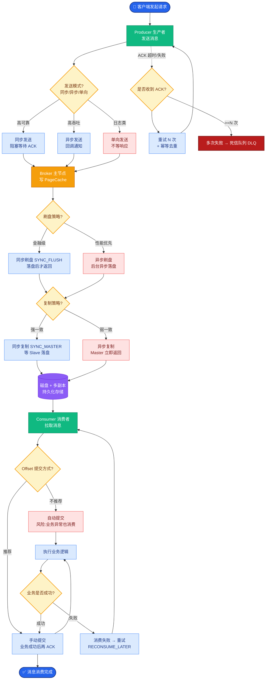

# 【拼多多内容】UGC 内容审核架构怎么设计？

> JD 依据："和算法同学挖掘业务问题"、"评价和行家社区"、"系统架构优化"。

## 一、整体架构

```
UGC 入口（评价/弹幕/短视频/直播）
        ↓
   Kafka 统一事件总线（content.audit.request）
        ↓
┌─────────────── 审核调度服务 ──────────────┐
│  按内容类型 + 优先级 + 来源 路由           │
└───┬───────────────┬───────────────┬──────┘
    ▼               ▼               ▼
 规则引擎        模型服务         人审台
 (Drools/自研)  (NLP/视觉)      (工作台)
   毫秒           百毫秒           分钟
    │               │               │
    └─────── 决策合并 ──────────────┘
                ↓
        审核结果（status）
                ↓
        ┌───────┴───────┐
        ▼               ▼
   通知业务          人审标注库
   (上下架)            ↓
                   模型再训练
```

## 二、规则引擎

**Drools / 自研**：
```java
rule "敏感词命中"
when
    $c : Content(text matches ".*敏感词.*")
then
    $c.reject("SENSITIVE_WORD");
end

rule "新用户首条限频"
when
    $c : Content(uid age < 7 days, type == "REVIEW")
then
    $c.flag("NEW_USER_REVIEW");
end
```

**自研（更灵活）**：
- 敏感词：DATrie/AC 自动机
- 正则：广告/链接/手机号
- 黑名单：IP/UID/设备
- 行为：频次/突变

## 三、模型服务

**NLP（文本）**：
- BERT/ERNIE 微调分类（涉政/涉黄/广告/辱骂）
- SimHash/MinHash 查重（防模板复制）
- 命名实体识别（敏感人物/事件）

**视觉（图片/视频）**：
- 图片分类（涉黄/暴恐/广告）
- OCR → 转文字走文本审核
- 视频抽帧 → 每帧走视觉

**音频**：
- ASR 转文字 → 走文本审核
- 声纹识别（敏感人物）

**模型推理服务**（TF Serving/Triton）：
```
输入 → 预处理 → 模型 → 后处理 → 标签+置信度
```

## 四、人审台

```
工作台功能：
  - 待审队列（优先级：实时直播 > 评价 > 短视频）
  - 待审卡片（内容+上下文+历史）
  - 决策按钮（通过/拒绝/打标签）
  - 标签体系（违规类型/严重度/处置）
  - 性能监控（审核员吞吐/准确率）
```

**优先级队列**：
```java
PriorityQueue<Content> queue = new PriorityQueue<>(
    Comparator.comparing(Content::getPriority).reversed()
              .thenComparing(Content::getSubmitTime));
```

## 五、决策合并

```java
public AuditResult audit(Content c) {
    // 规则先跑（便宜）
    AuditResult rule = ruleEngine.check(c);
    if (rule.isReject()) return rule;          // 明确拒绝
    if (rule.isPass() && rule.confidence() > 0.95) return rule;

    // 模型跑（贵）
    AuditResult model = modelService.predict(c);
    if (model.confidence() > 0.95) return model;

    // 进人审（疑难）
    return humanAuditQueue.submit(c);
}
```

## 六、实时性（直播）

```
视频流 → 抽帧（1 帧/s） → 视觉模型（<500ms）
音频流 → ASR（流式）→ NLP（<500ms）

策略：
  - 抽帧+推理并行
  - 模型蒸馏（小模型实时，大模型异步）
  - 超时默认通过（先播后审）
  - 严重违规实时阻断
```

## 七、反馈闭环

```
人审结果 → 标注库 → 模型再训练 → 灰度上线 → 准确率提升
              ↓
        规则补丁（新型违规入库）
              ↓
        黑样本库（变体对抗）
```

```java
@EventListener
public void onHumanAudit(HumanAuditEvent e) {
    annotationRepo.save(e.toAnnotation());
    // 触发增量训练
    if (annotationRepo.uncappedSize() > 10000) {
        modelService.retrainAsync("text-classifier");
    }
}
```

## 八、容量与扩展

```
- Kafka：按 contentId 分区，保证顺序
- 规则引擎：无状态，K8s 弹性扩
- 模型服务：GPU 集群，按 QPS 弹性
- 人审台：B/C 端分离，按审核员数扩
- 标注库：MySQL + HBase（历史）
```

## 九、监控

```
审核指标：
  - 规则命中率（敏感词/广告）
  - 模型准确率/召回率
  - 人审吞吐/SLA
  - 误判率（用户申诉反推）
  - 端到端延迟

业务指标：
  - 内容合规率（线上抽检）
  - 用户投诉率
  - 模型版本对比
```

## 十、底层本质

UGC 审核架构本质是**"漏斗式机审+人审兜底+反馈闭环"**——规则扛 80%、模型扛 15%、人审 5%，结果回流持续优化；架构用事件驱动+多级决策，平衡成本/准确/延迟。

## 常见考点
1. **怎么降低误杀**？——多阈值+人审兜底+用户申诉+灰度上线。
2. **审核延迟怎么降**？——抽帧+流式推理+模型蒸馏+优先级队列。
3. **新型违规怎么对抗**？——黑样本快速入库+规则补丁+模型增量训练。

## 苏格拉底式面试追问

> 这组追问不是背答案，而是模拟面试官层层逼近本质。每一问先回答"为什么"，再回答"怎么做"，最后回答"如何证明"。

### 第一层：目标与动机

**Q：审核调度你按"内容类型 + 优先级 + 来源"路由，但直播实时弹幕和评价都用同一套规则引擎，为什么不让直播走独立的轻量审核？**

直播和评价的 SLA 完全不同。直播弹幕要求实时（<1s，否则弹幕都飘过去了才审完），评价允许分钟级（用户提交后等审无感）。如果共用一套，规则引擎给直播配的复杂规则（多模型串行）会让评价也慢；给评价配的深度规则（图片 OCR + 视觉）搬到直播会超时。路由的目的是"按 SLA 选链"：直播走"轻量快审"（敏感词 DATrie + 小模型蒸馏，<500ms），超时默认通过（先播后审）；评价走"深度精审"（规则 + 大模型 + OCR，秒级），必须审完才上架。共用的是"规则词典和模型"，但调度链路按内容类型定制。本质：路由是为不同 SLA 选不同"成本-延迟"组合，而非复用全链路。

### 第二层：证据与定位

**Q：机审准确率从 98% 掉到 93%，但规则和模型都没改。你怎么定位是对抗变体、模型漂移，还是流量结构变化？**

准确率下降且无代码变更，根因排查：
1. 对抗变体——看规则层的"敏感词命中率"是否下降。如果黑产用了新变体（谐音/拆字/表情替换），规则词典没覆盖，命中率降，这些违规内容漏到模型层甚至通过。解法：抽样人审通过的"正常"内容里找漏判的变体。
2. 模型漂移——看模型预测的置信度分布。如果大量样本集中在 0.4-0.6（不确定区间），说明模型遇到训练时没见过的内容分布（如新热点事件相关讨论）。解法：增量训练补充新分布样本。
3. 流量结构——看内容来源占比。如果某新业务线（如短视频）接入审核，其内容特征和评价不同（短视频有画面+音频），老模型在短视频上准确率天然低。解法：按业务线分模型。

### 第三层：根因深挖

**Q：人审结果回流训练，但模型再训练后准确率不升反降。根因可能是什么？**

反馈闭环失效的常见根因：
1. 标注质量差——人审员的判断本身有误（疲劳/主观偏差），这些错误标注进了训练集，模型学了错误。解法：多人交叉标注 + 仲裁机制。
2. 样本不均衡——人审只处理"疑难"（置信度 0.4-0.6 的），这些是长尾边界样本。用它们再训练，模型在这个区间更准，但整体分布偏移（大量高置信度的正常/违规样本没进训练集）。解法：全量采样（不只疑难）+ 加权。
3. 训练-推理不一致——训练用了某特征（如用户信誉分），但推理时该特征缺失或口径变了，模型预测偏差。解法：特征一致性校验。
4. 过拟合——增量数据少（1 万条）但训练轮次多，模型过拟合新样本，对历史样本泛化降。解法：用全量历史 + 增量混合训练，控制 epoch。

### 第四层：方案权衡

**Q：直播实时审核你用"抽帧（1 帧/s）+ 视觉模型"，但 GPU 推理 500ms，审核延迟 1s+，弹幕已经飘过了。你要不要降低抽帧频率（省钱省时但可能漏审）？权衡是什么？**

抽帧频率 vs 审核覆盖率的权衡：
1. 降频率（1 帧/s → 1 帧/3s）——推理量降 2/3，延迟降到 300ms，但帧间漏审风险高（违规画面出现在没抽的帧）。
2. 保持频率 + 模型蒸馏——大模型（ResNet152）蒸馏成小模型（MobileNet），推理从 500ms 降到 50ms，准确率降 3-5%。用大模型异步复核（抽到的帧存下来，后台大模型精审，发现违规再回溯下线）。
3. 分级审核——关键帧（I 帧）必审（抽帧保证），P/B 帧用轻量模型（只检测显著变化）。违规画面通常会持续多帧，抽 I 帧能覆盖。
拼多多推荐方案 2——蒸馏小模型实时审（保延迟），大模型异步复核（保准确）。小模型漏的，大模型在几秒内发现并下线，用户体验上就是"直播画面闪了一下消失"，可接受。

### 第五层：验证与沉淀

**Q：你怎么量化审核系统的健康度，让业务和算法都信服？**

审核健康度多维指标体系：
1. 准确率——分通过准确率（判通过的真通过）和拒绝准确率（判拒绝的真违规），避免平均掩盖。
2. 误判率——误杀率（正常判违规）+ 漏判率（违规判正常），分别监控，误杀影响用户体验，漏判是合规风险。
3. 人工复核率——进人审的比例，目标 <10%（机审自动化程度）。
4. 审核延迟——机审 P99 <1s，人审 SLA <30min（评价）/ <10s（直播）。
5. 对抗响应时长——新型变体从"首现"到"规则/模型覆盖"的小时数，目标 <24h。
6. 申诉成功率——用户申诉"被误删"的成功率，高说明误杀多。
沉淀：审核指标每日大盘（业务 + 算法）；模型 AB 实验（新模型准确率提升 >1% 且误杀不增才上线）；规则变更灰度（先 5% 流量验证）；对抗变体自动检测（聚类分析漏判样本，发现新模式自动告警）。

## 核心流程图



## 结构化回答


**30 秒电梯演讲：** 审核架构像海关流水线——X 光机（规则）+ 智能识别（模型）+ 海关员开箱（人工），每步过滤一部分。

**展开框架：**
1. **接入：Kaf** — Kafka 统一事件入口
2. **规则引擎** — 敏感词/正则/黑名单（毫秒级）
3. **模型服务** — NLP/视觉（百毫秒级）

**收尾：** 实时审核怎么保证低延迟？


## 视频脚本

> 预计时长：3 分钟 | 由浅入深

| 时间 | 画面/字幕 | 口播台词 | 讲解要点 |
|------|----------|----------|----------|
| 0:00 | 标题卡：UGC 内容审核架构怎么设计？ | 今天聊「UGC 内容审核架构怎么设计？」。一句话：UGC 审核架构是"接入→预处理→机审（规则+模型）→人审→回流"漏斗+事件驱动；用规则引擎+模型服务+人审台组合，平… | 开场钩子 |
| 0:12 | 核心概念图 + 关键词浮现 | 要点是：漏斗：规则→模型→人工 | 核心概念 |
| 0:51 | 能力/参数拆解表 | 要点是：多模态：文本/图/视频/音 | 能力拆解 |
| 1:30 | 流程图：输入→处理→输出 | 要点是：引擎：Drools/自研规则 | 关键机制 |
| 2:09 | 代码片段 + 注释高亮 | 要点是：闭环：人审回流训练 | 实战要点 |
| 3:00 | 总结卡 + 下期预告 | 记住这些核心点就够了。下期我们接着聊——实时审核怎么保证低延迟？。 | 收尾 |

---

## 延伸：【拼多多内容】UGC 内容审核架构（设计模式）？

> 合并自 `pdd-content-018`（相似度 81%）

> JD 依据："和算法同学挖掘业务问题"、"评价和行家社区"。

## 一、审核漏斗

```
UGC 内容（评价/直播弹幕/短视频）
        ↓
规则机审（敏感词/正则/IP 黑名单）→ 80% 直接通过/拒绝
        ↓ 剩下 20%
模型机审（NLP/视觉模型）→ 又判 70%
        ↓ 剩下 6%
人工审核（疑难/边界/高价值）→ 100% 准确
        ↓
结果回流（人审标注 → 训练模型）
```

## 二、多维度审核

| 维度 | 技术 | 场景 |
|------|------|------|
| 文本 | 敏感词/NLP 分类/相似度 | 评价/弹幕/标题 |
| 图片 | OCR/涉黄涉政/水印 | 评价图/直播封面 |
| 视频 | 抽帧+视觉模型/音转文字 | 短视频/直播录像 |
| 音频 | ASR 转文字+NLP | 直播音频 |

## 三、设计模式应用

**策略模式**（多种审核器）：
```java
public interface Auditor {
    AuditResult audit(Content c);
}

@Component
public class TextSensitiveWordAuditor implements Auditor { ... }

@Component
public class TextNlpAuditor implements Auditor { ... }

@Component
public class ImagePornAuditor implements Auditor { ... }
```

**责任链模式**（审核流程）：
```java
public abstract class AuditHandler {
    protected AuditHandler next;
    public AuditHandler setNext(AuditHandler n) { this.next = n; return n; }
    public abstract AuditResult handle(Content c);
}

public class RuleAuditHandler extends AuditHandler {
    public AuditResult handle(Content c) {
        AuditResult r = ruleEngine.check(c);
        if (r.isCertain()) return r;             // 确定（通过/拒绝）直接返回
        return next != null ? next.handle(c) : r; // 不确定交下一环
    }
}

public class ModelAuditHandler extends AuditHandler { ... }
public class HumanAuditHandler extends AuditHandler { ... }

// 组装链
AuditHandler chain = new RuleAuditHandler();
chain.setNext(new ModelAuditHandler())
     .setNext(new HumanAuditHandler());
```

**工厂模式**（按内容类型选链）：
```java
public class AuditChainFactory {
    public AuditHandler getChain(ContentType type) {
        switch (type) {
            case REVIEW: return reviewChain;
            case DANMAKU: return danmakuChain;
            case SHORT_VIDEO: return videoChain;
        }
    }
}
```

## 四、审核规则引擎

**敏感词匹配**（DATrie/AC 自动机）：
```java
@Autowired WordMatcher sensitiveWordMatcher;

public AuditResult checkText(String text) {
    Set<String> hits = sensitiveWordMatcher.match(text);
    if (!hits.isEmpty()) {
        return AuditResult.reject("敏感词: " + hits);
    }
    return AuditResult.uncertain();   // 进下一环
}
```

**变体对抗**：
- 谐音（"傻逼"→"煞笔"）→ 拼音索引+谐音词典
- 拆字（"违禁"→"韦 禁"）→ 去空格+合并
- 表情/符号替换 → 归一化

## 五、NLP 模型审核

```
文本分类模型（BERT/ERNIE 微调）：
  输入：文本
  输出：涉政/涉黄/广告/正常 + 置信度

阈值：
  置信度 > 0.95：直接判
  0.5 ~ 0.95：人审
  < 0.5：通过
```

**视觉模型**：
- 图片分类（涉黄/暴恐/广告）
- OCR → 文字再走文本审核

## 六、人审台

```
待审队列（按优先级）：
  - 直播实时（最高，秒级）
  - 新发评价（高，分钟级）
  - 历史回扫（低，异步）

审核员工作台：
  - 待审内容卡片
  - 上下文（用户历史/商品信息）
  - 决策按钮（通过/拒绝/打标签）
  - 标签：违规类型/严重度
```

## 七、反馈闭环

```
人审结果 → 标注库 → 模型训练 → 上线 → 准确率提升
              ↓
        规则补丁（新模式/变体加入词典）
```

```java
@EventListener
public void onHumanAudit(HumanAuditEvent e) {
    // 人审结果入标注库
    annotationRepo.save(e.toAnnotation());
    // 累积一定量后触发模型再训练
    if (annotationRepo.count() % 10000 == 0) {
        modelService.retrain("text-classifier");
    }
}
```

## 八、底层本质

UGC 审核本质是**"用规则+模型+人工分级漏斗+反馈闭环实现合规+成本平衡"**——机审扛量（90%）、人审定疑难（10%）、人审结果反哺模型持续优化。

## 常见考点
1. **怎么平衡误杀和漏判**？——多阈值（高阈值通过、低阈值拒绝、中间人审）+ 用户申诉。
2. **直播实时审核怎么做**？——抽帧+视觉模型流式审核，超时默认通过（先播后审）+ 强下线。
3. **怎么对抗新型违规**？——黑样本快速入库+模型增量训练+规则补丁。

## 苏格拉底式面试追问

> 这组追问不是背答案，而是模拟面试官层层逼近本质。每一问先回答"为什么"，再回答"怎么做"，最后回答"如何证明"。

### 第一层：目标与动机

**Q：审核漏斗你把"规则机审"放第一层、"模型机审"放第二层，为什么不反过来（模型更准为什么不当首道）？**

顺序由"成本 vs 准确率"决定。规则机审（敏感词 DATrie/AC 自动机）是纯内存操作，单条审核微秒级，几乎零成本，能挡掉 80% 的明显违规（明确的敏感词命中、IP 黑名单）。模型机审（BERT/视觉模型）每条要跑神经网络推理，单条 50-100ms（GPU 资源贵），如果让模型审全量，GPU 成本爆炸。把规则放前面：80% 明显违规被规则秒判（通过或拒绝），剩下 20% 模糊的才进模型，模型只跑 1/5 的量。这是"用廉价规则扛量，用昂贵模型兜长尾"。反过来模型审全量再规则补，GPU 成本翻 5 倍且收益极低（规则能判的模型也能判，但模型判不出的规则也判不出）。

### 第二层：证据与定位

**Q：审核准确率从 98% 掉到 92%，你怎么定位是模型退化、规则遗漏，还是新型违规变体？**

审核准确率下降要分层定位：
1. 看各层拒绝率——规则层的拒绝率是否下降（规则没变但命中率降，说明变体绕过规则）；模型层的置信度分布是否漂移（大量样本集中在 0.4-0.6 不确定区间，说明模型遇到分布外样本）。
2. 看人审结果回流——人审拒绝的内容里，规则和模型是否都判"通过"（漏判）。对这些漏判样本聚类（按违规类型/文本模式），如果聚类出"谐音变体""拆字变体"集中，是新型对抗。
3. 申诉率——用户申诉"被误删"的比例，如果申诉成功率从 10% 涨到 30%，是误判增多（规则/模型过激）。

### 第三层：根因深挖

**Q：你发现模型对"谐音变体"（如"傻逼"→"煞笔"/"sb"）漏判严重，但加规则词典追不上变体增长速度。根因和解法是什么？**

根因是"规则追不上对抗演化"——黑产/用户每天都在造新变体，规则词典更新有延迟。深挖解法：
1. **NLP 模型增强**——BERT 等预训练模型本身能理解语义（"煞笔"和"傻逼"在语义空间接近），但如果微调数据里变体样本不足，模型泛化差。解法：用对抗增强——自动生成变体（拼音替换/拆字/同音字）扩充训练集，让模型见过更多变体。
2. **拼音索引**——文本转拼音索引后匹配敏感词拼音，"煞笔"和"傻逼"拼音都是"sha bi"，能绕过字形变化。代价是假阳性（正常词拼音撞上）。
3. **变体检测模型**——单独训一个"变体检测"分类器（输入文本，输出是否是变体），先过滤可疑变体再走主审核。
4. **反馈闭环加速**——人审发现的变体样本实时入标注库，触发模型增量训练（每日），缩短变体从"出现"到"被识别"的窗口。

### 第四层：方案权衡

**Q：直播是实时审核，但你担心"先播后审"会放任违规内容几秒内被百万观众看到。你选"先审后播"还是"先播后审"？权衡是什么？**

这是审核时效 vs 合规风险的权衡：
1. **先播后审**（默认通过，审核挂起）——延迟低（弹幕秒级显示），但违规内容可能被百万观众看到几秒到几分钟才下线。适合风险可控的轻内容（普通弹幕/评价）。
2. **先审后播**（审核通过才显示）——合规严，但延迟高（审核 1-3s，弹幕滞后失去实时性）。适合高风险内容（涉政/暴恐）或高曝光场景（首页推荐）。
3. **分层策略**——按用户信誉分级：高信誉用户先播后审（信任），低信誉/新用户先审后播（风控）；按内容类型分级：文本弹幕先播后审，图片/视频先审后播（视觉违规风险高且事后删影响大）。拼多多直播用分层：普通弹幕先播（规则实时拦截 + 模型异步审，2s 内决定是否撤回），新用户首条弹幕先审后播。

### 第五层：验证与沉淀

**Q：你怎么量化审核系统的健康度（不只是"准确率"），让算法同学和业务都能看懂？**

审核健康度的多维指标体系：
1. **准确率**——机审与人审一致的比例，分通过准确率和拒绝准确率（避免被准确率平均掩盖）。
2. **误判率**——正常被判违规（误杀，影响用户体验）+ 违规被判正常（漏判，合规风险），分别监控。
3. **人工复核率**——进人审的比例，反映机审的自动化程度。目标 <10%（90% 机审解决）。
4. **审核延迟**——机审 P99 <1s，人审 SLA <30min（评价）/ <10s（直播）。
5. **对抗指标**——新型变体的发现到拦截时长（从变体首现到规则/模型覆盖的时间，目标 <24h）。
沉淀：审核指标大盘（每日报表给业务 + 算法）；模型版本管理（AB 实验对比新旧模型准确率，提升 >1% 才上线）；规则变更走灰度（先 5% 流量验证不误杀）。

## 结构化回答


**30 秒电梯演讲：** 审核像海关——机审是 X 光（快速过滤大部分），人审是开箱（疑难重点看）。

**展开框架：**
1. **三级漏斗** — 规则→模型→人工
2. **维度** — 文本/图片/视频/音频
3. **设计模式** — 策略模式（规则）+责任链（流程）+工厂

**收尾：** 怎么降低误杀？


## 视频脚本

> 预计时长：3 分钟 | 由浅入深

| 时间 | 画面/字幕 | 口播台词 | 讲解要点 |
|------|----------|----------|----------|
| 0:00 | 标题卡：UGC 内容审核架构（设计模式）？ | 今天聊「UGC 内容审核架构（设计模式）？」。一句话：UGC 审核是"机审（规则+模型）+ 人审（疑难）"分级漏斗；用策略模式+责任链组装规则，机审过滤 90% | 开场钩子 |
| 0:12 | 核心概念图 + 关键词浮现 | 要点是：三级：规则→模型→人工 | 核心概念 |
| 1:04 | 能力/参数拆解表 | 要点是：维度：文本/图片/视频/音频 | 能力拆解 |
| 1:56 | 流程图：输入→处理→输出 | 要点是：模式：策略+责任链+工厂 | 关键机制 |
| 3:00 | 总结卡 + 下期预告 | 记住这些核心点就够了。下期我们接着聊——怎么降低误杀？。 | 收尾 |

