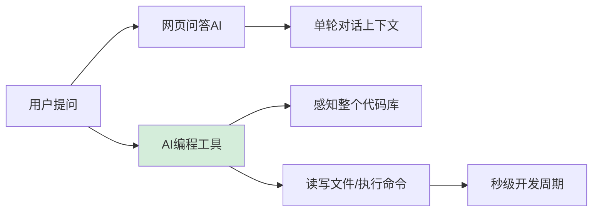

# 【字节面经】你平常使用什么 AI 工具？AI 编程工具和传统网页问答 AI 有什么区别？

**主流 AI 编程工具分类与对比：**

| 工具 | 类型 | 特点 | 适用场景 |
|------|------|------|----------|
| **Cursor** | IDE 集成 | 上下文感知、Agent 模式多文件修改 | 日常开发、重构 |
| **Claude Code** | 终端 Agent | 可执行命令/读写文件/运行测试 | 自动化流水线、CI/CD |
| **GitHub Copilot** | 插件 | 实时补全、Chat | 代码补全 |
| **Windsurf** | IDE 集成 | Cascade 多步推理 | 复杂功能开发 |
| **ChatGPT/Claude Web** | 网页问答 | 通用问答、无代码库感知 | 学习、方案设计 |

**AI 编程工具 vs 传统网页问答的核心区别：**

1. **上下文感知** — Cursor/Claude Code 能读取整个 codebase，理解项目结构和依赖关系；网页问答只能看你粘贴的片段
2. **文件操作能力** — AI 编程工具可以直接创建/修改/删除文件；网页问答只能给出代码让你手动复制
3. **执行能力** — Claude Code 可以运行命令、执行测试、查看编译结果；网页问答无法验证代码是否正确
4. **迭代速度** — AI 编程工具的「编码-编译-调试」循环从分钟级压缩到秒级
5. **多文件协作** — Agent 模式可以同时修改多个关联文件，保持一致性

**实际使用建议：**
- 补全/小修改 → Cursor Tab / Copilot
- 多文件重构/功能开发 → Cursor Agent / Windsurf Cascade
- 自动化/CI/CD → Claude Code（终端执行）
- 方案设计/学习 → 网页问答（ChatGPT/Claude）
- Java 项目推荐：Cursor（Java 扩展支持好）+ Claude Code（Maven/Gradle 构建）

## 常见考点
1. **上下文窗口管理**：如何处理超大 Java 项目（如 Monorepo）的索引？答案：通常使用 Semantic Search（语义搜索）或 Map-Reduce 策略先索引关键文件，而非全量加载。
2. **安全性/隐私**：AI 编程工具是否会将代码上传云端？答案：部分工具（如 Copilot）会上传片段，企业版通常支持本地化或私有化部署（如 Cursor Business），需注意敏感数据泄露风险。
3. **Prompt 优化技巧**：如何让 AI 生成符合企业规范的代码？答案：通过 `.cursorrules` 或 Project Context 注入统一的编码规范（如 Alibaba Java Coding Guidelines）。

**实战案例**：在重构一个有10年历史的遗留Java单体应用时，使用Cursor的“@codebase”功能指引用导包路径复杂的Util类，准确率远高于网页ChatGPT；但在一次升级Spring Boot版本时，AI工具自动修改了`pom.xml`却忽略了`application.yml`的废弃属性配置，导致启动报错，人工Review必不可少。

**代码示例**：
```
# Cursor 中使用 Agent 进行多文件重构的 Prompt 示例
@codebase 请将项目中所有的 SimpleDateFormat 替换为 Java 8 的 DateTimeFormatter。
注意：
1. 仅修改 com.mycompany.service 包下的文件
2. 保持原有的日期格式化 pattern 不变
3. 添加必要的 import 语句
4. 运行 mvn compile 验证语法
```


## 核心流程图



## 核心知识点图


## 记忆要点

- 核心差异：编程工具有上下文感知，能读代码库，网页问答仅限片段。
- 执行闭环：Claude Code能执行命令看编译结果，实现秒级调试闭环。
- 场景划分：补全小修改用Cursor，多文件重构用Agent，方案设计用网页。
- 安全避坑：AI工具可能泄露隐私，且修改关联文件易遗漏，人工Review必选。

## 结构化回答


**30 秒电梯演讲：** 编程工具是懂项目的“结对程序员”，网页AI是通用的“百科全书”。

**展开框架：**
1. **编程工具能感知整** — 编程工具能感知整个代码库上下文
2. **直接读写文件** — 直接读写文件，甚至运行命令
3. **将开发周期从分钟** — 将开发周期从分钟级压缩到秒级

**收尾：** AI 编程会不会取代程序员？


## 视频脚本

> 预计时长：3 分钟 | 由浅入深

| 时间 | 画面/字幕 | 口播台词 | 讲解要点 |
|------|----------|----------|----------|
| 0:00 | 标题卡：你平常使用什么 AI 工具 | "你平常使用什么 AI 工具，这题我会分三步讲。" | 开场钩子 |
| 0:41 | 概念定义动画 | "一句话：AI编程工具拥有代码库上下文和IDE执行权。" | 核心定义 |
| 1:22 | 生活类比动画 | "打个比方——编程工具是懂项目的“结对程序员”，网页AI是通用的“百科全书”。" | 核心类比 |
| 2:03 | 编程工具 图解 | "编程工具能感知整个代码库上下文。" | 编程工具 |
| 2:50 | 直接读写文件 图解 | "直接读写文件，甚至运行命令。" | 直接读写文件 |
