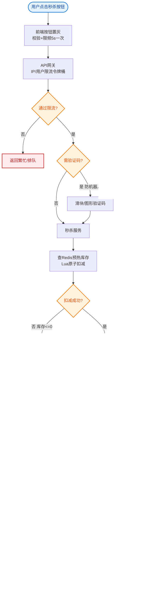

# 如何设计一个秒杀系统？假设某商品1000件，瞬时并发100万。

【场景分析】
秒杀三大挑战：瞬时高并发（100w QPS）、库存防超卖、防止黄牛刷单。

【分层架构】
1. 前端层：
   - 静态资源CDN部署（商品详情页）
   - 按钮置灰防重复提交 + 验证码 + 答题验证
   - 倒计时动态获取服务器时间
2. 网关层：
   - 限流：令牌桶/漏桶算法，超过阈值的请求直接拒绝
   - IP限频 + 设备指纹识别
3. 服务层：
   - Redis预扣库存：`DECR stock_key`，返回值<0则库存不足
   - 消息队列异步下单：库存扣减成功后，发MQ消息异步创建订单
   - 熔断降级：Sentinel/Hystrix保护下游服务
4. 存储层：
   - MySQL乐观锁：`UPDATE stock SET num=num-1 WHERE id=? AND num>0`
   - 分库分表分散写压力

【核心流程】
秒杀开始前：预热库存到Redis → 配置商品秒杀信息
秒杀请求：限流检查 → Redis原子扣库存 → 发MQ消息 → 返回"排队中"
异步消费：消费MQ → 创建订单 → 扣减DB库存 → 通知用户

【防超卖三道防线】
1. Redis DECR原子操作（第一道）
2. DB乐观锁 `WHERE num > 0`（第二道）
3. 分布式锁兜底（第三道，极端情况）

【容灾设计】
- Redis Cluster高可用 + 本地缓存降级
- MQ消费失败重试 + 死信队列人工处理
- 服务熔断：库存扣完后自动熔断，拒绝所有后续请求

### 实战案例
在双11大促中，曾出现因 Redis 预热脚本配置错误导致库存 Key 未加载，瞬时流量直接击穿 DB，最终通过在网关层开启`限流兜底`并快速回滚预热配置才恢复。建议预热操作必须加入自动化校验。

### 代码示例
```lua
-- Redis Lua 脚本：原子性扣减库存
local key = KEYS[1]
local buyNum = tonumber(ARGV[1])

-- 检查库存是否充足
local stock = tonumber(redis.call('GET', key) or 0)
if stock < buyNum then
    return 0
end

-- 扣减库存
redis.call('DECRBY', key, buyNum)
return 1
```

### 架构图
```text
┌───────┐   ┌───────┐   ┌─────────┐   ┌───────┐   ┌─────────┐   ┌───────┐
│ User  │──▶| CDN   │──▶| Gateway │──▶| Redis │──▶|   MQ    │──▶| MySQL |
└───────┘   └───────┘   └─────────┘   └───────┘   └─────────┘   └───────┘
                │           │             │           │             │
                │           ▼ (Limit)     ▼ (Decr)    ▼ (Order)    ▼ (DB)
                │        ┌─────────┐   ┌───────┐   ┌─────────┐   ┌───────┐
                └───────▶│  Nginx  │   │ Stock │   │Consumer│   │ Order │
                         └─────────┘   └───────┘   └─────────┘   └───────┘
```

### 常见考点
1. **超卖问题细节**：Redis 扣减库存后，MQ 消费失败（如宕机）如何保证数据一致性？（利用 Redis 的 `INCR` 乐观回滚或定时任务对账）。
2. **预热策略**：库存为什么要预热到 Redis？如何保证 Redis 和 DB 数据一致？（秒杀开始前统一写入，扣减 Redis 成功才视为抢购资格，DB 异步扣减，允许短暂不一致）。
3. **Redis 脚本**：为什么库存扣减必须使用 Lua 脚本？（保证「查询库存」和「扣减库存」的原子性，防止并发竞态）。


## 核心流程图


## 记忆要点

- 防超卖三道防线：网关限流、Redis预扣(Lua原子性)、DB乐观锁兜底
- 核心链路：因为同步写库慢，所以Redis扣减成功后必发MQ异步下单
- 防刷三板斧：前端按钮置灰+验证码，网关IP限频，后端设备指纹
- 容灾机制：库存扣完自动触发服务熔断拒绝后续，MQ消费失败走死信队列

## 结构化回答


**30 秒电梯演讲：** 像商场限量发售，门外排队（限流），进门凭票（Redis），发货（MQ）。

**展开框架：**
1. **前端静态化与按钮** — 前端静态化与按钮置灰拦截无效请求
2. **Redis原子扣** — Redis原子扣减库存作为第一道防线
3. **MQ异步下单保护** — MQ异步下单保护数据库不被瞬间压垮

**收尾：** 如何保证消息不丢失？


## 视频脚本

> 预计时长：3 分钟 | 由浅入深

| 时间 | 画面/字幕 | 口播台词 | 讲解要点 |
|------|----------|----------|----------|
| 0:00 | 标题卡：秒杀系统 | "秒杀系统，这题我会分三步讲。" | 开场钩子 |
| 0:41 | 概念定义动画 | "一句话：层层漏斗限流，Redis预热扣库存，MQ异步削峰。" | 核心定义 |
| 1:22 | 生活类比动画 | "打个比方——像商场限量发售，门外排队(限流)，进门凭票(Redis)，发货(MQ)。" | 核心类比 |
| 2:03 | 前端静态化与按钮置灰 图解 | "前端静态化与按钮置灰拦截无效请求。" | 前端静态化与按钮置灰 |
| 2:50 | Redis原子扣减库 图解 | "Redis原子扣减库存作为第一道防线。" | Redis原子扣减库 |
