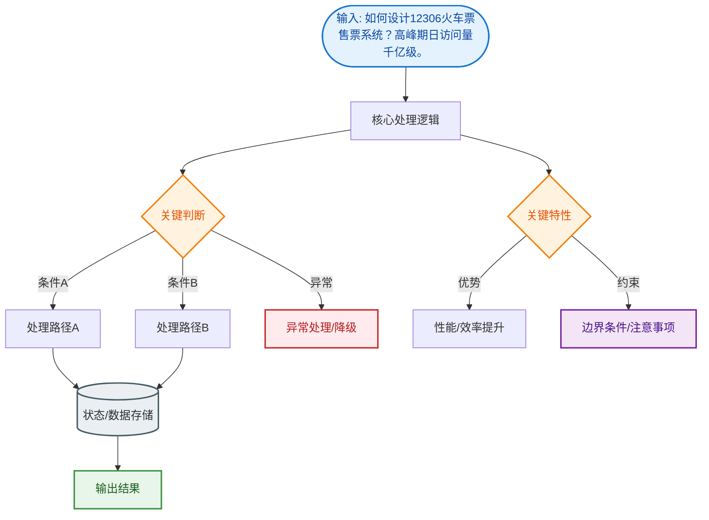
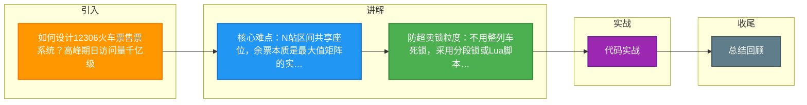

# 如何设计12306火车票售票系统？高峰期日访问量千亿级。

### 场景分析
12306 核心难点：余票实时计算（多站区间共享座位）、瞬时极高并发（春运）、防超卖。

### 余票计算模型
一趟列车 G101（北京→上海），经过 A→B→C→D 四站：
- 旅客 1 买 A→C：占用 A→B、B→C 两段
- 旅客 2 买 B→D：占用 B→C、C→D 两段
- 余票 = 总座位 - 各区间已售座位的最大值
- 本质：区间重叠问题，余票矩阵需实时维护

### 架构设计
1. **查票**
   - 余票缓存：Redis 维护每趟车每个区间的余票数
   - 余票矩阵预计算：离线计算 + 增量更新
2. **排队机制**
   - 大流量时启用排队系统，先入队再处理
   - 减少数据库直接压力
3. **购票核心**
   - 分布式锁锁定区间座位 → 预扣 → 创建订单 → 30 分钟内支付
   - 座位分配：贪心算法 + 优先靠窗/连座

### 性能优化
- 读写分离：查票走缓存/Slave，购票走 Master
- 分库分表：按车次 ID 分片
- 异步削峰：MQ 异步处理订单创建
- 候补购票：无票时排队，有人退票自动匹配

### 防超卖
- Redis 原子扣减各区间余票
- 数据库乐观锁兜底
- 分布式事务保证多区间扣减一致性

### 春运应对
- 弹性扩容：K8s 动态扩容 Pod
- 限流降级：非核心功能（如改签）降级
- 异地多活：多地机房分流

### 实战案例
在旧版系统中，曾出现因为大量用户查询同一趟热门列车，导致 Redis 单节点 CPU 飙升至 100%，进而引发查票超时。优化后采用 Redis Cluster 并将查询请求按`车次ID Hash`分片，不仅解决了热点问题，还将吞吐量提升了 4 倍。

### 代码示例
```java
// 伪代码：多区间原子扣余票
public boolean lockSeats(String trainId, List<Integer> segments) {
    String lockKey = "lock:" + trainId;
    // 1. 获取分布式锁（Redisson）
    RLock lock = redissonClient.getLock(lockKey);
    if (lock.tryLock(0, 500, TimeUnit.MILLISECONDS)) {
        try {
            // 2. Lua 脚本批量扣减各区间库存
            String script = "for i, seg in ipairs(segments) do ... end";
            Long result = redisTemplate.execute(script, keys, segments);
            return result == 1;
        } finally {
            lock.unlock();
        }
    }
    return false;
}
```

### 车票区间模型
```text
Station A  ------ Station B ------ Station C ------ Station D
   |               |               |               |
  Seg1            Seg2            Seg3
   |               |               |
Seat 1: [  Occupied  ] [    Free   ] [   Occupied  ]
Seat 2: [    Free     ] [  Occupied ] [    Free     ]

计算余票：
A-B: 1 (Total 2 - 1 Sold)
B-C: 0 (Total 2 - 2 Sold) -> 卖光
C-D: 1 (Total 2 - 1 Sold)
```

### 常见考点
1. **复杂度分析**：如果列车有 N 个站点，会有多少个区间？（N*(N-1)/2，1000 个站点将产生约 50 万种票种，无法简单按 SKU 存储）。
2. **锁的粒度**：是锁整列车还是锁区间？（锁区间会降低并发，但锁整列车粒度太粗导致死锁；实际采用「分段锁」或基于 Redis Lua 脚本一次性扣减相关区间的原子操作）。
3. **库存预占**：下单后 30 分钟不支付如何释放库存？（延时队列或定时任务扫描 `expire_time < now` 的订单，回滚 Redis 和 DB 库存，并触发候补队列）。


## 核心流程图


## 记忆要点

- 核心难点：N站区间共享座位，余票本质是最大值矩阵的实时维护
- 防超卖锁粒度：不用整列车死锁，采用分段锁或Lua脚本区间批量扣减
- 消峰三宝：排队系统前置拦截、查票走缓存、购票走Master并分库分表
- 履约机制：下单锁座配延时队列，30分钟超时未付自动回滚库存触发候补

## 结构化回答


**30 秒电梯演讲：** 像接力赛，有人跑 A-B 段，有人跑 B-C 段，每一节车厢容量实时变动。

**展开框架：**
1. **分段计算库存** — 分段计算库存解决区间重叠
2. **Redis** — Redis缓存余票，DB兜底
3. **排队机制削峰** — 排队机制削峰填谷

**收尾：** 余票矩阵如何实时更新？


## 视频脚本

> 预计时长：3 分钟 | 由浅入深

| 时间 | 画面/字幕 | 口播台词 | 讲解要点 |
|------|----------|----------|----------|
| 0:00 | 标题卡：12306火车票售票系统 | "12306火车票售票系统，这题我会分三步讲。" | 开场钩子 |
| 0:41 | 概念定义动画 | "一句话：复杂区间的库存实时计算与极高并发下的扣减一致性。" | 核心定义 |
| 1:22 | 生活类比动画 | "打个比方——像接力赛，有人跑 A-B 段，有人跑 B-C 段，每一节车厢容量实时变动。" | 核心类比 |
| 2:03 | 分段计算库存 图解 | "分段计算库存解决区间重叠。" | 分段计算库存 |
| 2:50 | Redis缓存余票 图解 | "Redis缓存余票，DB兜底。" | Redis缓存余票 |

### 视频流程图



