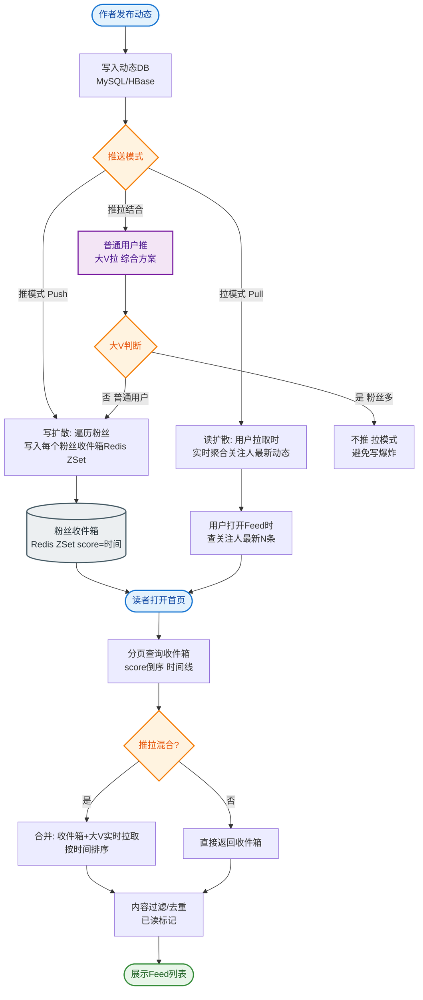

# 如何设计微博/朋友圈点赞系统？日活数亿，每秒点赞数十万。

### 场景分析
点赞系统特点：写多读多、需实时计数、需防重复点赞、需通知。

### 数据模型
1. 点赞关系：谁给谁点赞（user_id, target_id, target_type, created_at）
2. 点赞计数：某条内容的总点赞数

### 架构设计
1. **写路径（点赞/取消点赞）**
   - 用户点赞 → 写 Redis Set（记录点赞者）→ 更新 Redis 计数器 → 异步写入 DB
   - 防重：Redis SISMEMBER 判断是否已点赞
   - 批量异步：攒 100 条写入一次 DB（减少 DB 压力）
2. **读路径（查询点赞数和列表）**
   - 计数：优先 Redis INCR/DECR 维护
   - 点赞列表：Redis ZSet（按时间排序）只缓存前 N 条

### 数据存储
- 点赞记录表：按 target_id 分库分表
- 计数表：单独维护，异步更新
- 冷数据归档：历史点赞记录转入 HBase

### 通知机制
- 点赞后发 MQ 消息 → 消费者推送通知给被点赞者
- 消息聚合：同一人多次点赞合并为一条通知

### 性能数据
- Redis 集群：32 个分片，QPS 可达 50 万+
- 热点微博（明星）：本地缓存 + 计数延迟容忍（最终一致）
- 定时任务：每 5 分钟同步 Redis 计数到 DB

### 实战案例
某明星官宣恋情，瞬时点赞触发 Redis 集群 CPU 飙高导致写入超时。解决方案是引入`本地缓存`做一级计数，每秒聚合一次再刷入 Redis，虽然牺牲了毫秒级实时性，但成功扛住了百倍峰值流量，且用户无感知。

### 代码示例
```java
// 伪代码：点赞操作
public void like(Long userId, Long targetId) {
    String key = "likes:" + targetId;
    // 1. 利用 Set 的不可重复性防重
    Boolean isNew = redisTemplate.opsForSet().add(key, userId.toString());
    if (Boolean.TRUE.equals(isNew)) {
        // 2. 只有新点赞才增加计数
        redisTemplate.opsForValue().increment("count:" + targetId);
        
        // 3. 发送异步 MQ 消息通知
        mqProducer.send(new LikeEvent(userId, targetId));
        
        // 4. 记录 ZSet 用于展示最近点赞者（保留前 5 位）
        redisTemplate.opsForZSet().add("z_likes:" + targetId, userId.toString(), System.currentTimeMillis());
        redisTemplate.opsForZSet().removeRange("z_likes:" + targetId, 0, -6);
    }
}
```

### 数据流转图
```text
User Action                   Cache Layer               Async Layer
  │                             │                          │
  ├── Like/Unlike ───────────▶│ Redis Set/ZSet           │
  │                            │ (Member Check)           │
  │                            │                          │
  │                            ▼                          ▼
  │                     Redis Counter ────▶ Kafka/MQ ────▶ MySQL/HBase
  │                     (INCR/DECR)         (聚合写入)       (持久化)
  │                            │                          │
  │                            ▼                          │
  │                     Query Response ◀───────────────────┘
  │                     (Count + Top List)
```

### 常见考点
1. **计数准确性**：Redis 挂了数据会丢吗？（是的，通常用于加速，最终一致；如果要求强一致，需配合 Binlog 异步刷盘，但会牺牲性能）。
2. **热点处理**：明星发博瞬间数千万点赞，Redis 集群如何抗住？（使用本地缓存 Guava/Caffeine 做一级缓存，Redis 做二级，异步刷盘，容忍短时计数误差）。
3. **分库分表 Key**：点赞记录表怎么分？（通常按 `target_id` 分片，保证同一内容的点赞记录在一起，方便查询；但查询某用户点赞了谁时需反向查询或冗余表）。


## 核心流程图


## 记忆要点

- 双链路设计：写路径用Set防重并异步批量刷DB，读路径ZSet展示前N条点赞
- 抗热点明星：引入本地缓存做一级计数，牺牲毫秒级实时性换百倍峰值流量
- 分库分表Key：必须按目标ID(target_id)分片，保证同内容点赞记录聚拢
- 最终一致：Redis仅做加速，高可用强一致需靠Binlog异步刷DB兜底

## 结构化回答


**30 秒电梯演讲：** 就像现场投票，大屏幕（Redis）实时更新数字，后台（DB）慢慢统计选票。

**展开框架：**
1. **Redis** — Redis Set/Hash存储点赞关系防重
2. **Redis** — Redis计数器保证高性能读
3. **MQ** — MQ异步解耦写库与通知

**收尾：** 如何处理热点内容的点赞洪峰？


## 视频脚本

> 预计时长：2 分钟 | 由浅入深

| 时间 | 画面/字幕 | 口播台词 | 讲解要点 |
|------|----------|----------|----------|
| 0:00 | 标题卡：微博/朋友圈点赞系统 | "微博/朋友圈点赞系统，一分钟讲透。" | 开场钩子 |
| 0:35 | 生活类比动画 | "打个比方——就像现场投票，大屏幕(Redis)实时更新数字，后台(DB)慢慢统计选票。" | 核心类比 |
| 1:10 | 概念定义动画 | "一句话：高频写操作下的实时计数与关系存储，追求最终一致性。" | 核心定义 |
| 1:50 | Redis Set/ 图解 | "Redis Set/Hash存储点赞关系防重。" | Redis Set/ |
