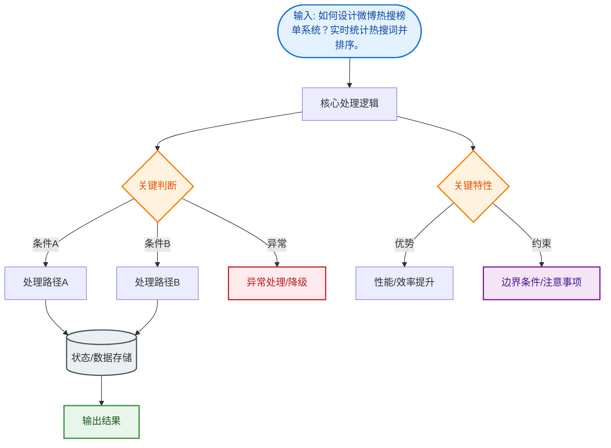

# 如何设计微博热搜榜单系统？实时统计热搜词并排序。

### 场景分析
热搜核心需求：实时统计关键词出现频率、多维度排序（搜索量+讨论量+互动量）、防刷榜。

### 数据采集层
- 搜索日志：用户搜索行为实时上报
- 微博内容：实时提取热门关键词
- 互动数据：转发/评论/点赞量统计

### 计算架构（Lambda 架构）
1. **实时层（速度层）**
   - Kafka 收集实时搜索词流
   - Flink/Storm 滑动窗口统计（5 分钟窗口）
   - 结果写入 Redis ZSet（score=热度值）
2. **批处理层（批次层）**
   - Hadoop/Spark 定时跑全量统计
   - 修正实时层的误差
3. **合并层**：实时结果 + 批处理结果 → 最终榜单

```text
┌─────────────┐    ┌──────────────┐    ┌─────────────┐
│  数据采集   │───▶│   Kafka MQ   │───▶│  Flink 实时 │
│ (日志/内容) │    └──────────────┘    │  计算(窗口) │
└─────────────┘                        └──────┬──────┘
                                             │
┌─────────────┐                      ┌───────▼──────┐
│  展示层     │◀─────────────────────│  Redis ZSet  │
│ (榜单API)   │                      │  (热词排行)  │
└─────────────┘                      └──────┬──────┘
       ▲                                ▲     │
       │                                │     │  校正
       │                          ┌─────┴─────┴──────┐
       │                          │   Spark/Hadoop   │
       └──────────────────────────│    (离线修正)     │
            定时全量合并            └──────────────────┘
```

### 热度算法
热度值 = 搜索量×W1 + 讨论量×W2 + 互动量×W3 - 时间衰减因子  
时间衰减：score = raw_score × exp(-λΔt)，越久远的热度下降越快

### 防刷机制
- 同 IP/用户短时间内大量搜索同一词 → 降权
- 异常飙升检测：环比增长超过阈值触发审核
- 人工审核：敏感词 + 运营审核
- 加权去噪：同一设备只计一次

### 展示优化
- ZSet TOP 50 实时更新
- CDN 缓存榜单页面（30 秒刷新）
- 标签分类：热/新/沸/爆

### 实战案例
某次突发新闻，因大量爬虫机器瞬间刷同一关键词，导致非正常话题冲上第一。事后引入了`风控熔断机制`：检测到某词 QPS 环比激增 10 倍以上时，自动锁定榜单展示快照，并人工介入审核，确认非刷量后再放开。

### 代码示例
```java
// 伪代码：更新热搜权重
public void updateHotScore(String keyword, int viewCount) {
    long now = System.currentTimeMillis();
    // ZSet 分桶，防止单 Key 热点
    int bucket = Math.abs(keyword.hashCode()) % BUCKET_SIZE;
    String key = "hot_search:" + bucket;
    
    // 计算带时间衰减的分数 (简化版)
    double decayScore = viewCount * Math.exp(-0.1 * (now - lastTime) / 60000);
    
    // 更新 ZSet
    redisTemplate.opsForZSet().add(key, keyword, decayScore);
    
    // 设置过期时间清理旧数据
    redisTemplate.expire(key, 1, TimeUnit.HOURS);
}
```

### 补充细节：滑动窗口与分桶
- **滑动窗口机制**：Flink 使用滑动窗口（如 1 分钟滑动步长，5 分钟窗口大小），确保榜单的平滑过渡，避免某分钟流量突增导致的榜单剧烈跳动。
- **Redis 分桶**：为了防止 ZSet 单 Key 写入瓶颈，可按 Hash(id)%N 将热搜词分桶存储到 N 个 ZSet 中，查询时合并 Top K。

## 常见考点
1. **实时性 vs 准确性**：如果 Redis 挂了如何降级？（答：读取离线数仓的预计算结果，牺牲实时性保可用性）。
2. **热点 Key 处理**：某个热搜词（如突发新闻）访问量极大，如何防止 Redis 节点被打挂？（答：使用 Local Cache 缓存 Top 数据，或对 Key 进行拆分分片）。
3. **时间衰减因子**：λ 参数如何动态调整？（答：通过配置中心动态下发，根据全站流量峰谷调整衰减速度）。


## 核心流程图


## 记忆要点

- Lambda双层架构：Flink实时窗口初算 + Spark离线全量修正防误差
- 热度算法公式：互动量乘以权重，再乘以exp(-λΔt)的时间衰减因子
- 防刷与熔断：同IP降权去噪，QPS环比激增10倍以上触发快照锁定人工审核
- 防热点单Key：Redis ZSet必做分桶，并配本地Local Cache缓存Top榜单

## 结构化回答


**30 秒电梯演讲：** 像股市大盘，实时把所有买卖单（搜索行为）汇总计算最新股价（热度）。

**展开框架：**
1. **Lambda** — Lambda架构结合实时与全量计算
2. **时间衰减因子** — 时间衰减因子保证榜单新鲜度
3. **Redis** — Redis ZSet实现实时排序

**收尾：** 滑动窗口大小的选择依据是什么？


## 视频脚本

> 预计时长：3 分钟 | 由浅入深

| 时间 | 画面/字幕 | 口播台词 | 讲解要点 |
|------|----------|----------|----------|
| 0:00 | 标题卡：微博热搜榜单系统 | "微博热搜榜单系统，这题我会分三步讲。" | 开场钩子 |
| 0:41 | 概念定义动画 | "一句话：海量流数据的实时聚合与多维度加权排序。" | 核心定义 |
| 1:22 | 生活类比动画 | "打个比方——像股市大盘，实时把所有买卖单(搜索行为)汇总计算最新股价(热度)。" | 核心类比 |
| 2:03 | Lambda架构结合 图解 | "Lambda架构结合实时与全量计算。" | Lambda架构结合 |
| 2:50 | 时间衰减因子 图解 | "时间衰减因子保证榜单新鲜度。" | 时间衰减因子 |
