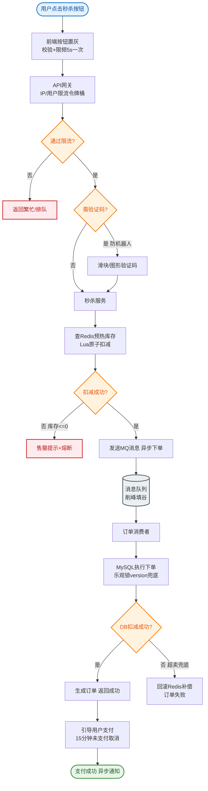

# 如何设计一个春运红包雨系统？春晚期间瞬时并发千万级。

### 场景分析
红包雨特点：固定时间窗口（春晚零点）、超高瞬时并发、公平随机分配、必须在几秒内完成。

### 实战案例
某电商平台在双11红包雨中遇到“超发”事故：由于 Redis Lua 脚本执行耗时过长，导致大量请求积压在 Tomcat 线程池，最终 OOM 崩溃，事后发现库存扣减逻辑未在原子操作中完成校验。**优化**：将所有库存校验与扣减逻辑下沉至 Lua 脚本，并在网关层直接丢弃 50% 请求（错峰峰填），保护后端。

### 架构设计
1. **预热阶段（提前 1 小时）**
   - 将红包总池拆分为 N 万个微红包，预分配金额
   - Redis Cluster 预加载所有红包数据
   - 各服务器本地缓存一部分红包（本地抢，减少网络开销）
2. **抢红包阶段（几秒）**
   - 用户请求 → 负载均衡 → 路由到某台服务器
   - 服务器从本地缓存原子 pop 一个红包
   - 返回金额 → 异步记录
3. **结算阶段**
   - 异步将抢到的红包写入用户账户
   - 未抢完的红包按规则处理（退回/慈善捐赠）

```text
预热阶段：
┌───────────────┐       ┌───────────────┐       ┌───────────────┐
│   红包总池    │ ──拆分▶│ Redis Cluster │ ──下发▶│  应用服务器组 │
│ (DB/库存中心) │       │  (库存快照)   │       │ (本地内存 Ring)│
└───────────────┘       └───────────────┘       └───────┬───────┘
                                                         │
抢红包阶段 (0-5s)：                                        ▼
┌───────────────┐    HTTP      ┌───────────────┐   本地Pop   ┌───────────────┐
│   海量用户    │ ──────────▶  │  负载均衡器   │ ──────────▶│  App Instance │
│               │               │ (一致性哈希)  │             │   (CAS/自旋)   │
└───────────────┘               └───────────────┘             └───────┬───────┘
                                                                     │
                                                                     ▼
                                                            ┌───────────────┐
                                                            │ 返回结果(成功)│
                                                            └───────┬───────┘
                                                                    │
                                                                    ▼ 异步MQ
                                                            ┌───────────────┐
                                                            │   结算服务    │
                                                            │ (落库/防重)   │
                                                            └───────────────┘
```

### 关键设计
- **去中心化抢红包**：每台服务器持有一批红包，避免单点。
- **客户端预分配**：APP 在红包雨开始前预连接服务器。
- **资源隔离**：红包雨服务独立部署，不影响其他业务。
- **多级限流**：CDN 层→网关层→服务层分别限流。

### 技术选型对比

| 维度 | Redis Lua 脚本 | 本地内存 RingBuffer | 数据库行锁 (不推荐) |
| :--- | :--- | :--- | :--- |
| **性能** | 极高 (单模型万级 QPS) | 最高 (无网络IO) | 极低 (百级 QPS) |
| **一致性** | 强一致 (原子执行) | 最终一致 (需异步同步) | 强一致 |
| **复杂度** | 中 (需处理超时) | 高 (需处理分片与回滚) | 低 (简单但不可用) |
| **适用场景** | 中小规模红包雨 | 超大规模瞬时峰值 | 闲置资源回收 |

### 防作弊
- 设备指纹 + 行为分析识别脚本
- 抽奖概率调整：模拟器/脚本降低中奖概率
- 风控实时拦截

### 关键代码示例 (Redis Lua：原子抢红包)
```lua
-- lua_script_grab.lua
local key = KEYS[1] -- red_packet_list_key
local user_key = KEYS[2] -- user_grab_record
local user_id = ARGV[1]

-- 1. 检查是否已抢过
if redis.call('sismember', user_key, user_id) == 1 then
    return -1 
end
-- 2. 原子弹出一个红包
local packet = redis.call('lpop', key)
if packet then
    redis.call('sadd', user_key, user_id)
    return packet
else
    return 0 -- 抢完了
end
```


## 核心流程图


## 记忆要点

- 核心难点：瞬时峰值极高，必须通过预热拆分与本地缓存化解中心节点压力。
- 分阶段策略：提前预热拆分微红包下发至应用内存，正式抢采用本地内存原子Pop。
- 数据一致性：因为要严防超发，所以校验与扣减必须用Lua脚本保证绝对原子性。
- 多级限流：因为后端无法承接千万QPS，所以必须在网关或CDN层直接按比例错峰丢弃请求。
- 异步解耦：抢红包结果仅返回前端，账务落库与防重记录交由MQ异步结算处理。

## 结构化回答


**30 秒电梯演讲：** 像发传单，提前把传单分发给许多工作人员，用户就近拿，瞬间发完。

**展开框架：**
1. **IO** — 资源预加载与本地缓存减少IO
2. **去中心化部署** — 去中心化部署避免单点瓶颈
3. **多级限流保护** — 多级限流保护系统

**收尾：** 红包金额如何在多台服务器间分配？


## 视频脚本

> 预计时长：3 分钟 | 由浅入深

| 时间 | 画面/字幕 | 口播台词 | 讲解要点 |
|------|----------|----------|----------|
| 0:00 | 标题卡：春运红包雨系统 | "春运红包雨系统，这题我会分三步讲。" | 开场钩子 |
| 0:41 | 概念定义动画 | "一句话：瞬时超高并发下的库存预分配与抗瞬时峰值设计。" | 核心定义 |
| 1:22 | 生活类比动画 | "打个比方——像发传单，提前把传单分发给许多工作人员，用户就近拿，瞬间发完。" | 核心类比 |
| 2:03 | 资源预加载与本地缓存 图解 | "资源预加载与本地缓存减少IO。" | 资源预加载与本地缓存 |
| 2:50 | 去中心化部署 图解 | "去中心化部署避免单点瓶颈。" | 去中心化部署 |
