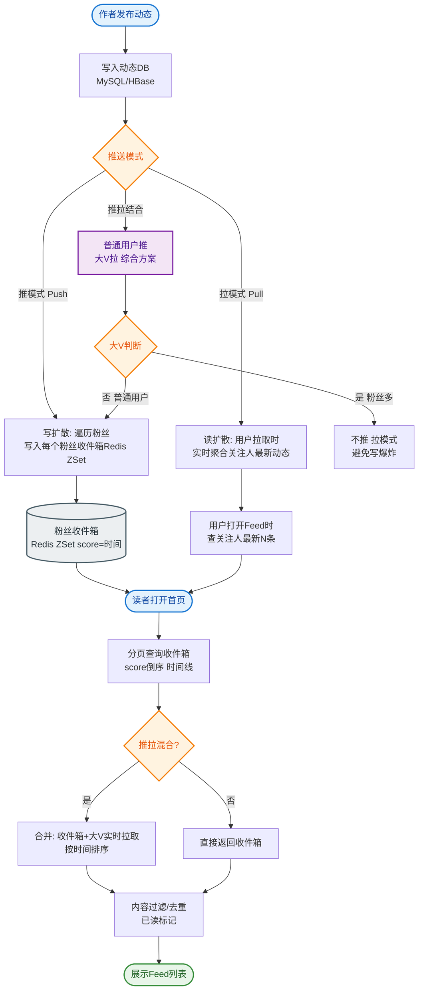

# 如何设计一个评论系统？支持千万级帖子，每篇帖子上万评论。

### 场景分析
评论系统核心需求：发表评论、楼中楼回复、评论排序（时间/热度）、分页加载。

### 实战案例
某社交媒体在做“年度热评”活动时，因所有热门帖子共享同一个 Redis 热度队列，导致一条恶意刷赞的垃圾评论占据了所有帖子首页。**改进**：将热度队列 Key 隔离细化到 `post:comment:hot:{post_id}`，并引入布隆过滤器过滤短时间内重复 IP 的点赞请求。

### 数据模型
- 评论表：id, target_id, user_id, content, parent_id, reply_to_id, like_count, created_at
- 楼中楼：parent_id=根评论 id，reply_to_id=被回复者

### 存储架构
1. **写路径**
   - 用户评论 → MQ 异步写入 → 分库分表存储
   - 分表策略：按 target_id 分片，同帖评论在同一分片
   - 评论计数：Redis INCR 原子更新
2. **读路径**
   - 首屏评论：Redis 缓存前 100 条（ZSet 按热度排序）
   - 分页加载：游标分页（避免 OFFSET 性能问题）
   - 楼中楼：单独查询 parent_id=? 的子评论

```text
评论数据流转：
┌─────────┐  发评论  ┌──────────┐  MQ解耦  ┌──────────────┐
│  用户   │─────────▶│ API 网关 │─────────▶│  评论写入服务 │
└─────────┘          └──────────┘         └──────┬───────┘
                                             │       │
                                             ▼       ▼ (异步更新)
                                    ┌──────────────┐  ┌──────────────┐
                                    │  DB (分库分表)│  │   缓存更新   │
                                    │ (Shard by ID)│  │ (删除/置顶)  │
                                    └──────────────┘  └──────────────┘

读路径优化（混合模式）：
用户请求列表 ──▶ 查询 Redis (Top N 热门) ──▶ Hit? 返回
                                  │
                                  ▼ Miss
                            查询 MySQL ──▶ 回填 Redis
```

### 排序策略
- **时间排序**：按 created_at DESC
- **热度排序**：score = 点赞数×W1 + 回复数×W2 - 时间衰减
- **混合排序**：热门优先 + 最新穿插

### 排序实现对比

| 排序方式 | 实现方案 | 优点 | 缺点 |
| :--- | :--- | :--- | :--- |
| **按时间** | MySQL (`ORDER BY created_at`) | 实现简单，强一致 | 深分页性能差，无法体现优质内容 |
| **按热度** | Redis ZSet | 读取性能极高，支持分页 | 内存占用大，数据一致性需同步维护 |
| **复杂权重** | Elasticsearch | 支持多维度排序，全文检索 | 成本高，写入延迟稍大 |

### 性能优化
- **评论索引**：(target_id, created_at) 联合索引；对于热度排序，需维护独立的索引表或利用 ES。
- **预计算**：定时任务更新热度分，写入 Redis ZSet。
- **读扩散 vs 写扩散**：热帖用读扩散（直接读缓存），冷帖直接查 DB。
- **CDN 缓存**：热门帖子的静态评论数据（HTML/JSON）。

### 扩展功能
- **@用户通知**：评论中检测 @username → 发通知
- **敏感词过滤**：DFA 算法实时过滤
- **评论折叠**：低质量评论折叠显示
- **审核队列**：AI 预审 + 人工复审

### 补充细节：深度限制与计数器
- **深度限制**：通常限制楼中楼层数（如最多 3 层），超过层级的回复在 UI 上只显示“@某用户”，数据上 parent_id 仍指向根评论或上一层，防止无限递归查询。
- **计数器设计**：评论数计数器（Redis）需考虑持久化，可定期同步回 DB，或使用 Redis 的 INCR + 异步 Binlog 同步方案。

### 关键代码示例 (Java：游标分页查询)
```java
// 避免使用 LIMIT offset, N，改用游标
public List<Comment> getComments(Long postId, Long lastCommentId, int limit) {
    QueryWrapper<Comment> wrapper = new QueryWrapper<>();
    wrapper.eq("post_id", postId)
           .lt(lastCommentId != null, "id", lastCommentId) // 游标条件：ID 小于上一页最后一个
           .orderByDesc("id")
           .last("LIMIT " + limit);
    return commentMapper.selectList(wrapper);
}
```

## 常见考点
1. **分页性能**：评论翻到第 1000 页（OFFSET 10000 LIMIT 10）如何优化？（答：禁止深分页，推荐“上一页/下一页”的游标分页；或只允许查看前几百页，老数据归档）。
2. **实时性**：刚发的评论没刷出来怎么办？（答：写后即读，写入时直接将评论 ID 追加到用户的 Redis 缓存列表末尾）。
3. **排序切换**：从“按时间”切换到“按热度”，数据源完全不同，如何保证一致性？（答：使用 ES 进行多维度排序，或者 Redis 维护两套 ZSet）。


## 核心流程图


## 记忆要点

- 数据模型：楼中楼采用双指针设计，parent_id指向根评论防无限递归。
- 分页策略：因为深分页性能极差，所以弃用OFFSET改用基于游标的分页方案。
- 读写分离：写请求异步入库分片，读请求优先查Redis ZSet获取热门列表。
- 分片规则：因为要避免跨库JOIN，所以必须按目标帖子ID进行分库分表。
- 防刷缓存：细化缓存Key到单帖子维度，配合布隆过滤器拦截恶意刷赞请求。

## 结构化回答


**30 秒电梯演讲：** 像论坛帖子，主楼层是一楼二楼，回复楼层是盖楼，还要按热度把最好的楼顶上去。

**展开框架：**
1. **通过pare** — 通过parent_id实现楼中楼结构
2. **游标分页解决深度分页性** — 游标分页解决深度分页性能
3. **Redis** — Redis缓存热门评论加速读

**收尾：** 如何实现无限滚动加载？


## 视频脚本

> 预计时长：2 分钟 | 由浅入深

| 时间 | 画面/字幕 | 口播台词 | 讲解要点 |
|------|----------|----------|----------|
| 0:00 | 标题卡：评论系统 | "评论系统，一分钟讲透。" | 开场钩子 |
| 0:35 | 生活类比动画 | "打个比方——像论坛帖子，主楼层是一楼二楼，回复楼层是盖楼，还要按热度把最好的楼顶上去。" | 核心类比 |
| 1:10 | 概念定义动画 | "一句话：树状数据的存储、分页查询与多维排序。" | 核心定义 |
| 1:50 | parent_id实 图解 | "通过parent_id实现楼中楼结构。" | parent_id实 |
