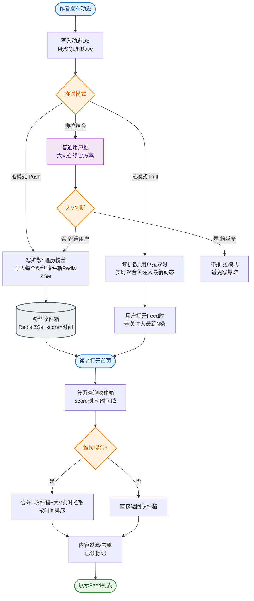
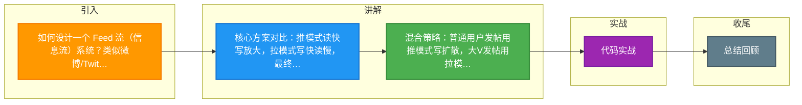

# 如何设计一个 Feed 流（信息流）系统？类似微博/Twitter首页。

### 场景分析
Feed 流核心需求：拉取关注的人的最新内容，按时间线排列，延迟要求低（秒级）。

### 实战案例
Twitter 早期采用纯拉模式，当 Lady Gaga 等明星发推时，数百万粉丝同时刷新导致数据库瞬间瘫痪（Fan-out on Read 问题）。后改用混合模式：普通用户推，大 V 拉。国内某微博在迁移 Feed 存储时，曾因 Redis 集群主从切换导致 10 分钟内用户 Timeline 丢失，最终引入了 Kafka 作为持久化缓冲层来保证数据不丢。

### 两种核心方案
1. **推模式**
   - 发布者发帖 → 将内容推送到所有粉丝的收件箱
   - 优点：读极快（直接查个人 Timeline）
   - 缺点：写放大（大 V 发帖需推百万次）
2. **拉模式**
   - 用户刷新 Feed → 拉取所有关注者的最新帖子 → 合并排序
   - 优点：写简单
   - 缺点：读慢（关注很多人时需大量查询）

### 混合方案（推荐）
- **普通用户（粉丝<1000）**：推模式，发帖时写粉丝 Timeline。
- **大 V（粉丝>10 万）**：拉模式，不发推，粉丝读时实时拉取。
- **中间用户**：推+拉结合。

### 技术实现
- **Timeline 存储**：Redis ZSet（score=时间戳），每人的收件箱保留最近 1000 条。
- **内容分发**：发帖 → Kafka → 消费者批量写入粉丝 Timeline。
- **大 V 特殊处理**：粉丝 Feed 查询时实时合并大 V 的最新帖子。

```text
┌──────────┐  发帖   ┌──────────┐            ┌──────────────┐
│ 发布者 A │────────▶│  Feed写  │───────────▶│    Kafka     │
│ (普通用户)│        │  服务    │  (写扩散)   │              │
└──────────┘        └──────────┘            └──────┬───────┘
                                                   │ 消费
                                                   ▼
                                         ┌──────────────────┐
                                         │  Fanout Service  │
                                         │ (获取粉丝列表)    │
                                         └────────┬─────────┘
                                                  │
                      ┌───────────────────────────┼──────────────────────┐
                      ▼                           ▼                      ▼
              ┌───────────────┐           ┌───────────────┐      ┌───────────────┐
              │  粉丝1 Inbox │           │  粉丝2 Inbox │      │  粉丝N Inbox  │
              │ (Redis ZSet) │           │ (Redis ZSet) │      │ (Redis ZSet) │
              └───────────────┘           └───────────────┘      └───────────────┘
```

### 方案对比

| 维度 | 推模式 | 拉模式 | 混合模式 |
| :--- | :--- | :--- | :--- |
| **写性能** | 差 (写放大严重) | 优 (仅写一次) | 中 (分情况处理) |
| **读性能** | 优 (直接读 Inbox) | 差 (需聚合排序) | 优 (大部分读 Inbox) |
| **内存占用** | 高 (需维护海量 Timeline) | 低 (仅需存用户发件箱) | 中 (折中方案) |
| **实时性** | 高 | 低 (需触发拉取) | 高 |

### 性能优化
- **定时预计算**：低峰期预生成活跃用户的 Feed（尤其是关注了很多大 V 的用户）。
- **分页策略**：游标分页（基于 score），避免 Deep Paging。
- **缓存策略**：Feed 列表缓存 5 分钟，或者只缓存 Feed ID，内容详情走独立缓存。
- **图片/视频 CDN 加速**：静态资源加速。

### 数据一致性
- **最终一致**：发帖后秒级到达粉丝 Feed。
- **取消关注**：标记删除 + 定期物理清理 Timeline 中的无效数据。
- **删帖**：广播删除消息到所有 Timeline，或建立“已删除 ID 集合”，读取时过滤。

### 补充细节：读模式的加权排序与计数
- **信箱 Inbox 与读信箱 Read-Inbox 分离**：为了优化读性能，可以将未读状态维护在独立的 Redis 结构中，避免每次读取都去更新 Timeline 的状态。

### 关键代码示例 (Go：推模式写入)
```go
// 发帖后的异步分发逻辑
func FanoutPost(post *Post, followerIDs []int64) {
    pipe := redisClient.Pipeline()
    score := float64(time.Now().Unix())
    
    for _, uid := range followerIDs {
        // 将帖子ID写入粉丝的时间线 ZSet
        key := fmt.Sprintf("feed:user:%d", uid)
        pipe.ZAdd(ctx, key, &redis.Z{Score: score, Member: post.ID})
        // 限制列表长度，只保留最近 1000 条，防止内存膨胀
        pipe.ZRemRangeByRank(ctx, key, 0, -1001) 
    }
    pipe.Exec(ctx)
}


## 核心流程图


## 记忆要点

- 核心方案对比：推模式读快写放大，拉模式写快读慢，最终选混合模式。
- 混合策略：普通用户发帖用推模式写扩散，大V发帖用拉模式由粉丝实时聚合。
- 存储设计：个人收件箱用Redis ZSet存储，以时间戳为Score保留近期千条。
- 性能优化：采用ID缓存与游标分页，以应对高并发读取及深分页问题。
- 数据一致：删帖或取消关注通过标记删除，读取时过滤并异步物理清理。

## 结构化回答


**30 秒电梯演讲：** 报纸订阅，大报纸（大V）不挨家送（拉），社区小报（普通人）直接塞信箱（推）。

**展开框架：**
1. **推模式读快写慢** — 推模式读快写慢，拉模式反之
2. **混合模式根据** — 混合模式根据粉丝数切换策略
3. **ZSet** — 使用ZSet维护时间线

**收尾：** 大V发帖如何避免写扩散风暴？


## 视频脚本

> 预计时长：3 分钟 | 由浅入深

| 时间 | 画面/字幕 | 口播台词 | 讲解要点 |
|------|----------|----------|----------|
| 0:00 | 标题卡：Feed 流（信息流）系统 | "Feed 流（信息流）系统，这题我会分三步讲。" | 开场钩子 |
| 0:41 | 概念定义动画 | "一句话：根据粉丝规模动态选择推/拉模式以平衡读写性能。" | 核心定义 |
| 1:22 | 生活类比动画 | "打个比方——报纸订阅，大报纸(大V)不挨家送(拉)，社区小报(普通人)直接塞信箱(推)。" | 核心类比 |
| 2:03 | 推模式读快写慢 图解 | "推模式读快写慢，拉模式反之。" | 推模式读快写慢 |
| 2:50 | 混合模式 图解 | "混合模式根据粉丝数切换策略。" | 混合模式 |

### 视频流程图



