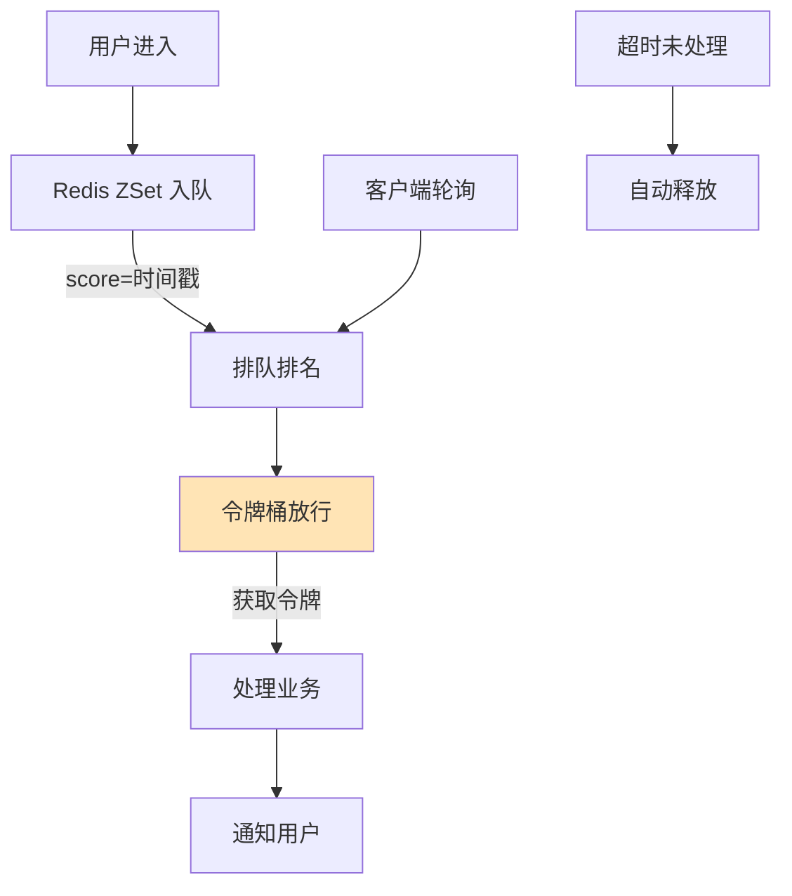

# 如何设计一个在线排队系统？类似小米抢购、医院挂号排队。

### 场景分析
排队系统核心需求：公平排队（FIFO）、实时位置反馈、超时自动退出、按需放行。

### 实战案例
某医院挂号系统在放号瞬间，大量用户疯狂点击“刷新排队”，导致后端 QPS 暴增 50 倍，正常用户的排队请求反而被拒绝服务。**解决**：前端实现“指数退避”轮询策略（首次间隔 1s，后续 2s, 4s...），并配合 Redis ZSet 存储排队数据，仅返回排名变动或窗口临近时才推送更新。

### 架构设计
1. **排队入队**
   - 用户请求 → 生成排队号 → Redis ZSet/LIST 存储（score=时间戳）
   - 返回当前排队位置和预估等待时间
2. **排队等待**
   - 客户端轮询/WebSocket 推送实时位置
   - 每 3 秒更新一次位置
3. **放行处理**
   - 后端按处理能力控制放行速率
   - 使用令牌桶：每秒生成 N 个令牌，拿到令牌的用户才能进入下单页
   - 超时未操作的自动出队

### 核心数据结构
- 队列：Redis Sorted Set（member=userId, score=入队时间戳）
- 位置计算：ZRANK 获取排名
- 活跃检查：Redis 定期清理超时用户（>5 分钟无操作）

### 存储方案对比

| 方案 | Redis List | Redis Sorted Set (ZSet) | 数据库 (DB) |
| :--- | :--- | :--- | :--- |
| **实现复杂度** | 低 (LPUSH/RPOP) | 中 (ZADD/ZRANGE) | 高 (需处理锁与行锁) |
| **功能支持** | 仅支持 FIFO | 支持 FIFO + 插队/优先级 | 支持复杂业务逻辑 |
| **查询排名** | 差 (需遍历) | 好 (ZRANK O(log N)) | 差 (COUNT 慢) |
| **适用场景** | 简单 FIFO 队列 | 需要查询排名/预估时间 | 无需高并发时 |

### 防作弊
- 一个账号一个排队位置
- 设备指纹去重
- 排队号加密签名防伪造

### 高可用
- Redis Cluster + 持久化
- 限流保护后端服务
- 排队页面静态化部署 CDN

### 扩展场景
- 优先级队列：VIP 用户优先（score 加权）
- 分组排队：按商品/科室分别排队
- 动态调整放行速率：根据系统负载自动调整

### 关键代码示例 (Redis Lua：排队与过期清理)
```lua
-- 入队并设置过期时间
local queue_key = KEYS[1]
local user_id = ARGV[1]
local timestamp = tonumber(ARGV[2])
local expire_sec = tonumber(ARGV[3])

-- 检查是否已在队列中
if redis.call('zscore', queue_key, user_id) then
    return {err = "Already in queue"}
end

-- 加入有序集合
redis.call('zadd', queue_key, timestamp, user_id)
-- 设置 TTL (注意: ZSet 本身不支持 TTL，需另开 Key 或通过懒加载清理)
-- 这里演示返回排名
local rank = redis.call('zrank', queue_key, user_id)
return {rank, timestamp}
```


## 核心流程图



## 核心知识点图


## 记忆要点

- 数据结构：选Redis ZSet而非List，因为ZSet能以O(log N)极速返回排队名次。
- 流量削峰：前端采用指数退避轮询，避免用户疯狂刷新引发后端QPS暴增。
- 放行控制：后端通过令牌桶限流，按系统能力平稳放行用户进入业务页。
- 高可用保障：超时无操作的用户由定时任务自动踢出队列，防止队列阻塞。
- 安全防刷：结合设备指纹与账号限制，排队号必须加密签名防伪造插队。

## 结构化回答


**30 秒电梯演讲：** 像银行叫号机，先取号，等待大屏叫号，过号作废。

**展开框架：**
1. **Redis** — Redis ZSet实现有序队列
2. **令牌桶算法控** — 令牌桶算法控制放行速率
3. **客户端轮询或** — 客户端轮询或推送更新状态

**收尾：** 如何处理用户中途放弃排队？


## 视频脚本

> 预计时长：2 分钟 | 由浅入深

| 时间 | 画面/字幕 | 口播台词 | 讲解要点 |
|------|----------|----------|----------|
| 0:00 | 标题卡：在线排队系统 | "在线排队系统，一分钟讲透。" | 开场钩子 |
| 0:35 | 生活类比动画 | "打个比方——像银行叫号机，先取号，等待大屏叫号，过号作废。" | 核心类比 |
| 1:10 | 概念定义动画 | "一句话：基于令牌桶或队列的流量控制与公平调度。" | 核心定义 |
| 1:50 | Redis ZSet 图解 | "Redis ZSet实现有序队列。" | Redis ZSet |
