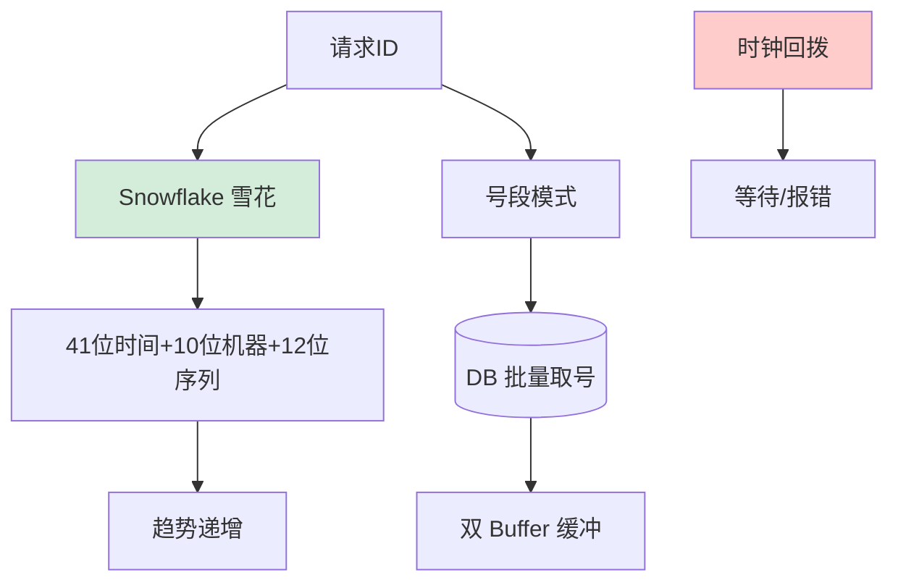
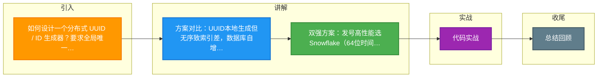

# 如何设计一个分布式 UUID / ID 生成器？要求全局唯一、趋势递增、高可用。

【场景分析】
分布式ID核心要求：全局唯一、趋势递增（利于B+树索引）、高可用（不成为瓶颈）、信息安全（不易猜测）。

【常见方案对比】
1. UUID（v4）：
   - 优点：本地生成，无网络开销
   - 缺点：太长（128bit）、无序（索引性能差）、不可读
2. 数据库自增：
   - 优点：简单、递增
   - 缺点：单点瓶颈、扩展难
3. 号段模式（Leaf-Segment）：
   - DB存储最大ID，服务每次取一批ID到内存
   - 双Buffer优化：当前号段用到20%时异步加载下一个
   - 优点：高性能（内存发号）、趋势递增
   - 缺点：服务重启会浪费部分ID
4. Snowflake：
   - 64bit = 1bit符号 + 41bit时间戳 + 10bit机器号 + 12bit序列号
   - 单机每秒可生成400万ID
   - 优点：高性能、趋势递增、可反解
   - 缺点：依赖时钟（时钟回拨问题）

【Snowflake时钟回拨解决方案】
- 方案A：等待时钟追上（回拨<5ms）
- 方案B：使用备用机器号
- 方案C：记录上次时间戳，若当前时间<上次时间则抛异常
- 方案D：百度UidGenerator使用RingBuffer

【美团Leaf方案（推荐）】
- Leaf-Segment：号段模式，适合简单场景
- Leaf-Snowflake：Snowflake + ZK分配workerId
- 两种模式可切换

【选型建议】
- 中小规模：Leaf-Segment（简单可靠）
- 大规模：Snowflake变体（高性能）
- 安全要求高：加密ID（Hashids）或UUID

### 实战案例
某支付系统曾因服务器 NTP 时间同步出现大幅跳变（回拨了 3 秒），导致 Snowflake 生成大量重复 ID，造成订单主键冲突入库失败。修复方案是引入 ZK 递增序列作为“备用时间戳”，当检测到时钟回拨时，使用 ZK 记录的序号代替系统时间，保证递增。

### 代码示例 (Java Snowflake 变体)
```java
public synchronized long nextId() {
    long timestamp = System.currentTimeMillis();
    // 时钟回拨处理：容忍 5ms 以内的回拨，否则报错
    if (timestamp < lastTimestamp) {
        long offset = lastTimestamp - timestamp;
        if (offset <= 5) {
            Thread.sleep(offset << 1); // 等待追上
            timestamp = System.currentTimeMillis();
        } else {
            throw new RuntimeException("Clock moved backwards");
        }
    }
    // 序列号填充 & ID 组装逻辑...
    return ((timestamp - epoch) << 22) | (workerId << 12) | sequence;
}
```

### 对比表格
| 方案 | 性能 (QPS) | 趋势递增 | 长度 | 复杂度 | 适用场景 |
| :--- | :--- | :--- | :--- | :--- | :--- |
| UUID | 极高 | 无序 | 128bit | 低 | 无需排序、本地生成 |
| DB自增 | 低 (DB瓶颈) | 严格递增 | 64bit | 低 | 小规模、单机 |
| Snowflake | 高 (400万/s) | 趋势递增 | 64bit | 中 | 分布式、高并发 |
| Leaf Segment | 极高 (内存) | 趋势递增 | 64bit | 中 | 需要持久化保证 |
| Redis Incr | 中 (网络IO) | 严格递增 | 64bit | 低 | 简单分布式计数 |


## 核心流程图




## 记忆要点

- 方案对比：UUID本地生成但无序致索引差，数据库自增受限单点瓶颈。
- 双强方案：发号高性能选Snowflake（64位时间戳+机器号+序列），业务可靠选号段模式。
- 位运算拆解：必须熟记Snowflake的1位符号、41位毫秒时间、10位机器、12位序列。
- 最大痛点：因为强依赖机器时钟，所以必须解决NTP时钟回拨导致的重号问题。
- 回拨解决：时钟回拨通常采用休眠等待追上，或抛异常并启用备用机器号机制。

## 结构化回答

**30 秒电梯演讲：** 在分布式环境下高效生成唯一且有序的数字ID。打比方——就像每台机器发号器都有一本不同编号的发票簿，大家一起按顺序撕发票。落到工程上，UUID无序性能差，不推荐做主键。

**展开框架：**
1. **UUID无序性** — UUID无序性能差，不推荐做主键
2. **Snowflake** — Snowflake利用时间戳+机器ID实现高性能趋势递增
3. **号段模式** — 号段模式通过批量获取DB ID减少数据库压力

**收尾：** 这几个点都能配合实战展开。您想继续聊哪个追问——比如 「Snowflake的机器号如何分配」 或者 「号段模式如何保证高可用」？

## 视频脚本

> 预计时长：2 分钟 | 由浅入深

| 时间 | 画面/字幕 | 口播台词 | 讲解要点 |
|------|----------|----------|----------|
| 0:00 | 标题卡：分布式 UUID / ID 生成器 | "分布式 UUID / ID 生成器，一分钟讲透。" | 开场钩子 |
| 0:35 | 生活类比动画 | "打个比方——就像每台机器发号器都有一本不同编号的发票簿，大家一起按顺序撕发票。" | 核心类比 |
| 1:10 | 概念定义动画 | "一句话：在分布式环境下高效生成唯一且有序的数字ID。" | 核心定义 |
| 1:50 | UUID无序性 图解 | "UUID无序性能差，不推荐做主键。" | UUID无序性 |

### 视频流程图



