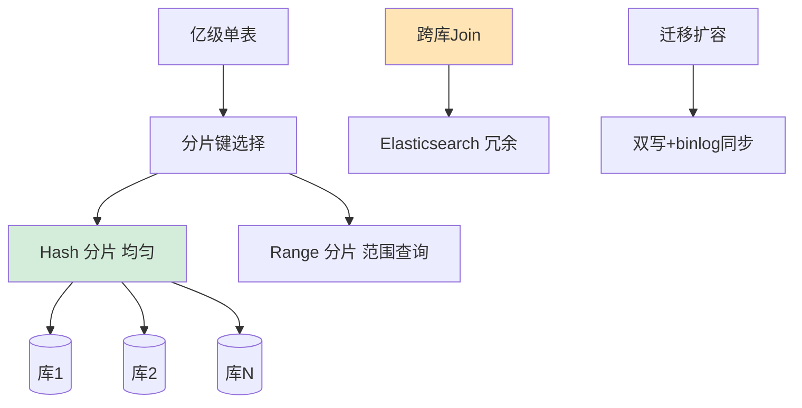
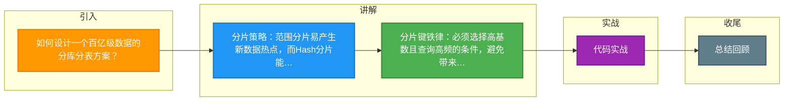

# 如何设计一个百亿级数据的分库分表方案？

【场景分析】
百亿数据单表无法承受：查询慢、索引膨胀、DDL锁表、维护困难。需要分库分表。

【分片策略选择】
1. 水平分片（行级拆分）：
   - 按范围分片：ID 0-1000万→库1，1000万-2000万→库2（热点问题）
   - 按Hash分片：user_id % 128 → 分配到128个表（数据均匀）
   - 按时间分片：按月/日建表（适合时序数据）
2. 垂直分片（列级拆分）：
   - 按业务拆分：用户表/订单表/商品表分到不同库
   - 冷热分离：热数据MySQL，冷数据HBase/ES

【分片键选择原则】
- 高基数（取值范围大）
- 查询常用条件（避免跨库查询）
- 不可变（一旦确定不可更改）
- 数据分布均匀

【百亿数据具体方案】
以订单系统为例：
- 128库 × 128表 = 16384个表
- 每表约60万条数据
- 分片键：user_id（C端查询高频）或 order_id（包含分片信息）
- 订单ID = 时间戳 + 分片号 + 序列号（可从ID反推分片位置）

【跨库查询解决方案】
1. 分片键路由：确保查询条件包含分片键
2. 二次索引：ES建立非分片键的索引，先查ES得到分片位置
3. CQRS：写走分库分表，读走ES/ClickHouse
4. 数据冗余：常用查询维度冗余存储

【分库分表中间件】
- ShardingSphere：Java生态首选，支持读写分离+分片
- MyCat：代理模式，跨语言
- Vitess：YouTube开源，K8s友好

【数据迁移方案】
- 双写模式：新老并行写，逐步迁移
- binlog同步：Canal监听binlog写入新分片
- 数据校验：全量+增量校验
- 灰度切换：逐步切读流量到新分片

### 实战案例
某电商在将 50 亿订单数据从单库迁移到分库分表时，初期采用 `id % 4` 策略，但因 ID 是连续自增的，导致新数据全部集中在最后一个分片，产生“新表热点”。后来改用 `Hash(id) % 4` 解决，并利用 ShardingSphere 的“标准分片策略”配置了复杂路由规则。

### 代码示例 (ShardingSphere Algorithm)
```java
// 自定义分片算法：根据 userId 取模分库
public class ModShardingDBAlgorithm implements PreciseShardingAlgorithm<Long> {
    @Override
    public String doSharding(Collection<String> availableTargetNames, PreciseShardingValue<Long> shardingValue) {
        Long userId = shardingValue.getValue();
        for (String dbName : availableTargetNames) {
            // db_0, db_1... 根据 userId % 2 路由
            if (dbName.endsWith(String.valueOf(userId % 2))) {
                return dbName;
            }
        }
        throw new IllegalArgumentException();
    }
}
```

### 对比表格
| 维度 | 单表 | 垂直分片 | 水平分片 (Range) | 水平分片 (Hash) |
| :--- | :--- | :--- | :--- | :--- |
| **解决核心** | 表数据量上限 | 表字段多、业务耦合 | 单机容量上限 | 单机容量上限 + 写入瓶颈 |
| **查询复杂度** | 低 | 中 | 低 (范围查询快) | 高 (需带分片键) |
| **数据分布** | N/A | 按业务拆分 | 易热点 (如最近时间) | 均匀分布 |
| **扩容难度** | N/A | 简单 | 难 (需数据迁移) | 中 (通常需倍数扩容) |
| **典型场景** | < 2000万行 | 复杂业务拆分 | 日志、历史数据 | 订单、用户数据 |


## 核心流程图




## 记忆要点

- 分片策略：范围分片易产生新数据热点，而Hash分片能保证数据分布绝对均匀。
- 分片键铁律：必须选择高基数且查询高频的条件，避免带来致命的跨库扫描。
- 百亿级容量：采用双维度拆分如128库乘128表，保障单表容量在百万级最优区间。
- 分片键植入：将分片信息隐含在业务ID中（如Snowflake变种），实现从ID反查路由。
- 跨库查询破局：非分片键查询通过ES建立二级索引，采用CQRS读写分离架构。

## 结构化回答

**30 秒电梯演讲：** 通过数据分片将海量数据分散存储到多个节点，突破单机性能瓶颈。打比方——就像把一本厚字典拆成128本小册子，按拼音或部首(分片键)分发到不同书架上。落到工程上，分片键选错是大忌，需兼顾查询高频和数据分布均匀。

**展开框架：**
1. **分片键选错** — 分片键选错是大忌，需兼顾查询高频和数据分布均匀
2. **Hash分片** — Hash分片解决均匀性，Range分片解决范围查询
3. **跨库Join** — 跨库Join是痛点，建议通过ES或数据冗余解决

**收尾：** 这几个点都能配合实战展开。您想继续聊哪个追问——比如 「如何选择分片数量」 或者 「分片键选错了怎么补救」？

## 视频脚本

> 预计时长：3 分钟 | 由浅入深

| 时间 | 画面/字幕 | 口播台词 | 讲解要点 |
|------|----------|----------|----------|
| 0:00 | 标题卡：百亿级数据的分库分表方案 | "百亿级数据的分库分表方案，这题我会分三步讲。" | 开场钩子 |
| 0:41 | 概念定义动画 | "一句话：通过数据分片将海量数据分散存储到多个节点，突破单机性能瓶颈。" | 核心定义 |
| 1:22 | 生活类比动画 | "打个比方——就像把一本厚字典拆成128本小册子，按拼音或部首(分片键)分发到不同书架上。" | 核心类比 |
| 2:03 | 分片键选错 图解 | "分片键选错是大忌，需兼顾查询高频和数据分布均匀。" | 分片键选错 |
| 2:50 | Hash分片 图解 | "Hash分片解决均匀性，Range分片解决范围查询。" | Hash分片 |

### 视频流程图



