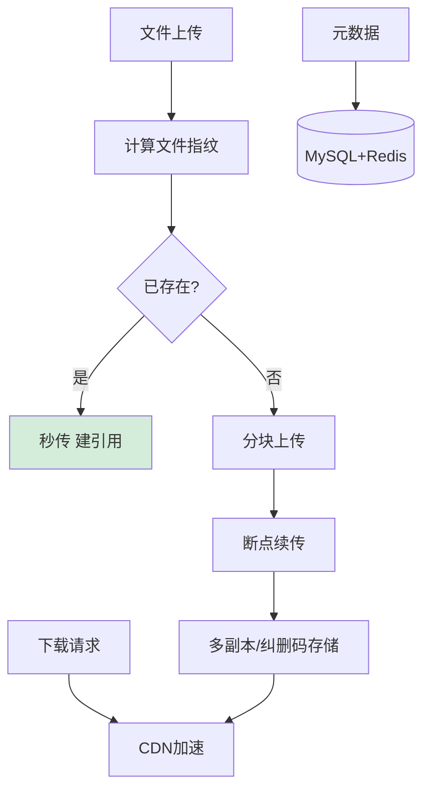

# 如何设计一个分布式文件存储系统？类似七牛云/阿里云OSS。

【场景分析】
文件存储系统核心需求：海量文件（百亿+）、大文件支持（GB级）、高可用、CDN加速。

【架构分层】
1. 接入层：
   - RESTful API：上传/下载/删除
   - 鉴权：Token + ACL权限控制
   - 限流：按用户/IP限流
2. 元数据层：
   - 存储文件信息（名称/大小/类型/存储位置/权限）
   - MySQL + Redis缓存
3. 存储层：
   - 小文件（<1MB）：合并存储（多文件合并成大文件，降低inode消耗）
   - 大文件（>1MB）：分块存储（Chunk Server）
   - 冷数据：迁移到低价存储（S3 IA/Glacier）

【文件上传方案】
1. 直传：客户端直接上传到存储节点（Pre-signed URL）
   - 减少应用服务器带宽压力
2. 分片上传：大文件分块上传 + 断点续传
   - 每片5MB，上传失败只需重传该片
   - 所有分片上传完成后合并
3. 秒传：计算文件MD5 → 查库 → 已存在则直接引用

【高可用设计】
- 多副本：每个文件3副本（不同机架/机房）
- EC纠删码：节省存储（N+M模式，M个校验块）
- 一致性：Quorum W+R>N，确保读写一致
- 自我修复：定期检查副本完整性，自动补充丢失副本

【性能优化】
- CDN边缘缓存：热点文件就近访问
- 预签名URL：直接上传/下载，无需经过应用服务器
- 分级存储：热数据SSD，温数据HDD，冷数据磁带
- 并行下载：多线程分块下载加速

【参考架构】
FastDFS / MinIO / Ceph / HDFS

### 实战案例
某社交平台早期将所有图片存储在本地 NFS，导致单点故障和 IO 瓶颈。后改用 MinIO 集群 + Nginx 直传，并实现了“秒传”功能，但曾出现因哈希碰撞导致用户 A 覆盖了用户 B 的头像（MD5 冲突概率虽低但在海量数据下必须考虑），修复方案引入了 UUID + Hash 的组合索引键。

### 代码示例 (Go 预签名上传)
```go
// 使用 MinIO SDK 生成预签名上传 URL (有效期为 1 小时)
u, err := minioClient.PresignedPutObject(context.Background(), 
    "user-avatars", 
    "user-123.jpg", 
    time.Hour,
)
if err != nil {
    log.Fatal(err)
}
// 客户端拿到 u 后，直接使用 PUT 方法上传文件，不经过应用服务器
fmt.Println("Upload URL:", u)
```

### 对比表格
| 特性 | 本地文件系统 | NFS (网络文件系统) | 对象存储 (MinIO/S3) | FastDFS |
| :--- | :--- | :--- | :--- | :--- |
| **扩容性** | 差 (需挂载盘) | 中 (受限于性能) | 极好 (扁平化结构) | 好 (Tracer+Storage) |
| **访问协议** | POSIX | POSIX | RESTful API | 自定义协议 |
| **元数据管理** | Inode | 单点 Metadata | 索引 (通常含Key) | 内存 + DB |
| **适用场景** | 单机应用 | 内网共享 | 公网云存储、海量文件 | 中小规模图片/视频 |
| **成本** | 低 | 中 | 随量线性增长 | 中 |


## 核心流程图




## 记忆要点

- 架构分层：系统分为API接入鉴权、MySQL元数据管理与物理块存储三层。
- 极速秒传：客户端先算MD5查库，命中已有记录则直接返回成功免上传。
- 大文件上传：大文件必须分块并发上传，支持断点续传以提升弱网体验。
- 传輸优化：应用服务器下发预签名URL，让客户端直传存储层彻底解放带宽。
- 高可用底座：通过EC纠删码或多副本机制保障，Quorum机制确保读写一致性。

## 结构化回答


**30 秒电梯演讲：** 像图书馆的目录索引（元数据）和书架（存储节点）分开，书太厚要拆成几卷存放。

**展开框架：**
1. **元数据量小但重要** — 用MySQL+Redis管理
2. **大文件分块上传** — 大文件分块上传，断点续传是标配
3. **多副本保安全** — 多副本保安全，纠删码省成本

**收尾：** 小文件合并存储如何实现？


## 视频脚本

> 预计时长：3 分钟 | 由浅入深

| 时间 | 画面/字幕 | 口播台词 | 讲解要点 |
|------|----------|----------|----------|
| 0:00 | 标题卡：分布式文件存储系统 | "分布式文件存储系统，这题我会分三步讲。" | 开场钩子 |
| 0:41 | 概念定义动画 | "一句话：将元数据与实际文件分离，通过分片和多副本机制存储海量文件。" | 核心定义 |
| 1:22 | 生活类比动画 | "打个比方——像图书馆的目录索引(元数据)和书架(存储节点)分开，书太厚要拆成几卷存放。" | 核心类比 |
| 2:03 | 元数据量小但重要 图解 | "元数据量小但重要，用MySQL+Redis管理。" | 元数据量小但重要 |
| 2:50 | 大文件分块上传 图解 | "大文件分块上传，断点续传是标配。" | 大文件分块上传 |
