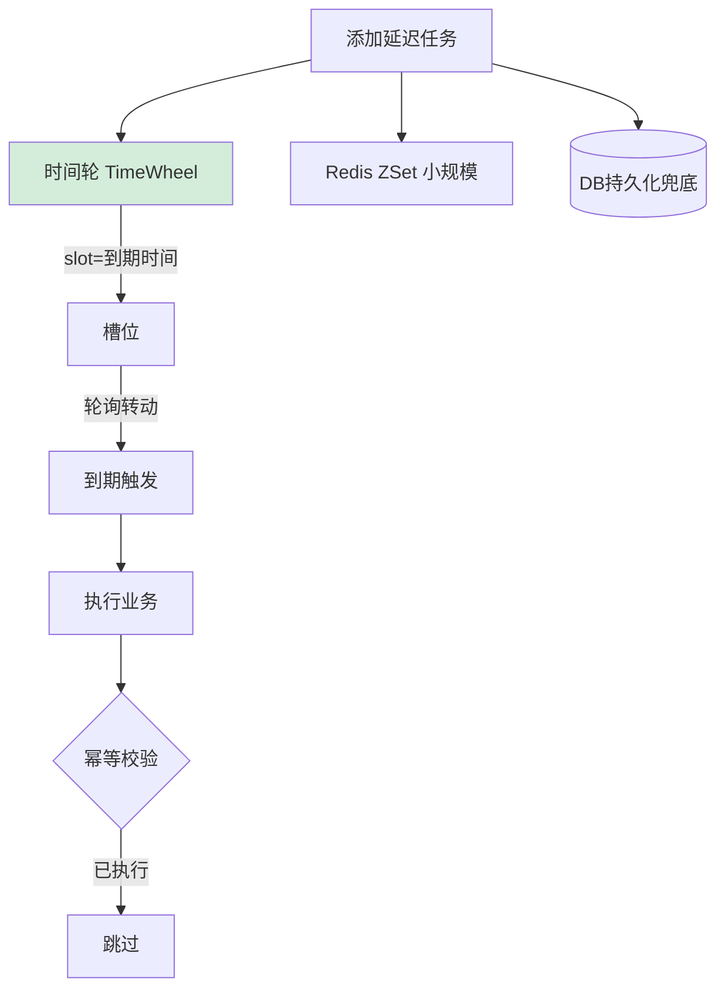

# 如何设计一个延迟队列？支持百万级延迟任务的精确触发。

【场景分析】
延迟队列应用：订单超时关闭、定时推送、延迟重试、优惠券过期。

【方案对比】
1. **数据库轮询**：
   - 定时任务扫描到期记录（`SELECT * FROM task WHERE exec_time < NOW()`）
   - **优化**：增加索引`exec_time`，轮询时携带`max_id`避免全表扫描。
   - 优点：简单，可靠。
   - 缺点：扫描效率低、精度差（依赖轮询间隔），数据库压力大。
2. **Redis ZSet**：
   - score=到期时间戳，member=任务ID（或轻量JSON）。
   - `ZRANGEBYSCORE`取出到期任务。
   - 优点：简单高效，O(log N)插入/读取。
   - 缺点：需轮询（CPU消耗），持久化依赖Redis AOF/RDB，内存成本。
3. **RocketMQ延迟消息**：
   - 内置18个延迟级别（1s 5s 10s 30m 1h 2h ...）。
   - 优点：可靠、高性能、削峰填谷。
   - 缺点：只支持特定级别，不支持任意秒数（如35分钟）。
4. **时间轮（推荐 - Netty HashedWheelTimer）**：
   - **原理**：模拟时钟表盘，指针转动，指针指向的槽位即执行任务。
   - **精度**：时间粒度由指针跳动间隔决定（如100ms）。
   - **适用**：单机百万级任务，内存占用极低。
5. **Redisson延迟队列**：
   - 基于`Redis ZSet + List + 发布订阅`。
   - 结构：ZSet负责按时间排序，List负责存待执行数据，Pub/Sub负责通知唤醒。

【Redis ZSet 实现细节与关键优化】
1. **生产消息**：
   `ZADD delay_queue {exec_timestamp} {task_id}`
   - **注意**：若Member包含完整JSON，ZSet内存膨胀快。建议仅存ID，详情存Hash。
2. **消费消息**：
   - **多进程竞争**（分布式锁）：
     ```lua
     -- 1. 查询到期任务
     local tasks = redis.call('ZRANGEBYSCORE', KEYS[1], 0, ARGV[1], 'LIMIT', 0, 100)
     -- 2. 立即删除（原子性）
     if #tasks > 0 then
         redis.call('ZREM', KEYS[1], unpack(tasks))
     end
     return tasks
     ```
   - **ACK机制**：业务处理成功后再从DB中删除元数据，失败则重新加入ZSet或进入死信队列。
3. **大规模优化**：
   - **分片**：按`Hash(task_id) % N` 分散到N个ZSet key（如`delay_queue_0`...`delay_queue_9`），每个队列由独立消费者处理。
   - **多路复用**：一个Jedis连接处理多个队列的Pop操作。

【时间轮实现原理（高性能单机）】
- **架构**：
  ```text
      [0] [1] [2] ... [N-1] (Bucket)
       ^   |
       |---| (Current Tick moves every 100ms)
  ```
- 入队：`time % wheel_size` 计算落桶。
- 出队：指针转动到该槽位，遍历链表执行。

### 实战案例
某订单系统依赖 Redis ZSet 实现超时取消，在“双十一”零点流量洪峰时，由于一个轮询线程通过 `ZRANGEBYSCORE` 一次拉取了 5000 个任务进行处理，导致该线程卡顿 10 秒，大量订单超时未取消。后改为使用 `BlockingQueue` 异步处理拉取结果，并引入 RMI-RingBuffer（类似 Netty 时间轮）作为本地内存缓冲，彻底解决了阻塞问题。

### 代码示例 (Lua 脚本原子性消费)
```lua
-- KEYS[1]: ZSet Key (delay_queue)
-- ARGV[1]: 当前时间戳
-- 获取并移除到期的任务
local tasks = redis.call('ZRANGEBYSCORE', KEYS[1], '-inf', ARGV[1], 'LIMIT', 0, 100)
if #tasks > 0 then
    redis.call('ZREM', KEYS[1], unpack(tasks))
end
return tasks
```

### 对比表格
| 方案 | 精度 | 吞吐量 | 可靠性 | 复杂度 | 支持持久化 | 适用场景 |
| :--- | :--- | :--- | :--- | :--- | :--- | :--- |
| **DB 轮询** | 秒级 (低) | 低 (IO瓶颈) | 高 (事务) | 低 | 是 | 任务量少、简单业务 |
| **Redis ZSet** | 毫秒级 | 中 (CPU轮询) | 中 (AOF掉电丢数据) | 中 | 是 | 中小规模、通用场景 |
| **时间轮** | 毫秒级 | 极高 (内存) | 低 (重启丢失) | 中 | 否 | 单机高性能、心跳检测 |
| **RocketMQ** | 秒级 (特定级别) | 高 | 高 (磁盘) | 中 | 是 | 业务解耦、削峰填谷 |
| **HashedWheelTimer**| 毫秒级 | 极高 | 低 | 低 | 否 | Netty 内部、超时控制 |


## 核心流程图



## 核心知识点图


## 记忆要点

- 方案对比：数据库轮询性能差，RocketMQ仅支持固定级别，时间轮重启即丢。
- 最通用方案：Redis ZSet，以到期时间戳为Score，循环扫描取出执行。
- 消费防争抢：多消费者操作时，必须借助Lua脚本实现取出与删除的绝对原子性。
- 内存优化：因为ZSet存大JSON易内存膨胀，所以只存任务ID再关联Hash取详情。
- 海量分片：针对百万级高并发，按Hash取模将任务打散至多个ZSet队列并行消费。

## 结构化回答


**30 秒电梯演讲：** 像闹钟设定在几点响，或者像秒针转动一圈触发对应的日程任务。

**展开框架：**
1. **小规模用Redis ZSe…** — 小规模用Redis ZSet（score为时间戳），简单实用
2. **大规模用时间轮算法** — 大规模用时间轮算法，减少空转消耗
3. **需保证任务不丢失** — 引入DB做持久化兜底

**收尾：** 时间轮算法的原理是什么？


## 视频脚本

> 预计时长：2 分钟 | 由浅入深

| 时间 | 画面/字幕 | 口播台词 | 讲解要点 |
|------|----------|----------|----------|
| 0:00 | 标题卡：延迟队列 | "延迟队列，一分钟讲透。" | 开场钩子 |
| 0:35 | 生活类比动画 | "打个比方——像闹钟设定在几点响，或者像秒针转动一圈触发对应的日程任务。" | 核心类比 |
| 1:10 | 概念定义动画 | "一句话：利用时间排序或轮盘机制，让任务在指定时间点自动触发执行。" | 核心定义 |
| 1:50 | 小规模用Redis 图解 | "小规模用Redis ZSet(score为时间戳)，简单实用。" | 小规模用Redis |
