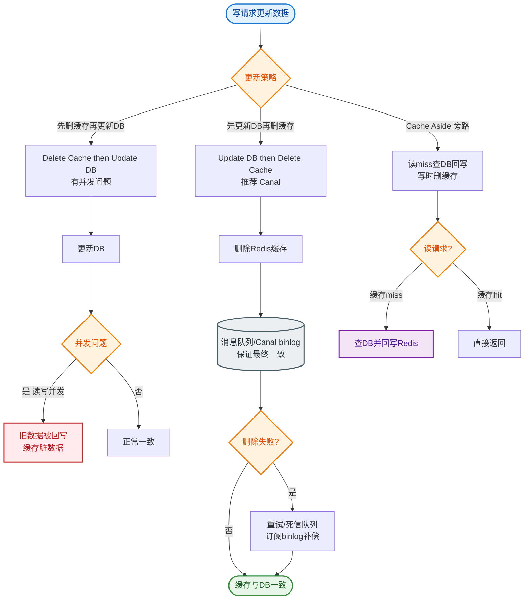

# 如何设计热点数据的缓存方案？比如某明星出轨新闻瞬间访问量暴增。

【场景分析】
热点数据特点：突发性、局部性（单Key）、极高并发（单Key QPS > 10万）。

【热点探测机制】
1. **客户端上报**：
   - 每个 JVM 实例统计本地 Top N Key。
   - 定时聚合上报到控制中心。
2. **服务端拦截**：
   - 网关层或中间件层统计滑动窗口内的 QPS。
3. **Redis 特性**：
   - 使用 `LFU` 策略或 Redis 4.0+ 的 `hotkeys` 命令（慎用，阻塞线程）。

【热点缓存架构方案】

```text
                   ┌──────────────┐
                   │  User Request│
                   └──────┬───────┘
                          │
                ┌─────────▼──────────┐
                │  Gateway / Proxy   │
                │ (Rate Limit Check) │
                └─────────┬──────────┘
                          │
           ┌──────────────┼──────────────┐
           │              │              │
           ▼              ▼              ▼
    ┌─────────────┐ ┌───────────┐ ┌───────────┐
    │Local Cache  │ │ Redis     │ │ Redis     │
    │(Caffeine)   │ │ Replica 1 │ │ Replica N │
    │ (Anti-Shake)│ │ (Shard A) │ │ (Shard Z) │
    └─────────────┘ └───────────┘ └───────────┘
           ▲              ▲              ▲
           │              │              │
           └──────────────┴──────────────┘
                 Write Bus (MQ)
```

【具体实施策略】
1. **本地缓存兜底**：
   - 检测到热点后，主动推送数据到所有应用节点的 Caffeine。
   - **作用**：拦截 99% 的请求，不经过网络。
   - **一致性**：设置极短的 TTL（如 1s）或通过 MQ 广播更新。
2. **Redis 分片副本**：
   - **问题**：单 Key 只能在一个 Redis 节点，单机网络带宽/卡顿成为瓶颈。
   - **方案**：在 Redis 上增加 N 个副本 Key，如 `hotkey:1`, `hotkey:2` ... `hotkey:10`。
   - **读**：客户端随机选取一个副本读取。
   - **写**：通过 Lua 脚本或 Pipeline 批量写入所有副本。
3. **CDN 动态加速**：
   - 将热点数据静态化（生成 HTML/JSON），推送到 CDN 边缘节点。
   - 适合读多写少的新闻类场景。
4. **限流与降级**：
   - 即使做了以上优化，也要限制最大 QPS，超过阈值直接返回“系统繁忙”或默认值。

【优化细节】
- **消息队列削峰**：写请求（如点赞、评论）先入 MQ，异步落库，防止 DB 打挂。
- **隔离**：热点服务独立部署，避免拖垮非热点业务。

## 常见考点
1. **如何更新 Redis 中的多个副本 Key？**
   - 使用 `EVAL` (Lua脚本) 原子性执行 `SET key1 val, SET key2 val...`，保证副本间强一致。
2. **本地缓存和 Redis 副本如何配合？**
   - L1（本地）作为第一道防线；L1 Miss 时访问 L2（Redis 副本）。本地缓存通常容量小，只存绝对热点。
3. **如何避免热点 Key 突然消失导致的缓存击穿？**
   - 永不过期 + 异步刷新，或者构建本地缓存作为二级保险。


## 核心流程图


## 记忆要点

- 热点探测三招：客户端聚合上报、网关滑动窗口拦截、Redis LFU策略统计
- 单点瓶颈破局：因为单Key集中压垮Redis，故打散为多副本Key（hotkey:1~N）随机读
- 极致扛量：本地缓存（Caffeine）兜底拦截99%请求，彻底切断网络开销
- 数据更新一致性：因多副本需同步，故用Lua脚本或Pipeline保证原子批量写入
- 防击穿与降级：热点Key永不过期并异步刷新，超载则MQ削峰或直接限流降级

## 结构化回答


**30 秒电梯演讲：** 像明星过安检，人多就多开几个通道，或者先把照片发到广场大屏幕让大家看，别都挤在门口。

**展开框架：**
1. **热点探测依赖Fl** — 热点探测依赖Flink或客户端统计
2. **核心策略是Red** — 核心策略是Redis多副本（本地加后缀）+ 本地缓存
3. **能推CDN的静态** — 能推CDN的静态内容尽量推CDN

**收尾：** 如何实时检测热点Key？


## 视频脚本

> 预计时长：2 分钟 | 由浅入深

| 时间 | 画面/字幕 | 口播台词 | 讲解要点 |
|------|----------|----------|----------|
| 0:00 | 标题卡：热点数据的缓存方案 | "热点数据的缓存方案，一分钟讲透。" | 开场钩子 |
| 0:35 | 生活类比动画 | "打个比方——像明星过安检，人多就多开几个通道，或者先把照片发到广场大屏幕让大家看，别都挤在门口。" | 核心类比 |
| 1:10 | 概念定义动画 | "一句话：通过探测和加副本机制，将极高频的单点访问分散到多个存储节点。" | 核心定义 |
| 1:50 | 热点探测依赖 图解 | "热点探测依赖Flink或客户端统计。" | 热点探测依赖 |
