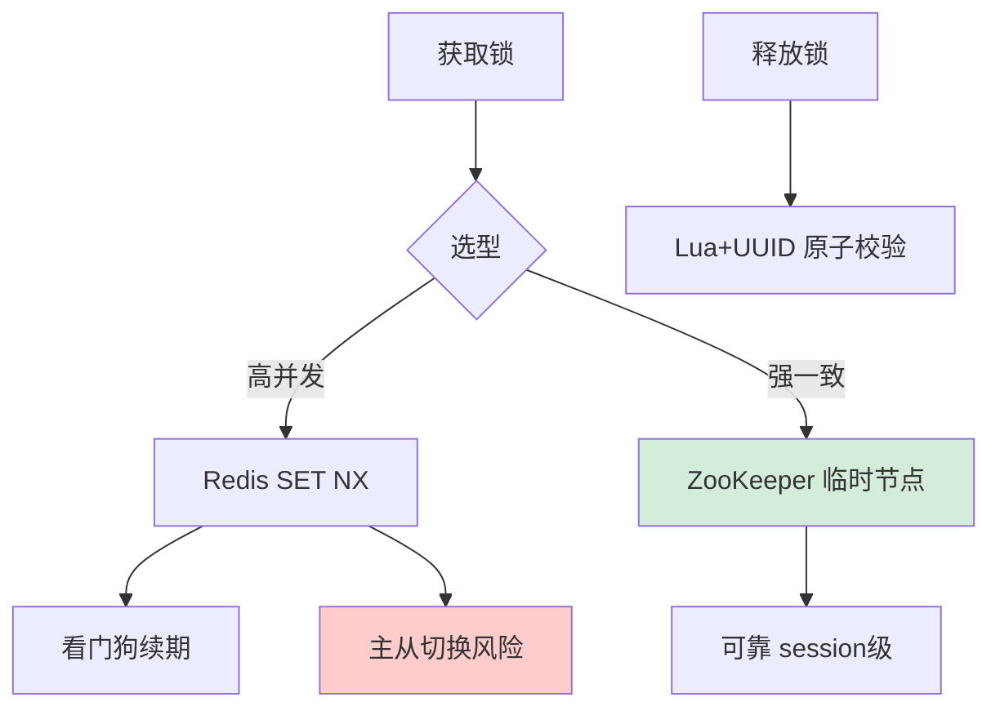
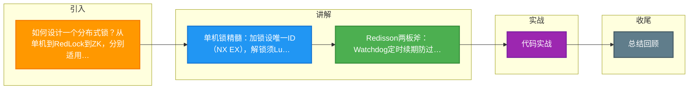

# 如何设计一个分布式锁？从单机到RedLock到ZK，分别适用什么场景？

【场景分析】
分布式锁核心需求：互斥性、可重入、防死锁、高可用、公平性（可选）。

【方案对比】

【1. Redis单节点分布式锁】
- 加锁：`SET lock_key {requestId} NX EX 30`
- 解锁：Lua脚本验证requestId后DEL（防止误删别人的锁）
- 续期：Watchdog定时续期（Redisson实现）
优点：性能极高（10万+TPS）
缺点：单点故障、主从切换可能丢锁

【2. RedLock算法（Redis官方推荐）】
- 5个独立Redis实例（非集群）
- 向5个实例同时申请锁
- 超过半数（3个）成功 → 加锁成功
- 加锁时间 < 锁过期时间 → 有效
优点：降低单点风险
缺点：时钟漂移问题、实现复杂、争议较大（Martin Kleppmann批评）

【3. ZooKeeper分布式锁】
- 创建临时顺序节点 /lock/node-0001
- 判断自己是否最小节点 → 是则获得锁
- 否则监听前一个节点的删除事件
- 会话断开自动删除临时节点（防死锁）
优点：强一致（CP）、可靠性高
缺点：性能不如Redis（1-3万TPS）、部署复杂

【4. etcd分布式锁】
- 基于Raft协议，类似ZK
- Lease机制防死锁
- 适合K8s生态

【5. MySQL分布式锁】
- 利用唯一索引/SELECT FOR UPDATE
- 优点：简单、无额外组件
- 缺点：性能差、不适合高并发

【Redisson实现要点】
- 可重入锁：Hash结构记录重入次数
- Watchdog：默认30秒过期，每10秒续期
- 公平锁：基于ZK或Redis队列
- 联锁：MultiLock（多个RLock组合）

【选型建议】
高并发低延迟：Redis（Redisson）
强一致高可靠：ZooKeeper
已有DB无额外组件：MySQL
K8s生态：etcd

## 核心流程图

## 记忆要点

- 单机锁精髓：加锁设唯一ID（NX EX），解锁须Lua脚本校验防误删
- Redisson两板斧：Watchdog定时续期防过期，Hash结构记录重入次数
- RedLock核心：向5个独立实例申请，超半数（3个）成功且耗时小于锁 TTL 方有效
- ZK强一致原理：靠创建临时顺序节点，监听前节点事件，会话断开自动释放防死锁
- 选型对比：高并发求性能用Redis，强一致求可靠用ZK/etcd

## 结构化回答

**30 秒电梯演讲：** 在分布式环境中，通过共享存储状态协调多进程对共享资源的互斥访问。打比方——像公厕的唯一的钥匙，谁拿到了钥匙(锁)谁就能进，其他人只能在门口等。落到工程上，Redis锁性能好但有主从切换丢数据风险，适合并发极高场景。

**展开框架：**
1. **Redis锁性** — Redis锁性能好但有主从切换丢数据风险，适合并发极高场景
2. **ZK锁强一致** — ZK锁强一致可靠，适合金融级一致性要求
3. **解锁务必用Lua脚本** — 解锁务必用Lua脚本保证原子性

**收尾：** 这几个点都能配合实战展开。您想继续聊哪个追问——比如 「RedLock算法有什么争议」 或者 「如何实现可重入的分布式锁」？

## 视频脚本

> 预计时长：2 分钟 | 由浅入深

| 时间 | 画面/字幕 | 口播台词 | 讲解要点 |
|------|----------|----------|----------|
| 0:00 | 标题卡：分布式锁 | "分布式锁，一分钟讲透。" | 开场钩子 |
| 0:35 | 生活类比动画 | "打个比方——像公厕的唯一的钥匙，谁拿到了钥匙(锁)谁就能进，其他人只能在门口等。" | 核心类比 |
| 1:10 | 概念定义动画 | "一句话：在分布式环境中，通过共享存储状态协调多进程对共享资源的互斥访问。" | 核心定义 |
| 1:50 | Redis锁性 图解 | "Redis锁性能好但有主从切换丢数据风险，适合并发极高场景。" | Redis锁性 |

### 视频流程图

