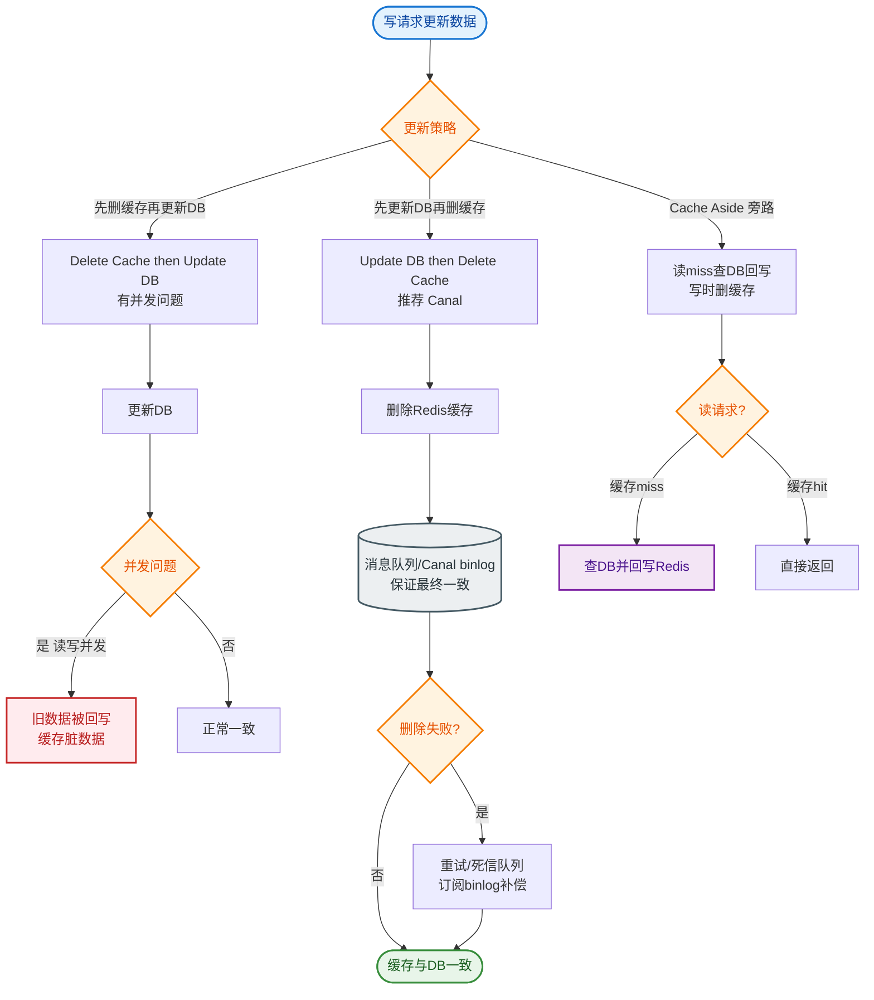

# 如何保证缓存与数据库的数据一致性？最终一致和强一致分别怎么做？

【场景分析】
缓存一致性问题根源：缓存和DB是两个系统，无法做原子操作，必然存在时间窗口的不一致。

【一致性模型】
1. 强一致性：读到的数据一定是最新的（代价大，一般不追求）
2. 最终一致性：短暂不一致，最终收敛（大多数场景适用）
3. 弱一致性：不保证最终一致（极少使用）

【Cache-Aside方案（最常用）】
读路径：查缓存 → 命中则返回 → 未命中查DB → 回填缓存
写路径有四种组合：

1. 先更新DB，再更新缓存（不推荐）
   - 并发问题：A先更新DB但后更新缓存，B后更新DB但先更新缓存 → 缓存是旧值
2. 先删缓存，再更新DB（不推荐）
   - 并发问题：删缓存后、更新DB前，读请求查DB旧值并回填
3. 先更新DB，再删缓存（推荐 Cache-Aside）
   - 并发问题概率极低（需要读在写之后且读比写慢）
   - 适用绝大多数场景
4. 延迟双删（推荐加强版）
   - 先删缓存 → 更新DB → 延迟500ms → 再删缓存
   - 解决更新DB期间读请求回填旧数据的问题

【最终一致性保障机制】
1. 消息队列重试：
   - 更新DB后发MQ消息 → 消费者删除缓存
   - MQ保证消息可靠投递
   - 消费失败自动重试
2. Binlog监听：
   - Canal监听MySQL binlog变更
   - 自动解析变更 → 删除/更新Redis
   - 解耦、可靠、对应用无侵入
3. 订阅过期：
   - Redis key设TTL，过期后自动失效
   - 兜底方案，不能作为主要手段

【强一致性方案（代价大）】
- 分布式事务（2PC/3PC）：写DB和写缓存在同一事务中
- 串行化：所有读写操作加分布式锁（牺牲并发）
- Redis在事务提交后同步写入并等待确认
- 一般不推荐，性能太差

【实战案例】
**库存超卖坑**：在电商大促中，曾因先删缓存再更新DB，导致高并发读请求将旧库存（有货）回填Redis，后续下单扣减DB成功但缓存仍是旧值，造成前台显示有货实际无法下单。后改用“先更DB再删缓存 + Binlog异步兜底”解决。

【代码示例（Java）】
```java
// 延迟双删伪代码
public void updateData(Data data) {
    // 1. 先删缓存
    redis.delKey(data.getId());
    
    // 2. 更新数据库
    db.update(data);
    
    // 3. 延迟双删（异步线程执行，避免阻塞主流程）
    CompletableFuture.runAsync(() -> {
        try { Thread.sleep(500); } catch (Exception e) {}
        redis.delKey(data.getId()); // 再次删除，防止更新期间的脏读回填
    });
}
```

【方案对比】
| 方案 | 一致性保证 | 复杂度 | 性能影响 | 适用场景 |
| :--- | :--- | :--- | :--- | :--- |
| 先更DB，后删缓存 | 最终一致 | 低 | 极低 | 绝大多数业务（推荐） |
| 延迟双删 | 最终一致（更强） | 中 | 低（需异步） | 对一致性要求较高的场景 |
| 先删缓存，后更DB | 弱一致 | 低 | 低 | 不推荐，并发高易脏读 |
| 写数据库，更新缓存 | 弱一致 | 低 | 低 | 数据极少变更，如配置信息 |
| Canal监听Binlog | 最终一致 | 高 | 低（异步） | 解决异构系统数据同步，解耦 |

【实践建议】
- 99%场景用最终一致性
- 延迟双删 + Canal binlog监听 = 双保险
- 关键数据（余额）不用缓存或用强一致方案


## 核心流程图


## 记忆要点

- 核心准则：因为并发引发脏读脏写，故坚决“先更DB后删缓存”摒弃“更新缓存”
- 延迟双删：先删缓存 -> 更新DB -> 延迟500ms再删，专治并发旧数据回填
- 最终一致双保险：MQ重试机制或Canal监听Binlog，异步保证缓存必被删除
- 强一致代价极高：需引入2PC分布式事务或读写加锁串行化，极度牺牲性能
- 实战避坑：高并发大促切勿先删缓存再更DB，极易引发库存超卖

## 结构化回答

**30 秒电梯演讲：** 在数据库和缓存无法原子更新的约束下，通过特定顺序和异步机制保证数据最终收敛。打比方——改户口本(DB)和家门口的告示牌(缓存)，改完户口本记得把告示牌擦了重写，别让邻居看错。落到工程上，标准策略是先更新DB，再删除缓存(Cache-Aside)。

**展开框架：**
1. **标准策略** — 标准策略是先更新DB，再删除缓存(Cache-Aside)
2. **无法强一致时追求最终** — 无法强一致时追求最终一致性，接受短暂延迟
3. **延迟双删** — 延迟双删解决极端并发下的脏读问题

**收尾：** 这几个点都能配合实战展开。您想继续聊哪个追问——比如 「Canal如何保证binlog不丢」 或者 「延迟双删的延迟时间如何确定」？

## 视频脚本

> 预计时长：2 分钟 | 由浅入深

| 时间 | 画面/字幕 | 口播台词 | 讲解要点 |
|------|----------|----------|----------|
| 0:00 | 标题卡：保证缓存与数据库的数据一致性 | "保证缓存与数据库的数据一致性，一分钟讲透。" | 开场钩子 |
| 0:35 | 生活类比动画 | "打个比方——改户口本(DB)和家门口的告示牌(缓存)，改完户口本记得把告示牌擦了重写，别让邻居看错。" | 核心类比 |
| 1:10 | 概念定义动画 | "一句话：在数据库和缓存无法原子更新的约束下，通过特定顺序和异步机制保证数据最终收敛。" | 核心定义 |
| 1:50 | 标准策略 图解 | "标准策略是先更新DB，再删除缓存(Cache-Aside)。" | 标准策略 |
