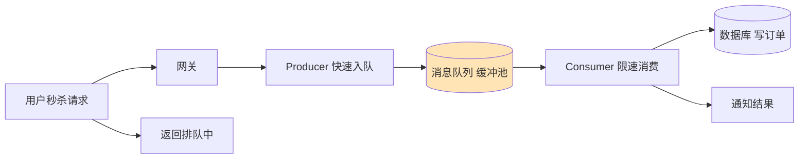
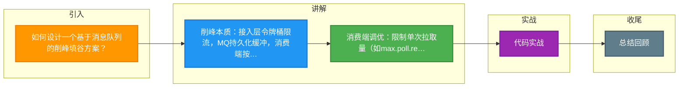

# 如何设计一个基于消息队列的削峰填谷方案？

【场景分析】
削峰填谷核心思想：用MQ作为缓冲，将瞬时高并发请求平滑化，保护后端系统。

【典型场景】
双11下单：前端10万QPS → 后端只能处理1万QPS → MQ缓冲 → 后端按1万QPS消费

【架构设计】
1. 接入层（10万QPS）：
   - Nginx + API网关限流（令牌桶）
   - 超过阈值的请求返回"排队中"
2. 消息队列层（缓冲）：
   - Kafka/RocketMQ承接所有合法请求
   - 消息持久化，不怕积压
   - 生产者只需把消息投递成功即可返回用户
3. 消费层（1万QPS）：
   - 按后端处理能力控制消费速率
   - 消费者集群水平扩展
   - 每个消费者控制prefetch数量

【实战案例】
**秒杀系统透传**：曾遇到用户请求全部进入MQ，但消费者处理过慢，导致用户看到“排队中”后收到成功通知时，活动已结束。优化方案：在MQ回传给前端的消息体中携带“预估等待时间”和“排队号”，前端动态展示进度，极大降低用户焦虑和投诉率。

【代码示例（RocketMQ Java Producer）】
```java
// 生产者：同步发送确保请求入队，快速返回Token
Message msg = new Message("OrderTopic", "OrderTag", orderId.toString(), orderBody);
// 设置超时时间，避免阻塞太久
SendResult sendResult = producer.send(msg, 3000); 
if (sendResult.getSendStatus() == SendStatus.SEND_OK) {
    return "排队成功，请等待结果";
} else {
    return "系统繁忙，请稍后重试";
}
```

【核心参数调优】
1. Kafka消费端：
   - `max.poll.records=500`：单次拉取最大消息数
   - `max.poll.interval.ms=300000`：处理超时时间
   - 消费者数量 ≤ 分区数
2. RocketMQ消费端：
   - `consumeThreadMin/Max`：控制消费线程数
   - `pullBatchSize`：单次拉取消息数

【消息积压处理】
1. 预防：
   - 监控积压量，超过阈值告警
   - 消费者自动扩容（K8s HPA）
2. 应急：
   - 增加消费者实例
   - 临时增加分区数
   - 消息转发：将积压消息转发到新Topic用更多消费者处理
3. 降级：
   - 非核心消息丢弃
   - 降低消息处理精度

【方案对比】
| 组件 | 吞吐量 | 延迟 | 适用场景 | 削峰特性 |
| :--- | :--- | :--- | :--- | :--- |
| **Kafka** | 极高 (百万级) | ms级 | 日志、大数据流 | 分区多，水平扩展能力强，适合海量积压 |
| **RocketMQ** | 高 (十万级) | ms级 | 订单、交易 | 支持延迟消息、事务消息，业务逻辑丰富 |
| **RabbitMQ** | 中 (万级) | μs级 | 耗时任务、即时通信 | 延迟极低但吞吐有限，不适合突发海量流量 |

【保证消息可靠】
- 生产端：ack=all + 重试
- Broker：多副本 + 持久化
- 消费端：手动提交offset + 幂等

【注意事项】
- 削峰有代价：用户看到的是"排队中"而非即时结果
- 需要前端配合展示排队状态
- 积压时间过长影响用户体验


## 核心流程图




## 记忆要点

- 削峰本质：接入层令牌桶限流，MQ持久化缓冲，消费端按最大处理能力平滑拉取
- 消费端调优：限制单次拉取量（如max.poll.records），控制消费者并发数≤分区数
- 积压应急三板斧：紧急扩容消费者、临时增Partition、老消息转发至新Topic分发处理
- MQ选型：Kafka适合海量日志，RocketMQ适合业务订单（事务/延时），RabbitMQ适合低延微服务
- 体验设计：因异步削峰无即时结果，故前端需配合反馈排队Token与预估等待时间

## 结构化回答


**30 秒电梯演讲：** 像水库蓄洪，洪水来时先存进库里，再按可控速度慢慢放水灌溉。

**展开框架：**
1. **生产端快速写入** — 生产端快速写入，不阻塞用户
2. **消费端限速处理** — 消费端限速处理，保护后端
3. **监控积压** — 监控积压，动态扩容消费

**收尾：** 如何监控消息积压？


## 视频脚本

> 预计时长：2 分钟 | 由浅入深

| 时间 | 画面/字幕 | 口播台词 | 讲解要点 |
|------|----------|----------|----------|
| 0:00 | 标题卡：基于消息队列的削峰填谷方案 | "基于消息队列的削峰填谷方案，一分钟讲透。" | 开场钩子 |
| 0:35 | 生活类比动画 | "打个比方——像水库蓄洪，洪水来时先存进库里，再按可控速度慢慢放水灌溉。" | 核心类比 |
| 1:10 | 概念定义动画 | "一句话：用消息队列做缓冲池，平滑瞬时高并发流量。" | 核心定义 |
| 1:50 | 生产端快速写入 图解 | "生产端快速写入，不阻塞用户。" | 生产端快速写入 |

### 视频流程图



