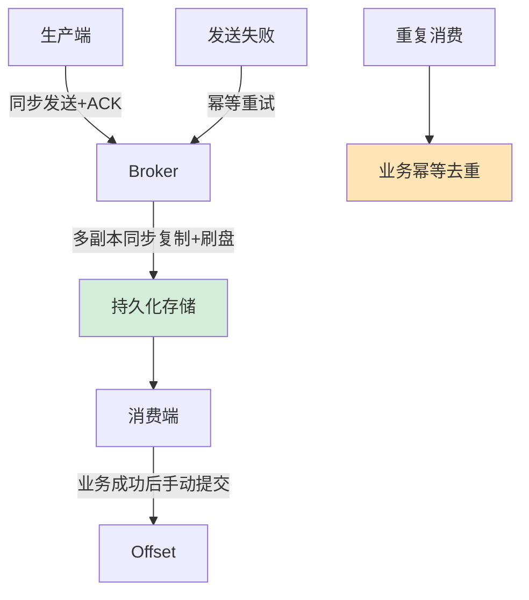

# 如何保证消息队列的消息不丢失？从生产到消费全链路分析。

【场景分析】
顺序消费场景：订单状态变更（创建→支付→发货→完成）、数据库binlog同步、金融流水。

【两种顺序】
1. 全局顺序：整个Topic所有消息严格有序（性能极差，极少使用）
2. 分区顺序：同一Key的消息有序（实际使用）

【实战案例】
**状态机回溯Bug**：曾有一个订单系统，MQ消费者多线程处理导致“支付成功”消息先于“创建订单”被消费，导致状态校验失败直接丢弃，订单卡在“创建中”无法完成支付。修复：将同一个orderId的消息通过Hash算法强制发往同一队列，且该队列只能被单线程消费。

【代码示例（RocketMQ 顺序消息）】
```javan// 生产者：根据订单ID选择队列
SendResult sendResult = producer.send(msg, new MessageQueueSelector() {
    @Override
    public MessageQueue select(List<MessageQueue> mqs, Message msg, Object arg) {
        Long orderId = (Long) arg; 
        int index = (int) (orderId % mqs.size());
        return mqs.get(index); // 保证同一ID进入同一队列
    }
}, orderId);

// 消费者：注册顺序监听器
consumer.registerMessageListener(new MessageListenerOrderly() {
    @Override
    public ConsumeOrderlyStatus consumeMessage(List<MessageExt> msgs, ConsumeOrderlyContext context) {
        // 处理逻辑，失败返回SUSPEND_CURRENT_QUEUE_A_MOMENT挂起，不丢序
        return ConsumeOrderlyStatus.SUCCESS;
    }
});
```

【Kafka实现分区有序】
1. 生产端：
   - 指定partition Key：相同Key的消息到同一分区
   - 如 orderId 作为Key → 同一订单的消息有序
2. Broker：
   - 单分区内消息天然有序（追加写入）
3. 消费端：
   - 每个分区只有一个消费者（保证有序）
   - 单线程消费或顺序处理

【RocketMQ实现顺序消息】
1. 生产端：
   - `MessageQueueSelector`选择队列
   - 按业务Key（如orderId）hash选队列
2. 消费端：
   - `MessageListenerOrderly`（顺序消费）
   - 同一队列单线程消费
   - 消费失败会挂起（不会跳过）

【方案对比】
| 维度 | 全局有序 | 分区有序（推荐） |
| :--- | :--- | :--- |
| **实现方式** | Topic仅1个分区 + 1个消费者 | 多个分区，相同Key路由至同一分区 |
| **吞吐量** | 极低（单线程） | 较高（并行度=分区数） |
| **扩展性** | 无法扩展 | 可通过增加分区/消费者扩展 |
| **适用场景** | 极简配置、低频系统 | 订单流、支付流等复杂业务 |

【顺序消费的代价】
1. 性能下降：
   - 并行度降低（同一Key只能单线程消费）
   - 吞吐量下降50%以上
2. 阻塞问题：
   - 一条消息消费慢，后续消息全部等待
   - 消息积压风险
3. 扩展受限：
   - 分区数 = 最大并发度
   - 增加分区无法提升已有Key的处理速度

【实践建议】
- 尽量避免顺序消费，用幂等 + 时间戳替代
- 确实需要：按业务粒度分Key，Key分散则并行度可控
- 超时处理：消费超过阈值跳过（可能丢序）
- 批量消费：取一批同Key消息批量处理

【替代方案】
- 状态机：消费者维护状态机，乱序消息通过状态判断是否处理
- 版本号：消息带版本号，消费时检查版本连续性


## 核心流程图




## 记忆要点

- 顺序消费前提：摒弃全局有序（极差），只用分区有序（同业务Key进同队列）
- 生产路由：按业务主键（如Order ID）Hash定向发送至指定Partition/Queue
- 消费单线程：对应队列只能由单线程拉取，且失败需挂起重试不能跳过（防乱序）
- 性能代价：因降低并行度，故吞吐量骤降且极易引发消息阻塞积压
- 替代方案：尽量不用强顺序，改为消费端状态机校验+版本号+时间戳容忍乱序

## 结构化回答

**30 秒电梯演讲：** 确保消息在发送、存储、消费三个环节全链路落地。打比方——寄重要挂号信：发件要回执(ACK)，运输要保价(副本)，收件要签字(手动提交)。落到工程上，同步发送 + ACK确认 + 幂等重试。

**展开框架：**
1. **发** — 同步发送 + ACK确认 + 幂等重试
2. **存** — 多副本同步复制 + 持久化
3. **收** — 业务成功后再手动提交Offset

**收尾：** 这几个点都能配合实战展开。您想继续聊哪个追问——比如 「Kafka的ISR机制是什么」 或者 「幂等消费如何实现」？

## 视频脚本

> 预计时长：2 分钟 | 由浅入深

| 时间 | 画面/字幕 | 口播台词 | 讲解要点 |
|------|----------|----------|----------|
| 0:00 | 标题卡：保证消息队列的消息不丢失 | "保证消息队列的消息不丢失，一分钟讲透。" | 开场钩子 |
| 0:35 | 生活类比动画 | "打个比方——寄重要挂号信：发件要回执(ACK)，运输要保价(副本)，收件要签字(手动提交)。" | 核心类比 |
| 1:10 | 概念定义动画 | "一句话：确保消息在发送、存储、消费三个环节全链路落地。" | 核心定义 |
| 1:50 | 发 图解 | "同步发送 + ACK确认 + 幂等重试。" | 发 |
