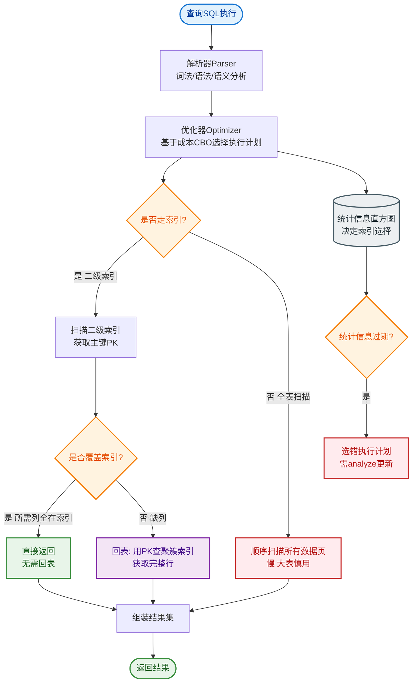

# 如何设计一个全文搜索引擎？支持亿级文档的实时搜索。

【场景分析】
全文搜索需求：关键词搜索、模糊匹配、高亮、排序、聚合统计、毫秒级响应。

【为什么不用MySQL LIKE？】
- LIKE '%keyword%' 无法走索引（全表扫描），数据量达到亿级时响应时间不可接受
- 不支持中文分词（无法将“中国人”拆分为“中国”、“人”进行索引）
- 不支持相关度排序（TF-IDF/BM25）
- 无高亮、纠错、同义词等高级功能

【Elasticsearch核心原理】
1. **倒排索引**：
   - 正向：文档ID → 词
   - 倒排：词 → [Posting List(文档ID, 词频, 位置)]
   - 搜索时直接查倒排表，利用FST（Finite State Transducer）和Bitset Roaring Bitmaps加速，接近O(1)复杂度
2. **分词器**：
   - 字符过滤器：HTML清洗
   - 分词器：中文（IK/jieba）、英文
   - Token过滤器：同义词、停用词、小写化、拼音

【倒排索引结构示意图】
```
文档                   倒排索引
┌───────────┐              ┌───────────────────────┐
│ Doc 1     │              │ Term (词)  │ Posting List │
│ content:  │ ─分词──→    ├───────────────────────┤
│ "Google Map" │            │ google     │ [1, 3]        │
└───────────┘              │ map        │ [1]           │
                           │ elasticsearch│ [2]        │
┌───────────┐              │ engine     │ [2, 3]        │
│ Doc 2     │              └───────────────────────┘
│ content:  │
│ "Elasticsearch Engine"│
└───────────┘
```

【实战案例】
**深分页内存溢出**：曾在ES中查询第100万页数据（from=1000000, size=10），导致集群OOM崩溃。原因：ES需从每个分片取出1000010条数据在内存协调排序。优化：改为使用`search_after`游标查询，基于上一条的排序值向后拉取，性能恒定且无内存压力。

【代码示例（Java High Level REST Client）】
```javan// 避免深分页：使用 search_after 进行游标查询
SearchRequest request = new SearchRequest("products");
SearchSourceBuilder sourceBuilder = new SearchSourceBuilder();
sourceBuilder.query(QueryBuilders.matchQuery("name", "手机"));
sourceBuilder.size(10);
sourceBuilder.sort("price", SortOrder.ASC); // 必须指定唯一排序字段
// 第一次查询不指定 search_after
// 后续查询带上上一次返回的 sortValues
sourceBuilder.searchAfter(new Object[]{lastPriceValue, lastIdValue});
request.source(sourceBuilder);
```

【ES集群架构】
- Index（索引）= 多个Shard（分片）
- Shard = 主分片（Primary）+ 副本分片（Replica）
- 每个Shard是一个完整的Lucene实例（本质是一个文件夹，包含Segment文件）
- Segment：不可变的数据文件，利用OS Cache加速读取；后台Merge机制合并小段
- 节点角色：Master（元数据管理）、Data（数据存储）、Coordinating（路由分发）、Ingest（预处理）

【亿级数据方案】
1. **索引生命周期管理（ILM）**：
   - 按时间滚动索引：logs-2024-01, logs-2024-02
   - Hot阶段：高频读写，SSD存储
   - Warm阶段：只读，降频
   - Cold阶段：冻结，降低开销
2. **分片策略**：
   - 单分片建议<50GB（过大影响Recovery和Merge）
   - 分片数 = 数据总量 / 单分片大小（避免Over-sharding，分片过多消耗内存和Socket）
   - 副本数≥1（高可用，且可增加读吞吐量）
3. **写入优化**：
   - 批量写入（Bulk API），单批5-15MB
   - 调大刷新间隔：`refresh_interval=30s`（默认1s，频繁刷新产生小Segment）
   - 暂时副本数设0，写完再恢复（减少写入时的双倍开销）
   - 关闭交换内存：`bootstrap.memory_lock: true`
4. **查询优化**：
   - Filter替代Query：Filter上下文利用BitSet缓存，无评分计算
   - 避免深度分页：用`search_after`（基于上一条排序值）或`scroll`（快照）替代深分页（`from+size`内存消耗指数级增长）
   - 路由查询：指定`routing`参数，确保同一类数据在同一分片，减少分片扫描数

【分页方案对比】
| 方式 | 原理 | 性能 | 限制 | 适用场景 |
| :--- | :--- | :--- | :--- | :--- |
| **from + size** | 内存跳过前N条 | 极差（指数级下降） | 默认上限10000 | 深度搜索、后台导出 |
| **scroll** | 维护上下文快照 | 好（初始查询） | 无法实时反映新数据 | 数据全量导出、Reindex |
| **search_after** | 基于上一页排序值查询 | 优秀（恒定） | 不支持随机跳页 | 无限下拉、移动端Feed流 |

【数据同步架构】
```
MySQL (Binlog)      Canal Server      Kafka           Consumer (ES)
┌───────────┐       ┌───────────┐      ┌───────┐      ┌───────────┐
│  Data     │──Binlog→│  Parse    │──Msg─→│ Buffer│──Pull─→│ Bulk Write│
└───────────┘       └───────────┘      └───────┘      └───────────┘
```


## 核心流程图


## 记忆要点

- 弃用MySQL原因：模糊查无法走索引，且不支持分词与相关度（BM25）排序
- 核心机制倒排表：分词映射至文档ID列表，靠FST字典树与Roaring Bitmap实现O(1)查找
- 深分页禁区：因from+size会拉取海量数据到内存排序引发OOM，故禁用，改用search_after游标
- 亿级架构：按时间滚动建索引（ILM），单分片限50GB，批量写入并调大refresh_interval
- 查询优化：用Filter上下文替代Query（走缓存免算分），结合routing指定精准分片查询

## 结构化回答


**30 秒电梯演讲：** 像书籍末尾的关键词索引页，想找“苹果”直接翻到对应的页码，而不用翻遍整本书。

**展开框架：**
1. **倒排索引** — 词到文档ID的映射
2. **分片策略** — 数据量控制分片大小
3. **写入优化** — 批量写入+异步刷新

**收尾：** ES的倒排索引结构是什么？


## 视频脚本

> 预计时长：3 分钟 | 由浅入深

| 时间 | 画面/字幕 | 口播台词 | 讲解要点 |
|------|----------|----------|----------|
| 0:00 | 标题卡：全文搜索引擎 | "全文搜索引擎，这题我会分三步讲。" | 开场钩子 |
| 0:41 | 概念定义动画 | "一句话：利用倒排索引将内容检索转换为ID查找，实现毫秒级响应。" | 核心定义 |
| 1:22 | 生活类比动画 | "打个比方——像书籍末尾的关键词索引页，想找“苹果”直接翻到对应的页码，而不用翻遍整本书。" | 核心类比 |
| 2:03 | 倒排索引 图解 | "词到文档ID的映射。" | 倒排索引 |
| 2:50 | 分片策略 图解 | "数据量控制分片大小。" | 分片策略 |
