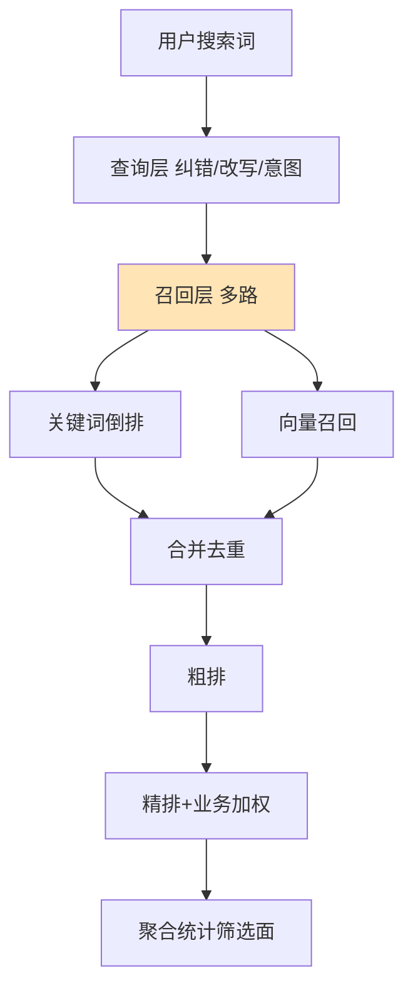

# 如何设计一个商品搜索系统？支持多维度筛选、排序和聚合。

【场景分析】
电商搜索需求：关键词搜索 + 类目筛选 + 价格区间 + 品牌筛选 + 多种排序 + 销量聚合 + 自动补全。

【搜索架构】
1. **查询理解层**：
   - 意图识别：NLP分类判断“买手机”（商品搜索）还是“怎么退款”（客服）
   - Query改写：同义词扩展（“iphone”→“苹果, iphone”）、纠错（“iphon”→“iphone”）
   - 类目预测：预测“手机”属于“数码/手机”类目，减少后续检索范围
2. **召回层**：
   - 倒排召回：ES全文检索（Match/Term Query）
   - 向量召回：将商品和Query转化为向量，计算语义相似度（解决“苹果手机”和“水果苹果”的歧义）
3. **排序层**：
   - 粗排：ES自带的TF-IDF/BM25相关度排序
   - 精排：机器学习模型（XGBoost/LightGBM/DNN）预估CTR/CVR，融合分 = `w1 * 相关分 + w2 * 质量分 + w3 * 人工干预`
4. **展示层**：
   - 分面统计：聚合品牌、价格区间、属性（筛选器）
   - 高亮：`<em>`标签包裹关键词
   - 个性化：根据用户历史行为调整排序

【ES查询DSL示例】
```
{
  "query": {
    "bool": {
      "must": [{ "match": { "title": "手机" }}],
      "filter": [
        { "term": { "category_id": "123" }}, 
        { "terms": { "brand": ["apple", "huawei"] }},
        { "range": { "price": { "gte": 5000, "lte": 10000 }}},
        { "term": { "status": 1 }} // 只查在售商品
      ]
    }
  },
  "sort": [
    { "sales": "desc" }, 
    { "_score": "desc" }
  ],
  "aggs": {
    "brands": { "terms": { "field": "brand.keyword", "size": 10 }},
    "price_ranges": { 
      "range": { "field": "price", "ranges": [
          { "to": 1000 }, { "from": 1000, "to": 5000 }, { "from": 5000 }
      ]}
    }
  }
}
```

【性能优化】
- **缓存策略**：
  - 热搜词缓存：Redis缓存高频Query的Top N结果（TTL短）
  - Filter Cache：ES自动缓存常用的Filter（如status=1）
  - Shards Request Cache：缓存分片级别的聚合结果
- **索引优化**：
  - Keyword类型用于精确匹配/聚合/排序，Text类型用于全文检索
  - 关闭`_source`或部分字段存储（减少IO）
  - 对Nest聚合对象使用`doc_values`（列式存储，利于排序聚合）
- **查询优化**：
  - 避免通配符前缀查询（`*key`），会导致全索引扫描
  - 使用`constant_score`包裹非评分查询，跳过评分计算

【搜索效果评估】
- **离线指标**：
  - 召回率：相关商品被检索到的比例
  - 精确率：检索结果中相关商品的比例
  - NDCG：考虑排序位置的评价指标
- **在线指标**：
  - CTR（点击率）、CVR（转化率）、GMV（成交总额）、人均搜索次数

## 常见考点
1. **倒排索引与正排索引**：ES排序为什么要用到正排索引（Doc Values，Fielddata）？区别是什么？
2. **分词器选择**：何时使用`keyword`，何时使用`text`？为什么聚合查询必须用`keyword`？
3. **查询上下文 vs 过滤上下文**：`must`和`filter`在评分和缓存上的区别是什么？
4. **Geo Search**：如何实现“附近的人”？（`geo_distance`，GeoHash原理）


## 核心流程图



## 核心知识点图


## 记忆要点

- 架构四层：查询理解（意图/改写）、召回（倒排+向量）、排序（粗排BM25+精排预估CTR/CVR）、展示
- DSL结构：must用于全文评分检索，filter用于精确过滤且自带缓存，aggs用于分面统计
- 性能优化：用keyword做聚合排序而非text，避免通配符前缀查询，用constant_score跳过打分
- 混合策略：ES解决基础召回，向量解决语义歧义（如苹果手机vs水果），Redis抗热点查询

## 结构化回答

**30 秒电梯演讲：** 结合倒排索引、结构化过滤和聚合统计，实现多维精准检索。打比方——像在电商平台筛选：先搜关键词，再勾选品牌和价格区间，最后按销量排序。落到工程上，纠错、改写、意图识别。

**展开框架：**
1. **查询层** — 纠错、改写、意图识别
2. **召回层** — 关键词+向量多路召回
3. **排序层** — 粗排+精排+业务加权

**收尾：** 这几个点都能配合实战展开。您想继续聊哪个追问——比如 「如何实现搜索的个性化推荐」 或者 「ES的BM25算法原理是什么」？

## 视频脚本

> 预计时长：3 分钟 | 由浅入深

| 时间 | 画面/字幕 | 口播台词 | 讲解要点 |
|------|----------|----------|----------|
| 0:00 | 标题卡：商品搜索系统 | "商品搜索系统，这题我会分三步讲。" | 开场钩子 |
| 0:41 | 概念定义动画 | "一句话：结合倒排索引、结构化过滤和聚合统计，实现多维精准检索。" | 核心定义 |
| 1:22 | 生活类比动画 | "打个比方——像在电商平台筛选：先搜关键词，再勾选品牌和价格区间，最后按销量排序。" | 核心类比 |
| 2:03 | 查询层 图解 | "纠错、改写、意图识别。" | 查询层 |
| 2:50 | 召回层 图解 | "关键词+向量多路召回。" | 召回层 |
