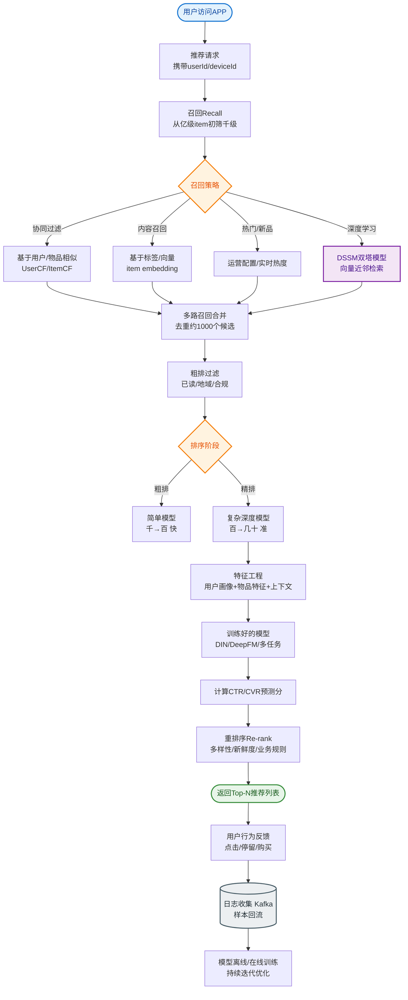

# 如何设计一个推荐系统？类似抖音/淘宝的个性化推荐。

【场景分析】
推荐系统目标：从百万/亿级物品池中选出用户最可能感兴趣的内容，提升CTR（点击率）、CVR（转化率）、GMV（成交额）和用户停留时长。

【推荐系统四层架构】
1. **召回层**：
   - 目标：从海量物品（百万/亿）中快速筛选出候选集（千级）
   - 策略：
     - 协同过滤（CF）：UserCF（找相似人），ItemCF（找相似物），Swing算法（高置信度）
     - 向量召回：双塔模型（DSSM），生成User Embedding和Item Embedding，利用Faiss/Milvus进行ANN（近似最近邻）检索
     - 内容召回：基于标签、关键词、类目匹配
     - 热门/趋势：全局热度、分行业热度
2. **粗排层**：
   - 目标：千级 → 百级，拦截明显不感兴趣的内容，减轻精排压力
   - 模型：轻量级模型（双塔、LR、FM），允许一定误差但速度要求极高（<5ms）
3. **精排层**：
   - 目标：百级 → 数十级，精确预测点击概率（pCTR）
   - 模型：复杂模型（DeepFM, DIN, DIEN, MMOE），引入深度学习特征交叉和用户历史行为序列
4. **重排层**：
   - 业务干预：去重（已买过、已曝光）、打散（同类产品不连续出现）、加权（广告、新品扶持）
   - 多样性：MMR算法，平衡准确性和多样性
   - 探索与利用：Bandit算法（Thompson Sampling），探索新物品的潜力

【推荐系统数据流图】
```
 用户请求 ──> 召回 ──> 粗排 ──> 精排 ──> 重排 ──> 展示
    │          │        │        │        │
    │          │        │        │        └──> 业务规则/去重
    │          │        │        └─────────> 预估 pCTR
    │          │        └──────────────────> 快速过滤
    │          └───────────────────────────> 倒排/向量检索
    │
    └──────────────────────────────────────> 特征工程
                                         (用户/物品/上下文)
```

【核心算法细节】
1. **矩阵分解（MF）**：
   - 原理：将User-Item矩阵分解为两个低维矩阵相乘（$P \times Q^T \approx R$）
   - 优化：ALS（交替最小二乘法），适合并行计算
2. **深度学习模型**：
   - **DeepFM**：结合FM（一阶/二阶特征交叉）和DNN（高阶特征交叉），能自动提取组合特征
   - **DIN（Deep Interest Network）**：引入Attention机制，根据当前候选Item动态关注用户历史行为中的相关部分
3. **向量检索**：
   - 索引结构：IVF（倒排文件）、HNSW（基于图的索引）
   - 相似度度量：余弦相似度、欧氏距离

【特征工程】
- **用户特征**：ID、年龄、性别、地域、购买力、历史N天点击/购买序列
- **物品特征**：ID、类目、品牌、价格、标签、发布时间、统计特征（历史CTR）
- **上下文特征**：时间（小时/星期）、网络（WiFi/4G）、位置
- **交叉特征**：用户历史点击类目与当前Item类目的匹配度

【工程架构】
- **离线层**：Hive/Spark清洗数据 → 特征存储 → 模型训练（TensorFlow/PyTorch） → 模型上线
- **在线层**：
  - 特征实时化：Flink消费Kafka行为日志，更新Redis特征
  - 模型推理：TF Serving / ONNX Runtime，利用Batching提升吞吐
- **近线层**：流式计算更新用户画像和物品热门榜单

【冷启动】
- 新用户：利用注册信息（年龄、性别）推荐热门，或引导用户选择偏好
- 新物品：利用Content-based召回，分发少量流量测试，积累初始数据

## 常见考点
1. **召回 vs 排序**：为什么需要粗排层？精排为什么不能直接处理海量数据？（算力瓶颈，O(N*M)复杂度）
2. **协同过滤的局限**：UserCF和ItemCF分别适用于什么场景？如何解决稀疏性和冷启动问题？
3. **评估指标**：AUC和GAUC的区别？AUC衡量排序能力，GAUC衡量用户维度的平均排序能力（更符合业务）。
4. **实时性**：如何实现实时推荐？（Flink实时计算用户短期兴趣画像，更新Embedding）


## 核心流程图


## 记忆要点

- 四层漏斗架构：召回（海量到千级）、粗排（千到百，轻量快）、精排（百到十，深模预估）、重排（打散去重）
- 核心模型：双塔做向量召回，DeepFM做特征交叉，DIN引入注意力机制捕捉用户历史序列兴趣
- 工程构建：离线Hive/Spark训练，近线Flink更新特征，在线TF-Serving推理
- 评估体系：离线看AUC/NDCG，在线看CTR/CVR；新用户用热门冷启，新物用内容召回

## 结构化回答


**30 秒电梯演讲：** 像选秀比赛：海选刷掉大部分人，晋级赛筛选，决赛精细评分，最后调节节目单。

**展开框架：**
1. **召回** — 多路策略（协同/向量/热门）
2. **排序** — 轻量粗排+深度精排
3. **重排** — 去重、打散、广告插播

**收尾：** 如何解决推荐系统的冷启动问题？


## 视频脚本

> 预计时长：3 分钟 | 由浅入深

| 时间 | 画面/字幕 | 口播台词 | 讲解要点 |
|------|----------|----------|----------|
| 0:00 | 标题卡：推荐系统 | "推荐系统，这题我会分三步讲。" | 开场钩子 |
| 0:41 | 概念定义动画 | "一句话：漏斗式筛选：海量召回→粗排→精排→重排，选出最优内容。" | 核心定义 |
| 1:22 | 生活类比动画 | "打个比方——像选秀比赛：海选刷掉大部分人，晋级赛筛选，决赛精细评分，最后调节节目单。" | 核心类比 |
| 2:03 | 召回 图解 | "多路策略(协同/向量/热门)。" | 召回 |
| 2:50 | 排序 图解 | "轻量粗排+深度精排。" | 排序 |
