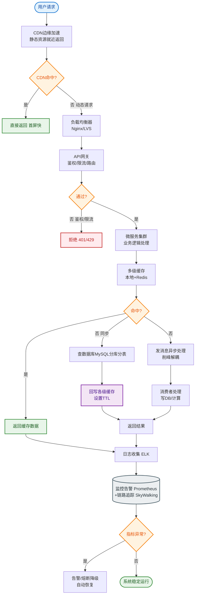

# 如何设计一个防重提交/幂等方案？适用于下单、支付等核心业务。

【场景分析】
重复提交场景：
- 前端：用户快速双击“提交”按钮
- 网络：客户端超时重试
- 后端：MQ消息重复投递
- 第三方：支付渠道重复回调

【幂等定义】
**Idempotency**：对于同一个请求，无论执行多少次，系统产生的副作用（状态改变）与执行一次完全相同。

【核心实现方案对比】
1. **数据库唯一索引**：
   - 原理：利用DB的强一致性约束，对`biz_no`（业务单号）建唯一索引
   - 场景：INSERT操作（如创建订单）
   - 优点：绝对可靠，基于DB锁
   - 缺点：依赖数据库，无法处理UPDATE
2. **Token机制（防重复提交）**：
   - 原理：
     1. 服务端生成Token (`UUID`) 存入Redis，并返回给前端
     2. 前端提交表单时携带Token
     3. 服务端删除Redis中的Token（Lua脚本保证原子性：get+del）
     4. 删除成功则处理业务，删除失败则拒绝
   - 场景：表单提交、按钮防抖
   - 关键：Token必须是一次性的（用完即毁）
3. **乐观锁（版本号/CAS）**：
   - 原理：`UPDATE account SET balance = balance - 100, version = version + 1 WHERE id = 1 AND version = old_version`
   - 场景：扣减库存、更新余额
   - 关键：通过影响行数判断是否成功（row=1成功，row=0失败）
4. **状态机约束（条件更新）**：
   - 原理：利用业务状态流转的约束，拒绝非法状态变更
   - SQL：`UPDATE orders SET status = 'PAID' WHERE id = ? AND status = 'UNPAID'`
   - 场景：订单状态流转、支付回调
5. **分布式锁**：
   - 原理：`SETNX key value PX 30000`，获取锁成功则执行业务
   - 场景：高并发下的写入/读取缓存
   - 注意：需配合业务逻辑判断状态（如先查后写），锁只是保护代码块串行
6. **独立去重表**：
   - 原理：建立独立的`dedup_table`，包含`unique_key`和`response_content`
   - 流程：先INSERT去重表（唯一索引防重），成功后再处理业务，最后更新去重表状态
   - 场景：MQ消费者、复杂的异步回调

【架构流程图：Token机制】
```
 Client                Server (Redis)           Database
  │                      │                       │
 │──(1) Get Token ──────>│                       │
 │<──── Token ───────────│                       │
 │                      │                       │
 │──(2) Submit Form ────>│                       │
 │      (携带Token)      │                       │
 │                      │──(3) Del Token? ─────>│ (Optional: Log)
 │                      │                       │
 │<──── 409 Conflict ───│ (if Token not exist)  │
 │                      │                       │
 │<──── 200 OK ─────────│ (if Del Success)      │
 │                      │──(4) Execute Biz ────>│
```

【实现示例 - 订单创建幂等】
```java
@Transactional
public void createOrder(OrderRequest req) {
    // 1. Token防重（防止前端重复点击）
    String tokenKey = "order:token:" + req.getToken();
    boolean isLock = redisTemplate.delete(tokenKey); // 原子操作
    if (!isLock) {
        throw new BusinessException("请勿重复提交");
    }
    
    try {
        // 2. 数据库唯一索引兜底（防止网络重试/并发）
        Order order = new Order(req.getBizNo(), ...);
        orderMapper.insert(order); 
        // ... 后续业务逻辑
    } catch (DuplicateKeyException e) {
        // 3. 异常捕获后返回“订单已存在”，避免报错给前端
        log.warn("Duplicate order creation: {}", req.getBizNo());
        throw new BusinessException("订单已创建，请勿重复操作");
    }
}
```

## 常见考点
1. **Token机制 vs 分布式锁**：Token机制是一次性的，且必须伴随删除操作；分布式锁通常有超时释放，且处理完业务后主动释放，适用于保护复杂代码段。
2. **幂等Key设计**：如何设计唯一ID？（UUID、雪花算法、业务号+时间戳+随机数）。如果是GET请求，如何做幂等？（通常只能靠前端限制或服务端缓存结果）。
3. **MQ消费幂等**：如果消费失败导致消息重回队列，如何保证不重复扣款？（先查去重表，或利用数据库唯一索引做Insert Select Where Not Exists）。
4. **并发边界**：如果两个请求同时通过Redis Token校验怎么办？（Redis单线程模型保证了原子性，delete是串行的；但若后端处理慢，需配合DB唯一索引兜底）。


## 核心流程图


## 记忆要点

- 本质定义：相同请求执行多次，产生的副作用与执行一次完全相同
- 方案对比：Token防表单重复提交，唯一索引防并发创建，状态机/乐观锁防状态乱序更新
- Token实现：服务端发UUID给前端，提交时用Lua脚本原子get并删Redis，成功才执行业务
- 高并发兜底：前端防抖+Token拦截+DB唯一索引三层防御，DuplicateKeyException捕获转友好提示

## 结构化回答

**30 秒电梯演讲：** 为请求分配唯一标识，通过去重机制保证同一操作只生效一次。打比方——像电影票，每张票有唯一座位号，检票时撕角，想拿同一张票再看第二场会被拒绝。落到工程上，Token机制防表单重复提交。

**展开框架：**
1. **前端** — Token机制防表单重复提交
2. **后端** — 唯一索引防DB重复插入
3. **状态机** — 利用条件更新防重复处理

**收尾：** 这几个点都能配合实战展开。您想继续聊哪个追问——比如 「Token机制如何防止并发」 或者 「MQ消费幂等用什么方案」？

## 视频脚本

> 预计时长：2 分钟 | 由浅入深

| 时间 | 画面/字幕 | 口播台词 | 讲解要点 |
|------|----------|----------|----------|
| 0:00 | 标题卡：防重提交/幂等方案 | "防重提交/幂等方案，一分钟讲透。" | 开场钩子 |
| 0:35 | 生活类比动画 | "打个比方——像电影票，每张票有唯一座位号，检票时撕角，想拿同一张票再看第二场会被拒绝。" | 核心类比 |
| 1:10 | 概念定义动画 | "一句话：为请求分配唯一标识，通过去重机制保证同一操作只生效一次。" | 核心定义 |
| 1:50 | 前端 图解 | "Token机制防表单重复提交。" | 前端 |

---

## 延伸：如何设计一个通用的接口幂等方案？适用于下单、支付、回调等核心业务。

> 合并自 `scen-113`（相似度 73%）

【幂等的本质】同一个请求执行一次和多次效果相同。

【需要幂等的场景】
- 前端重复提交（双击/网络重试）
- MQ 消息重复消费
- 接口超时客户端重试
- 支付回调重复通知

【5种幂等方案】
1. **唯一索引（DB）**：业务唯一键建唯一索引，重复插入报 DuplicateKeyException。适合新增场景。
2. **Token 机制**：
   - 原理：服务端生成 Token 存入 Redis，客户端请求时带回 Token。服务端校验 Token 存在即删除，并执行业务；若 Token 不存在则拒绝。
   - 适用：表单提交，防止重复提交。
3. **乐观锁**：`UPDATE table SET count=count-1, version=version+1 WHERE id=? AND version=?`。重复更新影响行数为0。适合更新场景。
4. **状态机**：订单状态流转（待支付→已支付），利用 SQL 状态约束：`UPDATE order SET status='PAID' WHERE id=? AND status='UNPAID'`。适合有状态的业务。
5. **分布式锁**：同一业务ID加锁（Redis `SET resource_name NX PX 30000`），串行化执行。适合逻辑复杂、耗时较长的操作。

【推荐架构（通用幂等）】
```
┌──────────┐      ┌──────────────┐      ┌───────────┐      ┌──────────┐
│ Client   │ ──>  │ Gateway/MVC  │ ──>  │ Idempotent│ ──>  │ Business │
│ Request  │      │ Interceptor  │      │ Checker   │      │ Service  │
└──────────┘      └──────────────┘      └───────────┘      └──────────┘
                                               │
                                               ▼
                                      ┌────────────────┐
                                      │   Redis        │
                                      │ Key: BizToken  │
                                      │ Val: Result    │
                                      └────────────────┘

Flow:
1. Extract Token/BizId
2. Redis SETNX NX (Check & Lock)
   - Success: Process Business -> Save Result to Redis
   - Fail: Get saved Result from Redis -> Return Directly
```

【实例：支付回调幂等】
1. 收到回调→提取 `orderNo` + `payChannel` 组成幂等 Key。
2. Redis `SETNX key:lock 1 EX 30` → 成功 → 标记处理中 → 处理业务（更新订单状态、增加积分）→ 保存结果到 Redis `SET key:result 'success'` → 释放锁/返回 SUCCESS。
3. `SETNX` 失败 → 说明正在处理或已处理 → 查询 `key:result` → 存在则直接返回该结果 → 若不存在则等待并轮询（防止并发未完成）。

【关键注意】
- **幂等键设计**：要全局唯一，推荐结构 `业务类型:资源ID:操作类型`（如 `order:123:pay`）。
- **原子性保证**：幂等判断和业务操作必须在一个事务或原子操作中（如 Lua 脚本或数据库事务），避免判断成功但业务失败造成死锁。
- **结果一致性**：第二次返回的结果必须和第一次完全一致（含 Code 和 Message）。
- **防过期**：Redis 结果缓存时间要大于业务最大处理时间，或在业务表中增加 `process_id` 字段做兜底。

## 常见考点
1. **Token 机制为什么能防重复提交？**
   - 答：Token 是一次性消耗品，获取 Token 和提交 Token 是分离的。后端删除 Token 是原子操作，保证了只有第一次提交能拿到 Token。
2. **MQ 消费如何实现幂等？**
   - 答：利用业务唯一ID（如订单号）作为 Redis Key 或数据库唯一索引。消费前先查是否已消费，或者直接 INSERT 唯一索引数据，利用 DB 报错来忽略重复消息。
3. **分布式锁实现幂等时，业务执行失败导致锁释放了，下次重试怎么办？**
   - 答：幂等不仅看锁，还要看业务执行结果（如 DB 记录）。即使锁释放了，再次执行时检测到订单已是“已支付”状态，也不再重复执行。
4. **前端 Token 重复使用（比如通过 Postman 重放）怎么办？**
   - 答：Token 必须是“一次有效”，服务端验证即删除；且 Token 应绑定用户/会话，防止跨用户攻击。

## 记忆要点

- 一句话定义：同一请求执行一次与多次的效果完全相同
- 场景选型：新增用唯一索引，更新用乐观锁/状态机，复杂逻辑用分布式锁
- Token机制：一次性消耗，因后端删Token是原子操作，故可防表单重放
- 关键细节：判断与业务必须同事务原子执行，且缓存的结果需与首次绝对一致

## 结构化回答


**30 秒电梯演讲：** 像外卖订单：重复下单时，系统根据单号识别，只送一份饭。

**展开框架：**
1. **ID** — 通过唯一ID或Token标识请求
2. **Redis** — Redis SETNX实现分布式互斥
3. **业务操作与幂等校验** — 业务操作与幂等校验需原子

**收尾：** Token机制的Token存在哪里？如何保证一次性？


## 视频脚本

> 预计时长：3 分钟 | 由浅入深

| 时间 | 画面/字幕 | 口播台词 | 讲解要点 |
|------|----------|----------|----------|
| 0:00 | 标题卡：通用的接口幂等方案 | "通用的接口幂等方案，这题我会分三步讲。" | 开场钩子 |
| 0:41 | 概念定义动画 | "一句话：唯一标识锁住请求，确保只处理一次。" | 核心定义 |
| 1:22 | 生活类比动画 | "打个比方——像外卖订单：重复下单时，系统根据单号识别，只送一份饭。" | 核心类比 |
| 2:03 | 唯一ID或 图解 | "通过唯一ID或Token标识请求。" | 唯一ID或 |
| 2:50 | Redis 图解 | "Redis SETNX实现分布式互斥。" | Redis |
