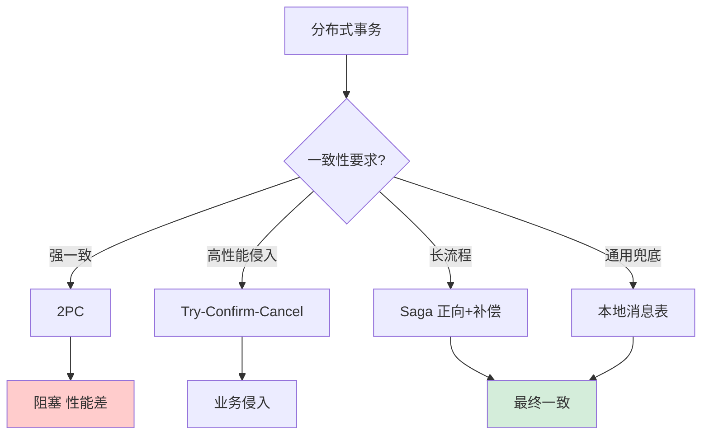
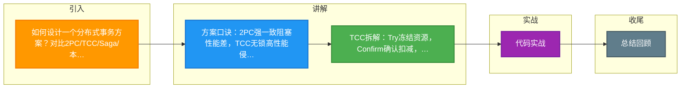

# 如何设计一个分布式事务方案？对比2PC/TCC/Saga/本地消息表。

【场景分析】
分布式事务场景：跨库转账（扣款+加款）、电商下单（库存+订单+支付）、积分发放。

【方案对比】

【1. 2PC（两阶段提交）】
- 阶段1：协调者问所有参与者"能提交吗？"，参与者锁定资源
- 阶段2：全部YES则提交，否则回滚
- 优点：强一致
- 缺点：阻塞、协调者单点、性能差
- 适用：传统企业应用（XA协议）

【2. TCC（Try-Confirm-Cancel）】
- Try：预留资源（冻结余额）
- Confirm：确认操作（扣减冻结金额）
- Cancel：取消操作（解冻）
- 优点：无锁、性能好
- 缺点：业务侵入大、需实现三个接口
- 适用：支付、金融

【3. Saga模式】
- 拆分为一系列子事务 T1, T2, T3...
- 每个子事务有对应补偿 C1, C2, C3...
- 失败时反向执行补偿
- 优点：长事务友好、无锁定
- 缺点：可能看到中间状态、补偿复杂
- 适用：旅行预订（订机票+订酒店+租车）

【4. 本地消息表（最终一致）】
- 本地事务：业务操作 + 写消息表（同一事务）
- 定时任务：扫描消息表 → 投递MQ → 消费者处理
- 优点：简单可靠、无需额外组件
- 缺点：延迟、消息表需维护
- 适用：绝大多数互联网业务

【5. 事务消息（RocketMQ）】
- 半消息：先发送但不消费
- 本地事务：执行业务逻辑
- 提交/回滚：根据本地事务结果
- 回查：Broker定期回查事务状态
- 优点：无消息表、原生支持
- 缺点：依赖RocketMQ

【选型建议】
强一致 + 低并发：2PC
金融 + 高性能：TCC
长链路业务：Saga
互联网通用：本地消息表 / RocketMQ事务消息

【实践要点】
- 理论：CAP定理 → AP优先（可用性 > 一致性）
- BASE理论：Basically Available + Soft State + Eventually Consistent
- 大多数场景用最终一致即可
- 幂等是分布式事务的基础

## 核心流程图

## 记忆要点

- 方案口诀：2PC强一致阻塞性能差，TCC无锁高性能侵入大，Saga长事务需补偿，本地消息表简单最终一致
- TCC拆解：Try冻结资源，Confirm确认扣减，Cancel异常解冻补偿
- 本地消息表：本地业务与写消息表同事务，定时任务轮询投递MQ保证最终一致
- 基石理论：CAP优先选AP，BASE拥抱最终一致，所有分布式事务均需配合接口幂等

## 结构化回答

**30 秒电梯演讲：** 根据业务对一致性的要求，在强一致(2PC)和最终一致(TCC/Saga)间权衡。打比方——像签合同：要么大家当场签字生效(2PC)，要么各自先起草，出错了再发函撤销(Saga)。落到工程上，强一致但阻塞，性能差。

**展开框架：**
1. **2PC** — 强一致但阻塞，性能差
2. **TCC** — 性能好但业务侵入性强
3. **Saga** — 适合长事务，最终一致

**收尾：** 这几个点都能配合实战展开。您想继续聊哪个追问——比如 「TCC的空回滚和悬挂问题如何解决」 或者 「Saga补偿操作的顺序」？

## 视频脚本

> 预计时长：3 分钟 | 由浅入深

| 时间 | 画面/字幕 | 口播台词 | 讲解要点 |
|------|----------|----------|----------|
| 0:00 | 标题卡：分布式事务方案 | "分布式事务方案，这题我会分三步讲。" | 开场钩子 |
| 0:41 | 概念定义动画 | "一句话：根据业务对一致性的要求，在强一致(2PC)和最终一致(TCC/Saga)间权衡。" | 核心定义 |
| 1:22 | 生活类比动画 | "打个比方——像签合同：要么大家当场签字生效(2PC)，要么各自先起草，出错了再发函撤销(Saga)。" | 核心类比 |
| 2:03 | 2PC 图解 | "强一致但阻塞，性能差。" | 2PC |
| 2:50 | TCC 图解 | "性能好但业务侵入性强。" | TCC |

### 视频流程图

