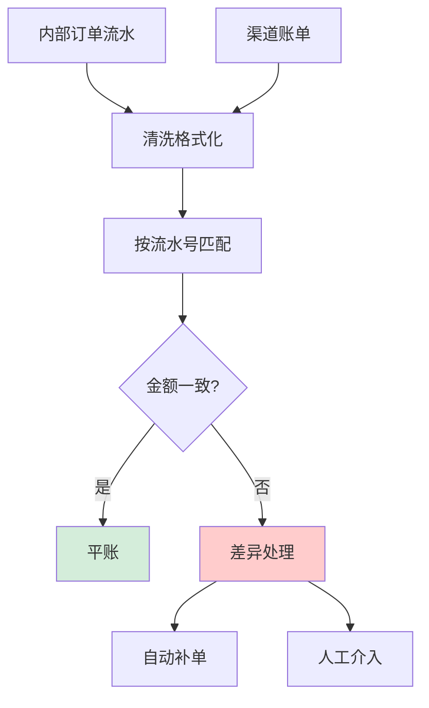

# 如何设计一个对账系统？保证支付/订单/资金数据分毫不差。

【场景分析】
对账系统目标：发现系统间的数据差异，确保资金安全。类型包括：平台vs渠道、订单vs支付、系统vs财务。

**实战案例**：曾遇某次渠道升级导致日期格式从“yyyyMMdd”变为“yyyy-MM-dd”，若未做好清洗解析会导致全量数据比对失败，资金挂账两小时。

【对账流程】
1. 数据获取：
   - 我方数据：从DB/数据仓库提取当日交易流水
   - 渠道数据：下载微信/支付宝/银联对账文件（T+1）
2. 数据清洗：
   - 字段映射：统一字段名和格式
   - 时区对齐
   - 金额单位统一（分/元）
3. 对账匹配：
   - 按交易号匹配
   - 逐笔比对金额、状态
4. 差异处理：
   - 长款：渠道有我方无（支付成功但订单未更新）
   - 短款：我方有渠道无（订单已创建但支付未成功）
   - 金额不一致：部分退款导致
5. 差异修复：
   - 自动补偿：根据差异类型自动修复
   - 人工确认：复杂差异转人工处理
6. 对账报告：
   - 生成对账日报
   - 差异明细
   - 处理状态跟踪

【技术实现】
1. 定时调度：
   - XXL-JOB每天凌晨2点触发
   - 拉取前一天的交易数据
2. 大数据量处理：
   - 百万级流水：Spark批量比对
   - 千万级：Spark on YARN
3. 存储设计：
   - 对账明细表：reconciliation_detail
   - 差异表：reconciliation_diff
   - 历史归档：超过3个月转Hive

**代码示例（Java - 对账文件解析策略）**：
```java
// 策略模式处理不同渠道的解析逻辑
public interface BillParser {
    List<BillRecord> parse(InputStream file);
}

// 针对支付宝CSV的特殊处理（去除BOM头，处理GBK编码）
public class AlipayCsvParser implements BillParser {
    public List<BillRecord> parse(InputStream file) {
        // 1. 处理UTF-8 BOM头
        // 2. 跳过前几行注释行
        // 3. 按行解析金额（需处理逗号分隔符，如"1,000.00"）
    }
}
```

【对账规则】
```
全等对账：我方记录 = 渠道记录（交易号+金额+状态）
包含对账：一方是另一方的子集
差额对账：允许小额差异（< 0.01元视为四舍五入误差）
多对多对账：多笔合并后金额匹配
```

**对比表格：对账模式选型**

| 维度 | 实时对账 | T+1 批量对账 |
| :--- | :--- | :--- |
| **时效性** | 秒级/分钟级 | 次日 |
| **成本** | 高（需实时链路、DB压力大） | 低（离线处理） |
| **适用场景** | 核心交易监控、风控 | 财务核算、合规报表 |
| **准确性** | 依赖消息队列可靠性 | 最终准确，可修正历史 |

【异常处理】
- 超时未到账：自动查询支付渠道
- 部分退款：确保退款对账
- 币种不同：按当日汇率折算
- 手续费：单独对账

【监控告警】
- 对账成功率 < 99.99% → 告警
- 差异数量超阈值 → 告警
- 对账任务失败 → 立即告警


## 核心流程图



## 记忆要点

- 核心流程：拉取T+1账单 → 数据清洗对齐格式 → 全等匹配（交易号+金额+状态） → 差异生成报告
- 差异类型：长款（渠道有我无，多为丢回调自动补单），短款（我方有渠道无，可能失败需冲正）
- 工程实现：大数据量用Spark批量算，多渠道账单用策略模式解析清洗（如处理BOM与编码）
- 对账模式：实时对账秒级控风险成本高，T+1批量对账低成本低，适用财务结算

## 结构化回答


**30 秒电梯演讲：** 像记账员每晚核对微信账单和自己的记账本，发现对不上的账目立刻查明原因。

**展开框架：**
1. **数据获取** — 拉取内部流水和渠道账单
2. **清洗与格式化** — 统一金额和时间
3. **自动匹配** — 按流水号逐笔比对

**收尾：** 对账发现差异如何自动修复？


## 视频脚本

> 预计时长：2 分钟 | 由浅入深

| 时间 | 画面/字幕 | 口播台词 | 讲解要点 |
|------|----------|----------|----------|
| 0:00 | 标题卡：对账系统 | "对账系统，一分钟讲透。" | 开场钩子 |
| 0:35 | 生活类比动画 | "打个比方——像记账员每晚核对微信账单和自己的记账本，发现对不上的账目立刻查明原因。" | 核心类比 |
| 1:10 | 概念定义动画 | "一句话：通过交叉比对内部与外部流水，自动发现并修复资金差异。" | 核心定义 |
| 1:50 | 数据获取 图解 | "拉取内部流水和渠道账单。" | 数据获取 |
