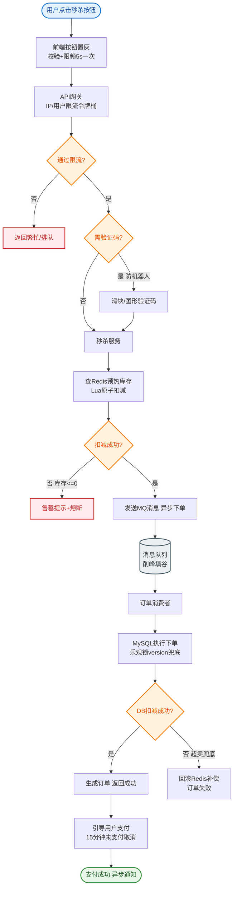
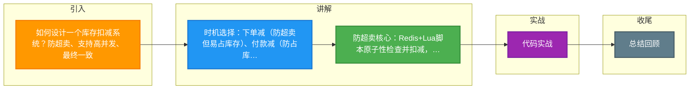

# 如何设计一个库存扣减系统？防超卖、支持高并发、最终一致。

【场景分析】
库存扣减场景：电商下单扣库存、秒杀扣库存、预售扣库存。

**实战案例**：在双11大促中，曾因Redis预热数据脚本故障导致部分SKU库存未加载，瞬间流量击穿DB造成主从延迟，后引入“库存分片+本地缓存”解决热点问题。

【扣减时机】
1. 下单减库存：下单即扣 → 防超卖最强，但有恶意占库存风险
2. 付款减库存：付款时扣 → 避免占库存，但可能超卖
3. 预扣库存：下单预扣 + 超时释放 → 平衡方案（推荐）

**对比表格：扣减方案选型**

| 方案 | 实现难度 | 并发性能 | 一致性 | 适用场景 |
| :--- | :--- | :--- | :--- | :--- |
| **Redis Lua** | 低 | 极高 | 弱一致性（需异步回写） | 秒杀、高并发抢购 |
| **DB乐观锁** | 低 | 中（行锁竞争） | 强一致性 | 普通商品、库存少 |
| **DB悲观锁** | 低 | 低 | 强一致性 | 严格扣减、非高并发 |
| **分段库存** | 高 | 极高（并行） | 最终一致 | 热点商品大库存 |

【防超卖方案】
1. Redis原子扣减：
   ```lua
   local stock = tonumber(redis.call('GET', KEYS[1]))
   if stock > 0 then
     redis.call('DECR', KEYS[1])
     return 1
   else
     return 0
   end
   ```
2. DB乐观锁：
   ```sql
   UPDATE stock SET num = num - 1 WHERE sku_id = ? AND num > 0
   ```
   - 影响行数=0说明库存不足
3. DB悲观锁：
   ```sql
   SELECT * FROM stock WHERE sku_id=? FOR UPDATE
   -- 检查并扣减
   ```
   - 并发性差

【高并发架构】
1. 分段库存（推荐）：
   - 将1000件库存拆成10段×100件
   - 每段独立扣减（并行）
   - 减少热点Key冲突
2. 异步扣减：
   - Redis预扣 → MQ异步扣DB库存
   - 前端展示"库存预留成功"
3. 库存预热：
   - 活动前将库存同步到Redis
   - 多机房各自缓存

**代码示例（Redis分段库存扣减逻辑）**：
```java
// 尝试在随机分片扣减，降低单点压力
public boolean deductStock(String skuId, int quantity) {
    int totalSegments = 10;
    String keyPrefix = "stock:" + skuId + ":seg:";
    // 随机打乱顺序尝试，避免头部竞争
    List<Integer> segments = shuffle(IntStream.range(0, totalSegments).boxed());
    for (int seg : segments) {
        String key = keyPrefix + seg;
        Long remaining = redisTemplate.opsForValue().decrement(key, quantity);
        if (remaining != null && remaining >= 0) {
            return true; // 扣减成功，发送MQ更新DB
        }
        // 回滚刚才的扣减
        redisTemplate.opsForValue().increment(key, quantity);
    }
    return false; // 所有分片均不足
}
```

【库存回退】
- 超时未支付：定时任务回退库存
- 订单取消：实时回退
- 退款：回退库存

【一致性保障】
- Redis扣减成功 → MQ → DB扣减
- DB扣减失败 → 补偿 → Redis回滚
- 定时全量校验Redis vs DB库存

【分库分表】
- 按SKU ID分片
- 热点商品独立分片
- 读写分离


## 核心流程图


## 记忆要点

- 时机选择：下单减（防超卖但易占库存）、付款减（防占库存但易超卖）、预扣减（最佳平衡推荐）
- 防超卖核心：Redis+Lua脚本原子性检查并扣减，或DB乐观锁WHERE num>0影响行数判断
- 高并发优化：热点SKU用分段库存（拆成多片并行扣减降低锁冲突），随机路由避免头部竞争
- 最终一致：Redis预扣成功后发MQ异步扣DB，超时未支付则定时任务回滚Redis与DB库存

## 结构化回答


**30 秒电梯演讲：** 像热门景区限流：先发预约码（Redis），入园后系统慢慢核销（DB），分时段入场分流。

**展开框架：**
1. **Redis原子扣** — 减（Lua/DECR）防超卖
2. **MQ异步扣DB** — MQ异步扣DB，削峰填谷
3. **分段库存减少热点** — 分段库存减少热点Key冲突

**收尾：** 分段库存如何实现？


## 视频脚本

> 预计时长：2 分钟 | 由浅入深

| 时间 | 画面/字幕 | 口播台词 | 讲解要点 |
|------|----------|----------|----------|
| 0:00 | 标题卡：库存扣减系统 | "库存扣减系统，一分钟讲透。" | 开场钩子 |
| 0:35 | 生活类比动画 | "打个比方——像热门景区限流：先发预约码(Redis)，入园后系统慢慢核销(DB)，分时段入场分流。" | 核心类比 |
| 1:10 | 概念定义动画 | "一句话：Redis防超卖、MQ异步落库、分段降热点。" | 核心定义 |
| 1:50 | Redis原子扣减( 图解 | "Redis原子扣减(Lua/DECR)防超卖。" | Redis原子扣减( |

---

### 视频流程图




## 延伸：如何设计一个秒杀系统？如何防止超卖？

> 合并自 `ssd-002`（相似度 65%）

🎯 **本质**：秒杀系统核心挑战是**瞬时高并发**、**绝对不能超卖**、**用户体验流畅**。核心策略：**漏斗削峰 + 缓存预热 + 异步解耦**。

📊 **架构分层设计**：
```
                    ┌───────────────┐
                    │   Client User │
                    └───────┬───────┘
                            │
               ┌────────────▼────────────┐
               │  1. 前端静态化 (CDN)    │  <- 静态资源全推CDN，JS控制倒计时
               │  - 静态页面/JS/CSS      │
               │  - 动态验证码/答题       │     (分流/防刷)
               └────────────┬────────────┘
                            │
               ┌────────────▼────────────┐
               │  2. 接入层              │
               │  - Nginx/Gateway        │
               │  - 限流: IP/用户/设备   │  <- 漏斗第一层：过滤明显无效流量
               └────────────┬────────────┘
                            │
               ┌────────────▼────────────┐
               │  3. 秒杀服务            │
               │  - 读: Redis 缓存       │
               │  - 写: Lua 脚本原子扣减 │     (核心防超卖逻辑)
               └────────────┬────────────┘
                            │
               ┌────────────▼────────────┐
               │  4. 消息队列 MQ         │  <- 削峰填谷：亿级请求削平为几千写入
               │  - RabbitMQ/Kafka       │
               └────────────┬────────────┘
                            │
               ┌────────────▼────────────┐
               │  5. 订单服务            │
               │  - 消费 MQ 消息         │
               │  - 创建订单             │
               │  - DB 扣减库存          │     (异步落库)
               └─────────────────────────┘
```

**详细技术方案**

1. **前端与网关**
   - **静态资源**：全部推 CDN，禁止动态请求。
   - **抢购按钮**：置灰，时间到才解锁；使用随机数延迟防止秒整点并发。
   - **验证码**：图形验证码或滑块，分离机器流量。
   - **限流**：Nginx 漏桶算法或 Gateway 令牌桶，单 IP 限制，单用户限制（Redis 计数器）。

2. **Redis 缓存层（核心）**
   - **库存预热**：启动时将 DB 库存 `SET stock:1001 100` 到 Redis。
   - **Lua 脚本**：
     ```lua
     local stock = redis.call('get', KEYS[1])
     if tonumber(stock) <= 0 then
        return 0 -- 没货
     end
     redis.call('decr', KEYS[1])
     redis.call('rpush', QUEUE_KEY, userId) -- 扣减成功，入队
     return 1
     ```
   - **售罄处理**：当 Lua 返回 0 时，在 Redis 中设置一个售罄标记（`SET sold_out:1001 1`），后续请求直接返回“秒杀结束”，不再执行 Lua 脚本，减轻 Redis 压力。

3. **消息队列削峰**
   - 扣减库存成功后，发送消息到 MQ，消息体包含 `userId`, `itemId`。
   - 控制消费者速率（如每秒处理 2000 单），保护 DB。

4. **数据库层**
   - **订单表**：仅包含必要字段，拆分用户库和订单库。
   - **库存表**：必须加乐观锁：`UPDATE stock SET num=num-1 WHERE id=? AND num>0`。
   - **幂等**：消费者消费前查 DB 是否已存在订单，避免重复创建。

## 常见考点
1. **秒杀后 Redis 库存扣了，但 MQ 消息丢了怎么办？**
   - 答：通过本地消息表或事务消息保证 MQ 100% 投递；或者定时任务核对 Redis 剩余库存和 DB 扣减总量，不一致则人工补偿（理想情况是 Redis 做预扣，DB 做终扣，以 DB 为准，但需处理退款逻辑）。
2. **大量用户直接打到 MySQL 怎么办？**
   - 答：第一道防线是限流；第二道是 Redis 预扣减，只有 Redis 扣减成功的才进 MQ；若 Redis 挂了，降级走 MySQL 乐观锁，虽然慢但能保证不超卖；也可以在 DB 前加一个热点数据 L1 本地缓存阻挡部分流量。
3. **如何防止黄牛通过脚本刷单？**
   - 答：1. 动态 URL（秒杀按钮链接动态化）；2. 验证码（滑块/点选）；3. 限制购买数量（每人限 1 件）；4. 大数据分析行为（点击频率、IP 归属地）。
4. **Redis Lua 脚本执行很慢怎么办？**
   - 答：检查 Redis 是否单线程被其他大 Key 阻塞；考虑将热点 Key 拆分（如将 1000 个库存拆分为 10 个 key，随机扣减一个，最后汇总）；或者升级 Redis 硬件/集群。

## 记忆要点

- 核心策略：漏斗削峰前置限流，异步解耦MQ排队，缓存预热防DB击穿
- 防超卖神：Redis执行Lua脚本，因GET后判断再DECR是原子操作故能防并发
- 削峰利器：Redis扣减成功后发MQ，用消费者低速率串行落库保护数据库
- DB终极兜底：MQ消费端必须带WHERE num>0的乐观锁，确保数据绝不错乱

## 结构化回答


**30 秒电梯演讲：** 像商场限时抢购，设多道安检且只给进店的人发票。

**展开框架：**
1. **前端静态化加限流** — 前端静态化加限流，按钮防抖。
2. **网关层限流黑** — 网关层限流黑名单拦截。
3. **Redis** — Redis Lua脚本原子扣减库存。

**收尾：** 这是我实战中的理解，您想深入哪一段？


## 视频脚本

> 预计时长：3 分钟 | 由浅入深

| 时间 | 画面/字幕 | 口播台词 | 讲解要点 |
|------|----------|----------|----------|
| 0:00 | 标题卡：秒杀系统 | "秒杀系统，这题我会分三步讲。" | 开场钩子 |
| 0:41 | 概念定义动画 | "一句话：多级缓存削峰，Redis原子扣库存防超卖。" | 核心定义 |
| 1:22 | 生活类比动画 | "打个比方——像商场限时抢购，设多道安检且只给进店的人发票。" | 核心类比 |
| 2:03 | 前端静态化加限流 图解 | "前端静态化加限流，按钮防抖。" | 前端静态化加限流 |
| 2:50 | 网关层限流黑名单拦截 图解 | "网关层限流黑名单拦截。" | 网关层限流黑名单拦截 |

### 视频流程图


