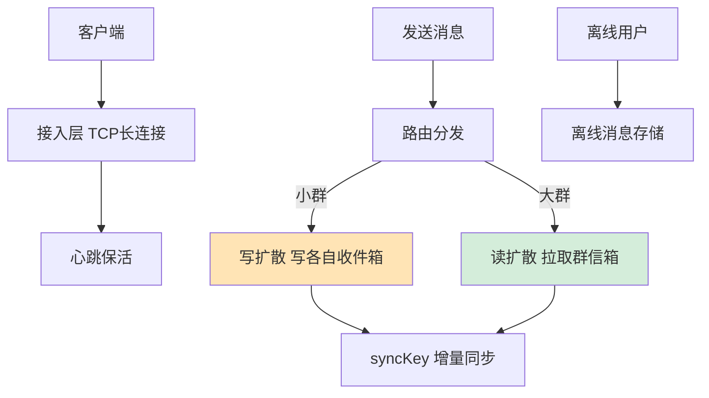
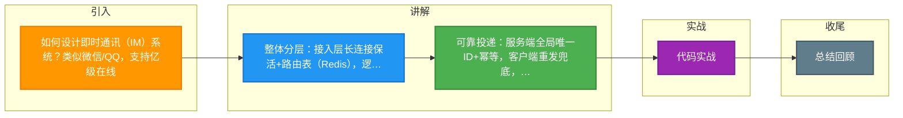

# 如何设计即时通讯（IM）系统？类似微信/QQ，支持亿级在线。

【场景分析】
IM系统核心需求：实时消息收发、消息有序可靠、在线状态管理、离线消息存储。

**实战案例**：曾处理过因客户端弱网重复发送消息导致消息重复展示的Bug，后通过服务端基于MessageID的去重机制和客户端“去重表”彻底解决。

【整体架构】
1. 接入层：
   - TCP长连接（Netty/Mina）
   - 每台服务器维持10-50万连接
   - 心跳保活：客户端30秒发心跳
   - 连接路由表：userId→serverId（Redis存储）
2. 逻辑层：
   - 消息处理：接收、存储、转发
   - 会话管理：单聊/群聊
   - 在线状态管理
3. 存储层：
   - 消息存储：写扩散/读扩散
   - 离线消息：用户上线后拉取

【消息投递流程】
1. 发送方A发消息 → 接入层 → 逻辑层
2. 逻辑层：
   - 生成消息ID（全局唯一+趋势递增）
   - 存储消息到DB
   - 查询接收方B在线状态
3. 在线投递：
   - B在线 → 查路由表找到B的接入服务器 → 推送
4. 离线投递：
   - B离线 → 存离线消息 → B上线时拉取
5. ACK确认：
   - B收到消息后ACK → A端显示"已送达"
   - B读取后Read ACK → A端显示"已读"

【消息可靠性】
- 客户端重发：超时未收到ACK自动重发
- 服务端去重：基于消息ID幂等
- 顺序保证：单聊用递增序列号；群聊用消息ID排序
- 消息同步：客户端维护syncKey（最后收到的消息ID）

**代码示例（WebSocket 消息处理 Handler - Netty）**：
```javan@Componentn@ChannelHandler.Sharablenpublic class IMHandler extends SimpleChannelInboundHandler<TextWebSocketFrame> {
    @Override
    protected void channelRead0(ChannelHandlerContext ctx, TextWebSocketFrame msg) {
        // 1. 解析协议（心跳/ACK/业务消息）
        Packet packet = JSON.parseObject(msg.text(), Packet.class);
        if (packet.getType() == MessageType.MSG) {
            // 2. 写入MQ进行持久化
            messageProducer.send(packet);
            // 3. 实时转发（如果在同一接入节点）
            dispatcher.dispatch(packet);
        }
    }
}
```

**对比表格：消息存储模型对比**

| 维度 | 写扩散 | 读扩散 |
| :--- | :--- | :--- |
| **写操作** | 高（写N份，N为群成员数） | 低（写1份到群Timeline） |
| **读操作** | 低（直接读个人收件箱） | 高（读群Timeline并过滤） |
| **适用场景** | 小群（<500人）、IM私聊 | 超大群（几千人）、系统通知 |
| **存储成本** | 高（冗余多） | 低 |

【群聊优化】
- 写扩散：消息写入每个群成员的收件箱（小群适用）
- 读扩散：消息写入群时间线，成员主动拉取（大群适用）
- 混合：<500人写扩散，>500人读扩散

【存储设计】
- 消息表：按用户ID + 时间分片
- Timeline模型：Redis ZSet/Sorted Set
- 离线消息：MySQL + Redis缓存
- 多端同步：基于消息ID的增量同步

【性能数据】
- 单机长连接：50万（Linux内核调优）
- 消息延迟：<200ms（同城）
- 消息吞吐：10万条/秒


## 核心流程图




## 记忆要点

- 整体分层：接入层长连接保活+路由表（Redis），逻辑层消息处理转发，存储层保证可靠不丢
- 可靠投递：服务端全局唯一ID+幂等，客户端重发兜底，双端ACK机制保证送达与已读
- 存储选型：私聊/小群用写扩散（写多读少直接拉收件箱），大群用读扩散（只写群Timeline）
- 顺序与同步：单聊递增序列号保证顺序，多端拉取靠客户端记录syncKey做增量同步

## 结构化回答


**30 秒电梯演讲：** 像邮政系统：接入局是邮局（长连接），信件按地址路由（消息投递），没人的信存局里（离线消息）。

**展开框架：**
1. **TCP** — 接入层维持TCP长连接，心跳保活
2. **ACK** — 在线推、离线存，ACK确认可靠送达
3. **小群写扩散** — 小群写扩散，大群读扩散

**收尾：** 如何保证消息的顺序性？


## 视频脚本

> 预计时长：3 分钟 | 由浅入深

| 时间 | 画面/字幕 | 口播台词 | 讲解要点 |
|------|----------|----------|----------|
| 0:00 | 标题卡：即时通讯（IM）系统 | "即时通讯（IM）系统，这题我会分三步讲。" | 开场钩子 |
| 0:41 | 概念定义动画 | "一句话：长连接接入、消息可靠投递、读写扩散存储。" | 核心定义 |
| 1:22 | 生活类比动画 | "打个比方——像邮政系统：接入局是邮局(长连接)，信件按地址路由(消息投递)，没人的信存局里(离线消息)。" | 核心类比 |
| 2:03 | 接入层维持TCP 图解 | "接入层维持TCP长连接，心跳保活。" | 接入层维持TCP |
| 2:50 | 在线推、离线存 图解 | "在线推、离线存，ACK确认可靠送达。" | 在线推、离线存 |

### 视频流程图



