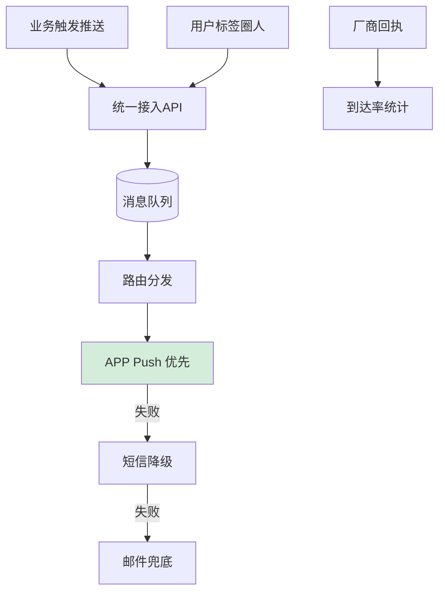
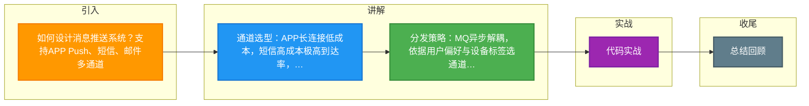

# 如何设计消息推送系统？支持APP Push、短信、邮件多通道。

【场景分析】
推送系统需求：多通道（APP/短信/邮件/站内信）、海量用户、个性化内容、到达率优先。

**实战案例**：某次营销活动因短信网关未做批次限流，触达运营商风控限制导致短信通道全量封禁4小时，后续引入了“令牌桶漏桶混合限流”及多供应商切换机制。

【推送通道】
1. APP推送：
   - 厂商通道：华为/小米/OPPO/VIVO/苹果APNs/Google FCM
   - 第三方SDK：极光/友盟/个推
   - 自建通道：APP存活时通过长连接推送
2. 短信推送：
   - 阿里云/腾讯云短信服务
   - 成本高，重要场景使用
3. 邮件推送：
   - SendGrid/AWS SES
   - 营销类、报告类
4. 站内信：
   - 应用内消息中心
   - 低成本、无打扰

**对比表格：推送通道策略**

| 通道 | 成本 | 实时性 | 到达率 | 干扰度 | 适用场景 |
| :--- | :--- | :--- | :--- | :--- | :--- |
| **APP Push** | 低 | 毫秒级 | 高（需应用权限） | 中 | 营销、业务通知 |
| **短信** | 高 | 秒级 | 极高 | 高 | 验证码、重要告警 |
| **邮件** | 低 | 分钟级 | 中 | 低 | 周报、账单 |
| **站内信** | 极低 | 即时 | 低（需登录） | 低 | 系统公告 |

【架构设计】
1. 消息生产：
   - 业务系统调用推送API → 写入推送任务队列（MQ）
   - 任务包含：用户ID、通道、模板ID、参数、优先级
2. 消息分发：
   - 消费MQ → 查用户推送偏好和设备信息
   - 通道选择：优先APP → 失败转短信
   - 频率控制：每用户每天推送上限
3. 推送执行：
   - APP：调厂商API
   - 短信：调短信网关
   - 并发控制：每通道独立限流
4. 回执处理：
   - 厂商回调推送结果
   - 更新推送状态（送达/点击/失败）

【核心设计】
1. 模板管理：
   - 变量替换：`{name}，您的订单{orderNo}已发货`
   - 多语言模板
   - 版本管理
2. 用户标签：
   - 按标签圈人推送（如"流失用户"）
   - 用户分群：活跃/沉默/付费
3. 降级策略：
   - APP推送失败 → 短信兜底
   - 短信限流 → 入队延迟发送
   - 系统过载 → 非紧急消息延迟发送

**代码示例（多通道策略执行逻辑）**：
```java
public void sendNotification(User user, Message msg) {
    // 策略模式：按优先级尝试通道
    for (Channel channel : msg.getPreferredChannels()) {
        try {
            boolean result = channel.send(user, msg);
            if (result) {
                recordSuccess(user, msg, channel);
                return; // 成功则终止
            }
        } catch (RateLimitException e) {
            // 当前通道限流，尝试下一个通道
            continue; 
        }
    }
    // 所有通道失败，记录死信队列待人工重试
    deadLetterQueue.offer(msg);
}
```

【到达率优化】
- 厂商通道优先（保活能力更强）
- 自建长连接 + 厂商通道双发
- 推送Token及时更新
- 设备在线状态感知

【成本控制】
- 短信按重要级使用
- 批量推送避开高峰（降低短信费率）
- 推送频率限制降低用户关闭推送概率


## 核心流程图




## 记忆要点

- 通道选型：APP长连接低成本，短信高成本极高到达率，邮件低干扰，站内信极低成本需登录
- 分发策略：MQ异步解耦，依据用户偏好与设备标签选通道，优先APP失败再转短信兜底
- 频控风控：多通道混合限流（令牌桶/漏桶），防运营商封禁；单用户设日推送上限防打扰
- 模板执行：变量占位符渲染多语言模板，失败通道降级重试并记录死信队列

## 结构化回答


**30 秒电梯演讲：** 像快递公司送货：有顺丰（APP）、EMS（短信），上门没人就放快递柜（站内信），必须送到。

**展开框架：**
1. **API** — 统一接入API，任务入MQ解耦
2. **APP** — APP优先，失败降级短信/邮件
3. **用户画像与标** — 用户画像与标签圈人

**收尾：** 如何提高APP推送到达率？


## 视频脚本

> 预计时长：2 分钟 | 由浅入深

| 时间 | 画面/字幕 | 口播台词 | 讲解要点 |
|------|----------|----------|----------|
| 0:00 | 标题卡：消息推送系统 | "消息推送系统，一分钟讲透。" | 开场钩子 |
| 0:35 | 生活类比动画 | "打个比方——像快递公司送货：有顺丰(APP)、EMS(短信)，上门没人就放快递柜(站内信)，必须送到。" | 核心类比 |
| 1:10 | 概念定义动画 | "一句话：多通道接入、消息路由、互补兜底降级。" | 核心定义 |
| 1:50 | 统一接入API 图解 | "统一接入API，任务入MQ解耦。" | 统一接入API |

### 视频流程图



