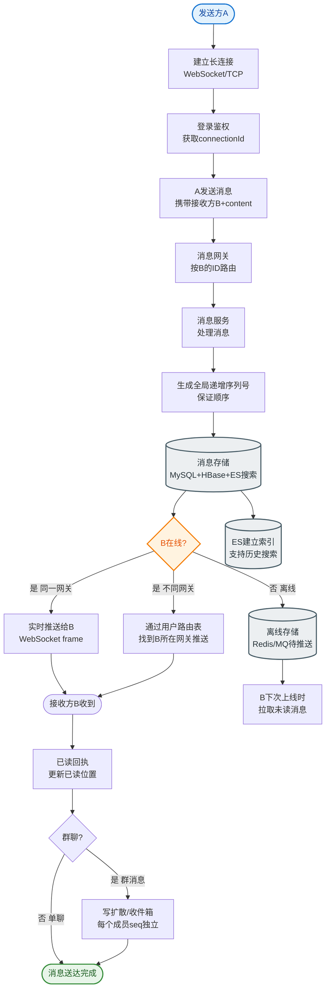
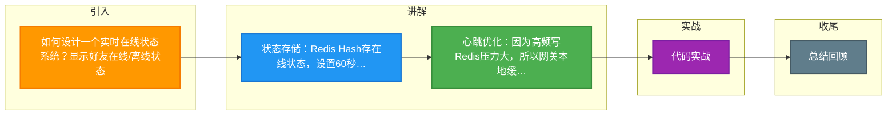

# 如何设计一个实时在线状态系统？显示好友在线/离线状态。

【场景分析】
在线状态需求：实时感知用户上下线、好友列表展示状态、低延迟更新。
核心挑战：高频心跳对DB的压力、海量连接下的广播风暴。

【实现方案】

【方案1：Redis 集中存储（推荐）】
- Key: `online:{userId}` → Value: `serverId@timestamp`
- TTL: 60秒（心跳续期）
- **原理**：利用 Redis 的过期机制自动清理僵死连接。

【方案2：Redis Bitmap（适合统计）】
- Key: `online:20240101` → Offset: userId
- **应用**：适合 DAU 统计，不适合实时单点查询（需要遍历整个 Bitmap 找到在线好友，效率低）。

【推荐架构（方案1增强版）】

```text
                     ┌───────────────────────┐
                     │   Presence Cluster     │
                     │  (Redis Cluster)       │
                     └───────────┬───────────┘
                                 │ (Pub/Sub State Change)
                 ┌───────────────┼───────────────┐
                 ▼               ▼               ▼
          ┌─────────────┐ ┌─────────────┐ ┌─────────────┐
          │ Gateway Svr 1│ │ Gateway Svr 2│ │ Gateway Svr N│
          │ (Long Conn)  │ │ (Long Conn)  │ │ (Long Conn)  │
          └──────┬──────┘ └──────┬──────┘ └──────┬──────┘
                 │               │               │
            WebSocket      WebSocket      WebSocket
                 │               │               │
            ┌────┴────┐    ┌────┴────┐    ┌────┴────┐
            │ User A  │    │ User B  │    │ ...     │
            └─────────┘    └─────────┘    └─────────┘
```

1. **状态存储**：Redis Cluster，按 `userId` hash 分片。
2. **心跳续期**：
   - 客户端每 30s 发心跳。
   - 服务端收到后执行 `SET online:{uid} {serverId} EX 60`。
   - **优化**：服务端本地维护一个过期时间表，只在 Redis 快过期时（如 50s）才去刷新，减少 90% Redis 写入。
3. **状态推送（关键）**：
   - **问题**：A 上线，A 有 5000 个好友，不能推送 5000 次。
   - **方案**：推给 "在线的好友"。
   - **实现**：
     1. 服务端维护一张 "反向索引表"：`online_users_set:serverId`（该服务器连接的所有用户）。
     2. 查询 A 的好友列表 → 取交集 → 得到 "A 的在线好友"。
     3. 仅向这些在线好友所在的 Server 推送状态变更。

【数据结构设计】
- **Redis Hash**：`Hash Key=online:server:01, Field=userId, Value=last_active_ts`。
  - 优点：O(1) 获取单个用户状态，O(N) 获取该服务器所有在线用户（便于反向查找）。

【边界条件】
- **弱网环境**：客户端可能无法发送「下线包」。依赖服务端心跳超时判定离线。
- **多端登录**：手机/PC 同时在线。Value 改为 JSON Array 或使用 Set 记录所有 DeviceId，仅当所有设备都超时才算离线。

## 常见考点
1. **如何优化Redis心跳写入压力？** 回答：应用层本地缓存 + 批量延迟写入，或者使用 UDP 协议发送心跳（服务端不确认，只用于刷新保活）。
2. **WebSocket断线重连机制？** 回答：指数退避重连（1s, 2s, 4s...），重连成功后必须同步当前最新的状态。
3. **如果Redis挂了怎么办？** 回答：降级为只读模式（显示离线）或使用本地内存状态（不准确但可用），配合 Redis Sentinel 快速故障转移。
4. **如何实现"隐身"但对特定人可见？** 回答：引入逻辑状态层，物理状态（在线/离线）与逻辑状态（展示/隐身）分离。


## 核心流程图


## 记忆要点

- 状态存储：Redis Hash存在线状态，设置60秒TTL自动清理僵死连接
- 心跳优化：因为高频写Redis压力大，所以网关本地缓存，快过期(如50s)才刷Redis
- 广播优化：因为全推引发广播风暴，所以仅查好友与在线列表交集定向推送
- 多端与弱网：弱网靠服务端超时判定离线，多端登录用JSON/Set记录设备ID

## 结构化回答


**30 秒电梯演讲：** 像学生打卡：我在教室（服务器）举手（心跳），老师在点名册（Redis）记“在”，同学（好友）能看到我举手。

**展开框架：**
1. **Redis** — 客户端定时心跳续期Redis TTL
2. **WebSocket** — WebSocket推送状态变更给好友
3. **MGET** — MGET批量查询好友状态

**收尾：** 如何处理用户弱网环境下的假在线？


## 视频脚本

> 预计时长：2 分钟 | 由浅入深

| 时间 | 画面/字幕 | 口播台词 | 讲解要点 |
|------|----------|----------|----------|
| 0:00 | 标题卡：实时在线状态系统 | "实时在线状态系统，一分钟讲透。" | 开场钩子 |
| 0:35 | 生活类比动画 | "打个比方——像学生打卡：我在教室(服务器)举手(心跳)，老师在点名册(Redis)记“在”，同学(好友)能看到我举手。" | 核心类比 |
| 1:10 | 概念定义动画 | "一句话：心跳续期、集中存储、事件广播。" | 核心定义 |
| 1:50 | 客户端定时心跳续期 图解 | "客户端定时心跳续期Redis TTL。" | 客户端定时心跳续期 |

### 视频流程图



