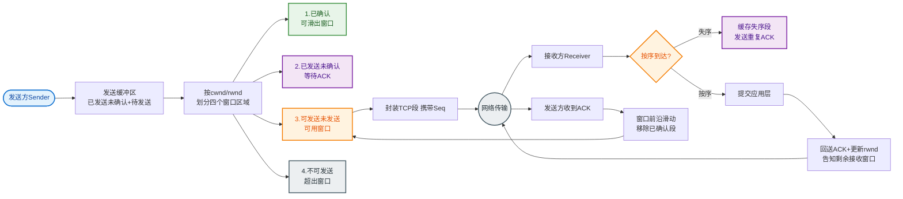

# 如何设计一个高可用的限流方案？对比令牌桶、漏桶、滑动窗口算法。

【场景分析】
限流目的：保护系统不被流量打垮、控制资源消耗、实现公平使用。
核心指标：QPS (Queries Per Second), TPS, 并发线程数。

【四大限流算法对比】

1. **固定窗口计数器**：
   - 实现：AtomicLong + 定时归零。
   - **临界问题**：0.9s 时来了 100 个请求，1.1s 时来了 100 个请求。虽然每秒内都限制 100，但 0.9s-1.1s 这 200ms 内处理了 200 个请求，系统可能崩。

2. **滑动窗口计数器**：
   - 实现：将大窗口切分为 N 个小格（如 1s 切分为 10 个 100ms 格子）。统计时滑动覆盖所有格子。
   - **原理**：平摊了临界流量，精度更高，但内存占用稍高。

3. **漏桶算法**：
   - **形象理解**：桶底有个洞，以恒定速率漏水。请求水滴先入桶，桶满溢出则拒绝。
   - **特性**：强制平滑流出。**缺点**：无法应对突发流量（即使系统空闲，也得排队慢慢漏）。
   - **适用**：保护数据库（Nginx limit_req 模块即为此类）。

4. **令牌桶算法**：
   - **形象理解**：管理员以恒定速率往桶里放令牌。请求来时取令牌，取到则通过。
   - **特性**：允许突发流量。如果桶容量为 100，长时间没请求后，桶里存了 100 个令牌，瞬间来 100 个请求能全部通过。
   - **适用**：应用层网关、保护微服务调用。

```text
令牌桶模型:
      (Rate R)               
    ─────────► ┌───────────┐
   放令牌      │   Bucket  │ ◄─── 请求取 Token
              │ (Cap=B)   │      (无Token=拒绝)
              └───────────┘
```

【分布式限流实现】

1. **Redis + Lua (脚本原子性)**：
   - **思路**：利用 `INCR` 计数，`EXPIRE` 设置窗口。
   - **问题**：如果流量在窗口末尾瞬间进来，Redis 设置过期时间可能导致临界突发（类似固定窗口）。
   - **进阶方案（滑动窗口+Redis）**：使用 ZSet，Score 为时间戳。`ZREMRANGEBYSCORE` 清理旧数据，`ZCARD` 统计当前数量。

2. **网关层限流**：
   - Nginx: `limit_req_zone $binary_remote_addr zone=one:10m rate=10r/s;` (漏桶实现)
   - Sentinel: 支持QPS/线程数/热点参数限流，动态规则推送。

【限流维度】
- **全局限流**：保护整个集群容量。
- **用户/IP限流**：防刷、防恶意攻击。
- **接口限流**：核心接口（如下单）严格限流，非核心接口（如评论）宽松。

【限流后的处理】
- **拒绝**：直接返回 429 Too Many Requests (HTTP) 或自定义错误码。
- **排队**：请求入 MQ，异步处理（适合秒杀）。
- **降级**：返回兜底数据或默认页。

## 常见考点
1. **令牌桶参数如何设置？** 回答：桶容量 = 系统能承受的最大瞬时并发；生成速率 = 系统长期平均处理能力。
2. **Redis 分布式限流的竞态问题？** 回答：必须使用 Lua 脚本保证 "读取-判断-写入" 的原子性，避免超限。
3. **Sentinel 的 QPS 限流是基于滑动窗口吗？** 回答：Sentinel 默认使用滑动窗口（LeapArray），将 1s 分为若干样本，统计精度高。
4. **预热限流？** 回答：系统刚启动时阈值较低（冷启动），随着时间逐渐增加到最大阈值（Guava RateLimiter 支持 `setWarmupPeriod`），防止瞬时流量压垮冷系统。


## 核心流程图


## 记忆要点

- 漏桶与令牌桶对比：漏桶强制平滑出流防突发，令牌桶允许突发流量吞令牌
- 滑动窗口原理：因为固定窗口有临界突发风险，所以细分小格滑动统计平摊流量
- 分布式限流：Redis+Lua保证读取判断写入的原子性，ZSet实现高精度滑动窗口
- 令牌桶参数：桶容量=系统最大瞬时并发，生成速率=系统长期平均处理能力

## 结构化回答


**30 秒电梯演讲：** 像地铁安检：固定速率放人（漏桶），或者凭券入场（令牌桶），没券了就在门口排队（限流）。

**展开框架：**
1. **令牌桶允许突发流量** — 令牌桶允许突发流量，漏桶强制平滑
2. **滑动窗口比固** — 滑动窗口比固定窗口更精确
3. **Redis** — Redis+Lua实现分布式全局限流

**收尾：** 令牌桶和漏桶的区别？


## 视频脚本

> 预计时长：2 分钟 | 由浅入深

| 时间 | 画面/字幕 | 口播台词 | 讲解要点 |
|------|----------|----------|----------|
| 0:00 | 标题卡：高可用的限流方案 | "高可用的限流方案，一分钟讲透。" | 开场钩子 |
| 0:35 | 生活类比动画 | "打个比方——像地铁安检：固定速率放人(漏桶)，或者凭券入场(令牌桶)，没券了就在门口排队(限流)。" | 核心类比 |
| 1:10 | 概念定义动画 | "一句话：令牌桶限突发、滑动窗口平滑、分布式全局限流。" | 核心定义 |
| 1:50 | 令牌桶允许突发流量 图解 | "令牌桶允许突发流量，漏桶强制平滑。" | 令牌桶允许突发流量 |
