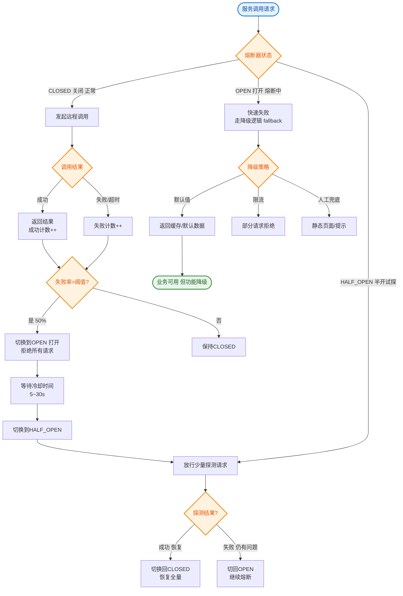

# 如何设计熔断降级方案？保证系统在故障时仍能提供基本服务。

【场景分析】
熔断降级目的：当下游服务故障时，快速失败避免级联雪崩，保证核心链路可用。
核心理念："宁可不可用，不可系统崩"。

【熔断器三态模型】

```text
      失败率达到阈值
      ┌───────────────────────┐
      ▼                       │
┌───────────(Open)─────────> │   (Open)   │
│   熔断开启  拒绝所有请求    │   全拒绝    │
│                           └───────┬─────┘
│        冷却时间过半            │
│        半开探测                │
│   <────────────────────────────┘
│   (Half-Open)
│   放行少量请求
│   成功 → Closed，失败 → Open
│
└───────┬─────────────┐
        │ 正常请求      │
        ▼               │
    (Closed) ◄──────────┘
    正常通过
```

【熔断触发条件】
1. **慢调用比例**：例如设定 RT > 500ms 为慢调用，当 1s 内慢调用比例 > 50% 且总数 > 5 时触发。
2. **异常比例**：例如抛出异常/错误码的占比 > 50%。
3. **异常数**：例如 1min 内异常总数 > 50。

【降级策略】
1. **自动降级**：超时、失败次数达到阈值自动触发。
2. **手动降级**：双十一期间手动关闭非核心服务（如评论、日志分析）。
3. **限流降级**：流量过大时，拒绝部分请求（也是一种降级）。

【资源隔离策略】
防止某个服务拖垮整个线程池：
1. **线程池隔离（Hystrix 默认）**：
   - 每个依赖服务独占线程池。
   - 优点：隔离彻底，即使依赖服务阻塞，也只是该线程池满，不影响 Tomcat 主线程。
   - 缺点：线程切换开销大，高并发时不适用。
2. **信号量隔离**：
   - 使用计数器，限制并发数。
   - 优点：轻量级，无线程切换。
   - 缺点：如果依赖服务响应慢，会占用主线程时间，可能导致整个服务吞吐下降。

【Sentinel vs Hystrix】
| 特性 | Sentinel | Hystrix |
|---|---|---|
| 隔离策略 | 信号量/并发数限流 (主流) | 线程池隔离/信号量 |
| 熔断降级 | 基于响应时间/异常/比例 | 基于异常比例 |
| 实时监控 | 自带 Dashboard，完善 | 较简陋 |
| 扩展性 | 插件式，支持 SPI | 较差 |
| 状态 | 活跃维护 | 停止维护 |

【级联故障防护体系】
- **超时**：设置合理的 ReadTimeout 和 ConnectTimeout（如 200ms），决不能无限等。
- **重试**：必须限制重试次数（如 2次），且只对幂等接口重试，避免重试风暴。
- **缓存**：降级时返回本地缓存（Guava Cache）。
- **兜底**：返回默认值（如库存查不到返回 0），而非 Null 或异常，防止 NPE。

## 常见考点
1. **熔断和降级的区别？** 回答：熔断是"自我保护"（下游不行了我不调了），降级是"服务兜底"（服务不行了给个备选方案）。熔断常是降级的触发条件。
2. **如何实现半开状态？** 回答：熔断器开启后，经过一个冷却窗口（Sleep Window），允许一个请求通过。如果成功，重置状态为 Closed；如果失败，重置计时器回到 Open。
3. **为什么 Hystrix 放弃线程池隔离？** 回答：在高吞吐（如 QPS > 1000）场景下，线程池上下文切换消耗极大，且线程池本身也是有限资源，容易造成拒绝服务。Sentinel 选择了更轻量的信号量模式。


## 核心流程图


## 记忆要点

- 熔断三态流转：Closed正常放行，失败率达阈值转Open全拒，冷却后Half-Open放行探测
- 熔断与降级对比：熔断是自我保护快速失败，降级是提供兜底方案，熔断常触发降级
- 隔离策略对比：Hystrix线程池隔离彻底但切换开销大，Sentinel信号量隔离轻量主流
- 防护四板斧：超时设限决不无限等，重试限次防风暴，结果缓存兜底防NPE

## 结构化回答


**30 秒电梯演讲：** 像家里电路保险丝：电流过大（异常）自动跳闸（熔断），保护家电，试合闸（半开）确认没问题了再恢复供电。

**展开框架：**
1. **基于异常比例或慢调** — 基于异常比例或慢调用触发熔断
2. **熔断开启直接拒绝** — 熔断开启直接拒绝，避免级联雪崩
3. **半开状态探测服务** — 半开状态探测服务是否恢复

**收尾：** 熔断器的三态如何转换？


## 视频脚本

> 预计时长：2 分钟 | 由浅入深

| 时间 | 画面/字幕 | 口播台词 | 讲解要点 |
|------|----------|----------|----------|
| 0:00 | 标题卡：熔断降级方案 | "熔断降级方案，一分钟讲透。" | 开场钩子 |
| 0:35 | 生活类比动画 | "打个比方——像家里电路保险丝：电流过大(异常)自动跳闸(熔断)，保护家电，试合闸(半开)确认没问题了再恢复供电。" | 核心类比 |
| 1:10 | 概念定义动画 | "一句话：故障检测、快速失败、自动探测恢复。" | 核心定义 |
| 1:50 | 异常比例或慢调用 图解 | "基于异常比例或慢调用触发熔断。" | 异常比例或慢调用 |
