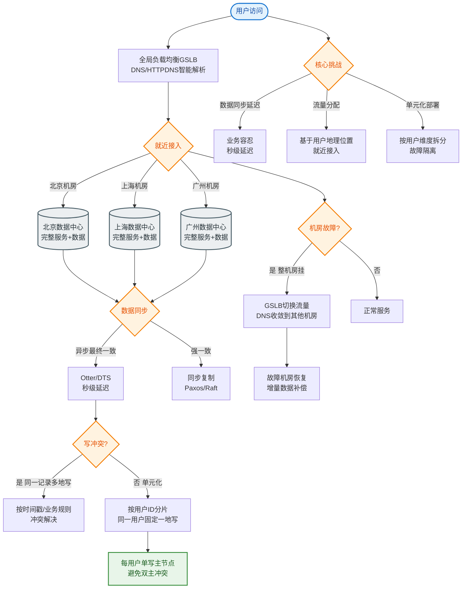

# 如何设计异地多活架构？保证地域级故障时业务不中断。

【场景分析】
异地多活目标：机房级/城市级故障时，业务自动切换到其他机房，用户无感知。

【多活架构层次】
1. **同城双活**：同城市两个机房（<50km）
   - 延迟低（<2ms）
   - 可做强同步
   - 应对机房故障（火灾/断电）
2. **两地三中心**：两个城市三个机房
   - 同城双活 + 异地灾备
   - 异地异步同步
3. **异地多活**：多个城市同时提供服务
   - 每个机房独立承载流量
   - 核心难点：数据一致性

【异地多活核心挑战】
1. 数据同步：跨城市延迟（北京-上海~10ms，北京-广州~30ms）
2. 一致性：跨机房事务成本高
3. 冲突处理：双写冲突如何解决
4. 切换决策：何时切换、如何切换

【数据同步方案】
1. **异步复制**：
   - 写主机房 → binlog异步复制到其他机房
   - 延迟秒级
   - 切换时可能丢少量数据
2. **强同步**：
   - 写主 → 同步等待至少一个备机确认
   - 延迟增加但保证一致
   - PAXOS/Raft
3. **单元化（Cell-based）**：
   - 按用户ID路由到固定机房
   - 用户数据只在一个机房写
   - 读可跨机房

【单元化架构（蚂蚁/支付宝方案）】
- 按用户ID取模分到不同Zone
- 每个Zone包含完整的计算+存储
- 同一用户的所有请求路由到同一Zone
- Zone内数据强一致，Zone间异步同步
- 故障切换：将故障Zone的流量切换到其他Zone

**架构示意图**：
```text
                    用户请求
                       │
                 ┌─────▼─────┐
                 │  接入层   │ (全局路由：根据UserID Hash)
                 └─────┬─────┘
           ┌───────────┼───────────┐
           ▼           ▼           ▼
      ┌─────────┐ ┌─────────┐ ┌─────────┐
      │ 机房 A  │ │ 机房 B  │ │ 机房 C  │
      │ (Zone1) │ │ (Zone2) │ │ (备机)  │
      └────┬────┘ └────┬────┘ └────┬────┘
           │           │           │
      ┌────▼────┐ ┌────▼────┐      │
      │ 用户1   │ │ 用户2   │      │
      │ 数据分片│ │ 数据分片│      │
      └─────────┘ └─────────┘      │
           ▲           ▲           │
           │   Binlog   │           │
           └────────────┼───────────┘ (异步复制)
                       ▼
                 ┌─────────┐
                 │ 机房 D  │
                 │ (异地容灾│
                 │  只读)  │
                 └─────────┘
```

【切换流程】
1. 故障检测：心跳/探针检测机房健康
2. 决策：自动或人工决策切换
3. DNS切换/流量路由切换
4. 数据校验：切换后比对数据一致性
5. 流量恢复：逐步恢复，监控验证

【实践建议】
- 核心业务多活（支付/订单）
- 非核心业务同城双活
- 搜索/分析类用异步同步即可
- 定期做切换演练（混沌工程）

## 常见考点
1. **数据路由策略**：如何保证同一个用户请求始终落在同一个机房？（基于UserID哈希、粘性会话）
2. **跨机房事务**：跨机房调用无法使用本地事务，如何保证最终一致性？（TCC、Saga、可靠消息最终一致性）
3. **冲突解决**：如果出现极端情况导致双写，如何解决数据冲突？（时间戳版本号、业务逻辑合并、人工介入）
4. **边缘触发**：接入层如何快速感知机房故障并切断流量？（健康检查失败阈值、自动熔断机制）


## 核心流程图


## 记忆要点

- 同城与异地对比：同城双活延迟低可强同步，异地多活因延迟高(>10ms)难点在数据一致
- 单元化核心：按用户ID哈希路由，同用户固定在单机房写，Zone内强一致，Zone间异步同步
- 切换流程：探针检测机房健康 → 自动/人工DNS切换 → 数据校验 → 逐步流量恢复
- 跨机房事务：因为分布式事务成本高，所以采用TCC、Saga或可靠消息保最终一致

## 结构化回答


**30 秒电梯演讲：** 像开连锁店：每个城市（机房）都有店，本地人只去本地店（单元化），着火了马上把客人转到隔壁城市店。

**展开框架：**
1. **按用户ID分片路由** — 按用户ID分片路由，归属地就近访问
2. **单元化保证数据主** — 单元化保证数据主要在本地写
3. **异地数据异步复制** — 异地数据异步复制，容忍数据延迟

**收尾：** 单元化架构如何实现？


## 视频脚本

> 预计时长：3 分钟 | 由浅入深

| 时间 | 画面/字幕 | 口播台词 | 讲解要点 |
|------|----------|----------|----------|
| 0:00 | 标题卡：异地多活架构 | "异地多活架构，这题我会分三步讲。" | 开场钩子 |
| 0:41 | 概念定义动画 | "一句话：单元化路由、异地多活、数据一致性妥协。" | 核心定义 |
| 1:22 | 生活类比动画 | "打个比方——像开连锁店：每个城市(机房)都有店，本地人只去本地店(单元化)，着火了马上把客人转到隔壁城市店。" | 核心类比 |
| 2:03 | 按用户ID分片路由 图解 | "按用户ID分片路由，归属地就近访问。" | 按用户ID分片路由 |
| 2:50 | 单元化 图解 | "单元化保证数据主要在本地写。" | 单元化 |
